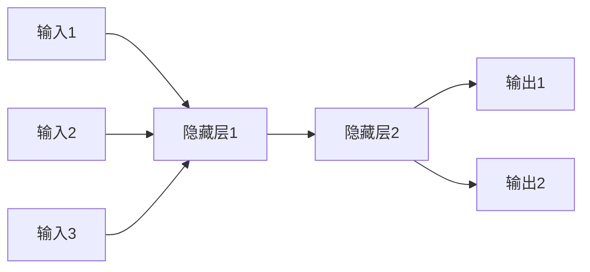

# 神经网络基石：反向传播算法工作原理详解

## 1. 背景介绍

### 1.1 神经网络的兴起

神经网络作为一种强大的机器学习技术,在过去几十年中获得了广泛的关注和应用。它模仿生物神经系统的工作原理,通过构建由大量互连节点组成的网络,能够从数据中自动学习模式和特征,用于解决各种复杂的任务,如图像识别、自然语言处理、推荐系统等。

### 1.2 反向传播算法的重要性

反向传播算法是训练神经网络的核心算法之一,它使得多层神经网络的训练成为可能。在深度学习的浪潮中,反向传播算法的重要性不言而喻。理解反向传播算法的工作原理,对于掌握神经网络的本质及其应用具有重要意义。

## 2. 核心概念与联系

### 2.1 神经网络的基本结构

神经网络由输入层、隐藏层和输出层组成。每一层由多个节点(神经元)构成,节点通过加权连接相互连接。输入数据通过输入层进入网络,经过隐藏层的处理,最终在输出层产生预测结果。



### 2.2 前向传播

前向传播是神经网络的基本运行过程。输入数据经过加权求和和激活函数的处理,逐层向前传播,最终得到输出结果。这个过程可以表示为:

$$o = f(W^Tx + b)$$

其中 $o$ 是输出, $f$ 是激活函数, $W$ 是权重矩阵, $x$ 是输入, $b$ 是偏置项。

### 2.3 损失函数

为了评估神经网络的预测结果与真实值之间的差距,我们需要定义一个损失函数(Loss Function)。常用的损失函数包括均方误差(MSE)、交叉熵损失(Cross-Entropy Loss)等。

$$J(W, b) = \frac{1}{n}\sum_{i=1}^{n}L(y_i, \hat{y}_i)$$

其中 $J$ 是总损失, $L$ 是单个样本的损失函数, $y_i$ 是真实值, $\hat{y}_i$ 是预测值, $n$ 是样本数量。

## 3. 核心算法原理具体操作步骤

反向传播算法的核心思想是通过计算损失函数对每个权重的梯度,并沿着梯度的反方向更新权重,从而最小化损失函数。具体步骤如下:

### 3.1 前向传播

1. 初始化网络权重和偏置项为小的随机值。
2. 对于每个输入样本,计算前向传播的输出结果。

### 3.2 反向传播

1. 计算输出层的损失函数。
2. 计算输出层权重的梯度。
3. 沿着网络从输出层向输入层反向传播,计算每一层权重的梯度。
4. 使用优化算法(如梯度下降)更新网络权重和偏置项。

### 3.3 梯度计算

反向传播算法的核心是计算每个权重的梯度。我们可以使用链式法则来推导梯度计算公式:

$$\frac{\partial J}{\partial W_{ij}^l} = \frac{\partial J}{\partial z^{l+1}}\frac{\partial z^{l+1}}{\partial W_{ij}^l}$$

其中 $J$ 是损失函数, $W_{ij}^l$ 是第 $l$ 层第 $i$ 个节点到第 $j$ 个节点的权重, $z^{l+1}$ 是第 $l+1$ 层的加权输入。

### 3.4 权重更新

使用梯度下降法更新权重和偏置项:

$$W_{ij}^l = W_{ij}^l - \eta\frac{\partial J}{\partial W_{ij}^l}$$
$$b_i^l = b_i^l - \eta\frac{\partial J}{\partial b_i^l}$$

其中 $\eta$ 是学习率,控制梯度下降的步长。

## 4. 数学模型和公式详细讲解举例说明

### 4.1 sigmoid 激活函数

sigmoid 函数是一种常用的激活函数,将输入值映射到 (0, 1) 范围内。它的数学表达式为:

$$\sigma(x) = \frac{1}{1 + e^{-x}}$$

sigmoid 函数的导数为:

$$\sigma'(x) = \sigma(x)(1 - \sigma(x))$$

这个导数在反向传播中计算梯度时会被使用。

### 4.2 交叉熵损失函数

对于二分类问题,交叉熵损失函数可以表示为:

$$J(W, b) = -\frac{1}{n}\sum_{i=1}^{n}[y_i\log(\hat{y}_i) + (1 - y_i)\log(1 - \hat{y}_i)]$$

其中 $y_i$ 是真实标签(0 或 1), $\hat{y}_i$ 是模型输出的概率。

交叉熵损失函数的导数为:

$$\frac{\partial J}{\partial \hat{y}_i} = -\frac{y_i}{\hat{y}_i} + \frac{1 - y_i}{1 - \hat{y}_i}$$

这个导数在计算输出层梯度时会被使用。

### 4.3 梯度计算示例

假设我们有一个简单的神经网络,只有一个隐藏层。输入层有两个节点,隐藏层有三个节点,输出层有一个节点。我们计算隐藏层第一个节点到输出层节点的权重梯度 $\frac{\partial J}{\partial W_1}$。

根据链式法则:

$$\frac{\partial J}{\partial W_1} = \frac{\partial J}{\partial \hat{y}}\frac{\partial \hat{y}}{\partial z_{\text{out}}}\frac{\partial z_{\text{out}}}{\partial W_1}$$

其中:

- $\frac{\partial J}{\partial \hat{y}}$ 是损失函数对输出的导数,可以由损失函数表达式求得。
- $\frac{\partial \hat{y}}{\partial z_{\text{out}}}$ 是输出层激活函数对加权输入的导数,对于 sigmoid 函数为 $\sigma'(z_{\text{out}})$。
- $\frac{\partial z_{\text{out}}}{\partial W_1}$ 是输出层加权输入对隐藏层第一个节点的权重的导数,等于隐藏层第一个节点的输出值。

通过这种方式,我们可以计算出每个权重的梯度,并使用梯度下降法更新权重。

## 4. 项目实践: 代码实例和详细解释说明

以下是使用 Python 和 NumPy 库实现一个简单的反向传播神经网络的示例代码:

```python
import numpy as np

# sigmoid 激活函数
def sigmoid(x):
    return 1 / (1 + np.exp(-x))

# sigmoid 导数
def sigmoid_derivative(x):
    return x * (1 - x)

# 输入数据
X = np.array([[0, 0], [0, 1], [1, 0], [1, 1]])
# 期望输出
y = np.array([[0], [1], [1], [0]])

# 初始化权重和偏置
np.random.seed(1)
W1 = np.random.randn(2, 3)  # 输入层到隐藏层的权重
b1 = np.random.randn(3)     # 隐藏层的偏置
W2 = np.random.randn(3, 1)  # 隐藏层到输出层的权重
b2 = np.random.randn(1)     # 输出层的偏置

# 超参数
learning_rate = 0.1
epochs = 10000

# 训练
for epoch in range(epochs):
    # 前向传播
    layer1 = sigmoid(np.dot(X, W1) + b1)
    layer2 = sigmoid(np.dot(layer1, W2) + b2)

    # 计算损失
    loss = np.mean(-y * np.log(layer2) - (1 - y) * np.log(1 - layer2))

    # 反向传播
    layer2_delta = (layer2 - y) * sigmoid_derivative(layer2)
    layer1_delta = layer2_delta.dot(W2.T) * sigmoid_derivative(layer1)

    # 更新权重和偏置
    W2 -= learning_rate * layer1.T.dot(layer2_delta)
    b2 -= learning_rate * np.sum(layer2_delta, axis=0)
    W1 -= learning_rate * X.T.dot(layer1_delta)
    b1 -= learning_rate * np.sum(layer1_delta, axis=0)

    # 打印损失
    if epoch % 1000 == 0:
        print(f"Epoch {epoch}, Loss: {loss}")

# 测试
print("Output:")
print(layer2)
```

这段代码实现了一个具有一个隐藏层的小型神经网络,用于解决 XOR 问题。让我们逐步解释这段代码:

1. 首先,我们定义了 sigmoid 激活函数及其导数。
2. 然后,我们准备了输入数据 `X` 和期望输出 `y`。
3. 接下来,我们初始化了权重矩阵 `W1`、`W2` 和偏置项 `b1`、`b2`。
4. 我们设置了超参数 `learning_rate` 和 `epochs`。
5. 在训练循环中,我们执行以下步骤:
   - 前向传播计算输出。
   - 计算损失函数(这里使用的是交叉熵损失)。
   - 反向传播计算梯度。
   - 使用梯度下降法更新权重和偏置项。
6. 每 1000 个epoch,我们打印当前的损失值。
7. 最后,我们打印出最终的输出结果。

通过这个示例,你可以看到反向传播算法的实现细节,包括前向传播、损失计算、梯度计算和权重更新等步骤。你还可以尝试修改超参数、添加更多隐藏层或使用其他激活函数和损失函数,来进一步探索神经网络的行为。

## 5. 实际应用场景

反向传播算法广泛应用于各种领域,包括但不限于:

### 5.1 计算机视觉

在图像识别、目标检测、图像分割等任务中,卷积神经网络(CNN)凭借其强大的特征提取能力获得了巨大成功。反向传播算法是训练 CNN 的核心算法之一。

### 5.2 自然语言处理

在文本分类、机器翻译、语音识别等任务中,循环神经网络(RNN)和transformer模型发挥着重要作用。反向传播算法用于训练这些模型,以捕捉文本和语音数据中的序列模式。

### 5.3 推荐系统

在电子商务、社交媒体和内容推荐等领域,神经网络被广泛用于建模用户偏好和预测用户行为。反向传播算法用于训练这些推荐模型,以提高推荐的准确性和相关性。

### 5.4 金融领域

在股票预测、欺诈检测和风险管理等金融应用中,神经网络已经展现出巨大的潜力。反向传播算法可以帮助神经网络从复杂的金融数据中学习模式和规律。

### 5.5 医疗保健

在医学图像分析、疾病诊断和药物发现等领域,神经网络正在发挥越来越重要的作用。反向传播算法可以帮助训练这些模型,从而提高诊断准确性和加速新药开发过程。

## 6. 工具和资源推荐

### 6.1 深度学习框架

- **TensorFlow**: Google开源的端到端机器学习平台,支持多种语言,提供了丰富的工具和库。
- **PyTorch**: Facebook开源的机器学习库,具有Python优雅的接口和动态计算图的特点。
- **Keras**: 高级神经网络API,可以在TensorFlow或Theano之上运行,提供了快速构建和训练模型的方法。

### 6.2 教程和在线课程

- **深度学习专业化课程(Coursera)**: 由Andrew Ng教授主讲的经典深度学习课程,涵盖了神经网络、卷积神经网络和序列模型等内容。
- **深度学习纳米学位(Udacity)**: Udacity提供的一系列深度学习课程,包括计算机视觉、自然语言处理和强化学习等主题。
- **斯坦福深度学习教程**: 由斯坦福大学开设的深度学习课程,提供了