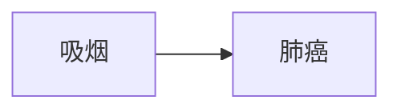
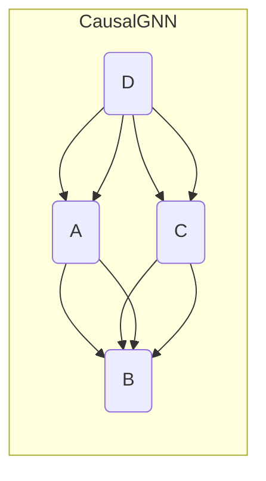
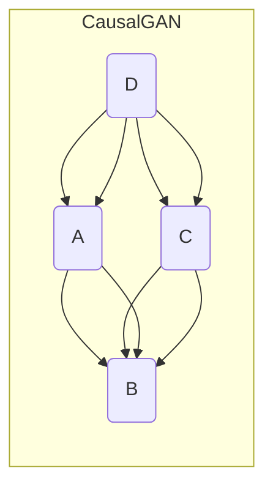
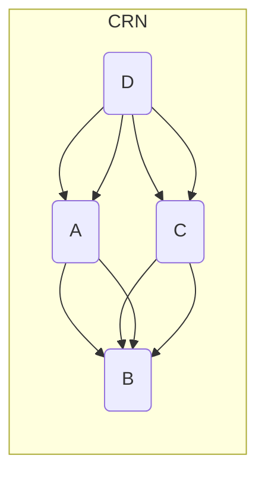
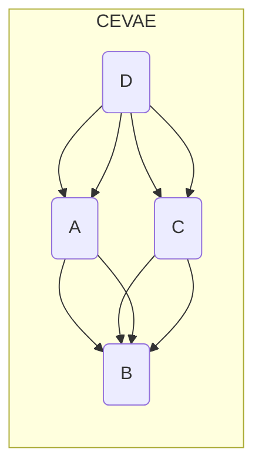

# 第四十三篇：图神经网络与因果推理：探索因果关系

作者：禅与计算机程序设计艺术

## 1. 背景介绍

### 1.1  因果关系推断的挑战

在科学研究和工程实践中，我们常常需要理解事物之间的因果关系。例如，我们想知道吸烟是否会导致肺癌，或者某种药物是否能有效治疗某种疾病。然而，仅仅观察到两个事件之间存在相关性并不能证明它们之间存在因果关系。例如，冰淇淋的销量和溺水人数之间存在正相关关系，但这并不意味着吃冰淇淋会导致溺水。

为了推断因果关系，我们需要进行随机对照实验，将人群随机分为实验组和对照组，并控制其他可能影响结果的因素。然而，在很多情况下，进行随机对照实验是不现实的，例如我们无法将人群随机分为吸烟组和非吸烟组。

### 1.2  图神经网络的兴起

近年来，图神经网络（GNNs）在处理图结构数据方面取得了巨大成功，并在许多领域得到了广泛应用，例如社交网络分析、推荐系统、药物发现等。GNNs 的优势在于能够有效地捕捉图中节点之间的关系，并学习到节点的表示。

### 1.3  图神经网络与因果推理的结合

将图神经网络应用于因果推理是一个新兴的研究方向。图结构可以自然地表示事物之间的关系，而 GNNs 可以学习到节点的表示，从而为因果推理提供了新的思路。

## 2. 核心概念与联系

### 2.1  因果图

因果图是一种用图结构表示因果关系的工具。在因果图中，节点表示变量，边表示变量之间的因果关系。例如，下图是一个简单的因果图，表示吸烟会导致肺癌。



### 2.2  混杂因素

混杂因素是指同时影响原因和结果的变量。例如，年龄就是一个混杂因素，它既影响吸烟，也影响肺癌。如果不控制混杂因素的影响，我们就无法确定吸烟和肺癌之间的因果关系。

### 2.3  干预

干预是指人为地改变某个变量的值。例如，我们可以通过禁烟来干预吸烟这个变量。通过观察干预后结果的变化，我们可以推断出原因和结果之间的因果关系。

### 2.4  反事实推理

反事实推理是指对过去发生的事件进行假设，并推断如果事件发生的方式不同，结果会有什么不同。例如，我们可以假设一个人没有吸烟，并推断如果他没有吸烟，他是否还会患肺癌。

## 3. 核心算法原理具体操作步骤

### 3.1  基于因果图的 GNNs

基于因果图的 GNNs 利用因果图中的信息来指导 GNNs 的学习过程。例如，我们可以将因果图中的边作为 GNNs 中的消息传递路径，或者将因果图中的节点类型作为 GNNs 中的节点特征。

#### 3.1.1  CausalGNN

CausalGNN 是一种基于因果图的 GNNs 模型，它利用因果图中的信息来学习节点的因果表示。CausalGNN 的核心思想是将因果图中的边作为消息传递路径，并利用因果图中的节点类型来约束消息传递过程。



#### 3.1.2  CGNN

CGNN 是一种基于因果图的 GNNs 模型，它利用因果图中的信息来学习节点的因果表示。CGNN 的核心思想是将因果图中的边作为消息传递路径，并利用因果图中的节点类型来约束消息传递过程。


### 3.2  基于干预的 GNNs

基于干预的 GNNs 利用干预操作来学习节点的因果表示。例如，我们可以将干预操作后的数据作为 GNNs 的输入，或者将干预操作作为 GNNs 中的一种正则化方法。

#### 3.2.1  CausalGAN

CausalGAN 是一种基于干预的 GNNs 模型，它利用干预操作来学习节点的因果表示。CausalGAN 的核心思想是将干预操作后的数据作为生成对抗网络（GAN）的输入，并利用 GAN 来生成符合因果关系的数据。



#### 3.2.2  CITEE

CITEE 是一种基于干预的 GNNs 模型，它利用干预操作来学习节点的因果表示。CITEE 的核心思想是将干预操作作为 GNNs 中的一种正则化方法，以鼓励 GNNs 学习到符合因果关系的节点表示。


### 3.3  基于反事实推理的 GNNs

基于反事实推理的 GNNs 利用反事实推理来学习节点的因果表示。例如，我们可以利用反事实推理来生成反事实样本，并将反事实样本作为 GNNs 的输入，或者利用反事实推理来评估 GNNs 学习到的因果关系的可靠性。

#### 3.3.1  Counterfactual Regression Network (CRN)

CRN 是一种基于反事实推理的 GNNs 模型，它利用反事实推理来学习节点的因果表示。CRN 的核心思想是利用反事实推理来生成反事实样本，并将反事实样本作为 GNNs 的输入，以鼓励 GNNs 学习到符合因果关系的节点表示。



#### 3.3.2  Causal Effect Variational Autoencoder (CEVAE)

CEVAE 是一种基于反事实推理的 GNNs 模型，它利用反事实推理来学习节点的因果表示。CEVAE 的核心思想是利用反事实推理来评估 GNNs 学习到的因果关系的可靠性。



## 4. 数学模型和公式详细讲解举例说明

### 4.1  因果效应

因果效应是指干预某个变量对另一个变量的影响。例如，吸烟对肺癌的因果效应是指吸烟会增加患肺癌的风险。

### 4.2  潜在结果框架

潜在结果框架是一种用于定义和估计因果效应的数学框架。在潜在结果框架中，我们假设每个个体都有两个潜在结果：

* $Y_i(1)$：如果个体 $i$ 接受干预（例如吸烟），则其结果为 $Y_i(1)$。
* $Y_i(0)$：如果个体 $i$ 不接受干预（例如不吸烟），则其结果为 $Y_i(0)$。

### 4.3  平均因果效应

平均因果效应（ATE）是指干预对结果的平均影响。ATE 可以定义为：

$$
ATE = E[Y(1) - Y(0)]
$$

其中，$E[\cdot]$ 表示期望值。

### 4.4  条件平均因果效应

条件平均因果效应（CATE）是指在给定某些协变量的情况下，干预对结果的平均影响。CATE 可以定义为：

$$
CATE(X) = E[Y(1) - Y(0) | X]
$$

其中，$X$ 表示协变量。

## 5. 项目实践：代码实例和详细解释说明

### 5.1  使用 Python 和 PyTorch 实现 CausalGNN

```python
import torch
import torch.nn as nn
import torch.nn.functional as F

class CausalGNN(nn.Module):
    def __init__(self, input_dim, hidden_dim, output_dim, adj_matrix, node_types):
        super(CausalGNN, self).__init__()
        self.input_dim = input_dim
        self.hidden_dim = hidden_dim
        self.output_dim = output_dim
        self.adj_matrix = adj_matrix
        self.node_types = node_types

        self.fc1 = nn.Linear(input_dim, hidden_dim)
        self.fc2 = nn.Linear(hidden_dim, output_dim)

    def forward(self, x):
        # 消息传递
        for i in range(self.adj_matrix.shape[0]):
            for j in range(self.adj_matrix.shape[1]):
                if self.adj_matrix[i, j] == 1:
                    x[j] += F.relu(self.fc1(x[i]))

        # 输出层
        x = self.fc2(x)
        return x
```

### 5.2  使用 CausalGNN 进行因果推理

```python
# 创建因果图
adj_matrix = torch.tensor([[0, 1, 0],
                         [0, 0, 1],
                         [0, 0, 0]])

# 创建节点类型
node_types = torch.tensor([0, 1, 2])

# 创建 CausalGNN 模型
model = CausalGNN(input_dim=10, hidden_dim=16, output_dim=1, adj_matrix=adj_matrix, node_types=node_types)

# 生成数据
x = torch.randn(3, 10)

# 进行因果推理
y = model(x)
```

## 6. 实际应用场景

### 6.1  医疗保健

* 预测患者接受某种治疗后的结果
* 识别导致疾病的风险因素
* 发现新的药物靶点

### 6.2  金融

* 预测股票价格
* 识别欺诈交易
* 优化投资组合

### 6.3  社交网络

* 预测用户的行为
* 识别虚假新闻
* 推荐朋友

## 7. 总结：未来发展趋势与挑战

### 7.1  未来发展趋势

* 开发更强大的 GNNs 模型，用于处理更复杂的因果关系。
* 将 GNNs 与其他因果推理方法相结合。
* 将 GNNs 应用于更广泛的领域。

### 7.2  挑战

* 数据的因果关系 often unknown or difficult to identify。
* GNNs 的可解释性。
* GNNs 的可扩展性。

## 8. 附录：常见问题与解答

### 8.1  什么是因果关系？

因果关系是指一个事件（原因）导致另一个事件（结果）发生的关系。

### 8.2  如何推断因果关系？

推断因果关系的常用方法包括随机对照实验、因果图、潜在结果框架等。

### 8.3  什么是图神经网络？

图神经网络是一种专门用于处理图结构数据的深度学习模型。

### 8.4  如何将图神经网络应用于因果推理？

可以利用图神经网络来学习节点的因果表示，从而进行因果推理。

### 8.5  图神经网络与因果推理的结合有哪些优势？

* 图结构可以自然地表示事物之间的关系。
* GNNs 可以学习到节点的表示，从而为因果推理提供了新的思路。