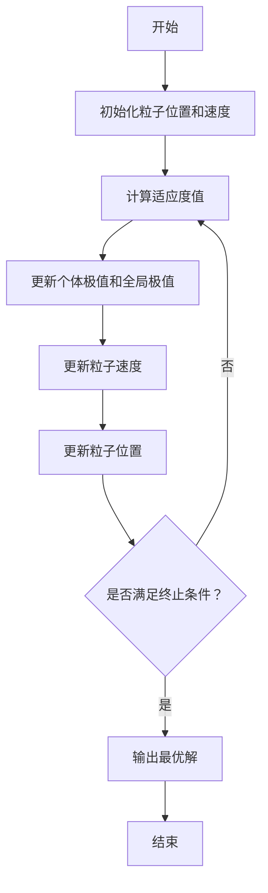

# 粒子群优化——算法的基础构架与实现

作者：禅与计算机程序设计艺术

## 1. 背景介绍

### 1.1 什么是粒子群优化？

粒子群优化（Particle Swarm Optimization, PSO）是一种基于群体智能的优化算法，由Kennedy和Eberhart于1995年提出。PSO通过模拟鸟群觅食行为来寻找最优解，具有简单易实现、收敛速度快等优点，被广泛应用于函数优化、神经网络训练、模糊系统控制等领域。

### 1.2 粒子群优化的历史发展

PSO自提出以来，已历经多次改进与扩展。早期版本的PSO主要集中在连续空间的优化问题上，后来逐渐扩展到离散空间、约束优化、多目标优化等领域。近年来，PSO还被结合到深度学习、强化学习等前沿技术中，展现出了强大的适应性和拓展性。

### 1.3 粒子群优化的应用领域

PSO在以下几个领域具有广泛应用：
- **函数优化**：用于求解复杂的数学函数最优化问题。
- **机器学习**：用于优化神经网络、支持向量机等模型的参数。
- **工程设计**：用于优化设计参数，提高系统性能。
- **图像处理**：用于图像分割、特征提取等任务。
- **机器人控制**：用于路径规划、运动控制等。

## 2. 核心概念与联系

### 2.1 粒子与群体

PSO算法中的每个个体称为“粒子”，整个搜索空间中的所有粒子构成一个“群体”。每个粒子代表一个潜在的解，通过不断调整位置和速度来搜索最优解。

### 2.2 位置与速度

粒子的状态由位置和速度两个向量决定。位置表示粒子在搜索空间中的位置，速度表示粒子移动的方向和速度。通过不断更新位置和速度，粒子逐步逼近最优解。

### 2.3 适应度函数

适应度函数（Fitness Function）用于评估每个粒子的优劣。适应度函数的选择直接影响算法的性能和收敛速度。通常，适应度函数的值越大（或越小），表示粒子的解越接近最优解。

### 2.4 个体极值与全局极值

每个粒子在搜索过程中会记录自身历史最佳位置（个体极值，pBest）和群体历史最佳位置（全局极值，gBest）。粒子的速度和位置更新依赖于这两个值。

## 3. 核心算法原理具体操作步骤

### 3.1 初始化

1. **粒子初始化**：随机生成粒子的位置和速度。
2. **参数初始化**：设定算法的参数，包括粒子数量、最大迭代次数、惯性权重、加速度常数等。

### 3.2 适应度评估

计算每个粒子的适应度值，并更新个体极值和全局极值。

### 3.3 速度更新

根据以下公式更新粒子的速度：
$$
v_{i}(t+1) = w \cdot v_{i}(t) + c_{1} \cdot r_{1} \cdot (pBest_{i} - x_{i}(t)) + c_{2} \cdot r_{2} \cdot (gBest - x_{i}(t))
$$
其中：
- $v_{i}(t)$ 表示粒子 $i$ 在 $t$ 时刻的速度。
- $w$ 表示惯性权重。
- $c_{1}$ 和 $c_{2}$ 表示加速度常数。
- $r_{1}$ 和 $r_{2}$ 为[0,1]之间的随机数。
- $pBest_{i}$ 表示粒子 $i$ 的个体极值。
- $gBest$ 表示群体的全局极值。

### 3.4 位置更新

根据以下公式更新粒子的位置：
$$
x_{i}(t+1) = x_{i}(t) + v_{i}(t+1)
$$
其中 $x_{i}(t)$ 表示粒子 $i$ 在 $t$ 时刻的位置。

### 3.5 终止条件

判断是否满足终止条件，通常包括以下几种：
- 达到最大迭代次数。
- 全局极值的变化小于设定的阈值。
- 适应度函数达到预定的目标值。

### 3.6 算法流程图



## 4. 数学模型和公式详细讲解举例说明

### 4.1 速度更新公式解析

速度更新公式中的每一项都有其特定的意义：
- **惯性项**：$w \cdot v_{i}(t)$ 表示粒子当前速度的惯性，控制粒子的搜索范围和速度。
- **个体认知项**：$c_{1} \cdot r_{1} \cdot (pBest_{i} - x_{i}(t))$ 表示粒子对自身历史最佳位置的回忆，体现了粒子的自我认知能力。
- **社会认知项**：$c_{2} \cdot r_{2} \cdot (gBest - x_{i}(t))$ 表示粒子对群体历史最佳位置的学习，体现了粒子的社会认知能力。

### 4.2 位置更新公式解析

位置更新公式 $x_{i}(t+1) = x_{i}(t) + v_{i}(t+1)$ 表示粒子在当前速度的作用下移动到新的位置。这个公式简单而直接，但其效果取决于速度更新公式的设计。

### 4.3 举例说明

假设一个简单的优化问题，目标函数为 $f(x) = x^2$，搜索空间为 $[-10, 10]$。假设粒子数量为3，最大迭代次数为10，惯性权重 $w = 0.5$，加速度常数 $c_{1} = c_{2} = 1.5$。

初始状态：
- 粒子1：位置 $x_1 = 2$，速度 $v_1 = 0.5$
- 粒子2：位置 $x_2 = -3$，速度 $v_2 = -0.3$
- 粒子3：位置 $x_3 = 1$，速度 $v_3 = 0.2$

经过一次迭代，更新速度和位置：
- 粒子1：$v_1 = 0.5 \cdot 0.5 + 1.5 \cdot r_1 \cdot (pBest_1 - 2) + 1.5 \cdot r_2 \cdot (gBest - 2)$
- 粒子2：$v_2 = 0.5 \cdot -0.3 + 1.5 \cdot r_1 \cdot (pBest_2 - (-3)) + 1.5 \cdot r_2 \cdot (gBest - (-3))$
- 粒子3：$v_3 = 0.5 \cdot 0.2 + 1.5 \cdot r_1 \cdot (pBest_3 - 1) + 1.5 \cdot r_2 \cdot (gBest - 1)$

根据新的速度更新位置：
- 粒子1：$x_1 = 2 + v_1$
- 粒子2：$x_2 = -3 + v_2$
- 粒子3：$x_3 = 1 + v_3$

## 5. 项目实践：代码实例和详细解释说明

### 5.1 Python实现粒子群优化

下面是一个用Python实现的粒子群优化算法的示例代码：

```python
import numpy as np

class Particle:
    def __init__(self, x0):
        self.position = np.array(x0)  # 粒子位置
        self.velocity = np.random.rand(len(x0))  # 粒子速度
        self.best_position = self.position  # 粒子历史最佳位置
        self.best_value = float('inf')  # 粒子历史最佳适应度值

    def update_velocity(self, global_best_position, w, c1, c2):
        r1 =