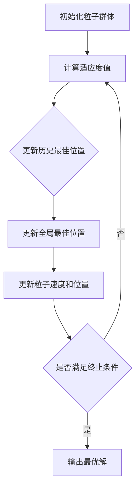

# "粒子群优化算法在制造业中的应用"

作者：禅与计算机程序设计艺术

## 1. 背景介绍

### 1.1 制造业的挑战

制造业作为国民经济的支柱产业，面临着来自市场需求、生产效率、成本控制等多方面的挑战。随着全球化和市场竞争的加剧，制造企业需要不断优化生产流程，提高资源利用率，以保持竞争优势。传统的优化方法在处理复杂、多维度的制造问题时，往往显得力不从心。因此，寻找高效、智能的优化算法成为了制造业亟待解决的问题。

### 1.2 智能优化算法的崛起

在过去的几十年里，智能优化算法得到了广泛的关注和应用。包括遗传算法（GA）、模拟退火（SA）、蚁群算法（ACO）等在内的多种算法被用于解决复杂的优化问题。粒子群优化算法（PSO）作为一种群体智能优化算法，以其简单易行、收敛速度快、适应性强等特点，逐渐在各个领域崭露头角。

### 1.3 粒子群优化算法简介

粒子群优化算法（Particle Swarm Optimization, PSO）由Kennedy和Eberhart在1995年提出，受鸟群觅食行为的启发而发展起来。PSO通过模拟一群粒子在搜索空间中的飞行和信息共享，寻找最优解。每个粒子代表一个潜在的解，通过不断调整自身的位置和速度，逐步逼近最优解。

### 1.4 本文的结构

本文将详细探讨粒子群优化算法在制造业中的应用。首先介绍PSO的核心概念和基本原理，然后深入解析其数学模型和公式，并通过具体的项目实践展示PSO的应用。接着，我们将讨论PSO在制造业中的实际应用场景，推荐一些有用的工具和资源，最后总结PSO在制造业中的未来发展趋势与挑战，并附上一些常见问题与解答。

## 2. 核心概念与联系

### 2.1 粒子群优化算法的基本概念

粒子群优化算法的基本概念包括粒子、群体、位置和速度等。每个粒子代表一个潜在解，粒子的位置表示该解在搜索空间中的位置，速度表示粒子在搜索空间中的移动方向和距离。粒子通过不断调整自身的位置和速度，逐步逼近最优解。

### 2.2 粒子的更新机制

在PSO中，粒子的更新机制是算法的核心。每个粒子根据自身的历史最佳位置和群体的全局最佳位置来调整速度和位置。具体的更新公式如下：

$$
v_{i}(t+1) = w \cdot v_{i}(t) + c_1 \cdot r_1 \cdot (p_{i}^{best} - x_{i}(t)) + c_2 \cdot r_2 \cdot (g^{best} - x_{i}(t))
$$

$$
x_{i}(t+1) = x_{i}(t) + v_{i}(t+1)
$$

其中，$v_{i}(t)$ 和 $x_{i}(t)$ 分别表示第 $i$ 个粒子在 $t$ 时刻的速度和位置；$w$ 是惯性权重，$c_1$ 和 $c_2$ 是加速常数，$r_1$ 和 $r_2$ 是在 [0, 1] 之间的随机数；$p_{i}^{best}$ 是第 $i$ 个粒子历史最佳位置，$g^{best}$ 是群体的全局最佳位置。

### 2.3 粒子群优化算法的流程

PSO的流程可以概括为以下几个步骤：

1. 初始化粒子群体的位置和速度。
2. 计算每个粒子的适应度值，并更新历史最佳位置和全局最佳位置。
3. 更新每个粒子的速度和位置。
4. 判断是否满足终止条件（如达到最大迭代次数或适应度值收敛），如果不满足，返回步骤2。
5. 输出最优解。

### 2.4 PSO与其他优化算法的比较

相比于遗传算法、模拟退火等优化算法，PSO具有以下优点：

1. 简单易行：PSO的算法结构简单，易于实现。
2. 收敛速度快：PSO通过信息共享机制，能够快速逼近最优解。
3. 参数较少：PSO只需调整少量参数，且对参数的敏感性较低。
4. 适应性强：PSO适用于多种类型的优化问题，包括连续和离散优化问题。

## 3. 核心算法原理具体操作步骤

### 3.1 初始化粒子群体

在PSO算法的初始阶段，需要对粒子群体进行初始化，包括粒子的位置和速度。通常，粒子的位置在搜索空间内随机生成，速度也可以随机初始化或设置为零。

### 3.2 计算适应度值

适应度值是衡量粒子解的优劣程度的指标。具体的适应度函数根据实际问题的需求进行定义。在制造业中，常见的适应度函数包括生产成本、生产时间、资源利用率等。

### 3.3 更新历史最佳位置和全局最佳位置

每个粒子在每次迭代中都会更新其历史最佳位置，即该粒子在迭代过程中所达到的最优位置。同时，群体中的全局最佳位置也会更新，即所有粒子中所达到的最优位置。

### 3.4 更新粒子速度和位置

根据前文所述的速度和位置更新公式，粒子在每次迭代中都会调整其速度和位置。惯性权重 $w$ 决定了粒子在搜索空间中的探索和开发能力；加速常数 $c_1$ 和 $c_2$ 分别控制粒子向自身历史最佳位置和全局最佳位置的移动速度。

### 3.5 判断终止条件

PSO算法的终止条件可以根据实际需求进行设置。常见的终止条件包括达到最大迭代次数、适应度值收敛或达到预设的适应度阈值。

### 3.6 输出最优解

当满足终止条件时，算法输出全局最佳位置，即最优解。此时，粒子群体中的一个或多个粒子已经逼近最优解。

## 4. 数学模型和公式详细讲解举例说明

### 4.1 数学模型

PSO算法的数学模型由位置、速度、适应度函数、惯性权重、加速常数等组成。粒子的运动模型可以表示为：

$$
v_{i}(t+1) = w \cdot v_{i}(t) + c_1 \cdot r_1 \cdot (p_{i}^{best} - x_{i}(t)) + c_2 \cdot r_2 \cdot (g^{best} - x_{i}(t))
$$

$$
x_{i}(t+1) = x_{i}(t) + v_{i}(t+1)
$$

其中，$v_{i}(t)$ 和 $x_{i}(t)$ 分别表示第 $i$ 个粒子在 $t$ 时刻的速度和位置；$w$ 是惯性权重，$c_1$ 和 $c_2$ 是加速常数，$r_1$ 和 $r_2$ 是在 [0, 1] 之间的随机数；$p_{i}^{best}$ 是第 $i$ 个粒子历史最佳位置，$g^{best}$ 是群体的全局最佳位置。

### 4.2 举例说明

假设我们要优化一个简单的函数：

$$
f(x) = x^2
$$

目标是找到使 $f(x)$ 最小的 $x$ 值。我们用PSO来解决这个问题。

1. 初始化粒子群体：假设有三个粒子，初始位置分别为 $x_1 = 5, x_2 = -3, x_3 = 2$，初始速度为 $v_1 = 0, v_2 = 0, v_3 = 0$。
2. 计算适应度值：$f(x_1) = 25, f(x_2) = 9, f(x_3) = 4$。
3. 更新历史最佳位置：$p