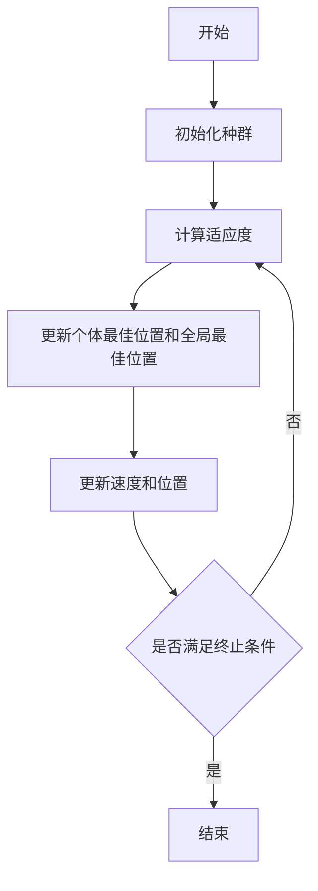

# 粒子群优化算法：解决复杂问题的强大工具

作者：禅与计算机程序设计艺术

## 1.背景介绍

粒子群优化算法（Particle Swarm Optimization, PSO）是一种基于群体智能的优化算法，由Kennedy和Eberhart于1995年提出。受鸟群觅食行为的启发，PSO通过个体之间的信息共享和协同作用来搜索最优解。由于其简单性、易实现性和良好的全局搜索能力，PSO在解决复杂优化问题中得到了广泛应用。

### 1.1. 什么是优化问题

优化问题是指在给定约束条件下，寻找某个目标函数的最优解。优化问题广泛存在于各个领域，如工程设计、经济学、数据挖掘等。数学上，优化问题可以表示为：

$$
\min_{x \in \mathbb{R}^n} f(x)
$$

其中，$ f(x) $ 是目标函数，$ x $ 是决策变量。

### 1.2. 传统优化算法的局限性

传统优化算法如梯度下降、牛顿法等在处理高维、非线性、多峰的复杂优化问题时，往往面临收敛速度慢、易陷入局部最优等问题。因此，基于群体智能的优化算法如PSO逐渐受到关注。

### 1.3. 粒子群优化算法的优势

PSO具有以下优势：
1. **简单易实现**：PSO算法结构简单，参数少，易于实现。
2. **全局搜索能力强**：通过个体之间的信息共享，PSO具有良好的全局搜索能力。
3. **适应性强**：PSO适用于连续、离散、多目标等多种优化问题。

## 2.核心概念与联系

### 2.1. 粒子

在PSO中，每个可能的解被称为一个粒子。每个粒子有其位置和速度，位置表示当前解，速度表示搜索方向。

### 2.2. 种群

种群由多个粒子组成，每个粒子在搜索空间中独立移动，通过相互之间的信息共享来更新自己的位置。

### 2.3. 适应度函数

适应度函数用于评估粒子的位置，即目标函数值。PSO通过适应度函数来判断当前解的优劣。

### 2.4. 速度和位置更新

粒子的速度和位置通过以下公式更新：

$$
v_{i}(t+1) = w \cdot v_{i}(t) + c_1 \cdot r_1 \cdot (p_{i} - x_{i}(t)) + c_2 \cdot r_2 \cdot (g - x_{i}(t))
$$

$$
x_{i}(t+1) = x_{i}(t) + v_{i}(t+1)
$$

其中，$ v_{i}(t) $ 和 $ x_{i}(t) $ 分别表示粒子 $ i $ 在 $ t $ 时刻的速度和位置，$ p_{i} $ 是粒子 $ i $ 的历史最佳位置，$ g $ 是全局最佳位置，$ w $ 是惯性权重，$ c_1 $ 和 $ c_2 $ 是学习因子，$ r_1 $ 和 $ r_2 $ 是随机数。

### 2.5. 惯性权重

惯性权重 $ w $ 控制粒子速度的影响，通常取值范围为 [0,1]。较大的 $ w $ 有助于全局搜索，较小的 $ w $ 有助于局部搜索。

### 2.6. 学习因子

学习因子 $ c_1 $ 和 $ c_2 $ 分别表示粒子对自身历史最佳位置和全局最佳位置的学习能力。通常取值为2。

### 2.7. 随机数

随机数 $ r_1 $ 和 $ r_2 $ 取值范围为 [0,1]，用于增加搜索的随机性，避免陷入局部最优。

## 3.核心算法原理具体操作步骤

### 3.1. 初始化

初始化种群，包括粒子的位置和速度。通常，位置和速度在搜索空间内随机分布。

### 3.2. 计算适应度

计算每个粒子的适应度值，即目标函数值。

### 3.3. 更新个体最佳位置和全局最佳位置

根据适应度值，更新每个粒子的历史最佳位置 $ p_{i} $ 和全局最佳位置 $ g $。

### 3.4. 更新速度和位置

使用速度和位置更新公式，更新每个粒子的速度和位置。

### 3.5. 判断终止条件

判断是否满足终止条件，如达到最大迭代次数或适应度值达到预定阈值。若满足，结束算法；否则，返回步骤3.2。

### 3.6. 算法流程图



## 4.数学模型和公式详细讲解举例说明

### 4.1. 目标函数

考虑一个简单的二次函数优化问题：

$$
f(x) = x^2
$$

目标是在区间 [-10,10] 内找到使 $ f(x) $ 最小的 $ x $。

### 4.2. 初始化

假设种群包含3个粒子，初始位置和速度如下：

$$
\begin{align*}
x_1 & = -5, \quad v_1 = 1 \\
x_2 & = 3, \quad v_2 = -1 \\
x_3 & = 0, \quad v_3 = 2 \\
\end{align*}
$$

### 4.3. 计算适应度

计算每个粒子的适应度值：

$$
\begin{align*}
f(x_1) & = (-5)^2 = 25 \\
f(x_2) & = 3^2 = 9 \\
f(x_3) & = 0^2 = 0 \\
\end{align*}
$$

### 4.4. 更新个体最佳位置和全局最佳位置

初始时，个体最佳位置和全局最佳位置分别为：

$$
\begin{align*}
p_1 & = x_1 = -5 \\
p_2 & = x_2 = 3 \\
p_3 & = x_3 = 0 \\
g & = x_3 = 0 \\
\end{align*}
$$

### 4.5. 更新速度和位置

假设 $ w = 0.5, c_1 = 2, c_2 = 2 $，随机数 $ r_1 $ 和 $ r_2 $ 为 [0,1] 之间的随机数。对于粒子 $ x_1 $，速度和位置更新如下：

$$
v_1(t+1) = 0.5 \cdot 1 + 2 \cdot r_1 \cdot (p_1 - x_1) + 2 \cdot r_2 \cdot (g - x_1)
$$

$$
x_1(t+1) = x_1 + v_1(t+1)
$$

类似地，更新其他粒子的速度和位置。

### 4.6. 迭代计算

重复步骤3.2至3.5，直到满足终止条件。

## 5.项目实践：代码实例和详细解释说明

### 5.1. Python实现PSO算法

以下是一个简单的Python实现PSO算法的示例：

```python
import numpy as np

class Particle:
    def __init__(self, x0):
        self.position = np.array(x0)
        self.velocity = np.random.rand(len(x0))
        self.best_position = self.position.copy()
        self.best_value = float('inf')

    def update_velocity(self, global_best_position, w, c1, c2):
        r1 = np.random.rand(len(self.position))
        r2 = np.random.rand(len(self.position))
        cognitive_velocity = c1 * r1 * (self.best_position - self.position)
        social_velocity = c2 * r2 * (global_best_position - self.position)
        self.velocity = w * self.velocity + cognitive_velocity + social_velocity

    def update_position(self, bounds):
        self.position += self.velocity
        for i in range(len(self.position)):
            if self.position[i] < bounds[i][0]:
                self.position[i] = bounds[i][0]
            if self.position[i] > bounds[i][1]:
                self.position[i] = bounds[i][1]

def pso(objective_function, bounds, num_particles, max