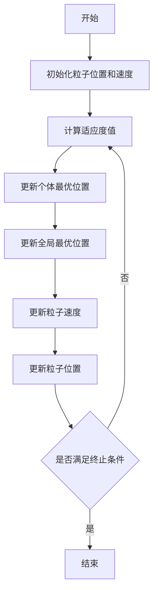

# "粒子群算法与全局优化问题：一段神奇的旅程"

作者：禅与计算机程序设计艺术

## 1. 背景介绍

### 1.1 什么是全局优化问题？

全局优化问题是指在一个给定的搜索空间内找到一个或多个使目标函数达到最优值的点。目标函数既可以是需要最大化的，也可以是需要最小化的。全局优化问题广泛存在于工程、经济、科学研究等多个领域，解决这些问题对于提升系统性能、降低成本具有重要意义。

### 1.2 全局优化问题的挑战

全局优化问题的挑战在于搜索空间的复杂性和目标函数的多样性。搜索空间可能是高维的、非线性的，甚至是离散的。目标函数可能具有多个局部最优点，使得找到全局最优点变得更加困难。传统的优化算法如梯度下降法、牛顿法等在处理这些复杂问题时往往表现不佳。

### 1.3 粒子群算法的诞生

粒子群算法（Particle Swarm Optimization, PSO）是Kennedy和Eberhart于1995年提出的一种基于群体智能的优化算法。PSO受鸟群觅食行为的启发，通过个体之间的信息共享和协同工作，能够有效地解决复杂的全局优化问题。自提出以来，PSO因其简单易实现、收敛速度快等优点，得到了广泛的研究和应用。

## 2. 核心概念与联系

### 2.1 粒子群算法的基本概念

粒子群算法的基本思想是通过模拟粒子在搜索空间中的飞行行为来寻找最优解。每个粒子代表一个潜在解，其位置和速度不断更新，以便在搜索空间中移动。粒子的位置更新由两个主要部分组成：个体最优位置和全局最优位置。

#### 2.1.1 粒子

粒子是PSO中的基本单位，每个粒子代表一个潜在解。粒子具有位置和速度两个属性，位置表示当前解，速度表示移动方向和速度。

#### 2.1.2 个体最优位置

个体最优位置是指粒子在搜索过程中的历史最优位置。每个粒子都记录自己找到的最佳位置，并在位置更新时参考这个位置。

#### 2.1.3 全局最优位置

全局最优位置是指所有粒子中找到的最佳位置。所有粒子在位置更新时都会参考这个全局最优位置。

### 2.2 粒子群算法的工作原理

粒子群算法的工作原理可以概括为以下几个步骤：

1. 初始化：随机生成粒子的位置和速度。
2. 评估：计算每个粒子的适应度值（即目标函数值）。
3. 更新个体最优位置和全局最优位置。
4. 更新粒子的速度和位置。
5. 检查终止条件：如果满足终止条件，则停止算法；否则，返回步骤2。

### 2.3 粒子群算法与其他优化算法的联系

粒子群算法与其他优化算法，如遗传算法、模拟退火等，都属于群体智能算法。这些算法通过模拟自然界中的群体行为（如生物进化、物理退火过程等）来解决复杂的优化问题。尽管具体实现和应用场景有所不同，但它们在解决全局优化问题时具有相似的思想和方法。

## 3. 核心算法原理具体操作步骤

### 3.1 初始化

在初始化阶段，我们需要确定粒子的数量、搜索空间的维度以及初始位置和速度。通常，粒子的初始位置和速度是随机生成的，以保证搜索的多样性。

### 3.2 适应度评估

适应度评估是指计算每个粒子的目标函数值。适应度值越高（或越低，取决于优化目标），表示该粒子的位置越接近最优解。

### 3.3 更新个体最优位置和全局最优位置

在每次迭代中，我们需要更新每个粒子的个体最优位置和全局最优位置。如果当前粒子的适应度值优于其历史最优值，则更新个体最优位置；如果当前粒子的适应度值优于全局最优值，则更新全局最优位置。

### 3.4 更新速度和位置

粒子的速度和位置更新公式如下：

$$
v_{i}(t+1) = \omega v_{i}(t) + c_{1}r_{1}(p_{i}(t) - x_{i}(t)) + c_{2}r_{2}(g(t) - x_{i}(t))
$$

$$
x_{i}(t+1) = x_{i}(t) + v_{i}(t+1)
$$

其中，$v_{i}(t)$ 和 $x_{i}(t)$ 分别表示粒子 $i$ 在迭代 $t$ 时的速度和位置；$\omega$ 是惯性权重；$c_{1}$ 和 $c_{2}$ 是学习因子；$r_{1}$ 和 $r_{2}$ 是在 $[0, 1]$ 之间的随机数；$p_{i}(t)$ 是粒子 $i$ 的个体最优位置；$g(t)$ 是全局最优位置。

### 3.5 终止条件

终止条件可以是预设的最大迭代次数、目标函数值达到某个阈值，或者粒子的位置变化小于某个阈值等。

## 4. 数学模型和公式详细讲解举例说明

### 4.1 数学模型

粒子群算法的数学模型可以用以下几个公式来描述：

#### 4.1.1 速度更新公式

$$
v_{i}(t+1) = \omega v_{i}(t) + c_{1}r_{1}(p_{i}(t) - x_{i}(t)) + c_{2}r_{2}(g(t) - x_{i}(t))
$$

#### 4.1.2 位置更新公式

$$
x_{i}(t+1) = x_{i}(t) + v_{i}(t+1)
$$

### 4.2 参数解释

- $v_{i}(t)$: 粒子 $i$ 在迭代 $t$ 时的速度
- $x_{i}(t)$: 粒子 $i$ 在迭代 $t$ 时的位置
- $\omega$: 惯性权重，控制粒子前进的惯性
- $c_{1}$ 和 $c_{2}$: 学习因子，控制粒子向个体最优位置和全局最优位置靠近的速度
- $r_{1}$ 和 $r_{2}$: 在 $[0, 1]$ 之间的随机数，增加搜索的随机性
- $p_{i}(t)$: 粒子 $i$ 的个体最优位置
- $g(t)$: 全局最优位置

### 4.3 举例说明

假设我们要优化一个简单的二次函数：

$$
f(x) = x^2 + y^2
$$

目标是找到使 $f(x)$ 最小的点。我们可以使用粒子群算法来解决这个问题。

#### 4.3.1 初始化

假设我们有三个粒子，其初始位置和速度如下：

- 粒子1：位置 $(1, 2)$，速度 $(0.1, 0.2)$
- 粒子2：位置 $(-1, -2)$，速度 $(-0.1, -0.2)$
- 粒子3：位置 $(2, -1)$，速度 $(0.2, -0.1)$

#### 4.3.2 适应度评估

计算每个粒子的适应度值：

- 粒子1：$f(1, 2) = 1^2 + 2^2 = 5$
- 粒子2：$f(-1, -2) = (-1)^2 + (-2)^2 = 5$
- 粒子3：$f(2, -1) = 2^2 + (-1)^2 = 5$

#### 4.3.3 更新个体最优位置和全局最优位置

初始时，个体最优位置和全局最优位置都等于当前粒