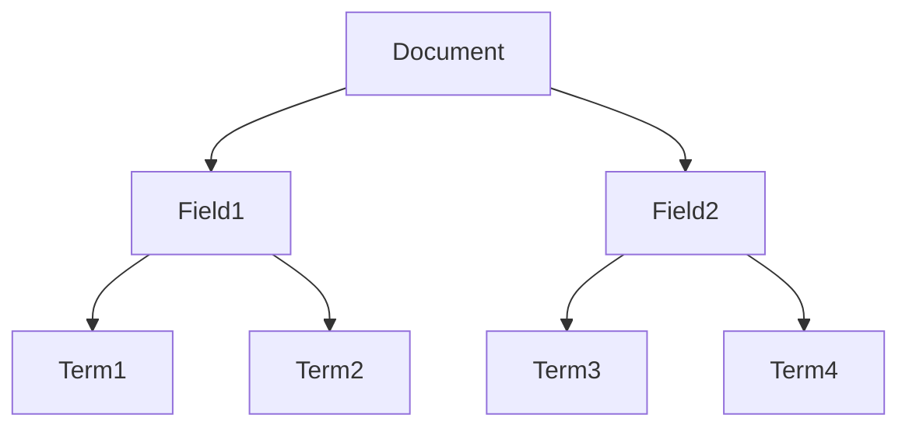

# 索引深入解析：文档、域和词项
作者：禅与计算机程序设计艺术

## 1. 背景介绍

### 1.1 索引的重要性

在信息检索和数据库管理领域，索引技术是提高查询效率的关键手段。无论是在搜索引擎中快速定位网页，还是在数据库中高效检索数据，索引都扮演着至关重要的角色。索引通过预处理数据，将其组织成特定结构，从而大幅度减少查询时间。

### 1.2 索引的基本概念

索引的基本概念包括文档、域和词项。文档是被索引的基本单位，可以是网页、数据库记录或其他形式的数据。域是文档中的特定部分，例如网页的标题、正文、作者等。词项是文档中出现的单词或短语，是索引的最小单位。

### 1.3 索引的应用场景

索引技术广泛应用于搜索引擎、数据库管理系统、电子商务平台等多个领域。通过索引，系统能够在海量数据中快速定位目标信息，提升用户体验和系统性能。

## 2. 核心概念与联系

### 2.1 文档

文档是索引的基本单位，可以是文本文件、网页、数据库记录等。每个文档包含若干域，每个域包含若干词项。文档的结构决定了索引的结构。

### 2.2 域

域是文档中的特定部分，例如网页的标题、正文、作者等。不同域在索引中的权重可能不同，影响查询结果的排序。例如，网页标题中的词项通常比正文中的词项权重更高。

### 2.3 词项

词项是文档中出现的单词或短语，是索引的最小单位。在创建索引时，系统会对文档进行分词处理，将其拆分为若干词项，并记录每个词项在文档中的位置和频率。

### 2.4 文档、域和词项的关系

文档、域和词项之间的关系可以用一个树状结构表示。文档是树的根节点，域是中间节点，词项是叶子节点。通过这种结构，索引能够高效地存储和查询数据。

## 3. 核心算法原理具体操作步骤

### 3.1 分词算法

分词是创建索引的第一步。分词算法将文档拆分为若干词项，常用的分词算法包括基于规则的分词、基于统计的分词和混合分词。

#### 3.1.1 基于规则的分词

基于规则的分词利用预定义的词典和规则进行分词。这种方法简单高效，但对未登录词（词典中不存在的词）处理能力较差。

#### 3.1.2 基于统计的分词

基于统计的分词利用统计模型（如隐马尔可夫模型、条件随机场等）进行分词。这种方法能够处理未登录词，但计算复杂度较高。

#### 3.1.3 混合分词

混合分词结合了基于规则和基于统计的方法，既具有高效性，又能处理未登录词，是目前应用最广泛的分词方法。

### 3.2 倒排索引

倒排索引是最常用的索引结构。它由词项和文档列表组成，每个词项对应一个包含该词项的文档列表。倒排索引的创建和查询步骤如下：

#### 3.2.1 创建倒排索引

1. 分词：对文档进行分词处理，生成词项列表。
2. 记录词项位置：记录每个词项在文档中的位置。
3. 构建倒排列表：将词项和文档ID、位置等信息存储在倒排列表中。

#### 3.2.2 查询倒排索引

1. 分词：对查询语句进行分词处理，生成查询词项列表。
2. 查找倒排列表：在倒排列表中查找查询词项对应的文档列表。
3. 计算相关性：根据词项在文档中的位置和频率计算文档的相关性。
4. 排序：根据相关性对文档进行排序，返回查询结果。

### 3.3 索引压缩

为了节省存储空间和提高查询效率，常用的索引压缩方法包括前缀压缩、差值编码和变长编码。

#### 3.3.1 前缀压缩

前缀压缩利用词项之间的公共前缀进行压缩。例如，将“information”和“informative”压缩为“inform(ation|ative)”。

#### 3.3.2 差值编码

差值编码利用文档ID之间的差值进行压缩。例如，将文档ID列表[1, 3, 6, 10]编码为[1, 2, 3, 4]。

#### 3.3.3 变长编码

变长编码利用词项和文档ID的频率进行压缩。例如，使用较短的编码表示高频词项和文档ID，使用较长的编码表示低频词项和文档ID。

## 4. 数学模型和公式详细讲解举例说明

### 4.1 词频-逆文档频率（TF-IDF）

TF-IDF是一种常用的文本特征提取方法，用于衡量词项在文档中的重要性。TF-IDF由词频（TF）和逆文档频率（IDF）组成。

#### 4.1.1 词频（TF）

词频表示词项在文档中出现的频率，公式如下：

$$
TF(t, d) = \frac{f_{t,d}}{\sum_{t' \in d} f_{t',d}}
$$

其中，$f_{t,d}$表示词项$t$在文档$d$中出现的次数，$\sum_{t' \in d} f_{t',d}$表示文档$d$中所有词项的出现次数总和。

#### 4.1.2 逆文档频率（IDF）

逆文档频率表示词项在所有文档中出现的稀有程度，公式如下：

$$
IDF(t, D) = \log \frac{N}{|d \in D : t \in d|}
$$

其中，$N$表示文档总数，$|d \in D : t \in d|$表示包含词项$t$的文档数。

#### 4.1.3 TF-IDF

TF-IDF的公式如下：

$$
TFIDF(t, d, D) = TF(t, d) \times IDF(t, D)
$$

### 4.2 余弦相似度

余弦相似度用于衡量两个文档之间的相似度，公式如下：

$$
\cos(\theta) = \frac{\vec{A} \cdot \vec{B}}{||\vec{A}|| \times ||\vec{B}||}
$$

其中，$\vec{A}$和$\vec{B}$分别表示两个文档的向量表示，$||\vec{A}||$和$||\vec{B}||$分别表示向量的模。

### 4.3 示例

假设我们有两个文档$d1$和$d2$，以及词项$t1$和$t2$，计算它们的TF-IDF和余弦相似度。

#### 4.3.1 计算TF

假设$d1$中$t1$出现3次，$t2$出现2次，$d2$中$t1$出现1次，$t2$出现4次。

$$
TF(t1, d1) = \frac{3}{3+2} = 0.6
$$

$$
TF(t2, d1) = \frac{2}{3+2} = 0.4
$$

$$
TF(t1, d2) = \frac{1}{1+4} = 0.2
$$

$$
TF(t2, d2) = \frac{4}{1+4} = 0.8
$$

#### 4.3.2 计算IDF

假设总共有10个文档，其中包含$t1$的有5个，包含$t2$的有2个。

$$
IDF(t1, D) = \log \frac{10}{5} = \log 2 = 0.301
$$

$$
IDF(t2, D) = \log \frac{10}{2} = \log 5 = 0