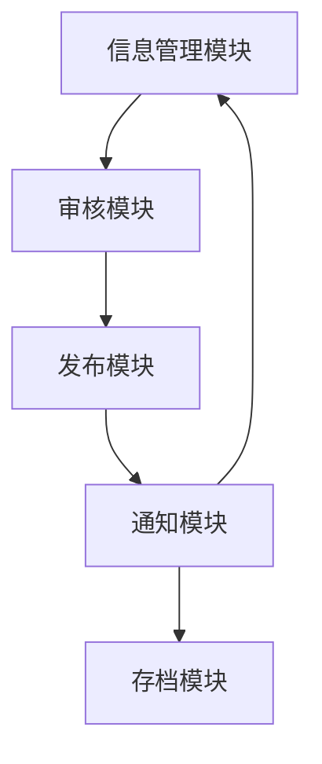
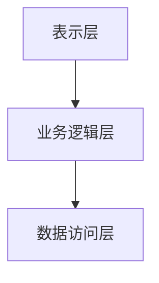

# 综合教务系统信息发布子系统详细设计与具体代码实现

作者：禅与计算机程序设计艺术

## 1.背景介绍

### 1.1 教务系统的概述

在现代教育管理中，信息化系统的应用已经成为不可或缺的一部分。教务系统作为学校管理的重要组成部分，承担着课程安排、成绩管理、学生信息维护等多项任务。而信息发布子系统作为教务系统的关键模块之一，负责将各种重要信息及时、准确地传达给师生。

### 1.2 信息发布子系统的重要性

信息发布子系统的主要作用是确保各类通知、公告、课程变动等信息能够迅速传达到每一个相关人员手中。这不仅提高了信息传递的效率，也减少了信息遗漏和误传的风险。一个高效的信息发布子系统可以大大提升学校的管理水平和教学质量。

### 1.3 本文的目标

本文旨在详细介绍一个综合教务系统信息发布子系统的设计与实现，涵盖从系统架构设计、核心算法、数学模型到具体代码实现的各个方面。通过本文的讲解，读者将能够深入理解信息发布子系统的设计原理，并掌握其实现方法。

## 2.核心概念与联系

### 2.1 信息发布的基本流程

信息发布子系统的基本流程包括信息创建、审核、发布、通知和存档五个主要步骤。每个步骤都有其特定的功能和操作要求。

### 2.2 关键技术概念

#### 2.2.1 消息队列

消息队列是一种用于在不同系统或组件之间传递消息的机制。它可以保证消息的可靠传递，并支持异步处理，是实现高效信息发布的重要技术。

#### 2.2.2 事件驱动架构

事件驱动架构是一种基于事件的系统设计模式，系统中的各个组件通过事件进行通信。这种架构能够提高系统的响应速度和扩展性。

### 2.3 各模块之间的联系

信息发布子系统由多个模块组成，包括信息管理模块、审核模块、发布模块和通知模块等。这些模块之间通过消息队列和事件驱动机制进行通信和协作。



## 3.核心算法原理具体操作步骤

### 3.1 信息创建与管理

信息创建与管理是信息发布的第一步，涉及到信息的录入、编辑和存储。核心算法包括信息的唯一标识生成、内容校验和存储优化。

### 3.2 信息审核流程

信息审核是保证信息准确性和合法性的关键步骤。审核流程通常包括多级审核机制，每一级审核都有不同的权限和职责。

### 3.3 信息发布机制

信息发布机制包括信息的格式化、发布渠道选择和发布时间的控制。核心算法需要考虑信息的优先级、发布时间窗口和发布渠道的负载均衡。

### 3.4 通知与提醒

通知与提醒是确保信息传达到每一个相关人员的重要手段。可以通过邮件、短信、应用内通知等多种形式进行通知。核心算法主要涉及通知的内容生成、发送策略和失败重试机制。

### 3.5 信息存档与查询

信息存档与查询是信息发布的最后一步，确保所有发布的信息都有记录可查。核心算法包括信息的索引、归档和快速查询。

## 4.数学模型和公式详细讲解举例说明

### 4.1 信息优先级计算模型

信息发布子系统需要根据信息的重要性和紧急程度来确定信息的优先级。可以使用以下公式进行优先级计算：

$$
P = \alpha \cdot I + \beta \cdot U
$$

其中，$P$ 表示信息的优先级，$I$ 表示信息的重要性，$U$ 表示信息的紧急程度，$\alpha$ 和 $\beta$ 为权重系数。

### 4.2 发布时间窗口优化模型

发布时间窗口的选择直接影响信息的传播效果。可以使用以下优化模型来选择最佳发布时间：

$$
T_{opt} = \arg\max_{T} \left( R(T) \right)
$$

其中，$T_{opt}$ 表示最佳发布时间，$R(T)$ 表示在时间 $T$ 发布信息的传播效果。

### 4.3 通知发送策略模型

通知发送策略需要考虑发送的成功率和用户的接收习惯。可以使用以下概率模型进行优化：

$$
S = \sum_{i=1}^{n} p_i \cdot r_i
$$

其中，$S$ 表示通知发送的成功率，$p_i$ 表示第 $i$ 种通知方式的发送成功率，$r_i$ 表示第 $i$ 种通知方式的接收率。

## 4.项目实践：代码实例和详细解释说明

### 4.1 系统架构设计

系统架构设计是信息发布子系统实现的基础。我们采用分层架构，将系统分为表示层、业务逻辑层和数据访问层。



### 4.2 信息管理模块代码实现

以下是信息管理模块的部分代码实现，采用Python编写：

```python
class Information:
    def __init__(self, title, content, importance, urgency):
        self.title = title
        self.content = content
        self.importance = importance
        self.urgency = urgency
        self.id = self.generate_id()

    def generate_id(self):
        import uuid
        return str(uuid.uuid4())

    def validate(self):
        if not self.title or not self.content:
            raise ValueError("Title and content cannot be empty.")
        if not (0 <= self.importance <= 10) or not (0 <= self.urgency <= 10):
            raise ValueError("Importance and urgency must be between 0 and 10.")

    def save(self):
        # Save information to database
        pass
```

### 4.3 审核模块代码实现

以下是审核模块的部分代码实现：

```python
class Review:
    def __init__(self, info_id, reviewer, status, comments=None):
        self.info_id = info_id
        self.reviewer = reviewer
        self.status = status
        self.comments = comments

    def approve(self):
        self.status = 'approved'
        # Update information status in database
        pass

    def reject(self, comments):
        self.status = 'rejected'
        self.comments = comments
        # Update information status in database
        pass
```

### 4.4 发布模块代码实现

以下是发布模块的部分代码实现：

```python
class Publisher:
    def __init__(self, info_id):
        self.info_id = info_id

    def format_content(self, content):
        # Format content for different channels
        pass

    def publish(self):
        # Publish information to different channels
        pass
```

### 4.5 通知模块代码实现

以下是通知模块的部分代码实现：

```python
class Notifier:
    def __init__(self, info_id):
        self.info_id = info_id

    def send_email(self, email):
        # Send email notification
        pass

    def send_sms(self, phone_number):
        # Send SMS notification
        pass

    def send_app_notification(self, user_id):
        # Send app notification
        pass

    def notify(self):
        # Notify users through different channels
        pass
```

### 4.6 信息存档与查询模块代码实现

以下是信息存档与查询模块的部分代码实现：

```python
class Archive:
    def __init__(self, info_id):
        self.info_id = info_id

    def archive_info(self):
        # Archive information
        pass

    def query_info(self, query_params):
        # Query archived information
        pass
```

## 5.实际应用场景

### 5.1 学校通知公告

信息发布子系统可以用于发布学校的各类通知公告，如校历安排、考试通知、活动通知等。

### 5.2 课程变动通知

当课程安排发生变动时，系统可以及时将变动信息通知到每一个相关的师生，确保教学计划的顺利实施。

### 5.3 成绩发布通知

系统可以在成绩发布后，及时通知学生查看自己的成绩，避免因信息滞后导致的误解和纠纷。

### 5.4 校园活动通知

对于各类校园活动，如讲座、比赛等，系统可以提前发布通知，吸引更多的师生参与。

## 6.工具和资源推荐

### 6.1 开发工具

- **IDE**: PyCharm, Visual Studio Code
- **版本控制**: Git, GitHub

### 6.2 框架和库

- **Web框架**: Flask, Django