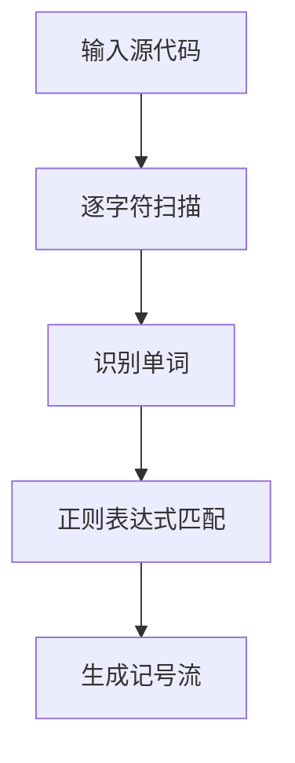
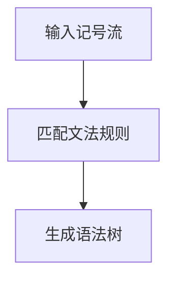
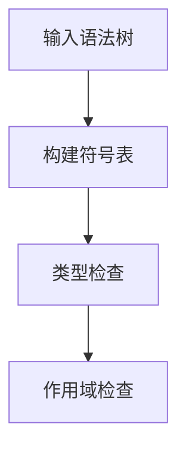
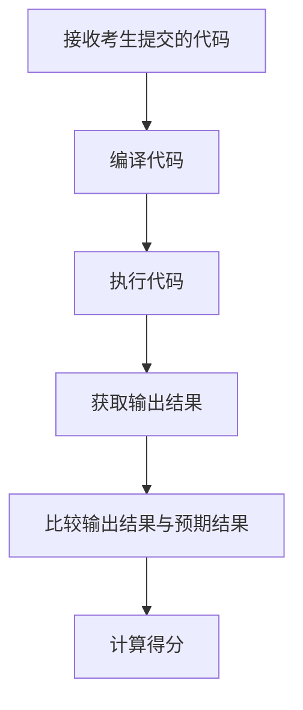

# 编译原理在线考试系统的设计与实现

作者：禅与计算机程序设计艺术

## 1. 背景介绍

### 1.1 编译原理的重要性

编译原理是计算机科学与技术专业的核心课程之一。它不仅涉及编译器的设计与实现，还涵盖了计算机语言的结构、语法分析、语义分析、代码生成和优化等关键内容。掌握编译原理对于理解计算机系统的工作机制、开发高效的软件系统具有重要意义。

### 1.2 在线考试系统的需求

随着信息技术的发展，在线教育逐渐普及，在线考试系统成为一种重要的教育工具。传统的纸质考试存在诸多不便，如阅卷工作量大、评分不统一等问题。在线考试系统能够提高考试效率，减少人工干预，同时提供即时反馈和数据分析功能。因此，设计和实现一个高效、可靠的编译原理在线考试系统具有重要的现实意义。

### 1.3 设计目标

本项目的主要目标是设计并实现一个编译原理在线考试系统，满足以下需求：
- 支持多种题型，包括选择题、填空题、编程题等。
- 提供自动评分功能，特别是对编程题的自动评测。
- 界面友好，操作简便，适合教师和学生使用。
- 支持考试数据的统计分析，提供详细的成绩报告。

## 2. 核心概念与联系

### 2.1 编译原理概述

编译器是将高级编程语言转换为机器语言的工具，其核心工作包括词法分析、语法分析、语义分析、中间代码生成、代码优化和目标代码生成。每个阶段都有其特定的任务和算法。

### 2.2 在线考试系统概述

在线考试系统是一种基于网络的考试平台，通常包括题库管理、考试管理、考生管理、成绩管理等模块。系统通过网络将试题分发给考生，考生在线作答，系统自动评卷并生成成绩报告。

### 2.3 编译原理与在线考试系统的联系

将编译原理应用于在线考试系统，特别是编程题的自动评测，可以提高考试的自动化程度和评测的准确性。通过设计合理的评测算法和评分标准，可以实现对考生编程能力的全面评估。

## 3. 核心算法原理具体操作步骤

### 3.1 词法分析

词法分析是编译器的第一个阶段，其主要任务是将源代码转换为一系列记号（Token）。在在线考试系统中，词法分析用于解析考生提交的编程答案。

#### 3.1.1 词法分析器的设计

词法分析器通过正则表达式识别语言的基本成分，如关键字、标识符、运算符等。以下是词法分析器的基本步骤：

1. 输入源代码。
2. 逐字符扫描，识别出单词。
3. 根据正则表达式匹配单词类型。
4. 生成记号流。



### 3.2 语法分析

语法分析是将记号流转换为语法树的过程。语法分析器根据上下文无关文法生成语法树，用于后续的语义分析和代码生成。

#### 3.2.1 语法分析器的设计

语法分析器通常采用递归下降或LR分析算法。以下是语法分析器的基本步骤：

1. 输入记号流。
2. 根据文法规则匹配记号。
3. 生成语法树。



### 3.3 语义分析

语义分析是检查语法树的语义正确性，包括类型检查、作用域检查等。语义分析器确保程序的语义符合语言规范。

#### 3.3.1 语义分析器的设计

语义分析器通过符号表管理变量和函数信息，执行类型检查和作用域检查。以下是语义分析器的基本步骤：

1. 输入语法树。
2. 构建符号表。
3. 执行类型检查。
4. 执行作用域检查。



### 3.4 自动评分算法

自动评分算法是在线考试系统的核心部分，特别是编程题的评分。评分算法需要考虑代码的正确性、效率和风格等因素。

#### 3.4.1 自动评分算法的设计

自动评分算法通过编译和执行考生提交的代码，比较输出结果与预期结果，计算得分。以下是自动评分算法的基本步骤：

1. 接收考生提交的代码。
2. 编译代码。
3. 执行代码，获取输出结果。
4. 比较输出结果与预期结果。
5. 计算得分。



## 4. 数学模型和公式详细讲解举例说明

### 4.1 词法分析中的正则表达式

词法分析器使用正则表达式识别单词。设 $L$ 是一个语言，$R$ 是一个正则表达式，则 $L(R)$ 表示由 $R$ 描述的语言。

例如，识别标识符的正则表达式可以表示为：
$$
R_{\text{id}} = [a-zA-Z_][a-zA-Z_0-9]*
$$

### 4.2 语法分析中的上下文无关文法

上下文无关文法（CFG）由四元组 $(V, \Sigma, P, S)$ 表示，其中：
- $V$ 是非终结符集合
- $\Sigma$ 是终结符集合
- $P$ 是产生式集合
- $S$ 是开始符号

例如，简单算术表达式的文法可以表示为：
$$
E \rightarrow E + T \ | \ T \\
T \rightarrow T * F \ | \ F \\
F \rightarrow (E) \ | \ id
$$

### 4.3 语义分析中的类型检查

类型检查是确保表达式类型正确的过程。设 $T$ 是类型集合，$E$ 是表达式集合，则类型检查函数 $type : E \rightarrow T$ 确定表达式的类型。

例如，检查加法表达式 $e_1 + e_2$ 的类型：
$$
type(e_1 + e_2) = \begin{cases}
int & \text{if } type(e_1) = int \text{ and } type(e_2) = int \\
error & \text{otherwise}
\end{cases}
$$

### 4.4 自动评分的评分函数

自动评分函数 $score : S \rightarrow [0, 100]$ 计算考生提交代码的得分。设 $S$ 是提交代码集合，$E$ 是预期输出集合，$O$ 是实际输出集合，则评分函数可以定义为：

$$
score(s) = \begin{cases}
100 & \text{if } O(s) = E \\
0 & \text{otherwise}
\end{cases}
$$

其中，$O(s)$ 表示代码 $s$ 的实际输出，$E$ 是预期输出。

## 5. 项目实践：代码实例和详细解释说明

### 5.1 词法分析器的实现

以下是一个简单的词法分析器实现，用于识别标识符和数字：

```python
import re

def lexer(code):
    tokens = []
    token_specification = [
        ('ID', r'[a-zA-Z_][a-zA-Z_0-9]*'),
        ('NUM', r'\d+'),
        ('OP', r'[+\-*/]'),
        ('SKIP', r'[ \t]+'),
        ('MISMATCH', r'.')
    ]
    tok_regex = '|'.join('(?P<%s>%s)' % pair for pair in token_specification)
    for mo in re.finditer(tok_regex, code):
        kind = mo.lastgroup
        value = mo.group()
        if kind == 'ID':
            tokens.append(('ID', value))
        elif kind == 'NUM':
            tokens.append(('NUM', value))
        elif kind == 'OP':
            tokens.append(('OP', value))
        elif kind == 'SKIP':
