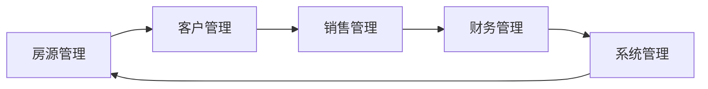

## 1. 背景介绍

### 1.1 房地产行业现状与挑战

随着城市化进程的不断推进，房地产行业在国民经济中扮演着越来越重要的角色。然而，传统的线下售房模式存在着诸多弊端，例如信息不对称、交易流程繁琐、客户体验差等问题，难以满足日益增长的市场需求。

### 1.2  互联网+房地产的兴起

近年来，随着互联网技术的快速发展，“互联网+”概念逐渐渗透到各行各业，房地产行业也不例外。网上售房系统应运而生，为购房者提供了更加便捷、透明、高效的购房体验。

### 1.3 本文目的和意义

本文旨在探讨网上售房管理系统的详细设计与具体代码实现，帮助读者深入了解该系统的架构、功能模块、技术实现等方面，为开发类似系统提供参考和借鉴。

## 2. 核心概念与联系

### 2.1 网上售房管理系统概述

网上售房管理系统是一个基于互联网平台，集房源信息发布、在线看房、客户管理、销售管理、财务管理等功能于一体的综合性管理系统。

### 2.2 系统用户角色

网上售房管理系统涉及的用户角色主要包括：

* **管理员:** 负责系统后台管理、用户权限管理、数据统计分析等工作。
* **销售人员:** 负责发布房源信息、接待客户咨询、促成房屋交易等工作。
* **客户:** 通过系统浏览房源信息、预约看房、在线咨询等。

### 2.3 系统核心功能模块

* **房源管理:** 包括房源信息录入、编辑、删除、查询、统计等功能。
* **客户管理:** 包括客户信息录入、编辑、删除、查询、跟进等功能。
* **销售管理:** 包括销售合同管理、付款管理、佣金管理等功能。
* **财务管理:** 包括收支管理、报表统计等功能。
* **系统管理:** 包括用户管理、权限管理、系统日志等功能。

### 2.4 核心概念联系图



## 3. 核心算法原理具体操作步骤

### 3.1 房源推荐算法

为了帮助用户快速找到心仪的房源，网上售房管理系统通常会采用推荐算法，根据用户的搜索历史、浏览记录、个人偏好等信息，为用户推荐符合其需求的房源。

**3.1.1 基于内容的推荐算法**

该算法主要根据房源自身的属性信息进行推荐，例如户型、面积、价格、区域、楼层等。

**具体操作步骤:**

1. 收集房源的属性信息，构建房源特征向量。
2. 计算用户历史浏览记录中房源特征向量的相似度。
3. 将相似度较高的房源推荐给用户。

**3.1.2 协同过滤推荐算法**

该算法主要根据用户之间的相似性进行推荐，例如用户 A 和用户 B 都购买了相同的小区、相同户型的房子，那么系统会认为用户 A 和用户 B 的兴趣爱好比较相似，可以将用户 A 喜欢的其他房源推荐给用户 B。

**具体操作步骤:**

1. 收集用户的历史行为数据，构建用户-房源评分矩阵。
2. 计算用户之间的相似度。
3. 将相似用户喜欢的房源推荐给目标用户。

### 3.2 在线看房功能实现

为了提升用户体验，网上售房管理系统通常会提供在线看房功能，用户无需亲临现场，即可通过虚拟现实技术，720度全景观看房屋的内部结构和周边环境。

**具体操作步骤:**

1. 使用全景相机拍摄房屋的内部和外部照片。
2. 将照片上传至系统，并进行拼接处理，生成全景图。
3. 在系统前端页面嵌入全景图，并添加交互功能，例如缩放、旋转、移动等。

## 4. 数学模型和公式详细讲解举例说明

### 4.1 房价预测模型

为了帮助用户更好地了解市场行情，网上售房管理系统通常会提供房价预测功能，根据历史成交数据、周边配套设施、政策法规等因素，预测未来一段时间内的房价走势。

**4.1.1 线性回归模型**

线性回归模型是一种常用的房价预测模型，其基本假设是房价与多个自变量之间存在线性关系。

**模型公式:**

$$
y = \beta_0 + \beta_1 x_1 + \beta_2 x_2 + ... + \beta_n x_n + \epsilon
$$

其中：

* y 表示房价
* $x_1, x_2, ..., x_n$ 表示影响房价的多个自变量，例如面积、楼层、区域等
* $\beta_0, \beta_1, \beta_2, ..., \beta_n$ 表示模型参数
* $\epsilon$ 表示随机误差项

**举例说明:**

假设我们想预测某个小区的房价，已知该小区的面积、楼层、区域等信息，我们可以使用线性回归模型进行预测。

**4.1.2 支持向量机模型**

支持向量机模型是一种基于统计学习理论的机器学习算法，其基本思想是找到一个最优的超平面，将不同类别的样本分开。

**模型公式:**

$$
f(x) = sign(\sum_{i=1}^n \alpha_i y_i K(x_i, x) + b)
$$

其中：

* $x$ 表示输入向量
* $y_i$ 表示样本 $x_i$ 的类别标签
* $\alpha_i$ 表示拉格朗日乘子
* $K(x_i, x)$ 表示核函数
* $b$ 表示偏置项

**举例说明:**

假设我们想预测某个房源的涨跌情况，已知该房源的历史价格走势、周边配套设施等信息，我们可以使用支持向量机模型进行预测。

## 5. 项目实践：代码实例和详细解释说明

### 5.1 技术选栈

本项目采用 Spring Boot + MyBatis + MySQL 技术栈进行开发。

* **Spring Boot:**  用于快速构建 Web 应用，简化开发配置。
* **MyBatis:**  用于数据库操作，简化 SQL 代码编写。
* **MySQL:**  用于数据存储。

### 5.2 代码实例

**5.2.1 房源信息实体类**

```java
public class House {

    private Long id; // 房源ID
    private String name; // 房源名称
    private String address; // 房源地址
    private Double area; // 房屋面积
    private Integer bedroom; // 卧室数量
    private Integer livingRoom; // 客厅数量
    private Integer bathroom; // 卫生间数量
    private Double price; // 房屋价格
    // ...

    // getter 和 setter 方法
}
```

**5.2.2 房源信息 Mapper 接口**

```java
@Mapper
public interface HouseMapper {

    List<House> findAll();

    House findById(Long id);

    int save(House house);

    int update(House house);

    int deleteById(Long id);
}
```

**5.2.3 房源信息 Service 接口**

```java
public interface HouseService {

    List<House> findAll();

    House findById(Long id);

    void save(House house);

    void update(House house);

    void deleteById(Long id);
}
```

**5.2.4 房源信息 Service 实现类**

```java
@Service
public class HouseServiceImpl implements HouseService {

    @Autowired
    private HouseMapper houseMapper;

    @Override
    public List<House> findAll() {
        return houseMapper.findAll();
    }

    @Override
    public House findById(Long id) {
        return houseMapper.findById(id);
    }

    @Override
    public void save(House house) {
        houseMapper.save(house);
    }

    @Override
    public void update(House house) {
        houseMapper.update(house);
    }

    @Override
    public void deleteById(Long id) {
        houseMapper.deleteById(id);
    }
}
```

**5.2.5 房源信息 Controller 类**

```java
@RestController
@RequestMapping("/houses")
public class HouseController {

    @Autowired
    private HouseService houseService;

    @GetMapping
    public List<House> findAll() {
        return houseService.findAll();
    }

    @GetMapping("/{id}")
    public House findById(@PathVariable Long id) {
        return houseService.findById(id);
    }

    @PostMapping
    public void save(@RequestBody House house) {
        houseService.save(house);
    }

    @PutMapping("/{id}")
    public void update(@PathVariable Long id, @RequestBody House house) {
        house.setId(id);
        houseService.update(house);
    }

    @DeleteMapping("/{id}")
    public void deleteById(@PathVariable Long id) {
        houseService.deleteById(id);
    }
}
```

### 5.3 代码解释

以上代码演示了如何使用 Spring Boot + MyBatis + MySQL 技术栈实现房源信息管理功能。

* 首先，我们定义了房源信息实体类 `House`，用于封装房源信息。
* 然后，我们定义了房源信息 Mapper 接口 `HouseMapper`，用于定义数据库操作方法。
* 接着，我们定义了房源信息 Service 接口 `HouseService`，用于定义业务逻辑方法。
* 最后，我们定义了房源信息 Controller 类 `HouseController`，用于处理 HTTP 请求，调用 Service 层方法实现业务逻辑。

## 6. 实际应用场景

### 6.1 房地产开发企业

房地产开发企业可以利用网上售房管理系统，实现线上线下相结合的销售模式，提高销售效率，降低销售成本。

### 6.2 房地产中介公司

房地产中介公司可以利用网上售房管理系统，管理房源信息、客户信息、销售信息等，提高工作效率，提升客户服务质量。

### 6.3 个人房东

个人房东可以利用网上售房管理系统，发布房源信息，与潜在客户进行沟通，提高出租效率。

## 7. 总结：未来发展趋势与挑战

### 7.1 未来发展趋势

* **智能化:**  随着人工智能技术的不断发展，网上售房管理系统将会更加智能化，例如智能推荐、智能客服、智能合约等。
* **移动化:**  随着移动互联网的普及，网上售房管理系统将会更加移动化，用户可以通过手机 APP 随时随地浏览房源信息、预约看房等。
* **数据化:**  网上售房管理系统将会积累大量的用户行为数据，这些数据可以用于用户画像分析、市场趋势预测等方面，为企业决策提供数据支撑。

### 7.2 面临的挑战

* **数据安全:**  网上售房管理系统涉及大量的用户隐私信息，如何保障数据安全是一个重要的挑战。
* **用户体验:**  如何提升用户体验，让用户更加便捷、高效地使用系统，是一个持续的挑战。
* **市场竞争:**  随着“互联网+房地产”的兴起，越来越多的企业进入该领域，市场竞争将会更加激烈。

## 8. 附录：常见问题与解答

### 8.1 如何保证系统安全性？

* **采用 HTTPS 协议:**  使用 HTTPS 协议对数据传输进行加密，防止数据被窃取。
* **设置复杂的密码:**  要求用户设置复杂的密码，并定期修改密码，防止密码被破解。
* **进行数据备份:**  定期对系统数据进行备份，防止数据丢失。

### 8.2 如何提高用户体验？

* **优化系统性能:**  优化系统代码、数据库等，提高系统响应速度。
* **简化操作流程:**  简化系统操作流程，让用户更容易上手。
* **提供优质的客户服务:**  及时解决用户遇到的问题，提供专业的咨询服务。


## 总结

本文详细介绍了网上售房管理系统的背景、核心概念、功能模块、技术实现、应用场景、未来发展趋势以及常见问题解答。相信读者通过阅读本文，能够对网上售房管理系统有一个更加深入的了解。