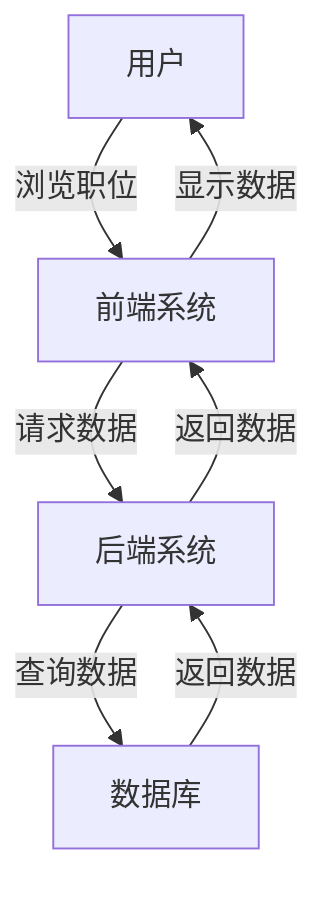

# 网上求职招聘系统详细设计与具体代码实现

作者：禅与计算机程序设计艺术

## 1. 背景介绍

### 1.1 互联网招聘的现状

随着互联网的普及，传统的招聘方式逐渐被网上招聘所取代。互联网招聘不仅提高了招聘效率，还扩大了招聘范围，使得企业能够更容易地找到合适的人才。同时，求职者也可以通过互联网迅速找到适合自己的职位。然而，当前的网上招聘系统仍然存在一些问题，例如信息不对称、招聘流程复杂、用户体验不佳等。

### 1.2 项目动机与目标

本项目旨在设计并实现一个高效、用户友好的网上求职招聘系统。该系统将解决当前网上招聘系统存在的问题，提供一个平台，使企业和求职者能够更高效地进行招聘和求职活动。具体目标包括：

- 提供简洁明了的用户界面，提高用户体验。
- 实现高效的职位匹配算法，帮助求职者快速找到合适的职位。
- 提供多种招聘工具，帮助企业高效管理招聘流程。
- 确保系统的安全性和稳定性，保护用户数据。

## 2. 核心概念与联系

### 2.1 用户角色

在网上求职招聘系统中，主要的用户角色包括：

- **求职者**：通过系统浏览职位信息，投递简历，参与面试。
- **招聘企业**：发布职位信息，筛选简历，安排面试。
- **管理员**：管理系统用户，维护系统运行。

### 2.2 系统功能模块

系统主要包括以下功能模块：

- **用户管理模块**：包括用户注册、登录、个人信息管理等功能。
- **职位管理模块**：包括职位发布、职位浏览、职位搜索等功能。
- **简历管理模块**：包括简历创建、简历投递、简历筛选等功能。
- **面试管理模块**：包括面试安排、面试通知、面试反馈等功能。
- **系统管理模块**：包括用户权限管理、系统日志管理等功能。

### 2.3 数据库设计

系统数据库主要包括以下几张表：

- **用户表**：存储用户的基本信息。
- **职位表**：存储职位的详细信息。
- **简历表**：存储求职者的简历信息。
- **面试表**：存储面试的相关信息。
- **系统日志表**：存储系统的操作日志。

## 3. 核心算法原理具体操作步骤

### 3.1 职位匹配算法

职位匹配是系统的核心功能之一。为了实现高效的职位匹配，我们采用基于内容的推荐算法。具体步骤如下：

1. **特征提取**：从职位信息和简历信息中提取关键特征，例如职位名称、技能要求、工作经验等。
2. **特征向量化**：将提取的特征转化为向量表示，采用TF-IDF（词频-逆文档频率）方法。
3. **相似度计算**：采用余弦相似度计算职位信息和简历信息的相似度。
4. **结果排序**：根据相似度对匹配结果进行排序，返回最匹配的职位列表。

### 3.2 简历筛选算法

简历筛选是企业招聘的重要环节。为了提高简历筛选的效率，我们采用基于规则的筛选算法。具体步骤如下：

1. **规则定义**：根据职位要求定义筛选规则，例如学历要求、工作经验要求、技能要求等。
2. **规则匹配**：将简历信息与筛选规则进行匹配，筛选出符合要求的简历。
3. **结果输出**：将符合要求的简历按匹配度排序，返回给招聘企业。

## 4. 数学模型和公式详细讲解举例说明

### 4.1 特征向量化

特征向量化是职位匹配算法的关键步骤。我们采用TF-IDF方法将职位信息和简历信息转化为向量表示。TF-IDF的计算公式如下：

$$
\text{TF-IDF}(t, d) = \text{TF}(t, d) \times \text{IDF}(t)
$$

其中，$\text{TF}(t, d)$ 表示词 $t$ 在文档 $d$ 中的词频，$\text{IDF}(t)$ 表示词 $t$ 的逆文档频率，计算公式为：

$$
\text{IDF}(t) = \log \frac{N}{\text{DF}(t)}
$$

其中，$N$ 表示文档总数，$\text{DF}(t)$ 表示包含词 $t$ 的文档数。

### 4.2 余弦相似度

余弦相似度用于计算职位信息和简历信息的相似度。余弦相似度的计算公式如下：

$$
\text{cosine\_similarity}(A, B) = \frac{A \cdot B}{\|A\| \|B\|}
$$

其中，$A$ 和 $B$ 分别表示职位信息和简历信息的特征向量，$\cdot$ 表示向量点积，$\|\cdot\|$ 表示向量的模。

### 4.3 举例说明

假设我们有一个职位信息和一个简历信息，分别为：

- 职位信息：`"Java Developer, 3 years experience, Spring Framework"`
- 简历信息：`"Experienced Java Developer with 3 years of experience in Spring Framework"`

首先，我们提取关键特征并进行向量化：

- 职位信息向量：`[1, 1, 1, 1]`（分别对应`Java`, `Developer`, `3 years`, `Spring Framework`）
- 简历信息向量：`[1, 1, 1, 1]`（分别对应`Java`, `Developer`, `3 years`, `Spring Framework`）

然后，计算余弦相似度：

$$
\text{cosine\_similarity}([1, 1, 1, 1], [1, 1, 1, 1]) = \frac{1 \times 1 + 1 \times 1 + 1 \times 1 + 1 \times 1}{\sqrt{1^2 + 1^2 + 1^2 + 1^2} \times \sqrt{1^2 + 1^2 + 1^2 + 1^2}} = 1
$$

相似度为1，表示职位信息和简历信息完全匹配。

## 5. 项目实践：代码实例和详细解释说明

### 5.1 系统架构设计

系统采用前后端分离的架构，前端使用React框架，后端使用Spring Boot框架。数据库采用MySQL，前后端通过RESTful API进行通信。

#### 5.1.1 系统架构图



### 5.2 前端实现

#### 5.2.1 用户注册界面

```jsx
import React, { useState } from 'react';
import axios from 'axios';

function Register() {
  const [username, setUsername] = useState('');
  const [password, setPassword] = useState('');

  const handleSubmit = async (event) => {
    event.preventDefault();
    try {
      const response = await axios.post('/api/register', { username, password });
      alert('注册成功');
    } catch (error) {
      alert('注册失败');
    }
  };

  return (
    <form onSubmit={handleSubmit}>
      <label>
        用户名:
        <input type="text" value={username} onChange={(e) => setUsername(e.target.value)} />
      </label>
      <label>
        密码:
        <input type="password" value={password} onChange={(e) => setPassword(e.target.value)} />
      </label>
      <button type="submit">注册</button>
    </form>
  );
}

export default Register;
```

#### 5.2.2 职位搜索界面

```jsx
import React, { useState } from 'react';
import axios from 'axios';

function JobSearch() {
  const [keyword, setKeyword] = useState('');
  const [jobs, setJobs] = useState([]);

  const handleSearch = async () => {
    try {
      const response = await axios.get(`/api/jobs?keyword=${keyword}`);
      setJobs(response.data);
    } catch (error) {
      alert('搜索失败');
    }
  };

  return (
    <div>
      <input
        type="text"
        value={keyword}
       