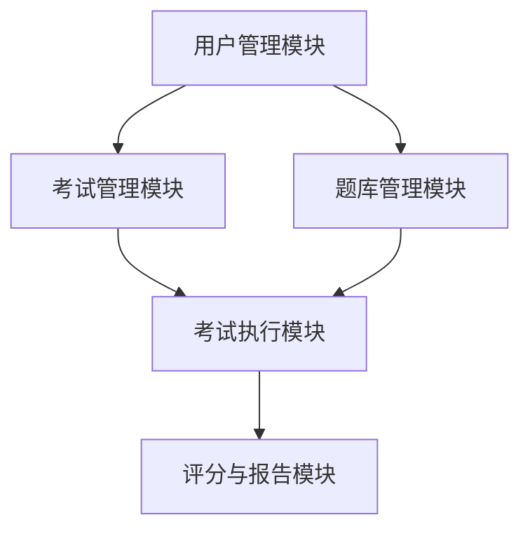

# 网上考试系统详细设计与具体代码实现

作者：禅与计算机程序设计艺术

## 1. 背景介绍

### 1.1 网上考试系统的兴起

随着互联网技术的快速发展，在线教育和考试系统在全球范围内迅速普及。传统的线下考试方式逐渐被在线考试系统所取代，这不仅提高了考试的效率和便捷性，还大大降低了组织考试的成本。尤其是在全球疫情期间，网上考试系统更是成为教育机构和考试组织的首选。

### 1.2 网上考试系统的优势

网上考试系统具有以下几个显著优势：

- **灵活性**：考生可以在任何时间、任何地点参加考试。
- **自动化**：系统可以自动评分，减少了人工评分的工作量和误差。
- **安全性**：通过技术手段可以有效防止作弊行为。
- **数据分析**：系统可以记录并分析考生的答题情况，为教学和改进提供数据支持。

### 1.3 设计网上考试系统的必要性

设计一个高效、安全、可靠的网上考试系统对于教育机构和考试组织者来说至关重要。本文将详细介绍一个网上考试系统的设计与具体代码实现，帮助读者理解其核心概念、算法原理及实际应用。

## 2. 核心概念与联系

### 2.1 系统架构概述

一个完整的网上考试系统通常包括以下几个核心模块：

- **用户管理模块**：负责用户的注册、登录、权限管理等。
- **考试管理模块**：负责考试的创建、发布、管理等。
- **题库管理模块**：负责题目的添加、编辑、删除等。
- **考试执行模块**：负责考试的进行、答题、提交等。
- **评分与报告模块**：负责自动评分、生成成绩报告等。

### 2.2 各模块之间的联系

各模块之间的联系可以用以下Mermaid流程图表示：



### 2.3 主要技术栈

为了实现上述功能，我们将采用以下技术栈：

- **前端**：React.js、HTML、CSS
- **后端**：Node.js、Express.js
- **数据库**：MongoDB
- **其他**：JWT（用于用户认证）、Socket.io（用于实时通信）

## 3. 核心算法原理具体操作步骤

### 3.1 用户认证算法

用户认证是系统安全的基础，我们采用JWT（JSON Web Token）来实现用户认证。其基本流程如下：

1. 用户登录时，系统验证其身份。
2. 验证通过后，系统生成一个JWT，并将其返回给用户。
3. 用户在后续请求中携带该JWT，系统验证其有效性。

具体代码实现如下：

```javascript
const jwt = require('jsonwebtoken');
const secretKey = 'your_secret_key';

// 用户登录
app.post('/login', (req, res) => {
    const { username, password } = req.body;
    // 验证用户名和密码
    if (username === 'admin' && password === 'password') {
        const token = jwt.sign({ username }, secretKey, { expiresIn: '1h' });
        res.json({ token });
    } else {
        res.status(401).send('Unauthorized');
    }
});

// 保护路由
app.get('/protected', (req, res) => {
    const token = req.headers['authorization'];
    if (!token) {
        return res.status(403).send('A token is required for authentication');
    }
    try {
        const decoded = jwt.verify(token, secretKey);
        req.user = decoded;
    } catch (err) {
        return res.status(401).send('Invalid Token');
    }
    return res.status(200).send('Protected content');
});
```

### 3.2 自动评分算法

自动评分是网上考试系统的一大优势，我们可以通过预先设定的答案和评分规则来实现自动评分。其基本流程如下：

1. 考生提交答案后，系统获取正确答案。
2. 系统将考生答案与正确答案进行比对。
3. 根据预设的评分规则，计算得分。

具体代码实现如下：

```javascript
const correctAnswers = {
    question1: 'A',
    question2: 'B',
    question3: 'C'
};

const calculateScore = (answers) => {
    let score = 0;
    for (const question in answers) {
        if (answers[question] === correctAnswers[question]) {
            score += 1;
        }
    }
    return score;
};

// 示例：计算某考生的得分
const studentAnswers = {
    question1: 'A',
    question2: 'C',
    question3: 'C'
};

const score = calculateScore(studentAnswers);
console.log(`Student Score: ${score}`);
```

## 4. 数学模型和公式详细讲解举例说明

### 4.1 评分模型

在设计评分模型时，我们可以采用多种评分策略，例如：

- **绝对评分**：每题得分固定，总分为各题得分之和。
- **相对评分**：根据考生的相对表现进行评分，例如采用正态分布模型。

绝对评分的数学公式为：

$$
S = \sum_{i=1}^{n} s_i
$$

其中，$S$ 为总分，$s_i$ 为第 $i$ 题的得分，$n$ 为题目总数。

相对评分的数学公式为：

$$
z = \frac{X - \mu}{\sigma}
$$

其中，$z$ 为标准分数，$X$ 为考生得分，$\mu$ 为平均分，$\sigma$ 为标准差。

### 4.2 例子说明

假设某次考试的满分为100分，某考生的得分为85分，平均分为70分，标准差为10分，则该考生的标准分数为：

$$
z = \frac{85 - 70}{10} = 1.5
$$

这意味着该考生的表现高于平均水平。

## 5. 项目实践：代码实例和详细解释说明

### 5.1 项目结构

我们将采用MVC（Model-View-Controller）架构来设计网上考试系统，其项目结构如下：

```
online-exam-system/
├── backend/
│   ├── controllers/
│   ├── models/
│   ├── routes/
│   ├── app.js
│   └── config.js
├── frontend/
│   ├── src/
│   │   ├── components/
│   │   ├── pages/
│   │   ├── App.js
│   │   └── index.js
└── README.md
```

### 5.2 后端代码实现

#### 5.2.1 用户管理模块

```javascript
// models/User.js
const mongoose = require('mongoose');

const userSchema = new mongoose.Schema({
    username: { type: String, required: true, unique: true },
    password: { type: String, required: true }
});

module.exports = mongoose.model('User', userSchema);

// controllers/userController.js
const User = require('../models/User');
const jwt = require('jsonwebtoken');
const bcrypt = require('bcrypt');
const secretKey = 'your_secret_key';

exports.register = async (req, res) => {
    const { username, password } = req.body;
    const hashedPassword = await bcrypt.hash(password, 10);
    const user = new User({ username, password: hashedPassword });
    await user.save();
    res.status(201).send('User registered');
};

exports.login = async (req, res) => {
    const { username, password } = req.body;
    const user = await User.findOne({ username });
    if (!user || !await bcrypt.compare(password, user.password)) {
        return res.status(401).send('Unauthorized');
    }
    const token = jwt.sign({ username: user.username }, secretKey, { expiresIn: '1h' });
    res.json({ token });
};

// routes/userRoutes.js
const express = require('express');
const router = express.Router();
const userController = require('../controllers/userController');

router.post('/register', userController.register);
router.post('/login', userController.login);

module.exports = router;

// app.js
const express = require('express');
const mongoose = require('mongoose');
const userRoutes = require('./routes/userRoutes');
const app = express();

app.use(express.json());
app.use('/api/users', userRoutes);

mongoose.connect('mongodb://localhost/online-exam-system', {
    useNewUrlParser: true,
    useUnifiedTopology: true
}).then(() => {
    console.log('Connected to MongoDB');
    app.listen(3000, () => {
        console.log('Server is running on port 3000');
    });
}).catch(err => {
    console.error('Failed to connect to MongoDB', err);
});
```

#### 5.2.2