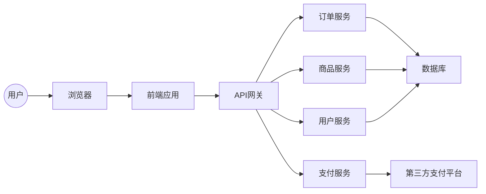

## 网上鲜花店系统详细设计与具体代码实现

作者：禅与计算机程序设计艺术

## 1. 背景介绍

### 1.1 电商行业的蓬勃发展与鲜花市场的兴起

近年来，随着互联网技术的飞速发展和人们生活水平的不断提高，电子商务行业呈现出蓬勃发展的态势。网上购物凭借其便捷、高效、低成本等优势，逐渐成为人们生活中不可或缺的一部分。与此同时，鲜花作为一种特殊的商品，其市场需求也在不断扩大。传统的鲜花销售模式存在着诸多弊端，如地域限制、信息不对称、中间环节多等，难以满足消费者日益增长的个性化、多样化需求。在此背景下，网上鲜花店应运而生，并迅速发展壮大。

### 1.2 网上鲜花店的优势和特点

与传统鲜花店相比，网上鲜花店具有以下优势：

* **打破地域限制，扩大销售范围:**  网上鲜花店不受地域限制，可以将产品销售到全国乃至全球各地，极大地拓展了市场空间。
* **降低运营成本，提高利润空间:**  网上鲜花店无需租赁实体店铺，可以节省大量的租金、水电、人工等成本，从而提高利润空间。
* **提供更丰富的商品信息:**  网上鲜花店可以利用图文、视频等多种形式展示商品信息，并提供详细的产品介绍、养护知识等，方便消费者选购。
* **实现个性化定制服务:**  网上鲜花店可以根据消费者的需求提供个性化定制服务，例如定制花束、贺卡等，满足消费者多元化的需求。

### 1.3 本文的目的和意义

本文旨在介绍网上鲜花店系统的详细设计和具体代码实现，为有意从事鲜花电商行业的创业者提供技术参考和实践指导。

## 2. 核心概念与联系

### 2.1 系统架构设计

#### 2.1.1 架构图



#### 2.1.2 架构说明

本系统采用前后端分离的架构设计，主要包括以下模块：

* **前端应用:** 负责用户界面展示和交互逻辑，使用 HTML、CSS、JavaScript 等技术实现。
* **API 网关:** 负责接收前端请求，并将请求转发到相应的后台服务，同时进行身份验证、权限控制、流量控制等操作。
* **订单服务:** 负责订单的创建、查询、修改、取消等操作。
* **商品服务:** 负责商品的管理，包括商品的添加、修改、删除、查询等操作。
* **用户服务:** 负责用户的注册、登录、信息修改、密码管理等操作。
* **支付服务:** 负责与第三方支付平台进行对接，完成支付流程。
* **数据库:** 存储系统数据，例如用户信息、商品信息、订单信息等。

### 2.2 功能模块设计

#### 2.2.1 用户模块

* 用户注册
* 用户登录
* 用户信息修改
* 密码管理
* 收货地址管理

#### 2.2.2 商品模块

* 商品分类管理
* 商品添加
* 商品修改
* 商品删除
* 商品查询
* 商品详情展示

#### 2.2.3 订单模块

* 购物车功能
* 订单创建
* 订单查询
* 订单修改
* 订单取消
* 订单支付

#### 2.2.4 支付模块

* 支持多种支付方式，例如支付宝、微信支付等。
* 与第三方支付平台进行对接，完成支付流程。

## 3. 核心算法原理具体操作步骤

### 3.1 商品推荐算法

#### 3.1.1 基于用户协同过滤的推荐算法

##### 3.1.1.1 算法原理

基于用户协同过滤的推荐算法是一种常用的推荐算法，其基本思想是：

> "物以类聚，人以群分"， 
> 
> 即用户会对与其兴趣相似的用户所购买的商品感兴趣。

该算法首先根据用户的历史购买记录，计算用户之间的相似度，然后根据目标用户的相似用户所购买的商品，预测目标用户可能会感兴趣的商品。

##### 3.1.1.2 算法步骤

1. 收集用户历史购买数据，构建用户-商品评分矩阵。
2. 计算用户之间的相似度，例如使用余弦相似度。
3. 找到目标用户的相似用户集合。
4. 根据相似用户集合的购买记录，预测目标用户可能会感兴趣的商品。

#### 3.1.2 基于内容的推荐算法

##### 3.1.2.1 算法原理

基于内容的推荐算法是根据商品的内容特征，向用户推荐与其 previously 购买过的商品内容特征相似的商品。

##### 3.1.2.2 算法步骤

1. 提取商品的内容特征，例如商品名称、描述、图片等。
2. 根据商品的内容特征，计算商品之间的相似度。
3. 根据目标用户 previously 购买过的商品的内容特征，找到与其相似的商品。

### 3.2 订单配送路径优化算法

#### 3.2.1 遗传算法

##### 3.2.1.1 算法原理

遗传算法是一种模拟自然界生物进化过程的优化算法，其基本思想是：

> 将问题的解表示为染色体，通过模拟自然选择、交叉、变异等操作，不断进化出更优的解。

##### 3.2.1.2 算法步骤

1. 将配送路径表示为染色体。
2. 初始化种群，即生成一组随机的配送路径。
3. 计算每个染色体的适应度值，即配送路径的总距离。
4. 选择操作，选择适应度值高的染色体进入下一代。
5. 交叉操作，将两个父代染色体的一部分进行交换，生成新的子代染色体。
6. 变异操作，对染色体的某些基因进行随机改变。
7. 重复步骤 3-6，直到满足停止条件，例如达到最大迭代次数或找到最优解。

## 4. 数学模型和公式详细讲解举例说明

### 4.1 余弦相似度

余弦相似度是一种常用的计算两个向量之间相似度的指标，其取值范围为 [-1, 1]，值越大表示两个向量越相似。

#### 4.1.1 公式

$$
\cos(\theta) = \frac{\mathbf{a} \cdot \mathbf{b}}{\|\mathbf{a}\|\|\mathbf{b}\|}
$$

其中：

* $\mathbf{a}$ 和 $\mathbf{b}$ 表示两个向量。
* $\cdot$ 表示向量的点积。
* $\|\mathbf{a}\|$ 表示向量 $\mathbf{a}$ 的模。

#### 4.1.2 举例说明

假设有两个用户 A 和 B，他们对商品的评分如下表所示：

| 商品 | 用户 A | 用户 B |
|---|---|---|
| 商品 1 | 5 | 4 |
| 商品 2 | 3 | 2 |
| 商品 3 | 4 | 5 |

则用户 A 和用户 B 的评分向量分别为：

$$
\mathbf{a} = [5, 3, 4]
$$

$$
\mathbf{b} = [4, 2, 5]
$$

则用户 A 和用户 B 的余弦相似度为：

$$
\begin{aligned}
\cos(\theta) &= \frac{\mathbf{a} \cdot \mathbf{b}}{\|\mathbf{a}\|\|\mathbf{b}\|} \\
&= \frac{5 \times 4 + 3 \times 2 + 4 \times 5}{\sqrt{5^2 + 3^2 + 4^2} \times \sqrt{4^2 + 2^2 + 5^2}} \\
&\approx 0.94
\end{aligned}
$$

## 5. 项目实践：代码实例和详细解释说明

### 5.1 技术选型

* **编程语言:** Java
* **Web 框架:** Spring Boot
* **数据库:** MySQL
* **缓存:** Redis
* **消息队列:** RabbitMQ
* **搜索引擎:** Elasticsearch

### 5.2 代码实例

#### 5.2.1 用户注册接口

```java
@RestController
@RequestMapping("/users")
public class UserController {

    @Autowired
    private UserService userService;

    @PostMapping("/register")
    public Result<User> register(@RequestBody User user) {
        // 校验参数
        // ...

        // 调用 Service 层方法进行注册
        User registeredUser = userService.register(user);

        // 返回注册结果
        return Result.success(registeredUser);
    }
}
```

#### 5.2.2 商品列表查询接口

```java
@RestController
@RequestMapping("/products")
public class ProductController {

    @Autowired
    private ProductService productService;

    @GetMapping
    public Result<Page<Product>> listProducts(
            @RequestParam(defaultValue = "1") int pageNum,
            @RequestParam(defaultValue = "10") int pageSize,
            @RequestParam(required = false) String keyword) {
        // 调用 Service 层方法查询商品列表
        Page<Product> productPage = productService.listProducts(pageNum, pageSize, keyword);

        // 返回查询结果
        return Result.success(productPage);
    }
}
```

## 6. 实际应用场景

* **鲜花电商平台:**  例如花加、Roseonly 等。
* **鲜花实体店线上化:**  传统鲜花店可以通过搭建网上鲜花店系统，实现线上线下融合发展。
* **企业礼品定制:**  企业可以通过网上鲜花店系统，定制鲜花礼品，用于员工福利、客户答谢等场景。

## 7. 总结：未来发展趋势与挑战

### 7.1 未来发展趋势

* **个性化定制:**  随着消费者需求的不断提高，个性化定制将成为未来鲜花电商的重要发展趋势。
* **人工智能应用:**  人工智能技术可以应用于商品推荐、客服机器人、物流优化等方面，提升用户体验和运营效率。
* **线上线下融合:**  线上线下融合是未来零售行业的发展趋势，鲜花电商也不例外，未来将出现更多线上线下融合的鲜花店。

### 7.2 面临的挑战

* **物流配送:**  鲜花属于易损商品，对物流配送的要求较高。
* **售后服务:**  鲜花电商的售后服务难度较大，例如鲜花保鲜、退换货等问题。
* **市场竞争:**  鲜花电商市场竞争激烈，需要不断提升产品和服务质量，才能在市场中立足。

## 8. 附录：常见问题与解答

### 8.1 如何保证鲜花的质量？

* 与优质的鲜花供应商合作。
* 建立完善的鲜花保鲜措施。
* 提供专业的鲜花养护知识。

### 8.2 如何处理退换货问题？

* 制定合理的退换货政策。
* 提供便捷的退换货流程。
* 做好售后服务工作，及时解决用户问题。
