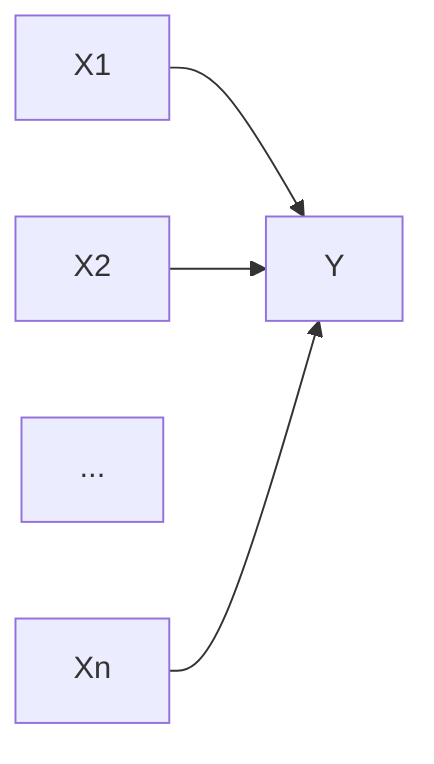

##  网络安全中恶意程序的分析与检测

作者：禅与计算机程序设计艺术

## 1. 背景介绍

### 1.1 网络安全的现状与挑战

随着互联网的快速发展和普及，网络安全问题日益突出，网络攻击手段层出不穷，网络安全形势日益严峻。恶意程序作为网络攻击的主要手段之一，其种类繁多，攻击方式复杂多变，对个人隐私、企业数据安全甚至国家安全都构成了严重威胁。

### 1.2 恶意程序的定义与分类

恶意程序是指任何以未经授权的方式访问计算机系统、窃取信息、破坏数据或干扰系统正常运行的程序或代码。根据其传播方式、攻击目标和行为特征，恶意程序可以分为以下几类：

* **病毒:**  通过感染其他程序进行传播，需要用户主动触发才能运行。
* **蠕虫:**  利用网络漏洞自动传播，无需用户干预。
* **木马:**  伪装成合法软件，窃取用户隐私或控制用户计算机。
* **勒索软件:**  加密用户文件并勒索赎金。
* **僵尸网络:**  控制大量受感染计算机，发动DDoS攻击或发送垃圾邮件。
* **Rootkit:**  隐藏自身和其他恶意程序，难以被发现和清除。

### 1.3 恶意程序分析与检测的重要性

面对日益严峻的网络安全形势，及时有效地分析和检测恶意程序对于维护网络安全至关重要。通过对恶意程序进行分析，可以了解其攻击原理、行为特征和攻击目标，从而制定相应的防御策略和措施。同时，准确地检测出恶意程序，可以及时阻止其攻击行为，最大限度地减少损失。

## 2. 核心概念与联系

### 2.1 恶意程序分析

恶意程序分析是指通过对恶意程序进行反汇编、调试、动态分析等技术手段，了解其内部结构、功能模块和攻击原理的过程。恶意程序分析可以分为静态分析和动态分析两种类型：

* **静态分析:**  在不运行恶意程序的情况下，通过分析其代码、结构和特征来识别恶意行为。
* **动态分析:**  在虚拟环境或沙箱中运行恶意程序，监控其行为并收集相关数据，以分析其功能和目的。

### 2.2 恶意程序检测

恶意程序检测是指利用各种技术手段识别和判断目标程序是否为恶意程序的过程。常见的恶意程序检测技术包括：

* **特征码检测:**  将已知恶意程序的特征码存储在数据库中，通过比对目标程序的特征码来判断其是否为恶意程序。
* **启发式检测:**  根据恶意程序的常见行为特征，制定相应的规则，通过检测目标程序的行为来判断其是否为恶意程序。
* **机器学习检测:**  利用机器学习算法，训练模型识别恶意程序的特征，并用训练好的模型检测未知程序。

### 2.3 恶意程序分析与检测的关系

恶意程序分析和检测是相辅相成的两个方面。恶意程序分析为恶意程序检测提供技术支持，通过分析恶意程序的攻击原理和行为特征，可以提取出更准确的特征码和行为规则，提高恶意程序检测的准确率。而恶意程序检测的结果也可以为恶意程序分析提供参考，帮助分析人员更快地定位恶意代码和分析其攻击原理。

## 3. 核心算法原理具体操作步骤

### 3.1 静态分析技术

#### 3.1.1 反汇编

反汇编是将机器语言指令转换为汇编语言指令的过程，是静态分析的基础。通过反汇编，可以将二进制可执行文件转换为可读性更高的汇编代码，方便分析人员理解程序的逻辑结构和功能模块。

#### 3.1.2 代码分析

代码分析是指通过分析程序的源代码或反汇编代码，识别恶意代码和漏洞的过程。常见的代码分析技术包括：

* **字符串分析:**  分析程序中出现的字符串，例如URL、IP地址、文件名等，可以发现恶意程序的通信地址、攻击目标等信息。
* **函数调用分析:**  分析程序中函数的调用关系，可以识别恶意程序使用的系统API和库函数，推测其功能和目的。
* **控制流分析:**  分析程序的控制流程，可以识别恶意程序中的异常跳转、循环和条件分支，发现恶意代码的执行路径。

#### 3.1.3 特征码提取

特征码是恶意程序的唯一标识，可以通过提取恶意程序的特征码来识别和检测该恶意程序。常见的特征码提取方法包括：

* **基于字节码的特征码:**  提取恶意程序中特定的字节序列作为特征码。
* **基于哈希值的特征码:**  计算恶意程序的哈希值作为特征码。

### 3.2 动态分析技术

#### 3.2.1 沙箱技术

沙箱是一种隔离的执行环境，可以在安全的环境下运行恶意程序，并监控其行为。常见的沙箱技术包括：

* **虚拟机:**  在虚拟机中运行恶意程序，可以隔离恶意程序对真实系统的访问。
* **仿真器:**  模拟真实系统的运行环境，可以执行恶意程序并监控其行为。

#### 3.2.2 行为分析

行为分析是指通过监控恶意程序在沙箱中的行为，例如文件操作、网络通信、注册表操作等，来识别恶意行为。常见的行为分析技术包括：

* **系统调用监控:**  监控恶意程序调用的系统API，可以发现其访问文件、网络、注册表等行为。
* **网络流量分析:**  分析恶意程序的网络通信数据，可以发现其通信地址、通信协议和通信内容。

#### 3.2.3 漏洞利用检测

漏洞利用检测是指通过检测恶意程序是否利用了系统或软件的漏洞来进行攻击。常见的漏洞利用检测技术包括：

* **基于规则的检测:**  根据已知的漏洞利用方法，制定相应的规则，通过检测目标程序的行为是否符合规则来判断其是否利用了漏洞。
* **基于异常的检测:**  监控系统或软件的运行状态，当发现异常行为时，判断其是否为漏洞利用行为。


## 4. 数学模型和公式详细讲解举例说明

### 4.1 基于贝叶斯网络的恶意程序检测模型

贝叶斯网络是一种概率图模型，可以用于表示变量之间的依赖关系。在恶意程序检测中，可以使用贝叶斯网络来表示恶意程序的特征和恶意行为之间的关系。

#### 4.1.1 模型建立

假设恶意程序的特征为 $X_1, X_2, ..., X_n$，恶意行为为 $Y$。可以使用贝叶斯网络来表示它们之间的关系，如下图所示：



其中，每个节点表示一个变量，箭头表示变量之间的依赖关系。例如，$X_1$ 表示恶意程序是否包含特定的字符串，$Y$ 表示恶意程序是否会连接到特定的IP地址。

#### 4.1.2 参数学习

可以使用训练数据集来学习贝叶斯网络的参数。假设训练数据集包含 $m$ 个样本，每个样本包含恶意程序的特征和恶意行为。可以使用最大似然估计方法来估计贝叶斯网络的参数：

$$
P(X_i = x_i | Y = y) = \frac{count(X_i = x_i, Y = y)}{count(Y = y)}
$$

其中，$count(X_i = x_i, Y = y)$ 表示训练数据集中特征 $X_i$ 的值为 $x_i$ 且恶意行为为 $y$ 的样本数量，$count(Y = y)$ 表示训练数据集中恶意行为为 $y$ 的样本数量。

#### 4.1.3 恶意程序检测

给定一个未知的恶意程序，可以根据其特征 $X_1, X_2, ..., X_n$ 来预测其恶意行为 $Y$。可以使用贝叶斯公式来计算恶意行为的后验概率：

$$
P(Y = y | X_1 = x_1, X_2 = x_2, ..., X_n = x_n) = \frac{P(X_1 = x_1, X_2 = x_2, ..., X_n = x_n | Y = y)P(Y = y)}{P(X_1 = x_1, X_2 = x_2, ..., X_n = x_n)}
$$

其中，$P(X_1 = x_1, X_2 = x_2, ..., X_n = x_n | Y = y)$ 可以使用贝叶斯网络的参数来计算，$P(Y = y)$ 可以使用训练数据集来估计，$P(X_1 = x_1, X_2 = x_2, ..., X_n = x_n)$ 可以使用全概率公式来计算。

#### 4.1.4 举例说明

假设恶意程序的特征包括：

* $X_1$: 是否包含字符串 "http://"
* $X_2$: 是否包含字符串 ".exe"
* $X_3$: 文件大小是否大于 10KB

恶意行为为：

* $Y = 1$: 恶意程序
* $Y = 0$: 良性程序

训练数据集如下：

| 样本 | $X_1$ | $X_2$ | $X_3$ | $Y$ |
|---|---|---|---|---|
| 1 | 1 | 1 | 1 | 1 |
| 2 | 0 | 1 | 1 | 1 |
| 3 | 1 | 0 | 0 | 0 |
| 4 | 0 | 0 | 1 | 0 |

根据训练数据集，可以计算出贝叶斯网络的参数：

* $P(X_1 = 1 | Y = 1) = 2/2 = 1$
* $P(X_1 = 0 | Y = 1) = 0/2 = 0$
* $P(X_2 = 1 | Y = 1) = 2/2 = 1$
* $P(X_2 = 0 | Y = 1) = 0/2 = 0$
* $P(X_3 = 1 | Y = 1) = 2/2 = 1$
* $P(X_3 = 0 | Y = 1) = 0/2 = 0$
* $P(X_1 = 1 | Y = 0) = 1/2 = 0.5$
* $P(X_1 = 0 | Y = 0) = 1/2 = 0.5$
* $P(X_2 = 1 | Y = 0) = 1/2 = 0.5$
* $P(X_2 = 0 | Y = 0) = 1/2 = 0.5$
* $P(X_3 = 1 | Y = 0) = 1/2 = 0.5$
* $P(X_3 = 0 | Y = 0) = 1/2 = 0.5$
* $P(Y = 1) = 2/4 = 0.5$
* $P(Y = 0) = 2/4 = 0.5$

现在，给定一个未知的恶意程序，其特征为 $X_1 = 1$, $X_2 = 0$, $X_3 = 1$。可以使用贝叶斯公式来计算其恶意行为的后验概率：

$$
\begin{aligned}
&P(Y = 1 | X_1 = 1, X_2 = 0, X_3 = 1) \\
&= \frac{P(X_1 = 1, X_2 = 0, X_3 = 1 | Y = 1)P(Y = 1)}{P(X_1 = 1, X_2 = 0, X_3 = 1)} \\
&= \frac{P(X_1 = 1 | Y = 1)P(X_2 = 0 | Y = 1)P(X_3 = 1 | Y = 1)P(Y = 1)}{P(X_1 = 1)P(X_2 = 0)P(X_3 = 1)} \\
&= \frac{1 \times 0 \times 1 \times 0.5}{0.5 \times 0.5 \times 0.5} \\
&= 0
\end{aligned}
$$

$$
\begin{aligned}
&P(Y = 0 | X_1 = 1, X_2 = 0, X_3 = 1) \\
&= \frac{P(X_1 = 1, X_2 = 0, X_3 = 1 | Y = 0)P(Y = 0)}{P(X_1 = 1, X_2 = 0, X_3 = 1)} \\
&= \frac{P(X_1 = 1 | Y = 0)P(X_2 = 0 | Y = 0)P(X_3 = 1 | Y = 0)P(Y = 0)}{P(X_1 = 1)P(X_2 = 0)P(X_3 = 1)} \\
&= \frac{0.5 \times 0.5 \times 0.5 \times 0.5}{0.5 \times 0.5 \times 0.5} \\
&= 0.5
\end{aligned}
$$

因此，该恶意程序为良性程序的概率为 0.5，为恶意程序的概率为 0。

### 4.2 其他数学模型

除了贝叶斯网络，还有许多其他的数学模型可以用于恶意程序检测，例如：

* **支持向量机 (SVM)**
* **决策树**
* **随机森林**
* **神经网络**

## 5. 项目实践：代码实例和详细解释说明

### 5.1 使用 Python 编写一个简单的恶意程序检测程序

```python
import hashlib

def calculate_hash(file_path):
    """计算文件的 SHA-256 哈希值

    Args:
        file_path: 文件路径

    Returns:
        文件的 SHA-256 哈希值
    """
    with open(file_path, 'rb') as f:
        file_content = f.read()
        file_hash = hashlib.sha256(file_content).hexdigest()
    return file_hash

def detect_malware(file_path, malware_hashes):
    """检测文件是否是恶意程序

    Args:
        file_path: 文件路径
        malware_hashes: 恶意程序哈希值列表

    Returns:
        如果文件是恶意程序，则返回 True，否则返回 False
    """
    file_hash = calculate_hash(file_path)
    if file_hash in malware_hashes:
        return True
    else:
        return False

if __name__ == '__main__':
    malware_hashes = [
        'e3b0c44298fc1c149afbf4c8996fb92427ae41e4649b934ca495991b7852b855',
        '7f83b1657ff1fc53b92dc18148a1d65dfc2d4b1fa3d677284addd200126d9069',
    ]
    file_path = 'test.exe'
    if detect_malware(file_path, malware_hashes):
        print(f'{file_path} 是恶意程序')
    else:
        print(f'{file_path} 不是恶意程序')
```

### 5.2 代码解释

* `calculate_hash` 函数用于计算文件的 SHA-256 哈希值。
* `detect_malware` 函数用于检测文件是否是恶意程序。它首先计算文件的哈希值，然后检查哈希值是否在恶意程序哈希值列表中。
* `if __name__ == '__main__':` 语句用于在脚本作为主程序运行时执行代码。
* `malware_hashes` 列表包含两个恶意程序的 SHA-256 哈希值。
* `file_path` 变量存储要检测的文件路径。
* `detect_malware` 函数的返回值用于判断文件是否是恶意程序。

## 6. 实际应用场景

### 6.1 入侵检测系统 (IDS)

入侵检测系统 (IDS) 是一种用于检测网络或系统中恶意活动的设备或软件应用程序。IDS 可以使用恶意程序分析和检测技术来识别和阻止恶意流量。

### 6.2 防病毒软件

防病毒软件是一种用于检测、阻止和删除计算机病毒和其他恶意程序的软件程序。防病毒软件使用恶意程序分析和检测技术来识别和阻止恶意程序的安装和执行。

### 6.3 安全信息和事件管理 (SIEM)

安全信息和事件管理 (SIEM) 是一种用于提供对来自各种安全设备和应用程序的安全警报的集中视图的软件解决方案。SIEM 可以使用恶意程序分析和检测技术来关联来自不同来源的安全事件，并识别安全事件的根本原因。

## 7. 总结：未来发展趋势与挑战

### 7.1 未来发展趋势

* **人工智能和机器学习:**  人工智能 (AI) 和机器学习 (ML) 技术将越来越多地用于恶意程序分析和检测，以提高检测的准确性和效率。
* **云安全:**  随着越来越多的企业将其数据和应用程序迁移到云中，云安全将变得越来越重要。恶意程序分析和检测技术将需要适应云环境。
* **物联网 (IoT) 安全:**  物联网 (IoT) 设备的数量正在迅速增长，这些设备通常缺乏强大的安全措施。恶意程序分析和检测技术将需要适应物联网环境。

