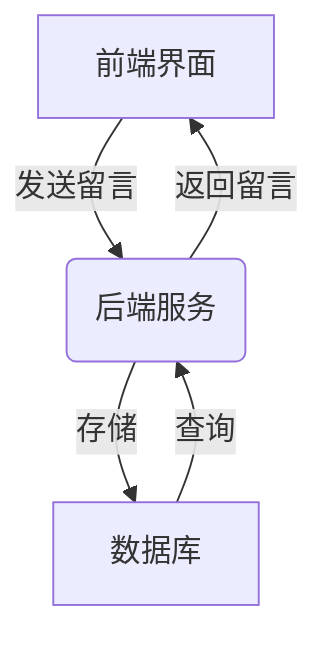
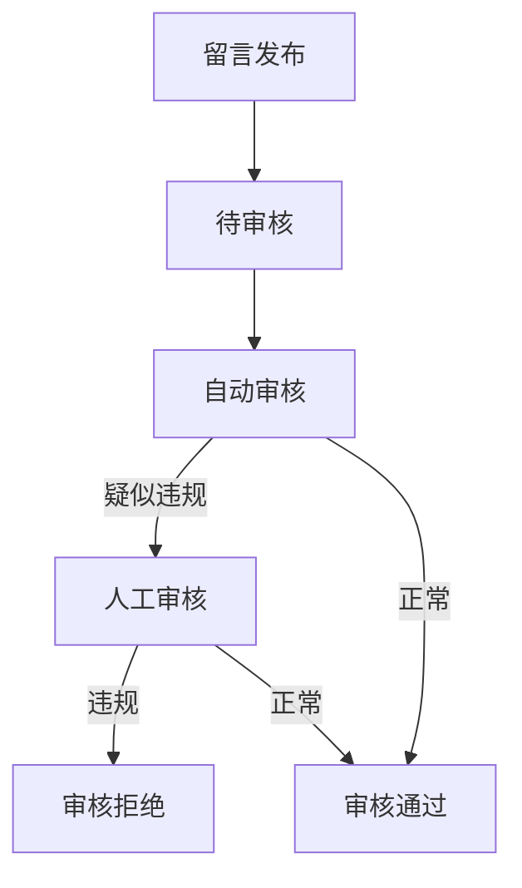

# 网络留言薄管理系统设计与实现

## 1. 背景介绍

### 1.1 留言薄的概念与作用

留言薄是一种在线交互工具,允许用户在网站或应用程序中发布短消息或评论。它为访客提供了一种表达想法、分享体验和提供反馈的方式。留言薄在以下几个方面具有重要作用:

- 促进用户交流互动
- 收集用户反馈意见
- 增强网站粘性和活跃度
- 提高用户参与度和忠诚度

### 1.2 留言薄系统的需求与挑战

随着互联网的发展,留言薄系统需要满足更高的要求,面临以下几个主要挑战:

- 高并发访问量处理
- 防垃圾留言与恶意攻击
- 内容审核与敏感词过滤 
- 可扩展性与高可用性
- 用户身份认证与权限管理

## 2. 核心概念与联系  

### 2.1 系统架构概览

网络留言薄管理系统通常采用前后端分离的架构模式,包括:

- 前端界面: 提供留言输入、展示和交互功能
- 后端服务: 处理留言存储、审核、查询等逻辑
- 数据库: 持久化存储留言数据



### 2.2 关键模块及交互

1. **用户管理模块**
   - 用户注册、登录、权限控制
   - 与身份认证服务集成
2. **留言管理模块** 
   - 留言发布、查询、删除
   - 敏感词过滤、内容审核
3. **审核管理模块**
   - 留言审核流程控制
   - 人工审核、自动审核策略
4. **系统管理模块**
   - 配置管理、日志记录
   - 监控告警、性能优化

## 3. 核心算法原理具体操作步骤

### 3.1 留言存储与查询

#### 3.1.1 留言数据模型设计

设计合理的留言数据模型是系统的基础,需要考虑以下几个方面:

- 留言基本属性:标题、内容、发布时间等
- 关联属性:发布者ID、所属板块、回复对象等
- 扩展属性:点赞数、阅读量、审核状态等

```mermaid
erDiagram
    Message ||--o{ User : publishes
    Message ||--o{ Board : belongs_to
    Message ||--o{ Message : replies_to
    Message {
        int id PK
        varchar title
        text content
        datetime pub_time
        int author_id FK
        int board_id FK
        int parent_id FK
        int likes
        int views
        int status
    }
    User {
        int id PK
        varchar username
        varchar email
        ...
    }
    Board {
        int id PK
        varchar name
        varchar description
        ...
    }
```

#### 3.1.2 留言存储策略

- 单表存储适合小规模系统,方便查询
- 分表分库可提高并发写入能力
- 缓存热点数据可减少数据库压力

#### 3.1.3 留言查询优化

- 使用索引提高查询效率
- 分页查询控制结果集大小
- 缓存或预热热点留言数据

### 3.2 敏感词过滤

#### 3.2.1 敏感词库构建

- 从历史违规案例中收集敏感词语
- 引入第三方敏感词库
- 支持正则表达式扩展匹配规则

#### 3.2.2 过滤算法

1. 前缀树(Trie树)匹配算法

```python
class TrieNode:
    def __init__(self):
        self.children = {}
        self.is_end = False

class FilterTrie:
    def __init__(self):
        self.root = TrieNode()

    def add_word(self, word):
        node = self.root
        for char in word:
            if char not in node.children:
                node.children[char] = TrieNode()
            node = node.children[char]
        node.is_end = True

    def filter(self, text):
        ...  # 实现具体的过滤算法
```

2. 正则表达式匹配
3. 基于机器学习的语义识别

#### 3.2.3 处理策略

- 替换敏感词为掩码字符
- 直接删除敏感内容
- 记录日志、发送告警

### 3.3 内容审核

#### 3.3.1 审核流程

1. 发布留言后进入待审核状态
2. 自动审核系统进行初步过滤
3. 人工审核员复审疑似违规内容
4. 确定最终审核结果(通过/拒绝)



#### 3.3.2 自动审核策略

- 基于敏感词匹配规则
- 基于机器学习的文本分类模型
- 融合多种策略,提高准确率

#### 3.3.3 人工审核

- 审核员身份认证与权限管理
- 审核操作日志记录
- 审核质量控制与反馈机制

### 3.4 Anti-Spam 策略

#### 3.4.1 行为识别

- 监控高频发布行为
- 检测重复、雷同内容
- 分析发布时间、地点等模式

#### 3.4.2 验证码机制

- 结合行为识别系统
- 通过图形、声音等验证码验证
- 考虑无障碍访问需求

#### 3.4.3 黑白名单机制

- 基于IP、账号、设备信息
- 黑名单自动拦截
- 白名单直接放行

## 4. 数学模型和公式详细讲解举例说明

### 4.1 文本相似度计算

在识别重复或雷同留言内容时,需要计算文本之间的相似度。常用的相似度计算模型有:

1. **编辑距离(Edit Distance)**

$$
d(i,j) = \begin{cases}
0 & \text{if $i=0$ or $j=0$} \\
d(i-1,j-1) & \text{if $s_i=t_j$} \\
1 + \min\begin{cases}
d(i,j-1) & \text{(deletion)}\\
d(i-1,j) & \text{(insertion)}\\
d(i-1,j-1) & \text{(substitution)}
\end{cases}
\end{cases}
$$

其中 $s_i$ 和 $t_j$ 分别表示两个字符串的第 $i$ 和第 $j$ 个字符。

2. **Jaccard 相似系数**

$$
J(A,B) = \frac{|A \cap B|}{|A \cup B|}
$$

其中 $A$ 和 $B$ 分别表示两个文本的特征集合,可以是词袋模型或者 n-gram 模型。

3. **TF-IDF 加权余弦相似度**

$$
\text{sim}(A,B) = \frac{\sum\limits_{i=1}^{n} \text{tfidf}(A_i) \cdot \text{tfidf}(B_i)}{\sqrt{\sum\limits_{i=1}^{n} \text{tfidf}(A_i)^2} \cdot \sqrt{\sum\limits_{i=1}^{n} \text{tfidf}(B_i)^2}}
$$

其中 $\text{tfidf}(t)$ 表示词项 $t$ 的 TF-IDF 权重。

### 4.2 文本分类模型

在自动审核中,可以使用文本分类模型对留言内容进行分类,判断是否属于违规内容。常见的文本分类模型有:

1. **朴素贝叶斯分类器**

根据贝叶斯定理计算后验概率:

$$
P(c|x) = \frac{P(x|c)P(c)}{P(x)}
$$

其中 $c$ 表示类别, $x$ 表示特征向量。

2. **支持向量机 (SVM)**

SVM 试图找到一个超平面,将不同类别的样本分开,并最大化margin:

$$
\begin{align}
& \underset{w,b}{\text{minimize}} & & \frac{1}{2}\|w\|^2 \\
& \text{subject to} & & y_i(w^Tx_i+b) \geq 1, \quad i=1,\ldots,n
\end{align}
$$

3. **深度神经网络**

例如长短期记忆网络 (LSTM):

$$
\begin{aligned}
f_t &= \sigma(W_f \cdot [h_{t-1}, x_t] + b_f) \\
i_t &= \sigma(W_i \cdot [h_{t-1}, x_t] + b_i) \\
\tilde{C}_t &= \tanh(W_C \cdot [h_{t-1}, x_t] + b_C) \\
C_t &= f_t \odot C_{t-1} + i_t \odot \tilde{C}_t \\
o_t &= \sigma(W_o \cdot [h_{t-1}, x_t] + b_o) \\
h_t &= o_t \odot \tanh(C_t)
\end{aligned}
$$

其中 $f_t$, $i_t$, $o_t$ 分别表示遗忘门、输入门和输出门。

通过合理选择模型并优化超参数,可以提高文本分类的准确性。

## 5. 项目实践: 代码实例和详细解释说明

### 5.1 留言数据模型实现

使用 Django ORM 定义留言数据模型:

```python
from django.db import models
from django.contrib.auth.models import User

class Board(models.Model):
    name = models.CharField(max_length=100)
    description = models.TextField()

class Message(models.Model):
    title = models.CharField(max_length=200)
    content = models.TextField()
    pub_time = models.DateTimeField(auto_now_add=True)
    author = models.ForeignKey(User, on_delete=models.CASCADE)
    board = models.ForeignKey(Board, on_delete=models.CASCADE)
    parent = models.ForeignKey('self', null=True, blank=True, on_delete=models.CASCADE)
    likes = models.PositiveIntegerField(default=0)
    views = models.PositiveIntegerField(default=0)
    status = models.IntegerField(choices=MESSAGE_STATUS_CHOICES, default=0)
```

### 5.2 留言发布视图

```python
from django.contrib.auth.decorators import login_required
from django.shortcuts import render, redirect, get_object_or_404
from .models import Board, Message
from .forms import MessageForm

@login_required
def publish_message(request, board_id):
    board = get_object_or_404(Board, id=board_id)
    if request.method == 'POST':
        form = MessageForm(request.POST)
        if form.is_valid():
            message = form.save(commit=False)
            message.author = request.user
            message.board = board
            message.save()
            return redirect('board_detail', board_id=board.id)
    else:
        form = MessageForm()
    return render(request, 'message_form.html', {'form': form, 'board': board})
```

### 5.3 留言查询视图

```python
from django.core.paginator import Paginator
from .models import Message

def board_detail(request, board_id):
    board = get_object_or_404(Board, id=board_id)
    messages = Message.objects.filter(board=board, status=1).order_by('-pub_time')
    paginator = Paginator(messages, 20)
    page_number = request.GET.get('page')
    page_obj = paginator.get_page(page_number)
    return render(request, 'board_detail.html', {'board': board, 'page_obj': page_obj})
```

### 5.4 敏感词过滤实现

```python
import re

class SensitiveWordFilter:
    def __init__(self):
        self.trie = {}
        self.load_words('sensitive_words.txt')

    def load_words(self, file_path):
        with open(file_path, 'r', encoding='utf-8') as f:
            for word in f:
                word = word.strip()
                self.add_word(word)

    def add_word(self, word):
        node = self.trie
        for char in word:
            if char not in node:
                node[char] = {}
            node = node[char]
        node['end'] = True

    def filter(self, text):
        def replace(match):
            return '*' * len(match.group())

        node = self.trie
        for i, char in enumerate(text):
            if 'end' in node:
                start = i - len(node) + 1
                text = re.sub(text[start:i+1], replace, text)
                node = self.trie
            if char not in node:
                node = self.trie
            else:
                node = node[char]
        return text
```

### 5.5 自动审核实现

```python
from django.db.models.signals import post_save
from django.dispatch import receiver
from .models import Message
from .filters import SensitiveWordFilter