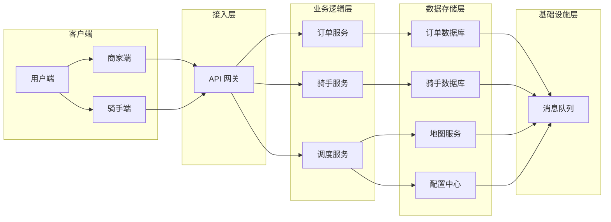

# 美团：使用Cosmos构建外卖配送网络

作者：禅与计算机程序设计艺术

## 1. 背景介绍

### 1.1 外卖配送网络的挑战

随着互联网和移动支付的普及，外卖行业近年来经历了爆炸式增长。外卖平台需要处理海量的订单、调度庞大的骑手队伍、并在复杂多变的城市环境中规划最优配送路线。这给外卖配送网络的构建和优化带来了巨大的挑战：

* **规模庞大且不断增长：** 外卖平台每天需要处理数百万甚至上千万的订单，这对系统的并发处理能力提出了极高要求。
* **实时性要求高：**  用户下单后希望尽快收到餐品，这就要求系统能够实时计算配送路线和预计送达时间。
* **环境复杂多变：**  城市交通状况复杂多变，配送过程中可能出现各种突发情况，需要系统具备灵活应对的能力。
* **效率和成本的平衡：**  平台需要在保证配送效率的同时，尽可能降低配送成本。

### 1.2  Cosmos：美团自研的分布式调度系统

为了应对上述挑战，美团自研了一套名为 **Cosmos** 的分布式调度系统，用于支撑其外卖配送网络的核心业务。Cosmos 具备以下特点：

* **高性能：** Cosmos 采用分布式架构，可以横向扩展以应对海量订单和骑手的调度需求。
* **实时性：** Cosmos 采用基于事件驱动的架构，能够实时响应订单和骑手状态的变化，并及时调整配送策略。
* **智能化：** Cosmos 集成了多种机器学习算法，可以根据历史数据和实时路况预测配送时间、优化配送路线、以及智能调度骑手。
* **可靠性：** Cosmos 采用多副本、容错等机制，保证了系统的高可用性和数据一致性。

## 2. 核心概念与联系

### 2.1  Cosmos 架构

Cosmos 的整体架构如下图所示：



* **客户端：** 包括用户端、商家端和骑手端，用户通过客户端下单，商家确认订单并准备餐品，骑手通过客户端接收订单并完成配送。
* **接入层：** 负责接收来自客户端的请求，并进行鉴权、限流等操作。
* **业务逻辑层：**  负责处理业务逻辑，包括订单管理、骑手管理、调度引擎等。
* **数据存储层：**  负责存储订单、骑手、地图等数据。
* **基础设施层：** 提供消息队列、缓存、数据库等基础服务。

### 2.2 核心概念

* **订单：** 用户在外卖平台上提交的购买请求。
* **骑手：** 负责将餐品从商家送至用户的配送人员。
* **配送区域：** 将城市划分为多个区域，每个区域由多个骑手负责配送。
* **配送路线：** 骑手从取餐到送达目的地所经过的路径。
* **预计送达时间 (ETA)：** 系统根据历史数据、实时路况等信息预测的订单送达时间。
* **调度引擎：** 负责根据订单信息、骑手位置、配送区域等信息，实时为每个订单分配最合适的骑手。

### 2.3 概念之间的联系

* 用户下单后，系统会生成一个订单，并将其分配给相应的商家。
* 调度引擎会根据订单信息和骑手位置，为订单分配最合适的骑手。
* 骑手接到订单后，会前往商家取餐，然后按照系统规划的路线将餐品送至用户手中。
* 在配送过程中，系统会实时跟踪订单和骑手的状态，并根据实际情况调整配送路线和预计送达时间。

## 3. 核心算法原理具体操作步骤

### 3.1 订单分配算法

Cosmos 的订单分配算法主要考虑以下因素：

* **骑手距离：** 优先选择距离商家较近的骑手，以减少取餐时间。
* **骑手运力：**  考虑骑手当前正在配送的订单数量和剩余运力，避免将过多订单分配给同一个骑手。
* **订单紧急程度：** 优先分配预计送达时间较短的订单，以保证用户体验。
* **配送区域：** 尽量将订单分配给负责该区域的骑手，以提高配送效率。

Cosmos 采用了一种基于 **贪心算法** 的订单分配策略，具体步骤如下：

1. 将所有待分配的订单按照预计送达时间排序。
2. 遍历每个订单，找到距离商家最近且满足运力要求的骑手。
3. 如果找到合适的骑手，则将订单分配给该骑手，并更新骑手的运力信息。
4. 如果没有找到合适的骑手，则将订单放入等待队列，等待其他骑手空闲。

### 3.2 路线规划算法

Cosmos 的路线规划算法基于 **Dijkstra 算法**，并结合了实时路况信息，可以为骑手规划出最优的配送路线。具体步骤如下：

1. 获取地图数据，包括道路网络、交通信号灯、限速信息等。
2. 根据实时路况信息，更新道路的通行时间。
3. 使用 Dijkstra 算法计算从起点 (商家) 到终点 (用户) 的最短路径。
4. 将最短路径转换为一系列路段，并为每个路段计算预计通行时间。
5. 将路线信息返回给骑手，指导骑手完成配送。

### 3.3 预计送达时间 (ETA) 算法

Cosmos 的 ETA 算法基于 **机器学习** 技术，可以根据历史订单数据、实时路况信息、天气情况等因素，预测订单的送达时间。具体步骤如下：

1. 收集历史订单数据，包括订单创建时间、商家位置、用户位置、配送时间等。
2. 对历史数据进行特征工程，提取影响配送时间的关键因素，例如距离、交通状况、天气等。
3. 使用机器学习算法训练 ETA 模型，例如线性回归、梯度提升树等。
4. 使用训练好的模型，根据实时路况信息、天气情况等因素，预测订单的送达时间。

## 4. 数学模型和公式详细讲解举例说明

### 4.1 订单分配模型

假设有 $n$ 个订单和 $m$ 个骑手，每个订单 $i$ 有一个预计送达时间 $d_i$，每个骑手 $j$ 有一个当前位置 $(x_j, y_j)$ 和一个最大运力 $c_j$。

定义一个二元变量 $z_{ij}$，表示是否将订单 $i$ 分配给骑手 $j$，则订单分配问题可以表示为一个整数线性规划问题：

$$
\begin{aligned}
& \text{minimize} & & \sum_{i=1}^n \sum_{j=1}^m d_i z_{ij} \\
& \text{subject to} & & \sum_{j=1}^m z_{ij} = 1, & & \forall i = 1, 2, ..., n \\
& & & \sum_{i=1}^n z_{ij} \le c_j, & & \forall j = 1, 2, ..., m \\
& & & z_{ij} \in \{0, 1\}, & & \forall i = 1, 2, ..., n, j = 1, 2, ..., m
\end{aligned}
$$

目标函数是最小化所有订单的总预计送达时间。第一个约束条件保证每个订单只分配给一个骑手。第二个约束条件保证每个骑手的运力不超过最大值。

### 4.2  Dijkstra 算法

Dijkstra 算法是一种经典的最短路径算法，用于计算图中两个节点之间的最短路径。算法步骤如下：

1. 初始化距离数组 `dist`，将起点 `s` 的距离设为 0，其他节点的距离设为无穷大。
2. 创建一个优先队列 `Q`，将所有节点加入队列，并以距离作为优先级。
3. 从优先队列中取出距离最小的节点 `u`。
4. 遍历 `u` 的所有邻居节点 `v`：
    * 如果 `dist[v] > dist[u] + w(u, v)`，则更新 `dist[v] = dist[u] + w(u, v)`，并将 `v` 加入优先队列。
5. 重复步骤 3-4，直到目标节点 `t` 从优先队列中取出。

其中，`w(u, v)` 表示节点 `u` 到节点 `v` 的边的权重。

### 4.3 线性回归模型

线性回归模型是一种常用的机器学习算法，用于预测连续值。模型假设目标变量与特征之间存在线性关系。模型公式如下：

$$
y = \beta_0 + \beta_1 x_1 + \beta_2 x_2 + ... + \beta_n x_n + \epsilon
$$

其中，$y$ 是目标变量，$x_1, x_2, ..., x_n$ 是特征，$\beta_0, \beta_1, \beta_2, ..., \beta_n$ 是模型参数，$\epsilon$ 是误差项。

## 5. 项目实践：代码实例和详细解释说明

### 5.1 订单分配代码示例 (Python)

```python
import heapq

def allocate_orders(orders, riders):
    """
    分配订单给骑手

    Args:
        orders: 订单列表，每个订单包含预计送达时间和商家位置
        riders: 骑手列表，每个骑手包含当前位置和最大运力

    Returns:
        分配结果，字典类型，key 为骑手 ID，value 为分配给该骑手的订单列表
    """

    # 初始化分配结果
    assignments = {}
    for rider in riders:
        assignments[rider['id']] = []

    # 将订单按照预计送达时间排序
    orders = sorted(orders, key=lambda x: x['eta'])

    # 遍历每个订单
    for order in orders:
        # 找到距离商家最近且满足运力要求的骑手
        rider = find_nearest_available_rider(order['restaurant_location'], riders, assignments)

        # 如果找到合适的骑手，则将订单分配给该骑手
        if rider:
            assignments[rider['id']].append(order)
            rider['capacity'] -= 1

    return assignments


def find_nearest_available_rider(restaurant_location, riders, assignments):
    """
    找到距离商家最近且满足运力要求的骑手

    Args:
        restaurant_location: 商家位置
        riders: 骑手列表
        assignments: 分配结果

    Returns:
        骑手信息，如果找到合适的骑手；否则返回 None
    """

    # 使用优先队列存储骑手信息，优先级为距离
    queue = []
    for rider in riders:
        distance = calculate_distance(restaurant_location, rider['location'])
        heapq.heappush(queue, (distance, rider))

    # 找到距离最近且满足运力要求的骑手
    while queue:
        distance, rider = heapq.heappop(queue)
        if rider['capacity'] > 0:
            return rider

    return None


def calculate_distance(location1, location2):
    """
    计算两个位置之间的距离
    """
    # 此处省略距离计算逻辑
    pass
```

### 5.2 Dijkstra 算法代码示例 (Python)

```python
import heapq

def dijkstra(graph, start, end):
    """
    Dijkstra 算法计算最短路径

    Args:
        graph: 图，字典类型，key 为节点，value 为邻居节点及边的权重
        start: 起点
        end: 终点

    Returns:
        最短路径，列表类型；如果不存在路径，则返回 None
    """

    # 初始化距离数组
    distances = {node: float('inf') for node in graph}
    distances[start] = 0

    # 创建优先队列
    queue = [(0, start)]

    # 记录每个节点的前驱节点
    previous = {}

    while queue:
        current_distance, current_node = heapq.heappop(queue)

        # 如果当前节点为终点，则构建最短路径并返回
        if current_node == end:
            path = []
            while current_node:
                path.append(current_node)
                current_node = previous.get(current_node)
            return path[::-1]

        # 遍历邻居节点
        for neighbor, weight in graph[current_node].items():
            distance = current_distance + weight
            if distance < distances[neighbor]:
                distances[neighbor] = distance
                previous[neighbor] = current_node
                heapq.heappush(queue, (distance, neighbor))

    return None
```

## 6. 实际应用场景

除了外卖配送，Cosmos 还被应用于美团的其他业务场景，例如：

* **打车：** 为乘客和司机提供实时匹配和路线规划服务。
* **酒店预订：** 为用户推荐附近的酒店，并提供路线规划和预计到达时间。
* **电影票务：** 为用户推荐附近的电影院，并提供路线规划和预计到达时间。

## 7. 工具和资源推荐

* **OptaPlanner:** 开源的约束求解器，可以用于解决复杂的规划问题，例如车辆路径规划、任务调度等。
* **Google OR-Tools:** Google 开源的运筹优化工具包，提供了多种求解器和算法，可以用于解决线性规划、整数规划、约束规划等问题。
* **Neo4j:** 图数据库，可以用于存储和查询图数据，例如社交网络、知识图谱等。
* **Elasticsearch:** 分布式搜索引擎，可以用于存储、搜索和分析海量数据。

## 8. 总结：未来发展趋势与挑战

随着外卖行业的不断发展，外卖配送网络的规模和复杂度将越来越高，未来发展趋势包括：

* **更加智能化的调度算法：**  利用机器学习、强化学习等技术，开发更加智能的调度算法，提高配送效率和用户体验。
* **无人配送技术的应用：**  无人机、自动驾驶等技术的应用，将为外卖配送带来新的可能性。
* **多场景融合配送：**  将外卖配送与其他配送场景融合，例如快递、生鲜配送等，提高配送效率和资源利用率。

同时，外卖配送网络也面临着一些挑战：

* **数据安全和隐私保护：**  外卖配送网络涉及大量用户数据，需要加强数据安全和隐私保护。
* **配送成本控制：**  随着人力成本的上升，如何控制配送成本是外卖平台需要解决的重要问题。
* **社会责任：**  外卖平台需要承担起社会责任，例如保障骑手权益、减少交通拥堵等。

## 9. 附录：常见问题与解答

### 9.1 Cosmos 如何保证数据一致性？

Cosmos 采用多副本机制保证数据一致性。每个数据分片都有多个副本，分布在不同的机器上。当数据发生变更时，系统会将变更同步到所有副本，保证所有副本的数据一致。

### 9.2 Cosmos 如何应对突发流量？

Cosmos 采用弹性伸缩机制应对突发流量。当系统负载过高时，可以自动添加机器，扩展系统容量。当负载降低时，可以自动减少机器，释放资源。

### 9.3 Cosmos 如何保证配送效率？

Cosmos 采用多种机制保证配送效率，例如：

* **智能调度算法：** 为每个订单分配最合适的骑手，减少配送距离和时间。
* **实时路况信息：**  根据实时路况信息规划配送路线，避开拥堵路段。
* **骑手激励机制：**  通过奖励机制激励骑手提高配送效率。
