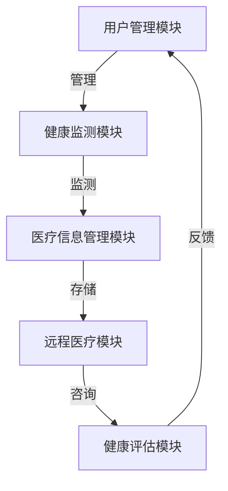

# 老年医疗保健管理系统详细设计与具体代码实现

作者：禅与计算机程序设计艺术

## 1.背景介绍

### 1.1 老年人口增长趋势

随着全球老龄化趋势的加剧，老年人口的比例在不断增加。根据世界卫生组织的数据，到2050年，全球60岁及以上人口将达到20亿，占全球总人口的22%。这一趋势对医疗保健系统提出了新的挑战，特别是在老年人群体的疾病管理和健康维护方面。

### 1.2 老年医疗保健的需求

老年人群体由于生理机能衰退，容易患上慢性疾病，如高血压、糖尿病、心脏病等。此外，老年人还面临认知功能下降、行动不便等问题。因此，提供专门针对老年人群体的医疗保健管理系统显得尤为重要。

### 1.3 技术背景

随着信息技术的发展，医疗信息化程度不断提高。物联网（IoT）、大数据、人工智能（AI）等技术在医疗领域的应用，为老年医疗保健管理系统的设计和实现提供了新的思路和方法。

## 2.核心概念与联系

### 2.1 老年医疗保健管理系统的定义

老年医疗保健管理系统是一个集成了医疗信息管理、健康监测、远程医疗、健康评估等功能的综合性系统，旨在为老年人提供全面的医疗保健服务。

### 2.2 系统架构

老年医疗保健管理系统通常由以下几个模块组成：

- **用户管理模块**：负责用户信息的管理，包括老年人及其家属、医护人员等。
- **健康监测模块**：通过可穿戴设备等手段，实时监测老年人的健康数据，如心率、血压、血糖等。
- **医疗信息管理模块**：管理老年人的病历、检查报告、治疗方案等医疗信息。
- **远程医疗模块**：支持老年人通过网络与医生进行远程问诊和咨询。
- **健康评估模块**：基于健康数据和医疗信息，对老年人的健康状况进行评估，并提供个性化的健康建议。



### 2.3 各模块之间的联系

各模块之间通过数据共享和交互，实现信息的无缝流转。例如，健康监测模块采集的健康数据可以实时传输到医疗信息管理模块，医生可以通过远程医疗模块查看这些数据，并在健康评估模块中进行分析和评估。

## 3.核心算法原理具体操作步骤

### 3.1 健康数据采集与处理

健康数据采集主要通过各种传感器和可穿戴设备进行。这些设备实时监测老年人的生理参数，并通过物联网技术将数据上传到云端服务器。

#### 3.1.1 数据采集

数据采集设备包括智能手表、血压计、血糖仪等。这些设备通过蓝牙、Wi-Fi等方式与手机或其他终端设备连接，将采集到的数据传输到系统中。

#### 3.1.2 数据处理

数据处理包括数据清洗、数据存储和数据分析。数据清洗是指对采集到的数据进行预处理，去除噪音和异常值。数据存储是将处理后的数据存储到数据库中。数据分析则是对存储的数据进行统计分析和建模，以便提取有用的信息。

### 3.2 健康评估算法

健康评估算法基于采集到的健康数据和医疗信息，对老年人的健康状况进行评估。常用的健康评估算法包括机器学习算法和规则算法。

#### 3.2.1 机器学习算法

机器学习算法通过对大量历史数据的训练，建立预测模型，用于评估老年人的健康状况。例如，利用回归分析可以预测老年人的血压变化趋势，利用分类算法可以判断老年人是否患有某种疾病。

#### 3.2.2 规则算法

规则算法基于医学专家的经验和知识，制定一系列规则，用于评估老年人的健康状况。例如，如果老年人的血压超过某个阈值，则判定其有高血压风险。

### 3.3 远程医疗技术

远程医疗技术包括视频通话、远程诊断、远程监控等。通过这些技术，老年人可以在家中与医生进行实时沟通，获取医疗建议和治疗方案。

#### 3.3.1 视频通话

视频通话技术通过互联网实现老年人与医生之间的实时视频交流。视频通话需要保证网络的稳定性和通话的清晰度，以便医生能够准确地了解老年人的病情。

#### 3.3.2 远程诊断

远程诊断技术通过传输老年人的健康数据和病历信息，医生可以在远程进行诊断和开具处方。远程诊断需要保证数据的准确性和安全性，防止数据泄露和篡改。

#### 3.3.3 远程监控

远程监控技术通过实时监测老年人的健康数据，医生可以随时了解老年人的健康状况，并在必要时进行干预。远程监控需要保证数据的实时性和可靠性，防止数据丢失和延迟。

## 4.数学模型和公式详细讲解举例说明

### 4.1 数据清洗模型

数据清洗是数据处理的第一步，目的是去除数据中的噪音和异常值。常用的数据清洗方法包括均值滤波、中值滤波等。

#### 4.1.1 均值滤波

均值滤波是一种简单的平滑技术，通过计算数据的移动平均值来去除噪音。

$$
\tilde{x}_i = \frac{1}{2k+1} \sum_{j=-k}^{k} x_{i+j}
$$

其中，$\tilde{x}_i$ 表示滤波后的数据，$x_i$ 表示原始数据，$k$ 是窗口大小。

#### 4.1.2 中值滤波

中值滤波是一种非线性滤波技术，通过取窗口内数据的中值来去除噪音。

$$
\tilde{x}_i = \text{median}(x_{i-k}, \ldots, x_{i+k})
$$

其中，$\text{median}$ 表示中值操作。

### 4.2 机器学习模型

机器学习模型用于对老年人的健康状况进行预测和分类。常用的机器学习模型包括线性回归、逻辑回归、支持向量机等。

#### 4.2.1 线性回归

线性回归用于预测连续变量，如老年人的血压、血糖等。

$$
y = \beta_0 + \beta_1 x_1 + \beta_2 x_2 + \ldots + \beta_n x_n + \epsilon
$$

其中，$y$ 表示预测值，$x_i$ 表示特征变量，$\beta_i$ 表示回归系数，$\epsilon$ 表示误差项。

#### 4.2.2 逻辑回归

逻辑回归用于分类问题，如判断老年人是否患有某种疾病。

$$
P(y=1|x) = \frac{1}{1 + \exp(-(\beta_0 + \beta_1 x_1 + \beta_2 x_2 + \ldots + \beta_n x_n))}
$$

其中，$P(y=1|x)$ 表示事件发生的概率，$x_i$ 表示特征变量，$\beta_i$ 表示回归系数。

### 4.3 规则算法

规则算法基于一系列预定义的规则，对老年人的健康状况进行评估。例如，高血压的判断规则可以定义为：

$$
\text{if } \text{Systolic Blood Pressure} \geq 140 \text{ or } \text{Diastolic Blood Pressure} \geq 90 \text{ then } \text{High Blood Pressure}
$$

## 5.项目实践：代码实例和详细解释说明

### 5.1 系统开发环境

在开始项目实践之前，需要搭建开发环境。本文使用Python作为主要编程语言，使用Flask框架进行Web开发，使用MySQL作为数据库，使用TensorFlow进行机器学习模型的训练和预测。

### 5.2 用户管理模块

用户管理模块负责用户信息的管理，包括用户注册、登录、信息修改等功能。

#### 5.2.1 数据库设计

用户信息表的设计如下：

```sql
