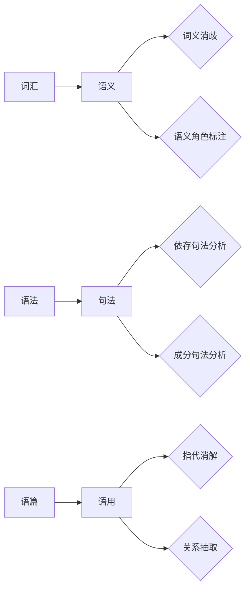

## 1. 背景介绍

### 1.1 什么是自然语言处理 (NLP)？

自然语言处理（Natural Language Processing, NLP）是人工智能领域的一个重要分支，旨在让计算机能够理解、解释和生成人类语言。简单来说，NLP就是让计算机像人类一样“懂”语言。

### 1.2 NLP 的发展历程

NLP 的发展可以追溯到 20 世纪 50 年代，经历了规则驱动、统计学习和深度学习三个主要阶段：

* **规则驱动时代 (1950s - 1980s):**  早期 NLP 系统主要依赖于语言学家手工编写的规则，例如语法规则、语义规则等。这些系统在处理简单任务时取得了一定成功，但难以扩展到更复杂的任务。
* **统计学习时代 (1990s - 2010s):**  随着统计机器学习的兴起，NLP 开始采用统计模型来学习语言规律。这些模型通过分析大量的文本数据来自动提取语言特征，并用于解决各种 NLP 任务。
* **深度学习时代 (2010s - 至今):**  近年来，深度学习技术 revolutionized 了 NLP 领域。深度学习模型，例如循环神经网络（RNN）、卷积神经网络（CNN）和 Transformer，能够学习到更加复杂和抽象的语言特征，并在各种 NLP 任务上取得了 state-of-the-art 的结果。

### 1.3 NLP 的应用领域

NLP 技术应用广泛，涵盖了众多领域，例如：

* **机器翻译：**  将一种语言的文本自动翻译成另一种语言。
* **情感分析：**  分析文本中表达的情感，例如正面、负面或中性。
* **问答系统：**  根据用户提出的问题，自动从知识库中找到答案。
* **文本摘要：**  从一篇长文本中提取出关键信息，生成简短的摘要。
* **语音识别：**  将语音信号转换为文本。
* **聊天机器人：**  模拟人类对话，与用户进行自然语言交互。

## 2. 核心概念与联系

### 2.1 词汇与语义

* **词汇 (Lexicon):**  语言中最基本的单元，例如单词、词根、词缀等。
* **语义 (Semantics):**  词汇、句子和段落所表达的含义。
* **词义消歧 (Word Sense Disambiguation, WSD):**  确定一个词在特定语境下的具体含义。
* **语义角色标注 (Semantic Role Labeling, SRL):**  识别句子中每个词语的语义角色，例如施事者、受事者、时间、地点等。

### 2.2 语法与句法

* **语法 (Grammar):**  语言的结构规则，规定了如何将词汇组合成句子。
* **句法 (Syntax):**  研究句子结构的学科。
* **依存句法分析 (Dependency Parsing):**  分析句子中词语之间的依存关系，构建依存句法树。
* **成分句法分析 (Constituency Parsing):**  将句子分解成不同的语法成分，构建成分句法树。

### 2.3 语篇与语用

* **语篇 (Discourse):**  指超过句子长度的语言单位，例如段落、文章等。
* **语用 (Pragmatics):**  研究语言在实际使用中的含义，例如说话者的意图、听者的理解等。
* **指代消解 (Coreference Resolution):**  确定语篇中不同表达指的是同一个实体，例如代词、名词短语等。
* **关系抽取 (Relation Extraction):**  从文本中识别实体之间关系，例如人物关系、组织机构关系等。

### 2.4 核心概念联系图



## 3. 核心算法原理具体操作步骤

### 3.1 文本预处理

在进行任何 NLP 任务之前，都需要对原始文本数据进行预处理，以便于后续的分析和处理。常见的文本预处理步骤包括：

#### 3.1.1 分词 (Tokenization)

将文本按照一定的规则切分成词语，例如空格、标点符号等。

**代码实例 (Python):**

```python
import nltk

text = "This is a sentence."
tokens = nltk.word_tokenize(text)
print(tokens)
# 输出: ['This', 'is', 'a', 'sentence', '.']
```

#### 3.1.2 词干提取 (Stemming)

将词语还原成其词干形式，例如 "running" 还原成 "run"。

**代码实例 (Python):**

```python
from nltk.stem import PorterStemmer

stemmer = PorterStemmer()
print(stemmer.stem("running"))
# 输出: run
```

#### 3.1.3 词形还原 (Lemmatization)

将词语还原成其基本形式，例如 "am", "is", "are" 还原成 "be"。

**代码实例 (Python):**

```python
from nltk.stem import WordNetLemmatizer

lemmatizer = WordNetLemmatizer()
print(lemmatizer.lemmatize("are", pos="v"))
# 输出: be
```

#### 3.1.4 停用词去除 (Stop Word Removal)

去除文本中一些无意义的词语，例如 "a", "the", "is" 等。

**代码实例 (Python):**

```python
from nltk.corpus import stopwords

stop_words = set(stopwords.words('english'))
text = "This is a sentence."
tokens = nltk.word_tokenize(text)
filtered_tokens = [w for w in tokens if not w.lower() in stop_words]
print(filtered_tokens)
# 输出: ['This', 'sentence', '.']
```

### 3.2 文本表示

#### 3.2.1 词袋模型 (Bag-of-Words, BoW)

将文本表示成一个向量，其中每个元素表示对应词语在文本中出现的频率。

**代码实例 (Python):**

```python
from sklearn.feature_extraction.text import CountVectorizer

corpus = [
    'This is the first document.',
    'This document is the second document.',
    'And this is the third one.',
    'Is this the first document?',
]
vectorizer = CountVectorizer()
X = vectorizer.fit_transform(corpus)
print(X.toarray())
```

#### 3.2.2 TF-IDF (Term Frequency-Inverse Document Frequency)

TF-IDF 是一种用于信息检索与文本挖掘的常用加权技术。它是一种统计方法，用于评估词语对于一个文档集或语料库中的一个文档的重要程度。字词的重要性随着它在文档中出现的次数成正比增加，但同时会随着它在语料库中出现的频率成反比下降。

**TF (词频)**：指的是某一个给定的词语在该文件中出现的频率。这个数字通常会被归一化，以防止它偏向长的文件。

**IDF (逆向文件频率)**：是一个衡量词语重要程度的度量。某词语的 IDF，可以由总文件数目除以包含该词语之文件的数目，再将得到的商取对数得到。

**TF-IDF 的计算公式:**

```
TF-IDF(t, d, D) = TF(t, d) * IDF(t, D)
```

其中:

*   **t** 指的是词条（Term）
*   **d** 指的是文件（Document）
*   **D** 指的是文件集（Document set）

**代码实例 (Python):**

```python
from sklearn.feature_extraction.text import TfidfVectorizer

corpus = [
    'This is the first document.',
    'This document is the second document.',
    'And this is the third one.',
    'Is this the first document?',
]
vectorizer = TfidfVectorizer()
X = vectorizer.fit_transform(corpus)
print(X.toarray())
```

#### 3.2.3 词嵌入 (Word Embedding)

将词语映射到一个低维向量空间中，使得语义相似的词语在向量空间中距离更近。

**常见的词嵌入模型:**

*   **Word2Vec:**  Word2Vec 是一种浅层神经网络模型，它可以将语料库中的词语映射成向量。Word2Vec 有两种模型结构：CBOW（Continuous Bag-of-Words）和 Skip-gram。CBOW 模型根据上下文预测目标词语，而 Skip-gram 模型根据目标词语预测上下文。
*   **GloVe (Global Vectors for Word Representation):**  GloVe 是一种基于全局词-词共现统计信息的词向量表示方法。GloVe 模型的目标是，通过训练词向量，使得词向量之间的点积尽可能地接近词-词共现矩阵中对应的元素值。
*   **FastText:**  FastText 是 Facebook 开发的一种快速文本分类和词向量表示工具。FastText 模型的特点是，它将词语视为字符序列，并使用字符级别的 n-gram 信息来学习词向量。

**代码实例 (Python):**

```python
from gensim.models import Word2Vec

# 训练 Word2Vec 模型
sentences = [['this', 'is', 'the', 'first', 'sentence'], ['this', 'is', 'the', 'second', 'sentence']]
model = Word2Vec(sentences, min_count=1)

# 获取词向量
vector = model.wv['sentence']
print(vector)
```

### 3.3  机器学习模型

#### 3.3.1 朴素贝叶斯 (Naive Bayes)

朴素贝叶斯分类器是一种基于贝叶斯定理的概率分类器，它假设每个特征之间相互独立。朴素贝叶斯分类器简单高效，在文本分类、垃圾邮件过滤等任务中取得了不错的效果。

**代码实例 (Python):**

```python
from sklearn.datasets import fetch_20newsgroups
from sklearn.feature_extraction.text import TfidfVectorizer
from sklearn.naive_bayes import MultinomialNB
from sklearn.pipeline import Pipeline

# 加载数据集
categories = ['alt.atheism', 'soc.religion.christian', 'comp.graphics', 'sci.med']
twenty_train = fetch_20newsgroups(subset='train', categories=categories, shuffle=True, random_state=42)

# 创建朴素贝叶斯分类器
text_clf = Pipeline([
    ('vect', TfidfVectorizer()),
    ('clf', MultinomialNB()),
])

# 训练模型
text_clf.fit(twenty_train.data, twenty_train.target)

# 预测新数据的类别
docs_new = ['God is love', 'OpenGL on the GPU is fast']
predicted = text_clf.predict(docs_new)
print(predicted)
```

#### 3.3.2 支持向量机 (Support Vector Machine, SVM)

支持向量机是一种二分类模型，它试图找到一个超平面，将不同类别的样本尽可能地分开。支持向量机在文本分类、图像识别等任务中取得了很好的效果。

**代码实例 (Python):**

```python
from sklearn.datasets import fetch_20newsgroups
from sklearn.feature_extraction.text import TfidfVectorizer
from sklearn.svm import LinearSVC
from sklearn.pipeline import Pipeline

# 加载数据集
categories = ['alt.atheism', 'soc.religion.christian', 'comp.graphics', 'sci.med']
twenty_train = fetch_20newsgroups(subset='train', categories=categories, shuffle=True, random_state=42)

# 创建支持向量机分类器
text_clf = Pipeline([
    ('vect', TfidfVectorizer()),
    ('clf', LinearSVC()),
])

# 训练模型
text_clf.fit(twenty_train.data, twenty_train.target)

# 预测新数据的类别
docs_new = ['God is love', 'OpenGL on the GPU is fast']
predicted = text_clf.predict(docs_new)
print(predicted)
```

#### 3.3.3 隐马尔可夫模型 (Hidden Markov Model, HMM)

隐马尔可夫模型是一种统计模型，它用于建模时间序列数据。隐马尔可夫模型在语音识别、词性标注等任务中取得了很好的效果。

**代码实例 (Python):**

```python
import nltk
from nltk.corpus import brown

# 训练 HMM 模型
train_sents = brown.tagged_sents()[:5000]
hmm_tagger = nltk.HiddenMarkovModelTagger.train(train_sents)

# 对新句子进行词性标注
test_sent = "This is a test sentence".split()
tagged_sent = hmm_tagger.tag(test_sent)
print(tagged_sent)
```

### 3.4 深度学习模型

#### 3.4.1 循环神经网络 (Recurrent Neural Network, RNN)

循环神经网络是一种专门设计用于处理序列数据的深度学习模型。RNN 的特点是，它可以记住之前的输入信息，并将其用于当前的输出。RNN 在机器翻译、文本生成等任务中取得了很好的效果。

**代码实例 (Python):**

```python
from tensorflow import keras
from tensorflow.keras import layers

# 创建 RNN 模型
model = keras.Sequential()
model.add(layers.Embedding(input_dim=1000, output_dim=64))
model.add(layers.LSTM(64))
model.add(layers.Dense(10, activation='softmax'))

# 编译模型
model.compile(optimizer='adam', loss='sparse_categorical_crossentropy', metrics=['accuracy'])

# 训练模型
model.fit(x_train, y_train, epochs=10)

# 评估模型
loss, accuracy = model.evaluate(x_test, y_test)
print('Test Loss:', loss)
print('Test Accuracy:', accuracy)
```

#### 3.4.2 长短期记忆网络 (Long Short-Term Memory, LSTM)

长短期记忆网络是一种特殊的 RNN，它能够解决 RNN 中的梯度消失和梯度爆炸问题。LSTM 在机器翻译、语音识别等任务中取得了很好的效果。

**代码实例 (Python):**

```python
from tensorflow import keras
from tensorflow.keras import layers

# 创建 LSTM 模型
model = keras.Sequential()
model.add(layers.Embedding(input_dim=1000, output_dim=64))
model.add(layers.LSTM(64))
model.add(layers.Dense(10, activation='softmax'))

# 编译模型
model.compile(optimizer='adam', loss='sparse_categorical_crossentropy', metrics=['accuracy'])

# 训练模型
model.fit(x_train, y_train, epochs=10)

# 评估模型
loss, accuracy = model.evaluate(x_test, y_test)
print('Test Loss:', loss)
print('Test Accuracy:', accuracy)
```

#### 3.4.3 门控循环单元 (Gated Recurrent Unit, GRU)

门控循环单元是 LSTM 的一种变体，它比 LSTM 更简单、更高效。GRU 在机器翻译、语音识别等任务中取得了很好的效果。

**代码实例 (Python):**

```python
from tensorflow import keras
from tensorflow.keras import layers

# 创建 GRU 模型
model = keras.Sequential()
model.add(layers.Embedding(input_dim=1000, output_dim=64))
model.add(layers.GRU(64))
model.add(layers.Dense(10, activation='softmax'))

# 编译模型
model.compile(optimizer='adam', loss='sparse_categorical_crossentropy', metrics=['accuracy'])

# 训练模型
model.fit(x_train, y_train, epochs=10)

# 评估模型
loss, accuracy = model.evaluate(x_test, y_test)
print('Test Loss:', loss)
print('Test Accuracy:', accuracy)
```

#### 3.4.4 Transformer

Transformer 是一种基于注意力机制的深度学习模型，它不需要循环结构，因此可以并行计算，训练速度更快。Transformer 在机器翻译、文本生成等任务中取得了 state-of-the-art 的结果。

**代码实例 (Python):**

```python
import tensorflow as tf

# 创建 Transformer 模型
encoder_inputs = tf.keras.Input(shape=(None,), dtype=tf.int32)
decoder_inputs = tf.keras.Input(shape=(None,), dtype=tf.int32)

# Encoder 层
encoder_embedding = tf.keras.layers.Embedding(input_dim=vocab_size, output_dim=d_model)(encoder_inputs)
encoder_outputs = tf.keras.layers.TransformerEncoder(num_layers=num_layers, d_model=d_model, num_heads=num_heads)(encoder_embedding)

# Decoder 层
decoder_embedding = tf.keras.layers.Embedding(input_dim=vocab_size, output_dim=d_model)(decoder_inputs)
decoder_outputs = tf.keras.layers.TransformerDecoder(num_layers=num_layers, d_model=d_model, num_heads=num_heads)(decoder_embedding, encoder_outputs)

# 输出层
final_output = tf.keras.layers.Dense(units=vocab_size, activation='softmax')(decoder_outputs)

# 创建模型
model