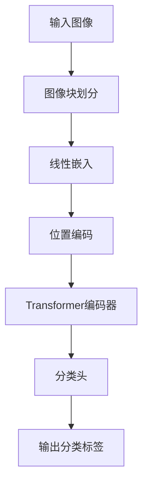

# 视觉Transformer原理与代码实例讲解

作者：禅与计算机程序设计艺术

## 1. 背景介绍

### 1.1 深度学习与计算机视觉的演变

深度学习在过去十年中经历了飞速的发展，尤其是在计算机视觉领域。传统的卷积神经网络（CNNs）在图像分类、目标检测和分割等任务中取得了巨大的成功。然而，随着任务复杂度的增加和数据规模的扩大，CNNs的局限性逐渐显现。模型的深度和宽度不断增加，带来了计算成本和内存需求的急剧上升。与此同时，Transformer模型在自然语言处理（NLP）领域取得了显著的成功，引发了研究者们将其应用于计算机视觉的兴趣。

### 1.2 Transformer模型的引入

Transformer模型最初由Vaswani等人在2017年提出，用于机器翻译任务。其核心思想是使用自注意力机制（Self-Attention）来捕捉序列数据中的长距离依赖关系。与传统的递归神经网络（RNN）不同，Transformer模型在并行计算和处理长序列方面表现出色。近年来，研究者们开始探索将Transformer应用于计算机视觉任务，提出了视觉Transformer（Vision Transformer, ViT）模型。

### 1.3 视觉Transformer的优势

视觉Transformer通过自注意力机制直接处理图像块（Patch），避免了卷积操作，从而克服了CNNs的一些固有局限性。它在捕捉图像中的全局信息和长距离依赖关系方面表现出色。同时，视觉Transformer具有较好的可扩展性，可以通过增加层数和注意力头数来提升模型性能。

## 2. 核心概念与联系

### 2.1 自注意力机制

自注意力机制是Transformer模型的核心组件。它通过计算输入序列中每个位置的注意力权重，来捕捉不同位置之间的依赖关系。具体来说，自注意力机制包括三个步骤：计算查询（Query）、键（Key）和值（Value），计算注意力权重，并生成输出。

### 2.2 多头注意力机制

多头注意力机制通过并行计算多个自注意力机制，将其结果拼接在一起，从而捕捉更多维度的信息。每个头（Head）独立地学习不同的注意力模式，最终通过线性变换将所有头的输出进行整合。

### 2.3 视觉Transformer的架构

视觉Transformer的架构主要包括以下几个部分：

1. **图像块划分**：将输入图像划分为固定大小的图像块（Patch）。
2. **线性嵌入**：将每个图像块展平并通过线性变换映射到高维空间。
3. **位置编码**：为每个图像块添加位置信息，以保留图像的空间结构。
4. **Transformer编码器**：通过堆叠多个Transformer编码器层来处理图像块。
5. **分类头**：将编码后的图像块通过全连接层映射到分类标签。

以下是视觉Transformer的架构示意图：



## 3. 核心算法原理具体操作步骤

### 3.1 图像块划分

将输入图像划分为固定大小的图像块（Patch）是视觉Transformer的第一步。假设输入图像大小为 $H \times W \times C$，其中 $H$ 和 $W$ 分别表示图像的高度和宽度，$C$ 表示通道数。我们将图像划分为大小为 $P \times P$ 的图像块，每个图像块展平后形成一个长度为 $P^2 \cdot C$ 的向量。

### 3.2 线性嵌入

将每个图像块通过线性变换映射到高维空间。假设嵌入维度为 $D$，我们可以使用一个线性层将每个图像块的向量映射到 $D$ 维空间。具体来说，线性嵌入的公式为：

$$
E_i = W \cdot x_i + b
$$

其中，$E_i$ 表示第 $i$ 个图像块的嵌入向量，$W$ 和 $b$ 分别表示线性变换的权重和偏置，$x_i$ 表示第 $i$ 个图像块的展平向量。

### 3.3 位置编码

为了保留图像的空间结构，我们为每个图像块添加位置信息。位置编码可以通过正弦和余弦函数生成，也可以通过学习得到。假设位置编码为 $P_i$，则添加位置编码后的嵌入向量为：

$$
Z_i = E_i + P_i
$$

### 3.4 Transformer编码器

Transformer编码器由多个编码器层堆叠而成。每个编码器层包括一个多头自注意力机制和一个前馈神经网络。具体步骤如下：

1. **多头自注意力机制**：计算查询、键和值，并通过多头注意力机制生成注意力输出。
2. **残差连接和层归一化**：将注意力输出与输入相加，并进行层归一化。
3. **前馈神经网络**：通过两个线性层和一个激活函数生成前馈输出。
4. **残差连接和层归一化**：将前馈输出与输入相加，并进行层归一化。

### 3.5 分类头

将编码后的图像块通过全连接层映射到分类标签。具体来说，我们可以将所有图像块的嵌入向量平均池化，得到一个全局特征向量，然后通过全连接层进行分类。

## 4. 数学模型和公式详细讲解举例说明

### 4.1 自注意力机制的数学模型

自注意力机制的核心在于计算查询、键和值，并生成注意力权重。具体公式如下：

$$
Q = XW_Q, \quad K = XW_K, \quad V = XW_V
$$

其中，$Q$、$K$ 和 $V$ 分别表示查询、键和值，$X$ 表示输入序列，$W_Q$、$W_K$ 和 $W_V$ 分别表示查询、键和值的权重矩阵。

注意力权重的计算公式为：

$$
A = \text{softmax}\left(\frac{QK^T}{\sqrt{d_k}}\right)
$$

其中，$A$ 表示注意力权重矩阵，$d_k$ 表示键的维度。

最终的注意力输出为：

$$
Z = AV
$$

### 4.2 多头注意力机制的数学模型

多头注意力机制通过并行计算多个自注意力机制，将其结果拼接在一起。具体公式如下：

$$
\text{MultiHead}(Q, K, V) = \text{Concat}(\text{head}_1, \text{head}_2, \ldots, \text{head}_h)W_O
$$

其中，$\text{head}_i = \text{Attention}(QW_{Q_i}, KW_{K_i}, VW_{V_i})$，$W_O$ 表示输出权重矩阵。

### 4.3 视觉Transformer的数学模型

视觉Transformer通过堆叠多个Transformer编码器层来处理图像块。每个编码器层的数学模型如下：

$$
Z' = \text{LayerNorm}(Z + \text{MultiHead}(Q, K, V))
$$

$$
Z'' = \text{LayerNorm}(Z' + \text{FFN}(Z'))
$$

其中，$\text{FFN}$ 表示前馈神经网络。

## 4. 项目实践：代码实例和详细解释说明

### 4.1 数据预处理

在项目实践中，我们首先需要对输入图像进行预处理，包括图像块划分和线性嵌入。以下是数据预处理的代码示例：

```python
import torch
import torch.nn as nn

class PatchEmbedding(nn.Module):
    def __init__(self, img_size, patch_size, in_channels, embed_dim):
        super(PatchEmbedding, self).__init__()
        self.img_size = img_size
        self.patch_size = patch_size
        self.in_channels = in_channels
        self.embed_dim = embed_dim
        self.num_patches = (img_size // patch_size) ** 2

        self.proj = nn.Conv2d(in_channels, embed_dim, kernel_size=patch_size, stride=patch_size)

    def forward(self, x