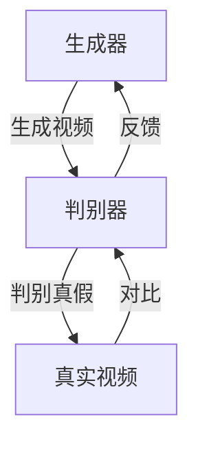

# 视频生成 (Video Generation)

作者：禅与计算机程序设计艺术

## 1. 背景介绍

### 1.1 视频生成的兴起

在过去的十年中，视频生成技术经历了巨大的发展。从早期的静态图像生成到如今的动态视频生成，这一领域已经走过了漫长的路程。视频生成技术不仅在娱乐产业中大放异彩，还在教育、医疗、广告等多个领域展现出其独特的价值。

### 1.2 关键技术突破

视频生成技术的进步离不开深度学习、生成对抗网络（GANs）、自回归模型（Autoregressive Models）和变分自编码器（VAEs）等关键技术的突破。这些技术的结合，使得生成高质量、逼真的视频成为可能。

### 1.3 应用场景

视频生成技术的应用场景广泛，包括但不限于虚拟现实（VR）、增强现实（AR）、电影特效、广告制作、教育培训、医疗影像分析等。每一个应用场景都对视频生成技术提出了不同的要求和挑战。

## 2. 核心概念与联系

### 2.1 生成对抗网络 (GANs)

生成对抗网络由两个相互竞争的神经网络组成：生成器（Generator）和判别器（Discriminator）。生成器试图生成逼真的视频片段，而判别器则试图区分这些片段是真实的还是生成的。通过这种对抗训练，生成器逐渐学会生成越来越逼真的视频。



### 2.2 自回归模型 (Autoregressive Models)

自回归模型通过逐帧生成视频，每一帧的生成依赖于前一帧的内容。这种方法可以捕捉视频中的时间序列特征，从而生成连续且逻辑一致的视频片段。

### 2.3 变分自编码器 (VAEs)

变分自编码器通过编码器将输入视频编码成潜在空间，然后通过解码器从潜在空间重建视频。这种方法可以生成具有多样性和连续性的高质量视频。

## 3. 核心算法原理具体操作步骤

### 3.1 生成对抗网络 (GANs)

#### 3.1.1 构建生成器和判别器

生成器和判别器通常采用卷积神经网络（CNN）结构。生成器从噪声向量开始，通过一系列反卷积层生成视频片段；判别器则通过一系列卷积层对输入视频片段进行分类。

#### 3.1.2 对抗训练

在对抗训练过程中，生成器和判别器交替更新。生成器的目标是最大化判别器的错误率，而判别器的目标是最小化分类错误率。

$$
\min_G \max_D V(D, G) = \mathbb{E}_{x \sim p_{\text{data}}(x)} [\log D(x)] + \mathbb{E}_{z \sim p_z(z)} [\log (1 - D(G(z)))]
$$

### 3.2 自回归模型 (Autoregressive Models)

#### 3.2.1 模型架构

自回归模型通常采用RNN、LSTM或Transformer架构。每一帧的生成依赖于前一帧的输出，从而捕捉视频中的时间序列特征。

#### 3.2.2 训练过程

在训练过程中，模型学习如何根据前一帧的内容生成当前帧。损失函数通常采用交叉熵损失或均方误差。

### 3.3 变分自编码器 (VAEs)

#### 3.3.1 编码器和解码器

编码器将输入视频编码成潜在向量，解码器从潜在向量重建视频。编码器和解码器通常采用对称的卷积神经网络结构。

#### 3.3.2 变分推断

通过变分推断，模型学习潜在空间的分布，从而生成具有多样性的视频。损失函数包括重建损失和KL散度损失。

$$
L = \mathbb{E}_{q(z|x)} [\log p(x|z)] - D_{KL} (q(z|x) || p(z))
$$

## 4. 数学模型和公式详细讲解举例说明

### 4.1 生成对抗网络 (GANs)

#### 4.1.1 理论基础

生成对抗网络的理论基础是博弈论中的零和博弈。生成器和判别器之间的对抗关系可以用博弈论中的策略来描述。

#### 4.1.2 数学推导

对抗训练的目标是找到生成器和判别器的纳什均衡点。在该点上，生成器生成的视频与真实视频无法区分。

$$
\min_G \max_D V(D, G) = \mathbb{E}_{x \sim p_{\text{data}}(x)} [\log D(x)] + \mathbb{E}_{z \sim p_z(z)} [\log (1 - D(G(z)))]
$$

### 4.2 自回归模型 (Autoregressive Models)

#### 4.2.1 理论基础

自回归模型的理论基础是马尔可夫链。每一帧的生成依赖于前一帧的内容，从而形成一个马尔可夫链。

#### 4.2.2 数学推导

自回归模型的目标是最大化视频序列的对数似然函数。通过最大化对数似然函数，模型学习视频序列的时间依赖关系。

$$
L = \sum_{t=1}^{T} \log p(x_t | x_{t-1}, x_{t-2}, \ldots, x_1)
$$

### 4.3 变分自编码器 (VAEs)

#### 4.3.1 理论基础

变分自编码器的理论基础是变分贝叶斯推断。通过变分推断，模型学习潜在空间的分布，从而生成具有多样性的视频。

#### 4.3.2 数学推导

变分自编码器的目标是最大化证据下界（ELBO）。通过最大化ELBO，模型同时最小化重建损失和KL散度损失。

$$
L = \mathbb{E}_{q(z|x)} [\log p(x|z)] - D_{KL} (q(z|x) || p(z))
$$

## 5. 项目实践：代码实例和详细解释说明

### 5.1 生成对抗网络 (GANs)

#### 5.1.1 构建生成器和判别器

```python
import torch
import torch.nn as nn

class Generator(nn.Module):
    def __init__(self):
        super(Generator, self).__init__()
        self.main = nn.Sequential(
            nn.ConvTranspose2d(100, 512, 4, 1, 0, bias=False),
            nn.BatchNorm2d(512),
            nn.ReLU(True),
            nn.ConvTranspose2d(512, 256, 4, 2, 1, bias=False),
            nn.BatchNorm2d(256),
            nn.ReLU(True),
            nn.ConvTranspose2d(256, 128, 4, 2, 1, bias=False),
            nn.BatchNorm2d(128),
            nn.ReLU(True),
            nn.ConvTranspose2d(128, 3, 4, 2, 1, bias=False),
            nn.Tanh()
        )

    def forward(self, input):
        return self.main(input)

class Discriminator(nn.Module):
    def __init__(self):
        super(Discriminator, self).__init__()
        self.main = nn.Sequential(
            nn.Conv2d(3, 128, 4, 2, 1, bias=False),
            nn.LeakyReLU(0.2, inplace=True),
            nn.Conv2d(128, 256, 4, 2, 1, bias=False),
            nn.BatchNorm2d(256),
            nn.LeakyReLU(0.2, inplace=True),
            nn.Conv2d(256, 512, 4, 2, 1, bias=False),
            nn.BatchNorm2d(512),
            nn.LeakyReLU(0.2, inplace=True),
            nn.Conv2d(512, 1, 4, 1, 0, bias=False),
            nn.Sigmoid()
        )

    def forward(self, input):
        return self.main(input)
```

#### 5.1.2 对抗训练

```python
import torch.optim as optim

# 实例化生成器和判别器
netG = Generator()
netD = Discriminator()

# 定义损失函数和优化器