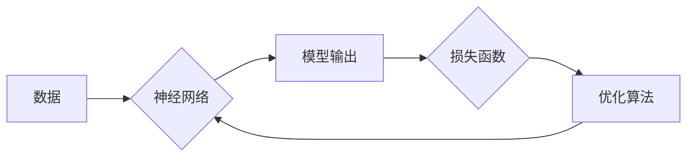

# 解构AI:打造高性能深度学习模型的秘诀

作者：禅与计算机程序设计艺术

## 1. 背景介绍

### 1.1 人工智能的兴起与深度学习的崛起
  近年来，人工智能（AI）在各个领域都取得了突破性进展，而深度学习作为其核心技术之一，更是引领了这场技术革命。从图像识别、语音识别到自然语言处理，深度学习模型展现出惊人的能力，不断刷新着各项技术指标。

### 1.2 深度学习模型性能瓶颈
  然而，随着模型复杂度的不断提升，训练和部署高性能深度学习模型面临着诸多挑战：
   * **计算资源消耗巨大**: 复杂的模型需要海量的计算资源和存储空间，这对于个人开发者和小型企业来说是一个巨大的负担。
   * **训练时间过长**: 训练一个深度学习模型往往需要数天甚至数周的时间，这极大地限制了模型的迭代速度。
   * **模型泛化能力不足**:  在实际应用中，模型往往会遇到与训练数据不同的情况，导致其泛化能力下降。

### 1.3 本文目标
  本文旨在探讨如何打造高性能深度学习模型，突破上述瓶颈，让AI技术真正落地应用。我们将从以下几个方面展开讨论：
   *  深度学习的核心概念和关键技术；
   *  构建高性能深度学习模型的实用技巧和策略；
   *  常用的深度学习工具和资源推荐；
   *  深度学习未来发展趋势和挑战。

## 2. 核心概念与联系

### 2.1 神经网络基础

#### 2.1.1 神经元模型
  神经网络的基本单元是神经元，它模拟了生物神经元的信息处理过程。每个神经元接收来自其他神经元的输入信号，对这些信号进行加权求和，并通过激活函数进行非线性变换，最终输出一个信号。

#### 2.1.2  神经网络结构
  神经网络由多个神经元层层连接而成。根据网络结构的不同，可以分为前馈神经网络、循环神经网络、卷积神经网络等。

   * **前馈神经网络 (FNN)**: 信息从输入层单向传递到输出层，没有反馈连接。
   * **循环神经网络 (RNN)**:  网络中存在循环连接，能够处理序列数据。
   * **卷积神经网络 (CNN)**:  利用卷积操作提取数据局部特征，适用于图像、语音等领域。

### 2.2 深度学习关键技术

#### 2.2.1 激活函数
  激活函数为神经网络引入了非线性，使其能够学习复杂的数据模式。常用的激活函数包括：
   * **Sigmoid**:  将输入值映射到0到1之间，常用于二分类问题。
   * **ReLU**:  保留正值部分，将负值部分置为0，有效缓解梯度消失问题。
   * **Tanh**:  将输入值映射到-1到1之间，具有更好的对称性。

#### 2.2.2 损失函数
  损失函数用于衡量模型预测值与真实值之间的差距。常用的损失函数包括：
   * **均方误差 (MSE)**:  适用于回归问题。
   * **交叉熵**:  适用于分类问题。

#### 2.2.3 优化算法
  优化算法用于寻找最优的模型参数，使得损失函数最小化。常用的优化算法包括：
   * **梯度下降法**:  沿着梯度方向不断更新参数。
   * **随机梯度下降法 (SGD)**:  每次只使用一小批数据进行梯度计算，加快训练速度。
   * **Adam**:  结合了动量和自适应学习率，能够更快更稳定地收敛。

### 2.3  核心概念联系
  下图展示了深度学习的核心概念之间的联系：




## 3. 核心算法原理具体操作步骤

### 3.1  前向传播
  前向传播是指将输入数据从神经网络的输入层传递到输出层的过程。具体步骤如下：
  1.  将输入数据输入神经网络的输入层。
  2.  逐层计算每个神经元的加权和。
  3.  对每个神经元的加权和应用激活函数，得到神经元的输出值。
  4.  将最后一层神经元的输出值作为模型的预测结果。

### 3.2 反向传播
  反向传播是指根据损失函数计算模型参数的梯度，并利用梯度更新参数的过程。具体步骤如下：
  1.  计算损失函数关于输出层的梯度。
  2.  利用链式法则，逐层反向计算损失函数关于每个参数的梯度。
  3.  利用优化算法，根据梯度更新模型参数。


## 4. 数学模型和公式详细讲解举例说明

### 4.1  线性回归
  线性回归是一种简单的机器学习算法，用于建立输入变量和输出变量之间的线性关系。其数学模型如下：

  $$
  y = wx + b
  $$

  其中：
   *  $y$ 是输出变量。
   *  $x$ 是输入变量。
   *  $w$ 是权重参数。
   *  $b$ 是偏置参数。

  线性回归的目标是找到最优的 $w$ 和 $b$，使得预测值 $\hat{y}$ 与真实值 $y$ 之间的差距最小化。

### 4.2  逻辑回归
  逻辑回归是一种用于解决二分类问题的机器学习算法。其数学模型如下：

  $$
  P(y=1|x) = \frac{1}{1 + e^{-(wx + b)}}
  $$

  其中：
   *  $P(y=1|x)$ 是给定输入 $x$，输出为 1 的概率。
   *  $w$ 是权重参数。
   *  $b$ 是偏置参数。

  逻辑回归的目标是找到最优的 $w$ 和 $b$，使得预测概率 $\hat{y}$ 与真实标签 $y$ 之间的差距最小化。

### 4.3  卷积神经网络
  卷积神经网络是一种专门用于处理图像数据的深度学习模型。其核心操作是卷积，通过卷积核对输入数据进行特征提取。

  卷积操作的数学公式如下：

  $$
  (f * g)(t) = \int_{-\infty}^{\infty} f(\tau)g(t - \tau)d\tau
  $$

  其中：
   *  $f$ 是输入信号。
   *  $g$ 是卷积核。
   *  $*$ 表示卷积操作。

  卷积神经网络通过多层卷积和池化操作，逐渐提取图像的高层语义特征，最终用于图像分类、目标检测等任务。


## 5. 项目实践：代码实例和详细解释说明

### 5.1  图像分类任务
  本节将以图像分类任务为例，介绍如何使用 TensorFlow 构建一个简单的卷积神经网络。

#### 5.1.1 数据集准备
  首先，我们需要准备一个图像分类数据集。这里我们使用 CIFAR-10 数据集，该数据集包含 10 个类别的 60000 张彩色图像。

#### 5.1.2 模型构建
  接下来，我们使用 TensorFlow 构建一个简单的卷积神经网络：

```python
import tensorflow as tf

# 定义模型
model = tf.keras.models.Sequential([
  tf.keras.layers.Conv2D(32, (3, 3), activation='relu', input_shape=(32, 32, 3)),
  tf.keras.layers.MaxPooling2D((2, 2)),
  tf.keras.layers.Conv2D(64, (3, 3), activation='relu'),
  tf.keras.layers.MaxPooling2D((2, 2)),
  tf.keras.layers.Flatten(),
  tf.keras.layers.Dense(10, activation='softmax')
])

# 编译模型
model.compile(optimizer='adam',
              loss='sparse_categorical_crossentropy',
              metrics=['accuracy'])
```

#### 5.1.3 模型训练
  完成模型构建后，我们可以使用训练数据对模型进行训练：

```python
# 加载数据集
(x_train, y_train), (x_test, y_test) = tf.keras.datasets.cifar10.load_data()

# 数据预处理
x_train = x_train.astype('float32') / 255.0
x_test = x_test.astype('float32') / 255.0

# 训练模型
model.fit(x_train, y_train, epochs=10, batch_size=32)
```

#### 5.1.4 模型评估
  训练完成后，我们可以使用测试数据评估模型的性能：

```python
# 评估模型
loss, accuracy = model.evaluate(x_test, y_test, verbose=0)
print('Loss:', loss)
print('Accuracy:', accuracy)
```

### 5.2  其他任务
  除了图像分类，深度学习还可以应用于许多其他任务，例如：
   * **目标检测**:  识别图像或视频中的物体，并确定其位置和类别。
   * **语义分割**:  将图像中的每个像素分类到不同的语义类别。
   * **自然语言处理**:  对文本进行分析和理解，例如机器翻译、情感分析等。


## 6. 实际应用场景

### 6.1  计算机视觉
  * **自动驾驶**:  使用深度学习模型识别道路、车辆、行人等目标，实现自动驾驶功能。
  * **医疗影像分析**:  使用深度学习模型辅助医生进行疾病诊断，例如识别肿瘤、骨折等。
  * **人脸识别**:  使用深度学习模型进行人脸识别，应用于身份验证、安防监控等领域。

### 6.2  自然语言处理
  * **机器翻译**:  使用深度学习模型将一种语言的文本翻译成另一种语言的文本。
  * **聊天机器人**:  使用深度学习模型构建智能聊天机器人，能够与用户进行自然语言交互。
  * **情感分析**:  使用深度学习模型分析文本的情感倾向，例如判断评论是正面、负面还是中性。

### 6.3  其他领域
  * **金融**:  使用深度学习模型进行风险评估、欺诈检测等。
  * **电商**:  使用深度学习模型进行商品推荐、用户画像分析等。


## 7. 工具和资源推荐

### 7.1  深度学习框架
  * **TensorFlow**:  由 Google 开发的开源深度学习框架，功能强大，社区活跃。
  * **PyTorch**:  由 Facebook 开发的开源深度学习框架，灵活易用，研究领域应用广泛。
  * **Keras**:  构建在 TensorFlow 和 Theano 之上的高级神经网络 API，易于学习和使用。

### 7.2  数据集
  * **ImageNet**:  包含超过 1400 万张图像的大规模数据集，用于图像分类、目标检测等任务。
  * **CIFAR-10/100**:  包含 10/100 个类别的彩色图像数据集，常用于图像分类任务。
  * **MNIST**:  包含 70000 张手写数字图像的数据集，常用于图像分类入门。

### 7.3  学习资源
  * **Coursera**:  提供丰富的机器学习和深度学习在线课程。
  * **斯坦福大学 CS231n**:  深度学习领域经典课程，提供详细的课程资料和作业。
  * **TensorFlow 官方文档**:  提供 TensorFlow 的详细文档和教程。


## 8. 总结：未来发展趋势与挑战

### 8.1  未来发展趋势
  * **模型轻量化**:  随着移动设备和物联网的普及，模型轻量化成为深度学习的重要发展方向。
  * **自动化机器学习**:  自动化机器学习旨在降低深度学习的门槛，让更多的人能够使用深度学习技术。
  * **可解释性**:  深度学习模型的可解释性是当前研究的热点，旨在解释模型的决策过程。

### 8.2  挑战
  * **数据隐私**:  深度学习模型的训练需要大量数据，如何保护数据隐私是一个重要挑战。
  * **模型鲁棒性**:  深度学习模型容易受到对抗样本的攻击，如何提高模型的鲁棒性是一个重要课题。


## 9. 附录：常见问题与解答

### 9.1  什么是过拟合？如何避免过拟合？
  过拟合是指模型在训练数据上表现很好，但在测试数据上表现很差的现象。避免过拟合的方法包括：
   * **增加训练数据**:  使用更多的数据训练模型可以提高模型的泛化能力。
   * **正则化**:  通过在损失函数中添加正则项来限制模型的复杂度。
   * **Dropout**:  在训练过程中随机丢弃一些神经元，可以防止模型过拟合。

### 9.2  什么是梯度消失/爆炸？如何解决？
  梯度消失/爆炸是指在深度神经网络中，梯度在反向传播过程中变得非常小/大的现象。解决梯度消失/爆炸的方法包括：
   * **使用 ReLU 激活函数**:  ReLU 激活函数可以有效缓解梯度消失问题。
   * **梯度裁剪**:  将梯度的范数限制在一个范围内，可以防止梯度爆炸。
   * **批量归一化**:  对每层的输入进行归一化，可以加速模型收敛，并缓解梯度消失/爆炸问题。
