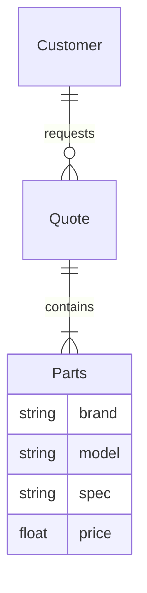

# 计算机散件报价系统详细设计与具体代码实现

作者：禅与计算机程序设计艺术

## 1. 背景介绍
### 1.1 计算机散件报价系统的必要性
在计算机硬件销售行业,由于产品种类繁多,价格波动频繁,手工报价费时费力且难以保证准确性。开发一套自动化的计算机散件报价系统,可以大幅提高报价效率,减少人为失误,为企业节约成本,提升客户满意度。
### 1.2 系统目标与核心功能
本系统旨在实现计算机散件的快速精准报价。其核心功能包括:
- 维护完善的散件信息数据库,包括型号、参数、价格、库存等
- 根据客户选择的散件型号和数量,实时计算并生成报价单 
- 对散件价格波动进行监控,自动更新数据库
- 支持报价单的打印和导出
- 提供直观的图形界面,便于销售人员和客户操作使用

## 2. 核心概念与关系
### 2.1 散件 Parts
计算机硬件的组成部分,包括CPU、主板、内存、硬盘、显卡、机箱、电源、散热器等。每种散件有多个型号,具有品牌、型号、参数、价格属性。
### 2.2 报价单 Quote 
列举所选散件的型号、单价、数量、小计金额,并计算总价的单据。一个报价单包含多个散件。
### 2.3 客户 Customer
需要购买计算机硬件的个人或企业。客户提供散件选型需求,销售根据需求生成报价单。
### 2.4 核心概念的ER图


## 3. 核心算法原理具体操作步骤
### 3.1 散件数据库的设计与维护
1. 设计散件数据表,包含品牌、型号、参数、价格、库存等字段
2. 定期爬取供应商网站,获取散件价格变动信息
3. 使用增量更新算法,只更新有变动的价格数据,提高效率
4. 每日定时对数据库进行全量备份,防止数据丢失
### 3.2 报价单的生成算法
1. 接收客户选择的散件型号和数量等信息
2. 查询数据库获得每种散件的单价
3. 计算每种散件的小计金额
4. 汇总计算所有散件的总金额
5. 生成并打印/导出报价单
### 3.3 自动报价算法优化
1. 使用缓存机制,将常用散件组合的报价结果缓存,加快响应速度 
2. 设置价格阈值,当散件价格波动未超过阈值时无需重新生成报价单
3. 引入批量报价功能,一次性计算多个客户的报价单,提高效率

## 4. 数学模型和公式详解
### 4.1 散件数据表的数学描述
设散件数据表为矩阵 $D$,其中元素 $d_{ij}$ 表示散件的属性取值:
$$
D=\begin{bmatrix}
 d_{11} & d_{12} & \cdots & d_{1n}\\ 
 d_{21} & d_{22} & \cdots & d_{2n}\\
 \vdots & \vdots & \ddots & \vdots\\
 d_{m1} & d_{m2} & \cdots & d_{mn}\\
\end{bmatrix}
$$

其中$m$为散件种类数,$n$为散件属性数。常见属性包括:
- $d_{i1}$: 品牌
- $d_{i2}$: 型号  
- $d_{i3}$: 参数
- $d_{i4}$: 价格
- $d_{i5}$: 库存

### 4.2 报价单的数学模型
设客户选择的散件数量向量为 $Q=(q_1,q_2,\cdots,q_m)$,散件单价向量为 $P=(p_1,p_2,\cdots,p_m)$,其中 $q_i,p_i$ 分别表示第 $i$ 种散件的数量和单价,则报价单的总金额 $T$ 为:

$$
T=\sum_{i=1}^m q_i \cdot p_i
$$

## 5. 项目实践：代码实现
下面使用Python实现计算机散件报价系统的核心功能。
### 5.1 散件数据表的维护
```python
import sqlite3

# 连接数据库
conn = sqlite3.connect('parts.db')

# 创建散件表
conn.execute('''CREATE TABLE IF NOT EXISTS parts
         (ID INTEGER PRIMARY KEY AUTOINCREMENT,
         BRAND           TEXT    NOT NULL,
         MODEL           TEXT    NOT NULL,
         SPEC            TEXT    NOT NULL,
         PRICE           REAL);''')

# 插入散件数据
conn.execute("INSERT INTO parts (BRAND,MODEL,SPEC,PRICE) \
      VALUES ('Intel', 'i7-10700K', '8核16线程', 2399.00 )");
conn.execute("INSERT INTO parts (BRAND,MODEL,SPEC,PRICE) \
      VALUES ('AMD', 'R7-5800X', '8核16线程', 2999.00 )");

# 提交事务
conn.commit()
# 关闭连接
conn.close()
```
### 5.2 报价单的生成
```python 
# 查询散件价格
def get_price(brand, model):
    conn = sqlite3.connect('parts.db')
    cursor = conn.cursor()
    cursor.execute("SELECT PRICE from parts WHERE BRAND=? AND MODEL=?", (brand,model,))
    price = cursor.fetchone()
    conn.close()
    return price[0]    

# 生成报价单
def generate_quote(parts):
    total = 0
    print("报价单:")
    print("散件名称\t单价\t数量\t小计")
    for k,v in parts.items():
        price = get_price(v[0],v[1]) 
        subtotal = price * v[2]
        total += subtotal
        print(f"{v[0]} {v[1]}\t{price}\t{v[2]}\t{subtotal}")   
    print(f"总计: {total}")
    
# 测试
parts = {
    1:['Intel', 'i7-10700K', 1],
    2:['AMD', 'R7-5800X',  1],
}
generate_quote(parts)
```
以上代码会生成如下格式的报价单:
```
报价单:
散件名称     单价    数量     小计
Intel i7-10700K  2399.0   1        2399.0
AMD R7-5800X     2999.0   1        2999.0  
总计: 5398.0
```

## 6. 实际应用场景
计算机散件报价系统在计算机硬件销售行业有广泛应用,使用场景包括:
- 各大PC厂商的官网选配系统
- 线下电脑城、IT卖场的销售系统
- 组装电脑爱好者的DIY配置单

该系统能显著提高人工报价的效率和准确性,规避价格估算错误,防止差价损失。通过自定义选配清单,客户可以灵活组合心仪的散件,系统自动算出组装费用,极大提升购物体验。

## 7. 工具和资源推荐
- 散件数据爬取: Scrapy、PySpider、Selenium 
- 数据存储: MySQL、SQLite、MongoDB
- 数据分析: NumPy、Pandas
- Web框架: Django、Flask
- 前端组件库: Vue、React 

## 8. 总结与展望
### 8.1 系统优势
- 自动化报价,高效准确
- 实时同步市场价,避免差价风险
- 灵活选配,满足客户多样需求
- 图形化界面,易学易用
### 8.2 未来挑战  
- 对接多个供应商接口,保证货源与价格优势
- 引入智能推荐,根据客户需求匹配最优散件组合
- 加入相容性检查,避免散件不兼容
- 拓展更多品类,如外设、软件等
### 8.3 行业趋势
随着计算机硬件更新换代速度加快,用户对性价比的要求也越来越高,散件选配和报价系统必将成为厂商的标配,成为连接客户和产品的关键纽带。其智能化、个性化水平将不断提升,为客户带来极致的 DIY 体验。

## 9. 附录：常见问题解答
### Q1:系统兼容哪些操作系统?
支持Windows、Linux、MacOS等主流操作系统。
### Q2:能否接入多个供应商?
可以,系统支持对接多家供应商API,可选择最优价格。
### Q3:如何升级新的散件型号?
管理员可通过后台页面手动添加,或设置自动同步。
### Q4:报价单支持哪些格式导出?
目前支持导出为PDF、EXCEL等常用文档格式。

希望这篇文章能为你全面讲解计算机散件报价系统的设计与实现过程,提供一个实践指南。你是否也想开发一套类似的系统?不妨参考文中的思路,动手实践吧。相信经过不断打磨,你一定能开发出一个优秀的报价系统!