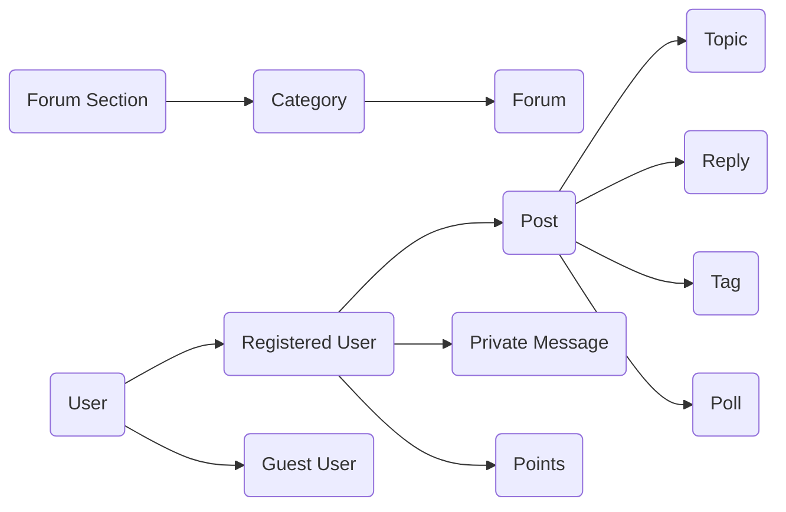

## 1. 背景介绍

### 1.1 论坛系统概述

论坛系统，作为互联网早期就存在的应用形式，为用户提供了一个围绕特定主题进行交流和分享的平台。用户可以在论坛上发布帖子、回复帖子、参与投票、上传图片等，与其他用户进行互动。随着互联网技术的不断发展，论坛系统也经历了从简单的文本论坛到功能丰富的多媒体论坛的演变。

### 1.2 论坛系统的意义

论坛系统在信息传播、知识分享、社区建设等方面发挥着重要作用：

* **信息传播：** 论坛系统可以快速传播信息，用户可以及时获取最新的新闻资讯、行业动态等。
* **知识分享：** 论坛系统为用户提供了一个分享知识和经验的平台，用户可以互相学习，共同进步。
* **社区建设：** 论坛系统可以聚集具有共同兴趣爱好的用户，形成线上社区，增强用户之间的互动和交流。

### 1.3 本文目的

本文旨在介绍论坛系统的详细设计和具体代码实现，帮助读者深入理解论坛系统的架构和工作原理，并能够根据自身需求开发和部署自己的论坛系统。

## 2. 核心概念与联系

### 2.1 用户

* **注册用户：** 拥有用户名、密码、邮箱等个人信息，可以发布帖子、回复帖子、参与投票等。
* **游客用户：** 未注册用户，只能浏览论坛内容，不能进行发帖、回复等操作。

### 2.2 论坛版块

* **分类：** 将论坛划分为不同的主题区域，例如技术、生活、娱乐等。
* **版块：** 每个分类下可以包含多个版块，例如技术分类下可以有编程语言、数据库、操作系统等版块。

### 2.3 帖子

* **主题帖：** 用户发布的初始帖子，包含标题、内容、图片等信息。
* **回复帖：** 用户对主题帖的回复，可以嵌套回复，形成树形结构。

### 2.4 其他概念

* **标签：** 用于标记帖子的关键词，方便用户搜索和分类。
* **投票：** 用户可以创建投票，其他用户可以参与投票，统计投票结果。
* **私信：** 注册用户之间可以发送私信，进行私下交流。
* **积分：** 用户可以通过发帖、回复、签到等方式获得积分，积分可以用于兑换礼品或提升用户等级。

### 2.5 核心概念联系图



## 3. 核心算法原理具体操作步骤

### 3.1 用户注册

1. 用户填写注册信息，包括用户名、密码、邮箱等。
2. 系统校验用户信息，例如用户名是否已存在、密码是否符合安全规则等。
3. 用户信息校验通过后，系统将用户信息存储到数据库中。
4. 系统发送激活邮件到用户邮箱，用户点击激活链接完成注册。

### 3.2 用户登录

1. 用户输入用户名和密码。
2. 系统校验用户名和密码是否匹配。
3. 用户名和密码匹配后，系统生成登录凭证（例如 Session ID），并将登录凭证存储到 Cookie 中。
4. 用户后续访问网站时，系统会读取 Cookie 中的登录凭证，验证用户身份。

### 3.3 发布帖子

1. 用户选择要发布帖子的版块。
2. 用户填写帖子标题和内容，可以选择上传图片或附件。
3. 系统校验帖子内容，例如是否包含敏感词、图片大小是否超过限制等。
4. 帖子内容校验通过后，系统将帖子信息存储到数据库中。

### 3.4 回复帖子

1. 用户点击帖子下方的“回复”按钮。
2. 用户填写回复内容，可以选择引用帖子内容。
3. 系统校验回复内容，例如是否包含敏感词等。
4. 回复内容校验通过后，系统将回复信息存储到数据库中。

### 3.5 其他操作

* **搜索帖子：** 用户输入关键词，系统根据关键词搜索相关帖子。
* **参与投票：** 用户选择投票选项，系统记录用户的投票结果。
* **发送私信：** 用户选择接收私信的用户，填写私信内容，系统将私信发送给对方。

## 4. 数学模型和公式详细讲解举例说明

论坛系统中涉及的数学模型和公式相对较少，主要包括：

### 4.1 分页算法

分页算法用于将大量数据分批次展示给用户，例如将帖子列表分成多页展示。常见的分页算法有：

* **基于页码的分页：** 用户输入页码，系统返回对应页码的数据。
* **基于游标的分页：** 用户请求下一页数据时，系统返回当前页最后一条数据的 ID 作为游标，用户下次请求时将游标传递给系统，系统根据游标返回下一页数据。

### 4.2 排序算法

排序算法用于对数据进行排序，例如按照时间、热度等对帖子进行排序。常见的排序算法有：

* **冒泡排序：** 比较相邻的元素，将较大的元素交换到后面，直到所有元素都排序完成。
* **快速排序：** 选择一个基准元素，将数组分成左右两个子数组，分别对左右子数组进行排序，最后将排序后的子数组合并。

### 4.3 举例说明

假设一个论坛系统有 10000 条帖子，每页展示 10 条帖子，那么需要 1000 页才能展示完所有帖子。如果使用基于页码的分页，用户需要点击 1000 次才能浏览完所有帖子，效率很低。如果使用基于游标的分页，用户只需要不断点击“下一页”按钮，就可以浏览完所有帖子，效率更高。

## 5. 项目实践：代码实例和详细解释说明

### 5.1 技术选型

本项目使用 Python 语言和 Django 框架进行开发，数据库使用 MySQL。

### 5.2 数据库设计

| 表名 | 字段 | 类型 | 说明 |
|---|---|---|---|
| user | id | int | 用户 ID，自增主键 |
| user | username | varchar(255) | 用户名，唯一 |
| user | password | varchar(255) | 密码，加密存储 |
| user | email | varchar(255) | 邮箱 |
| forum_category | id | int | 分类 ID，自增主键 |
| forum_category | name | varchar(255) | 分类名称 |
| forum | id | int | 版块 ID，自增主键 |
| forum | name | varchar(255) | 版块名称 |
| forum | category_id | int | 所属分类 ID |
| post | id | int | 帖子 ID，自增主键 |
| post | title | varchar(255) | 帖子标题 |
| post | content | text | 帖子内容 |
| post | user_id | int | 发布用户 ID |
| post | forum_id | int | 所属版块 ID |
| post | created_at | datetime | 创建时间 |
| post | updated_at | datetime | 更新时间 |

### 5.3 代码实例

**用户模型:**

```python
from django.db import models
from django.contrib.auth.models import AbstractUser

class User(AbstractUser):
    # 扩展用户信息
    pass
```

**论坛分类模型:**

```python
from django.db import models

class ForumCategory(models.Model):
    name = models.CharField(max_length=255)

    def __str__(self):
        return self.name
```

**论坛版块模型:**

```python
from django.db import models

class Forum(models.Model):
    name = models.CharField(max_length=255)
    category = models.ForeignKey(ForumCategory, on_delete=models.CASCADE)

    def __str__(self):
        return self.name
```

**帖子模型:**

```python
from django.db import models

class Post(models.Model):
    title = models.CharField(max_length=255)
    content = models.TextField()
    user = models.ForeignKey(User, on_delete=models.CASCADE)
    forum = models.ForeignKey(Forum, on_delete=models.CASCADE)
    created_at = models.DateTimeField(auto_now_add=True)
    updated_at = models.DateTimeField(auto_now=True)

    def __str__(self):
        return self.title
```

**视图函数:**

```python
from django.shortcuts import render, redirect
from .models import ForumCategory, Forum, Post
from .forms import PostForm

def index(request):
    categories = ForumCategory.objects.all()
    context = {'categories': categories}
    return render(request, 'forum/index.html', context)

def forum_detail(request, forum_id):
    forum = Forum.objects.get(pk=forum_id)
    posts = Post.objects.filter(forum=forum).order_by('-created_at')
    context = {'forum': forum, 'posts': posts}
    return render(request, 'forum/forum_detail.html', context)

def post_create(request, forum_id):
    forum = Forum.objects.get(pk=forum_id)
    if request.method == 'POST':
        form = PostForm(request.POST)
        if form.is_valid():
            post = form.save(commit=False)
            post.user = request.user
            post.forum = forum
            post.save()
            return redirect('forum_detail', forum_id=forum.id)
    else:
        form = PostForm()
    context = {'forum': forum, 'form': form}
    return render(request, 'forum/post_create.html', context)
```

### 5.4 部署

将代码部署到服务器后，用户就可以通过浏览器访问论坛系统了。

## 6. 实际应用场景

论坛系统可以应用于各种场景，例如：

* **企业内部论坛：** 用于企业内部员工之间的交流和沟通。
* **产品论坛：** 用于产品用户之间交流产品使用经验、反馈产品问题等。
* **兴趣爱好论坛：** 用于聚集具有相同兴趣爱好的用户，例如游戏论坛、音乐论坛等。
* **学习交流论坛：** 用于学生之间交流学习经验、分享学习资料等。

## 7. 工具和资源推荐

* **Django 框架：** Python Web 开发框架，提供了丰富的功能和组件，可以快速开发 Web 应用。
* **MySQL 数据库：** 关系型数据库，性能优越，稳定可靠。
* **Bootstrap 框架：** 前端框架，提供了丰富的 CSS 样式和 JavaScript 插件，可以快速构建美观的用户界面。

## 8. 总结：未来发展趋势与挑战

### 8.1 未来发展趋势

* **移动化：** 随着移动互联网的普及，论坛系统需要适配移动设备，提供更好的移动端用户体验。
* **社交化：** 论坛系统可以与社交网络平台进行整合，例如允许用户使用社交账号登录、分享帖子到社交网络等。
* **智能化：** 论坛系统可以利用人工智能技术，例如自然语言处理、机器学习等，实现自动审核帖子、推荐相关内容等功能。

### 8.2 面临挑战

* **内容质量：** 论坛系统需要有效控制垃圾信息和不良信息的传播，保证内容质量。
* **用户活跃度：** 论坛系统需要吸引用户参与，提高用户活跃度，才能保持论坛的活力。
* **技术更新：** 互联网技术发展迅速，论坛系统需要不断更新技术，才能适应新的技术环境。

## 9. 附录：常见问题与解答

### 9.1 如何防止用户发布垃圾信息？

* **设置发帖门槛：** 例如要求用户注册一段时间后才能发帖，或者设置发帖积分限制。
* **人工审核：** 对用户发布的帖子进行人工审核，过滤掉垃圾信息和不良信息。
* **机器学习：** 利用机器学习技术，训练模型自动识别垃圾信息和不良信息。

### 9.2 如何提高用户活跃度？

* **优质内容：** 提供高质量的帖子内容，吸引用户阅读和参与。
* **互动活动：** 定期举办线上活动，例如话题讨论、投票等，提高用户参与度。
* **用户激励：** 对活跃用户进行奖励，例如积分、勋章等，激发用户参与积极性。