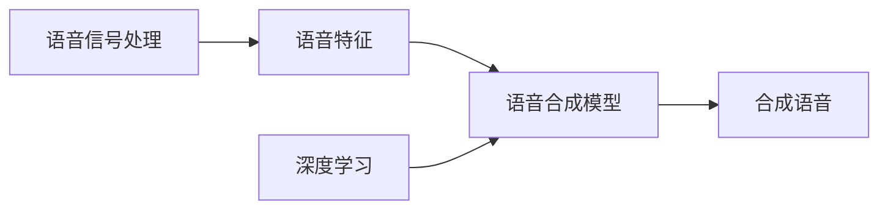

## 1. 背景介绍

### 1.1 语音合成的发展历程

语音合成，简单来说，就是让机器像人一样说话。这项技术已经发展了几十年，从最初的机械合成到如今的深度学习技术，语音合成的自然度和表现力都得到了极大的提升。

早期的语音合成技术主要基于拼接和参数合成方法，这些方法依赖于大量的人工规则和语音库，合成语音的音质和自然度都比较有限。近年来，随着深度学习技术的兴起，基于神经网络的语音合成方法逐渐成为主流，例如 WaveNet、Tacotron 和 Deep Voice 等，这些方法能够学习到更丰富、更自然的语音特征，合成语音的质量也得到了显著提升。

### 1.2 语音合成的应用场景

语音合成技术在现实生活中有着广泛的应用，例如：

* **智能助手：** Siri、Alexa 等智能助手利用语音合成技术与用户进行语音交互。
* **语音导航：** 高德地图、百度地图等导航软件利用语音合成技术为用户提供路线指引。
* **有声读物：** 喜马拉雅、懒人听书等平台利用语音合成技术将文字内容转换为语音，方便用户收听。
* **智能客服：** 电商平台、银行等机构利用语音合成技术实现智能客服，提高服务效率。

### 1.3 本文目标

本文将以 Python 代码为例，详细介绍如何使用深度学习技术实现语音合成，并对代码进行逐行解读，帮助读者深入理解语音合成的原理和实现方法。

## 2. 核心概念与联系

### 2.1 语音信号处理

语音信号处理是语音合成的基础，它主要涉及以下几个方面：

* **语音信号的数字化：** 将模拟语音信号转换为数字信号，以便计算机进行处理。
* **语音信号的预处理：** 对数字语音信号进行降噪、去混响等处理，提高语音质量。
* **语音信号的特征提取：** 从语音信号中提取出能够表征语音内容的特征参数，例如 MFCC、Mel 频谱等。

### 2.2 深度学习

深度学习是一种强大的机器学习方法，它通过构建多层神经网络来学习数据的复杂表示，在语音合成领域取得了显著的成果。

### 2.3 语音合成模型

语音合成模型是实现语音合成的核心，它接收文本或语音特征作为输入，输出合成的语音信号。常见的语音合成模型包括：

* **基于拼接的模型：** 将预先录制好的语音片段拼接起来，生成完整的语音。
* **基于参数的模型：** 使用一组参数来描述语音信号的特征，通过调整参数来控制合成语音的音调、语速等。
* **基于神经网络的模型：** 使用神经网络来学习文本和语音之间的映射关系，直接生成语音信号。

### 2.4 关系图



## 3. 核心算法原理具体操作步骤

### 3.1 数据准备

* 收集大量的语音数据和对应的文本标注。
* 对语音数据进行预处理，例如降噪、去混响等。
* 将文本标注转换为模型能够识别的格式，例如音素序列。

### 3.2 模型训练

* 选择合适的语音合成模型，例如 Tacotron 2。
* 使用准备好的数据对模型进行训练，调整模型参数，使模型能够根据输入的文本生成自然的语音。

### 3.3 语音合成

* 将需要合成的文本输入到训练好的模型中。
* 模型根据学习到的映射关系生成对应的语音信号。

### 3.4 流程图


## 4. 数学模型和公式详细讲解举例说明

### 4.1 Tacotron 2 模型

Tacotron 2 是一种基于神经网络的语音合成模型，它由编码器、解码器和注意力机制组成。

* **编码器：** 将输入的文本序列转换为上下文向量，捕捉文本的语义信息。
* **注意力机制：** 将编码器的输出与解码器的输入进行关联，帮助解码器关注文本中与当前语音帧相关的部分。
* **解码器：** 根据上下文向量和注意力机制的输出，生成语音的声学特征，例如梅尔频谱。

### 4.2 公式

Tacotron 2 模型的数学公式可以表示为：

```
h_t = Encoder(x_t)
c_t = Attention(h_t, s_{t-1})
s_t, y_t = Decoder(c_t, s_{t-1})
```

其中：

* $x_t$ 表示输入文本序列的第 $t$ 个词向量。
* $h_t$ 表示编码器在时刻 $t$ 的输出，即上下文向量。
* $s_t$ 表示解码器在时刻 $t$ 的隐藏状态。
* $c_t$ 表示注意力机制在时刻 $t$ 的输出，即上下文向量与解码器隐藏状态的加权和。
* $y_t$ 表示解码器在时刻 $t$ 的输出，即语音的声学特征。


## 5. 项目实践：代码实例和详细解释说明

### 5.1 环境搭建

首先，我们需要搭建 Python 环境，并安装相关的库，例如 TensorFlow、PyTorch、Librosa 等。

```python
!pip install tensorflow
!pip install torch
!pip install librosa
```

### 5.2 数据加载

接下来，我们需要加载语音数据和文本标注。

```python
import librosa

# 加载语音文件
audio, sr = librosa.load("audio.wav", sr=None)

# 加载文本标注
with open("text.txt", "r") as f:
    text = f.read()
```

### 5.3 数据预处理

对语音数据进行预处理，例如降噪、去混响等。

```python
# 对语音信号进行预加重
pre_emphasis = 0.97
audio = np.append(audio[0], audio[1:] - pre_emphasis * audio[:-1])

# 对语音信号进行分帧
frame_length = 25  # 帧长，单位为毫秒
frame_shift = 10  # 帧移，单位为毫秒
frame_length_samples = int(sr * frame_length / 1000)
frame_shift_samples = int(sr * frame_shift / 1000)
frames = librosa.util.frame(
    audio, frame_length=frame_length_samples, hop_length=frame_shift_samples
).T

# 对每一帧语音信号进行加窗
window = np.hanning(frame_length_samples)
frames *= window
```

### 5.4 特征提取

从语音信号中提取出能够表征语音内容的特征参数，例如 MFCC、Mel 频谱等。

```python
# 计算每一帧语音信号的 MFCC 特征
mfccs = librosa.feature.mfcc(
    y=frames.flatten(), sr=sr, n_mfcc=13
).T

# 计算每一帧语音信号的 Mel 频谱
mel_spectrogram = librosa.feature.melspectrogram(
    y=frames.flatten(), sr=sr, n_mels=80
).T
```

### 5.5 模型构建

选择合适的语音合成模型，例如 Tacotron 2，并使用 TensorFlow 或 PyTorch 构建模型。

```python
import tensorflow as tf

# 定义编码器
def encoder(inputs, embedding_dim, encoder_units):
    # ...
    return outputs

# 定义注意力机制
def attention(query, value, mask):
    # ...
    return context_vector, attention_weights

# 定义解码器
def decoder(context_vector, state, embedding_dim, decoder_units):
    # ...
    return output, state

# 构建 Tacotron 2 模型
def build_model(vocab_size, embedding_dim, encoder_units, decoder_units):
    # ...
    return model
```

### 5.6 模型训练

使用准备好的数据对模型进行训练，调整模型参数，使模型能够根据输入的文本生成自然的语音。

```python
# 定义优化器
optimizer = tf.keras.optimizers.Adam()

# 定义损失函数
loss_object = tf.keras.losses.CategoricalCrossentropy(from_logits=True)

# 定义训练步骤
def train_step(inputs, targets):
    # ...
    return loss

# 训练模型
epochs = 100
batch_size = 32
for epoch in range(epochs):
    for batch in range(len(train_data) // batch_size):
        # ...
        loss = train_step(inputs, targets)
        # ...
```

### 5.7 语音合成

将需要合成的文本输入到训练好的模型中，模型根据学习到的映射关系生成对应的语音信号。

```python
# 加载训练好的模型
model = tf.keras.models.load_model("tacotron2_model")

# 输入需要合成的文本
text = "你好，世界！"

# 使用模型生成语音
audio = model.predict(text)

# 保存合成的语音
librosa.output.write_wav("synthesized_audio.wav", audio, sr=sr)
```

## 6. 实际应用场景

### 6.1 智能助手

语音合成技术可以用于构建智能助手，例如 Siri、Alexa 等，用户可以通过语音与智能助手进行交互。

### 6.2 语音导航

语音合成技术可以用于语音导航系统，为用户提供路线指引。

### 6.3 有声读物

语音合成技术可以用于生成有声读物，方便用户收听。

### 6.4 智能客服

语音合成技术可以用于实现智能客服，提高服务效率。

## 7. 工具和资源推荐

### 7.1 TensorFlow

TensorFlow 是一个开源的机器学习平台，可以用于构建语音合成模型。

### 7.2 PyTorch

PyTorch 是另一个开源的机器学习平台，也支持语音合成模型的构建。

### 7.3 Librosa

Librosa 是一个 Python 库，用于音频分析和处理，可以用于语音数据的预处理和特征提取。

### 7.4 LJSpeech 数据集

LJSpeech 数据集是一个开源的语音数据集，包含 13100 个英语语音样本，可以用于语音合成模型的训练。

## 8. 总结：未来发展趋势与挑战

### 8.1 未来发展趋势

* **更加自然的语音合成：** 随着深度学习技术的不断发展，语音合成的自然度和表现力将会进一步提升。
* **多语言语音合成：** 支持更多语言的语音合成技术将会得到更广泛的应用。
* **个性化语音合成：** 根据用户的语音特征生成个性化的语音，将会成为未来的发展趋势。

### 8.2 挑战

* **数据稀缺：** 高质量的语音数据仍然比较稀缺，这限制了语音合成技术的发展。
* **计算资源消耗：** 训练语音合成模型需要大量的计算资源，这对于一些开发者来说是一个挑战。
* **伦理问题：** 语音合成技术可能会被用于生成虚假信息，引发伦理问题。

## 9. 附录：常见问题与解答

### 9.1 问：如何评估语音合成的质量？

答：可以使用主观评价和客观评价两种方法来评估语音合成的质量。主观评价是指由人来评判合成语音的自然度、清晰度等指标，客观评价是指使用一些指标来衡量合成语音的质量，例如梅尔倒谱失真（Mel Cepstral Distortion，MCD）。

### 9.2 问：如何提高语音合成的自然度？

答：可以通过以下几种方法来提高语音合成的自然度：

* 使用高质量的语音数据进行训练。
* 选择合适的语音合成模型。
* 对模型进行精细的调参。

### 9.3 问：语音合成技术有哪些应用场景？

答：语音合成技术在智能助手、语音导航、有声读物、智能客服等领域都有着广泛的应用。
