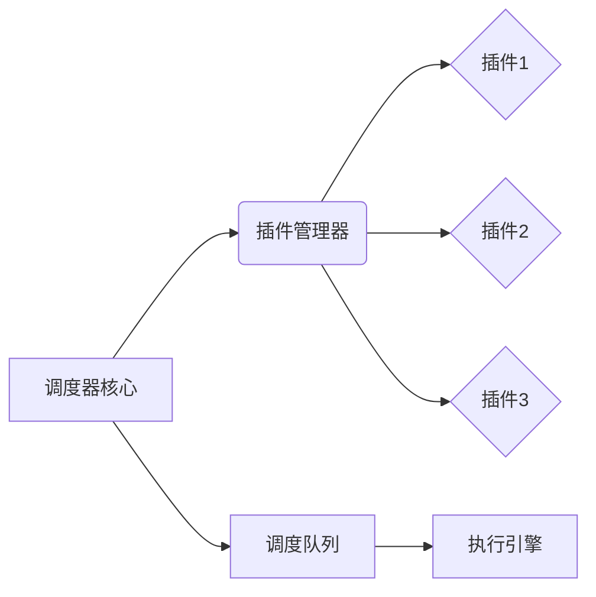

# 调度器的插件化和扩展性设计

作者：禅与计算机程序设计艺术

## 1. 背景介绍

### 1.1. 调度器的重要性

在计算机系统中，调度器扮演着至关重要的角色，它负责决定哪些任务何时以及如何在系统资源上运行。从操作系统内核到分布式系统，从数据库到云计算平台，调度器无处不在。一个高效、灵活、可扩展的调度器能够极大地提升系统性能、资源利用率以及用户体验。

### 1.2. 传统调度器的局限性

传统的调度器通常采用硬编码的方式来实现特定的调度策略和功能。这种方式虽然简单直接，但存在以下局限性：

* **可扩展性差:** 难以添加新的调度策略和功能，需要修改调度器核心代码。
* **可定制性差:** 难以根据不同的应用场景和需求进行定制化配置。
* **代码复杂度高:** 随着功能的增加，调度器代码会变得越来越庞大，难以维护和扩展。

### 1.3. 插件化和扩展性设计的优势

为了克服传统调度器的局限性，越来越多的现代调度器开始采用插件化和扩展性设计。这种设计理念将调度器的核心功能与具体的调度策略、算法和扩展功能分离，通过定义清晰的接口和插件机制，使得开发者可以轻松地扩展和定制调度器的功能，而无需修改调度器核心代码。

插件化和扩展性设计带来的优势包括：

* **提高可扩展性:**  可以方便地添加新的调度策略、算法和扩展功能，满足不断变化的需求。
* **增强可定制性:**  可以根据不同的应用场景和需求，选择不同的插件组合，实现定制化的调度策略。
* **降低代码复杂度:**  将复杂的调度逻辑封装在独立的插件中，降低调度器核心代码的复杂度，提高代码可读性和可维护性。
* **促进代码复用:**  可以将通用的调度策略和功能封装成插件，在不同的调度器中复用。

## 2. 核心概念与联系

### 2.1. 插件(Plugin)

插件是独立的代码模块，它实现了一组特定的调度功能或策略。插件通过调度器定义的接口与调度器核心进行交互，并可以访问调度器内部的数据结构和状态信息。

### 2.2. 接口(Interface)

接口定义了插件与调度器核心进行交互的规范。调度器核心通过接口向插件暴露必要的功能和数据，插件则通过接口实现特定的调度逻辑。

### 2.3. 插件管理器(Plugin Manager)

插件管理器负责加载、管理和调度插件。它维护一个插件列表，并根据配置信息或运行时状态选择合适的插件来执行调度任务。

### 2.4. 事件(Event)

事件是调度过程中发生的特定事情，例如任务提交、任务完成、资源可用等。调度器可以触发事件通知插件，插件可以监听感兴趣的事件并做出相应的处理。

### 2.5. 上下文(Context)

上下文包含了调度过程中需要传递给插件的信息，例如当前系统状态、任务信息、资源信息等。调度器在调用插件时会将上下文信息传递给插件，插件可以根据上下文信息做出调度决策。


## 3. 核心算法原理具体操作步骤

### 3.1. 插件化调度器架构



* **调度器核心:**  负责维护调度队列、管理资源、触发事件等核心功能。
* **插件管理器:**  负责加载、管理和调度插件。
* **插件:**  实现特定的调度策略、算法和扩展功能。
* **调度队列:**  存储待调度的任务。
* **执行引擎:**  负责执行调度器分配的任务。

### 3.2. 插件加载机制

插件加载机制通常包括以下步骤:

1. **插件发现:**  调度器在启动时会扫描指定的目录，查找符合规范的插件。
2. **插件加载:**  将插件代码加载到内存中。
3. **插件实例化:**  创建插件对象的实例。
4. **插件注册:**  将插件对象注册到插件管理器中。

### 3.3. 插件调度流程

插件调度流程通常包括以下步骤:

1. **事件触发:**  调度器核心触发相应的事件，例如任务提交事件。
2. **插件过滤:**  插件管理器根据事件类型和插件注册信息，筛选出需要调用的插件列表。
3. **插件排序:**  根据插件的优先级或其他规则，对插件列表进行排序。
4. **插件调用:**  依次调用插件列表中的插件，并将上下文信息传递给插件。
5. **结果处理:**  调度器核心根据插件的返回值或执行结果，进行相应的处理。


## 4. 数学模型和公式详细讲解举例说明

本节以一个简单的任务优先级调度算法为例，介绍如何使用数学模型和公式来描述调度策略。

### 4.1. 问题描述

假设有 n 个任务需要调度，每个任务都有一个优先级 priority，调度器需要根据任务的优先级来决定任务的执行顺序，优先级高的任务先执行。

### 4.2. 数学模型

可以使用一个优先级队列来表示调度队列，队列中的元素按照优先级从高到低排序。

```
Queue = {task1, task2, ..., taskn}
```

其中，

* `task` 表示一个任务，包含任务ID、优先级等信息。
* `priority(task)` 表示任务 `task` 的优先级，优先级越高，数值越大。

### 4.3. 调度算法

调度算法的步骤如下:

1. 从优先级队列中取出优先级最高的任务 `task`。
2. 执行任务 `task`。
3. 如果任务队列不为空，则重复步骤 1 和 2。

### 4.4. 公式表示

可以使用以下公式来表示调度算法:

```
while (!Queue.isEmpty()) {
  task = Queue.poll();
  execute(task);
}
```

其中，

* `Queue.poll()` 表示从优先级队列中取出并移除优先级最高的元素。
* `execute(task)` 表示执行任务 `task`。

### 4.5. 举例说明

假设有 3 个任务，其优先级分别为:

* 任务 1: priority = 10
* 任务 2: priority = 5
* 任务 3: priority = 1

则调度器会按照以下顺序执行任务:

1. 任务 1
2. 任务 2
3. 任务 3


## 5. 项目实践：代码实例和详细解释说明

### 5.1. 示例代码

以下是一个简单的插件化调度器示例代码，使用 Python 语言实现:

```python
# 插件接口
class SchedulerPlugin:
    def on_task_submit(self, task):
        """
        任务提交事件处理函数
        """
        pass

    def on_task_complete(self, task):
        """
        任务完成事件处理函数
        """
        pass

# 插件管理器
class PluginManager:
    def __init__(self):
        self.plugins = []

    def register_plugin(self, plugin):
        """
        注册插件
        """
        self.plugins.append(plugin)

    def notify_task_submit(self, task):
        """
        触发任务提交事件
        """
        for plugin in self.plugins:
            plugin.on_task_submit(task)

    def notify_task_complete(self, task):
        """
        触发任务完成事件
        """
        for plugin in self.plugins:
            plugin.on_task_complete(task)

# 调度器
class Scheduler:
    def __init__(self):
        self.plugin_manager = PluginManager()

    def submit_task(self, task):
        """
        提交任务
        """
        # 触发任务提交事件
        self.plugin_manager.notify_task_submit(task)

        # 执行任务
        # ...

        # 触发任务完成事件
        self.plugin_manager.notify_task_complete(task)

# 示例插件
class PrioritySchedulerPlugin(SchedulerPlugin):
    def on_task_submit(self, task):
        """
        根据任务优先级进行调度
        """
        # 将任务添加到优先级队列中
        # ...

# 创建调度器对象
scheduler = Scheduler()

# 注册插件
scheduler.plugin_manager.register_plugin(PrioritySchedulerPlugin())

# 提交任务
scheduler.submit_task(...)
```

### 5.2. 代码解释

* `SchedulerPlugin` 类定义了插件接口，包含 `on_task_submit` 和 `on_task_complete` 两个事件处理函数。
* `PluginManager` 类负责管理插件，包括注册插件和触发事件。
* `Scheduler` 类是调度器核心，负责提交任务、执行任务和触发事件。
* `PrioritySchedulerPlugin` 类是一个示例插件，实现了根据任务优先级进行调度的逻辑。

### 5.3. 使用方法

1. 创建一个 `Scheduler` 对象。
2. 创建一个或多个插件对象，并实现 `SchedulerPlugin` 接口。
3. 使用 `register_plugin` 方法将插件对象注册到调度器中。
4. 使用 `submit_task` 方法提交任务。

## 6. 实际应用场景

调度器的插件化和扩展性设计可以应用于各种实际场景，例如：

* **操作系统内核:**  现代操作系统内核通常采用插件化架构来实现设备驱动程序、文件系统、网络协议栈等组件。
* **分布式系统:**  分布式调度框架（例如 Apache Mesos、Kubernetes）通常支持插件化机制，允许用户自定义调度策略、资源管理策略等。
* **数据库:**  数据库管理系统（例如 MySQL、PostgreSQL）通常支持插件式存储引擎，允许用户选择不同的存储引擎来满足不同的性能和功能需求。
* **云计算平台:**  云计算平台（例如 Amazon Web Services、Microsoft Azure）通常提供丰富的 API 和 SDK，允许用户开发和集成自定义的调度器和扩展功能。

## 7. 工具和资源推荐

以下是一些常用的调度器插件化和扩展性设计相关的工具和资源:

* **Celery:**  一个分布式任务队列，支持插件化机制，可以自定义任务调度策略、结果存储方式等。
* **Airflow:**  一个工作流调度系统，支持插件化机制，可以自定义任务依赖关系、调度策略等。
* **Quartz:**  一个开源的作业调度框架，支持插件化机制，可以自定义触发器、监听器等。

## 8. 总结：未来发展趋势与挑战

调度器的插件化和扩展性设计是未来发展趋势，它可以帮助开发者构建更加灵活、可扩展、易于维护的调度系统。未来，调度器插件化和扩展性设计将会朝着以下方向发展:

* **更加灵活的插件机制:**  支持动态加载、卸载和更新插件，以及更加细粒度的插件控制。
* **更加丰富的插件生态:**  提供更多开箱即用的插件，覆盖更多的应用场景。
* **更加智能的插件推荐:**  根据用户的需求和系统状态，自动推荐合适的插件。

## 9. 附录：常见问题与解答

### 9.1. 如何设计一个易于扩展的插件接口？

设计一个易于扩展的插件接口需要遵循以下原则:

* **接口要简洁明了:**  接口应该只包含必要的函数和参数，避免过于复杂。
* **接口要稳定:**  接口一旦发布，应该尽量避免修改，以确保插件的兼容性。
* **提供默认实现:**  为接口提供默认实现，方便插件开发者快速上手。

### 9.2. 如何管理插件之间的依赖关系？

可以使用依赖注入框架来管理插件之间的依赖关系。依赖注入框架可以自动解析插件之间的依赖关系，并将依赖的插件实例注入到需要的地方。

### 9.3. 如何测试插件的正确性和性能？

可以使用单元测试、集成测试和性能测试来测试插件的正确性和性能。

* **单元测试:**  用于测试插件中每个函数的逻辑是否正确。
* **集成测试:**  用于测试插件与调度器核心的集成是否正常。
* **性能测试:**  用于测试插件的性能指标，例如吞吐量、延迟等。
