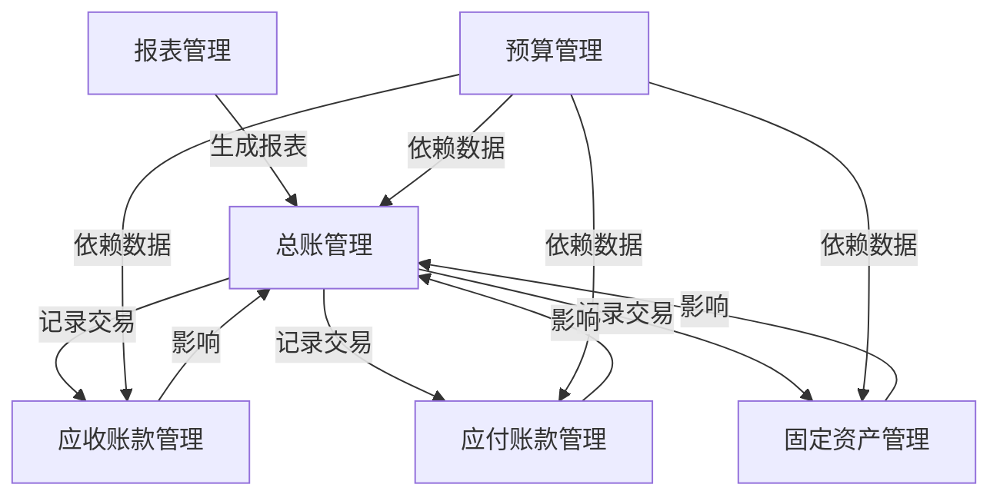

# 财务管理系统设计与实现

## 1. 背景介绍

### 1.1 财务管理系统的重要性

财务管理系统是企业信息系统中至关重要的一部分。它不仅帮助企业进行财务数据的采集、处理和分析，还为企业的决策提供数据支持。一个高效的财务管理系统能够提高企业的运营效率，减少人为错误，确保财务数据的准确性和及时性。

### 1.2 财务管理系统的发展历程

财务管理系统的发展经历了从简单的手工记账到复杂的软件系统的演变。早期的财务管理依赖于纸质账本和手工计算，而现代的财务管理系统则利用计算机技术和网络技术，实现了自动化和智能化。

### 1.3 现代财务管理系统的特点

现代财务管理系统具有以下几个特点：

- **自动化**：通过自动化处理减少人为错误，提高效率。
- **实时性**：能够实时获取和处理财务数据。
- **集成性**：与其他业务系统（如ERP系统）无缝集成。
- **可扩展性**：支持模块化设计，方便系统扩展和升级。
- **安全性**：确保财务数据的安全性和保密性。

## 2. 核心概念与联系

### 2.1 财务管理系统的基本功能模块

一个完整的财务管理系统通常包括以下几个基本功能模块：

- **总账管理**：记录和管理企业的所有财务交易。
- **应收账款管理**：管理企业的应收账款，确保及时回款。
- **应付账款管理**：管理企业的应付账款，确保及时付款。
- **固定资产管理**：管理企业的固定资产，进行资产折旧和维护。
- **预算管理**：制定和管理企业的财务预算。
- **报表管理**：生成各种财务报表，为企业决策提供数据支持。

### 2.2 各功能模块之间的联系

各功能模块之间相互联系，共同构成了一个完整的财务管理系统。例如，应收账款管理模块和应付账款管理模块的数据会影响总账管理模块的数据，而预算管理模块则需要依赖于其他模块的数据来进行预算编制和管理。

以下是一个简化的流程图，展示了各功能模块之间的联系：



## 3. 核心算法原理具体操作步骤

### 3.1 总账管理的核心算法

总账管理模块的核心算法主要包括以下几个步骤：

1. **数据采集**：从各业务模块获取财务数据。
2. **数据处理**：对采集到的数据进行处理，包括分类、汇总和核算。
3. **数据存储**：将处理后的数据存储到数据库中。
4. **数据查询**：提供数据查询接口，支持多维度的数据查询和分析。

### 3.2 应收账款管理的核心算法

应收账款管理模块的核心算法主要包括以下几个步骤：

1. **账款记录**：记录客户的应收账款信息。
2. **账款跟踪**：跟踪应收账款的回款情况，生成账龄分析报表。
3. **账款催收**：根据账龄分析报表，进行账款催收。
4. **账款核销**：在收到客户的付款后，对应收账款进行核销。

### 3.3 应付账款管理的核心算法

应付账款管理模块的核心算法主要包括以下几个步骤：

1. **账款记录**：记录供应商的应付账款信息。
2. **账款跟踪**：跟踪应付账款的付款情况，生成账龄分析报表。
3. **账款支付**：根据账龄分析报表，进行账款支付。
4. **账款核销**：在支付供应商的款项后，对应付账款进行核销。

### 3.4 固定资产管理的核心算法

固定资产管理模块的核心算法主要包括以下几个步骤：

1. **资产记录**：记录企业的固定资产信息。
2. **资产折旧**：根据资产的使用年限和折旧方法，计算资产的折旧费用。
3. **资产维护**：记录和管理资产的维护记录。
4. **资产处置**：在资产报废或出售时，进行资产处置。

### 3.5 预算管理的核心算法

预算管理模块的核心算法主要包括以下几个步骤：

1. **预算编制**：根据企业的历史数据和未来预期，编制财务预算。
2. **预算执行**：跟踪预算的执行情况，生成预算执行报表。
3. **预算调整**：根据实际情况，对预算进行调整。
4. **预算分析**：对预算执行情况进行分析，生成预算分析报表。

### 3.6 报表管理的核心算法

报表管理模块的核心算法主要包括以下几个步骤：

1. **数据采集**：从各业务模块获取财务数据。
2. **数据处理**：对采集到的数据进行处理，包括分类、汇总和核算。
3. **报表生成**：根据预定义的报表模板，生成各种财务报表。
4. **报表展示**：提供报表展示接口，支持多维度的报表展示和分析。

## 4. 数学模型和公式详细讲解举例说明

### 4.1 资产折旧计算公式

固定资产折旧是财务管理中的一个重要概念。常用的折旧方法包括直线法、双倍余额递减法和年数总和法。

#### 4.1.1 直线法

直线法是最简单的一种折旧计算方法。其公式为：

$$
D = \frac{C - S}{N}
$$

其中：
- $D$ 为每年的折旧费用
- $C$ 为资产的原值
- $S$ 为资产的残值
- $N$ 为资产的使用年限

#### 4.1.2 双倍余额递减法

双倍余额递减法是一种加速折旧的方法。其公式为：

$$
D_t = 2 \times \frac{C - \sum_{i=1}^{t-1} D_i}{N}
$$

其中：
- $D_t$ 为第 $t$ 年的折旧费用
- $C$ 为资产的原值
- $N$ 为资产的使用年限
- $\sum_{i=1}^{t-1} D_i$ 为前 $t-1$ 年的累计折旧费用

#### 4.1.3 年数总和法

年数总和法也是一种加速折旧的方法。其公式为：

$$
D_t = \frac{(N - t + 1) \times (C - S)}{\sum_{i=1}^{N} i}
$$

其中：
- $D_t$ 为第 $t$ 年的折旧费用
- $C$ 为资产的原值
- $S$ 为资产的残值
- $N$ 为资产的使用年限
- $\sum_{i=1}^{N} i$ 为年数总和

### 4.2 预算差异分析公式

预算差异分析是预算管理中的一个重要概念。其公式为：

$$
V = A - B
$$

其中：
- $V$ 为预算差异
- $A$ 为实际数值
- $B$ 为预算数值

预算差异可以进一步分解为价格差异和数量差异：

$$
V = (P_A - P_B) \times Q_B + (Q_A - Q_B) \times P_B
$$

其中：
- $P_A$ 为实际价格
- $P_B$ 为预算价格
- $Q_A$ 为实际数量
- $Q_B$ 为预算数量

## 5. 项目实践：代码实例和详细解释说明

### 5.1 总账管理模块的实现

以下是一个简化的总账管理模块的实现代码示例：

```python
class GeneralLedger:
    def __init__(self):
        self.entries = []

    def add_entry(self, date, description, amount, account):
        entry = {
            'date': date,
            'description': description,
           