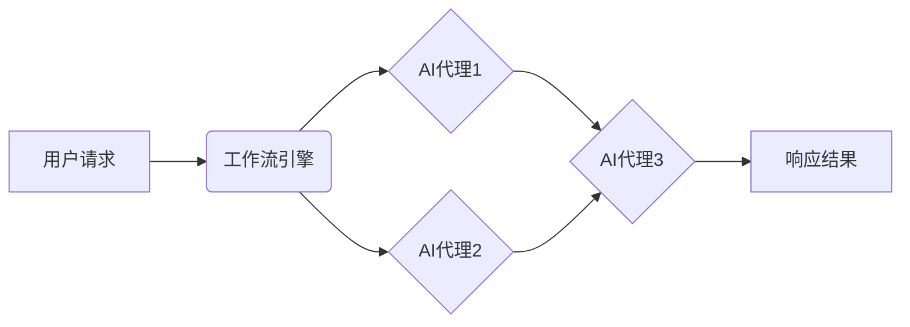
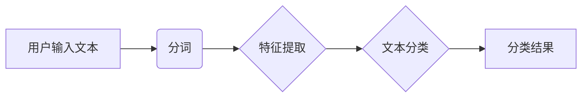
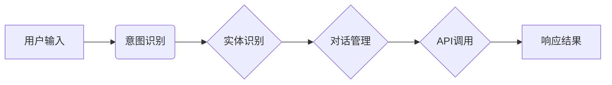

##  跨领域AI代理工作流模型：灵活应用于不同场景

**作者：禅与计算机程序设计艺术**

## 1. 背景介绍

### 1.1 人工智能代理的兴起与挑战

近年来，人工智能（AI）技术发展迅速，各种类型的AI代理被广泛应用于各个领域，例如聊天机器人、智能助手、自动驾驶汽车等。这些AI代理能够模拟人类的智能行为，完成特定的任务或目标。然而，随着应用场景的不断扩展，传统的AI代理设计模式面临着一些挑战：

* **领域特定性:**  传统的AI代理通常针对特定领域进行设计和训练，难以适应新的领域和任务。例如，一个专门用于订餐的聊天机器人无法处理天气查询等其他领域的任务。
* **可扩展性:**  随着应用场景的复杂化，AI代理需要处理的信息量和任务复杂度不断增加，传统的单体架构难以满足需求。
* **交互性:**  许多AI代理需要与用户进行交互，而传统的命令式交互方式难以满足用户个性化和自然语言交互的需求。

### 1.2 跨领域AI代理的优势

为了克服上述挑战，跨领域AI代理应运而生。跨领域AI代理旨在构建能够在不同领域之间进行迁移和泛化的AI系统，具有以下优势：

* **灵活性:**  跨领域AI代理能够根据不同的应用场景和用户需求，灵活地组合和调用不同的AI能力，实现多任务处理和个性化服务。
* **可扩展性:**  跨领域AI代理采用模块化设计，可以方便地添加新的AI能力和领域知识，实现系统的快速扩展和升级。
* **可重用性:**  跨领域AI代理的各个模块可以独立开发和维护，并在不同的应用场景中进行复用，提高开发效率和代码质量。

### 1.3 本文目标

本文旨在介绍一种跨领域AI代理工作流模型，该模型能够灵活地应用于不同的场景，并提供高效、可扩展的AI解决方案。

## 2. 核心概念与联系

### 2.1 AI代理

AI代理是指能够感知环境、进行决策并执行动作的智能体。在本文中，我们将AI代理定义为一个软件模块，它能够接收输入数据，执行特定的AI任务，并返回输出结果。

### 2.2 工作流

工作流是指一系列按照预定义规则和顺序执行的任务或活动的集合。在本文中，我们将工作流定义为一个由多个AI代理组成的流程，用于完成特定的业务目标。

### 2.3 跨领域AI代理工作流模型

跨领域AI代理工作流模型是一种将多个AI代理组织成工作流，以实现跨领域AI应用的框架。该模型的核心思想是将不同的AI能力封装成独立的AI代理，并通过工作流引擎将这些代理连接起来，实现复杂AI任务的自动化处理。

## 3. 核心算法原理具体操作步骤

### 3.1 模型架构

跨领域AI代理工作流模型的架构如下图所示：



* **用户请求:** 用户通过API接口或其他方式向系统发送请求。
* **工作流引擎:**  工作流引擎负责解析用户请求，并根据预定义的工作流规则，将请求分发给相应的AI代理进行处理。
* **AI代理:**  AI代理是模型的核心组件，每个AI代理负责执行特定的AI任务，例如自然语言处理、图像识别、机器学习等。
* **响应结果:**  AI代理处理完成后，将结果返回给工作流引擎，最终由系统返回给用户。

### 3.2 工作流定义

工作流定义了AI代理的执行顺序和数据流向。可以使用YAML、JSON等格式定义工作流，例如：

```yaml
name:  跨领域AI代理工作流示例
description:  该工作流用于处理用户查询
steps:
  - name:  自然语言理解
    agent:  NLUAgent
    input:  ${input}
    output:  ${intent}, ${entities}
  - name:  对话管理
    agent:  DialogManagerAgent
    input:  ${intent}, ${entities}
    output:  ${action}, ${parameters}
  - name:  任务执行
    agent:  TaskExecutionAgent
    input:  ${action}, ${parameters}
    output:  ${result}
  - name:  自然语言生成
    agent:  NLGAgent
    input:  ${result}
    output:  ${response}
```

### 3.3 AI代理开发

AI代理可以使用Python、Java等编程语言开发，并通过RESTful API等方式与工作流引擎进行交互。每个AI代理都需要实现以下功能：

* **初始化:**  加载模型参数、连接外部服务等。
* **处理请求:**  接收来自工作流引擎的请求数据，并执行相应的AI任务。
* **返回结果:**  将处理结果返回给工作流引擎。

### 3.4 模型部署

跨领域AI代理工作流模型可以使用Docker、Kubernetes等容器化技术进行部署，以实现系统的可移植性和可扩展性。

## 4. 数学模型和公式详细讲解举例说明

本节以一个简单的文本分类任务为例，介绍如何使用跨领域AI代理工作流模型实现该任务。

### 4.1 任务描述

假设我们需要构建一个文本分类系统，用于将用户输入的文本分为以下几类：

* 体育
* 娱乐
* 科技

### 4.2 工作流设计

我们可以设计如下工作流来实现该任务：



* **分词:** 将用户输入的文本分割成单词或词语序列。
* **特征提取:** 从分词后的文本中提取特征向量，例如词袋模型、TF-IDF等。
* **文本分类:** 使用预先训练好的文本分类模型对特征向量进行分类。

### 4.3 AI代理实现

* **分词代理:**
    ```python
    class TokenizerAgent:
        def __init__(self):
            # 初始化分词器
            self.tokenizer = ...

        def process(self, text):
            # 对文本进行分词
            tokens = self.tokenizer(text)
            return tokens
    ```
* **特征提取代理:**
    ```python
    class FeatureExtractorAgent:
        def __init__(self):
            # 初始化特征提取器
            self.vectorizer = ...

        def process(self, tokens):
            # 提取特征向量
            features = self.vectorizer.transform(tokens)
            return features
    ```
* **文本分类代理:**
    ```python
    class TextClassifierAgent:
        def __init__(self):
            # 加载预训练的文本分类模型
            self.model = ...

        def process(self, features):
            # 对特征向量进行分类
            label = self.model.predict(features)
            return label
    ```

### 4.4 数学模型

文本分类模型可以使用逻辑回归、支持向量机、神经网络等算法实现。

以逻辑回归为例，其数学模型如下：

$$
P(y=1|x) = \frac{1}{1 + e^{-(w^Tx + b)}}
$$

其中：

* $x$ 表示特征向量
* $y$ 表示类别标签
* $w$ 表示权重向量
* $b$ 表示偏置项

### 4.5 模型训练

可以使用标注好的文本数据对文本分类模型进行训练。

### 4.6 模型评估

可以使用测试集评估文本分类模型的性能，例如准确率、召回率、F1值等指标。

## 5. 项目实践：代码实例和详细解释说明

本节以一个实际的跨领域AI代理工作流模型项目为例，介绍如何使用Python语言实现该模型。

### 5.1 项目背景

假设我们需要构建一个智能客服系统，用于处理用户的各种咨询和服务请求。

### 5.2 工作流设计

我们可以设计如下工作流来实现该系统：



* **意图识别:**  识别用户输入的意图，例如查询天气、预订酒店等。
* **实体识别:**  识别用户输入中的实体，例如日期、地点、人物等。
* **对话管理:**  根据用户的意图和实体信息，进行对话状态跟踪和对话策略选择。
* **API调用:**  调用外部API接口，获取用户所需的信息或服务。

### 5.3 代码实现

```python
from abc import ABC, abstractmethod

class Agent(ABC):
    """
    AI代理基类
    """
    @abstractmethod
    def process(self, data):
        """
        处理请求数据
        """
        pass

class IntentRecognitionAgent(Agent):
    """
    意图识别代理
    """
    def __init__(self):
        # 加载意图识别模型
        self.model = ...

    def process(self, text):
        # 进行意图识别
        intent = self.model.predict(text)
        return intent

class EntityRecognitionAgent(Agent):
    """
    实体识别代理
    """
    def __init__(self):
        # 加载实体识别模型
        self.model = ...

    def process(self, text):
        # 进行实体识别
        entities = self.model.extract_entities(text)
        return entities

class DialogManagerAgent(Agent):
    """
    对话管理代理
    """
    def __init__(self):
        # 初始化对话状态
        self.state = ...

    def process(self, intent, entities):
        # 根据意图和实体信息，更新对话状态
        self.state = self.update_state(intent, entities)
        # 选择对话策略
        action, parameters = self.select_action(self.state)
        return action, parameters

class APICallAgent(Agent):
    """
    API调用代理
    """
    def __init__(self):
        # 初始化API客户端
        self.client = ...

    def process(self, action, parameters):
        # 调用API接口
        response = self.client.call(action, parameters)
        return response

class WorkflowEngine:
    """
    工作流引擎
    """
    def __init__(self, agents):
        # 初始化AI代理
        self.agents = agents

    def run(self, text):
        # 意图识别
        intent = self.agents["intent_recognition"].process(text)
        # 实体识别
        entities = self.agents["entity_recognition"].process(text)
        # 对话管理
        action, parameters = self.agents["dialog_manager"].process(intent, entities)
        # API调用
        response = self.agents["api_call"].process(action, parameters)
        return response

# 创建AI代理
intent_recognition_agent = IntentRecognitionAgent()
entity_recognition_agent = EntityRecognitionAgent()
dialog_manager_agent = DialogManagerAgent()
api_call_agent = APICallAgent()

# 创建工作流引擎
agents = {
    "intent_recognition": intent_recognition_agent,
    "entity_recognition": entity_recognition_agent,
    "dialog_manager": dialog_manager_agent,
    "api_call": api_call_agent,
}
workflow_engine = WorkflowEngine(agents)

# 处理用户输入
text = "我想查询一下明天的天气"
response = workflow_engine.run(text)

# 打印响应结果
print(response)
```

### 5.4 代码解释

* `Agent` 类是所有AI代理的基类，定义了 `process()` 方法用于处理请求数据。
* `IntentRecognitionAgent`、`EntityRecognitionAgent`、`DialogManagerAgent` 和 `APICallAgent` 分别实现了意图识别、实体识别、对话管理和API调用等功能。
* `WorkflowEngine` 类是工作流引擎，负责管理AI代理并执行工作流。
* 在 `run()` 方法中，工作流引擎依次调用各个AI代理的 `process()` 方法，并将上一个代理的输出作为下一个代理的输入，最终返回API调用的结果。

## 6. 实际应用场景

跨领域AI代理工作流模型可以应用于各种实际场景，例如：

* **智能客服:**  构建能够处理用户各种咨询和服务请求的智能客服系统。
* **智能助手:**  构建能够帮助用户完成各种任务的智能助手，例如日程管理、邮件处理等。
* **自动驾驶:**  构建能够实现自动驾驶功能的AI系统。
* **医疗诊断:**  构建能够辅助医生进行疾病诊断的AI系统。
* **金融风控:**  构建能够识别和防范金融风险的AI系统。

## 7. 工具和资源推荐

* **工作流引擎:**  Airflow、Argo、Kubeflow
* **AI平台:**  TensorFlow Extended、MLflow、Amazon SageMaker
* **自然语言处理工具:**  spaCy、NLTK、Stanford CoreNLP
* **机器学习库:**  scikit-learn、XGBoost、LightGBM

## 8. 总结：未来发展趋势与挑战

### 8.1 未来发展趋势

* **更加智能化的AI代理:**  随着深度学习等技术的不断发展，AI代理将变得更加智能化，能够处理更加复杂的任务。
* **更加灵活的工作流模型:**  未来的工作流模型将更加灵活，支持更加复杂的业务流程和数据流转。
* **更加广泛的应用场景:**  跨领域AI代理工作流模型将应用于更加广泛的场景，例如物联网、智慧城市等。

### 8.2 面临的挑战

* **数据孤岛问题:**  不同领域的数据往往分散在不同的系统中，如何打通数据孤岛是跨领域AI代理工作流模型面临的一大挑战。
* **模型可解释性问题:**  深度学习等模型往往缺乏可解释性，如何提高模型的可解释性是未来需要解决的问题。
* **模型安全性问题:**  AI模型容易受到攻击，如何保障模型的安全性是至关重要的。

## 9. 附录：常见问题与解答

### 9.1 如何选择合适的AI代理？

选择合适的AI代理需要考虑以下因素：

* **任务需求:**  不同的AI任务需要使用不同的AI代理，例如自然语言处理任务可以使用BERT、GPT等模型，图像识别任务可以使用ResNet、YOLO等模型。
* **性能要求:**  不同的AI代理具有不同的性能表现，需要根据实际应用场景选择性能满足需求的代理。
* **易用性:**  一些AI代理提供简单易用的API接口，方便用户快速集成和使用。

### 9.2 如何保证工作流的可靠性？

保证工作流的可靠性可以采取以下措施：

* **异常处理:**  在工作流中添加异常处理机制，例如重试、回滚等，以应对各种异常情况。
* **监控报警:**  对工作流的运行状态进行监控，并在出现异常时及时报警。
* **测试:**  对工作流进行充分的测试，确保其在各种情况下都能正常运行。

### 9.3 如何提高模型的可扩展性？

提高模型的可扩展性可以采取以下措施：

* **模块化设计:**  将模型划分为多个独立的模块，每个模块负责特定的功能，方便扩展和维护。
* **微服务架构:**  将模型部署为多个微服务，每个微服务负责特定的AI任务，可以独立扩展和升级。
* **容器化技术:**  使用Docker、Kubernetes等容器化技术，可以方便地部署和管理模型。
