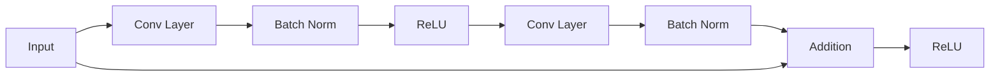
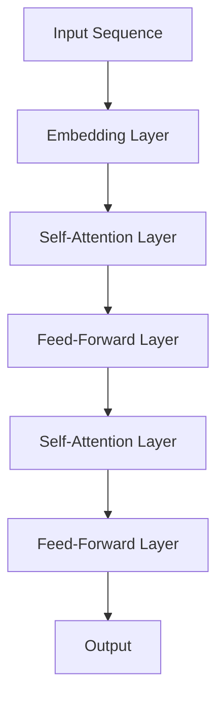

# 迁移学习的预训练模型：ResNet、BERT等

作者：禅与计算机程序设计艺术

## 1. 背景介绍

### 1.1 迁移学习的兴起

在现代机器学习和深度学习领域，训练一个高性能的模型往往需要大量的数据和计算资源。然而，获取大规模标注数据集和高性能计算设备并非总是可行。迁移学习（Transfer Learning）作为一种解决这一问题的技术，近年来受到了广泛关注和应用。迁移学习的核心思想是将一个领域中训练好的模型应用到另一个相关领域，从而减少数据和计算资源的需求。

### 1.2 预训练模型的作用

预训练模型是迁移学习中常用的一种方法，这些模型通常在大规模数据集上进行训练，能够捕捉到丰富的特征表示。通过在这些预训练模型的基础上进行微调，可以在较小的数据集上实现良好的性能。ResNet（Residual Networks）和BERT（Bidirectional Encoder Representations from Transformers）是两个广泛使用的预训练模型，分别在计算机视觉和自然语言处理领域取得了显著的成果。

### 1.3 本文结构

本文将详细介绍迁移学习中的预训练模型，重点讨论ResNet和BERT的核心概念、算法原理、数学模型、项目实践、实际应用场景、工具和资源推荐，以及未来的发展趋势与挑战。通过这篇文章，读者将能够深入理解迁移学习的预训练模型，并在实际项目中应用这些技术。

## 2. 核心概念与联系

### 2.1 迁移学习的基本概念

迁移学习旨在利用一个领域（源领域）中获得的知识来帮助另一个领域（目标领域）的学习任务。其基本假设是源领域和目标领域之间存在某种程度的相关性。迁移学习可以分为以下几种类型：

- **特征迁移**：将源领域模型的特征表示应用于目标领域。
- **参数迁移**：将源领域模型的参数作为目标领域模型的初始参数。
- **关系迁移**：利用源领域中的关系信息来辅助目标领域的学习。

### 2.2 预训练模型的概念

预训练模型是指在大规模数据集上预先训练好的模型，这些模型能够捕捉丰富的特征表示。通过在这些预训练模型的基础上进行微调，可以在较小的数据集上实现良好的性能。预训练模型的优势在于：

- **减少训练时间**：预训练模型已经在大规模数据集上进行了长时间的训练，只需在目标任务上进行微调即可。
- **提高性能**：预训练模型能够捕捉到丰富的特征表示，在目标任务上通常能够取得较好的性能。
- **减少数据需求**：通过利用预训练模型，可以在较小的数据集上实现良好的性能，减少对大规模标注数据的需求。

### 2.3 ResNet与BERT的联系

ResNet和BERT分别是计算机视觉和自然语言处理领域中的经典预训练模型。虽然它们应用于不同的领域，但其核心思想都是通过在大规模数据集上进行预训练，捕捉丰富的特征表示，从而在目标任务上实现良好的性能。ResNet通过引入残差连接解决了深层神经网络训练中的梯度消失问题，而BERT通过双向编码器捕捉上下文信息，实现了更好的自然语言理解能力。

## 3. 核心算法原理具体操作步骤

### 3.1 ResNet的核心算法原理

#### 3.1.1 残差块（Residual Block）

ResNet的核心创新在于引入了残差块。传统的深层神经网络在训练过程中容易出现梯度消失或梯度爆炸的问题，导致模型训练困难。残差块通过引入快捷连接（skip connections），将输入直接传递到输出，从而缓解了梯度消失问题。

#### 3.1.2 残差块的数学表示

残差块的数学表示如下：

$$
y = F(x, \{W_i\}) + x
$$

其中，$x$ 为输入，$y$ 为输出，$F(x, \{W_i\})$ 为残差函数，$\{W_i\}$ 为残差块中的权重参数。

#### 3.1.3 ResNet的网络结构

ResNet的网络结构由多个残差块堆叠而成。常见的ResNet变体包括ResNet-18、ResNet-34、ResNet-50、ResNet-101和ResNet-152，数字表示网络的层数。

### 3.2 BERT的核心算法原理

#### 3.2.1 Transformer架构

BERT基于Transformer架构，Transformer由编码器（Encoder）和解码器（Decoder）组成。BERT只使用了编码器部分。编码器由多层自注意力（Self-Attention）和前馈神经网络（Feed-Forward Neural Network）组成。

#### 3.2.2 自注意力机制

自注意力机制通过计算输入序列中每个位置的注意力权重，捕捉序列中不同位置之间的依赖关系。自注意力的计算公式如下：

$$
\text{Attention}(Q, K, V) = \text{softmax}\left(\frac{QK^T}{\sqrt{d_k}}\right)V
$$

其中，$Q$ 为查询向量，$K$ 为键向量，$V$ 为值向量，$d_k$ 为键向量的维度。

#### 3.2.3 BERT的预训练任务

BERT的预训练任务包括掩码语言模型（Masked Language Model, MLM）和下一个句子预测（Next Sentence Prediction, NSP）。MLM任务通过随机掩盖输入序列中的部分单词，要求模型预测被掩盖的单词；NSP任务通过预测两个句子是否连续，帮助模型理解句子间的关系。

## 4. 数学模型和公式详细讲解举例说明

### 4.1 ResNet的数学模型

#### 4.1.1 残差块的数学表示

残差块的数学表示如下：

$$
y = F(x, \{W_i\}) + x
$$

其中，$x$ 为输入，$y$ 为输出，$F(x, \{W_i\})$ 为残差函数，$\{W_i\}$ 为残差块中的权重参数。

#### 4.1.2 残差函数的具体形式

残差函数 $F(x, \{W_i\})$ 通常由两个卷积层、批归一化层和ReLU激活函数组成。其具体形式如下：

$$
F(x, \{W_i\}) = \text{ReLU}(\text{BN}(W_2 \cdot \text{ReLU}(\text{BN}(W_1 \cdot x))))
$$

其中，$W_1$ 和 $W_2$ 分别为两个卷积层的权重参数，$\text{BN}$ 为批归一化层。

### 4.2 BERT的数学模型

#### 4.2.1 自注意力机制的数学表示

自注意力机制通过计算输入序列中每个位置的注意力权重，捕捉序列中不同位置之间的依赖关系。自注意力的计算公式如下：

$$
\text{Attention}(Q, K, V) = \text{softmax}\left(\frac{QK^T}{\sqrt{d_k}}\right)V
$$

其中，$Q$ 为查询向量，$K$ 为键向量，$V$ 为值向量，$d_k$ 为键向量的维度。

#### 4.2.2 多头自注意力机制

为了提升模型的表达能力，BERT采用了多头自注意力机制。多头自注意力机制通过并行计算多个自注意力，捕捉不同子空间的特征表示。其数学表示如下：

$$
\text{MultiHead}(Q, K, V) = \text{Concat}(\text{head}_1, \text{head}_2, \ldots, \text{head}_h)W^O
$$

其中，$\text{head}_i = \text{Attention}(Q