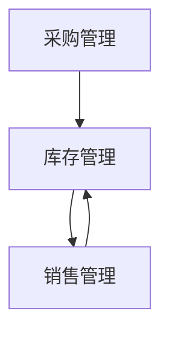

# 进销存管理系统详细设计与具体代码实现

作者：禅与计算机程序设计艺术

## 1. 背景介绍

### 1.1 进销存管理系统的定义

进销存管理系统（Inventory, Purchase, and Sales Management System）是指用于管理企业的采购、销售以及库存的系统。它通过信息化手段，实现对企业物流、资金流、信息流的全面管理和控制，帮助企业提高效率、降低成本、优化资源配置。

### 1.2 进销存管理系统的重要性

在现代企业管理中，进销存管理系统扮演着至关重要的角色。它不仅能够帮助企业实时掌握库存情况，避免库存积压或短缺，还能优化采购和销售流程，提高企业的市场反应速度和客户满意度。

### 1.3 发展历程

进销存管理系统的发展经历了从手工管理到信息化管理的过程。早期的进销存管理依靠手工记录和管理，效率低下且易出错。随着计算机技术的发展，企业逐渐采用信息化手段进行进销存管理，极大地提高了管理效率和准确性。

## 2. 核心概念与联系

### 2.1 核心概念

#### 2.1.1 库存管理

库存管理是进销存管理系统的核心功能之一。它包括库存的入库、出库、盘点、调拨等操作，旨在确保库存数量的准确性和合理性。

#### 2.1.2 采购管理

采购管理是指对企业采购活动的管理，包括供应商管理、采购订单管理、采购入库等。其目的是确保企业能够及时获得所需的物资，并控制采购成本。

#### 2.1.3 销售管理

销售管理是指对企业销售活动的管理，包括客户管理、销售订单管理、销售出库等。其目的是提高销售效率，增加企业收入。

### 2.2 核心概念之间的联系

库存管理、采购管理和销售管理三者之间存在紧密的联系。采购管理确保企业能够获得所需的物资，库存管理对物资进行有效管理和控制，而销售管理则负责将物资销售出去。三者共同构成了企业的物流、信息流和资金流的管理体系。



## 3. 核心算法原理具体操作步骤

### 3.1 库存管理算法

#### 3.1.1 库存盘点算法

库存盘点算法用于定期或不定期地对库存进行盘点，以确保库存数量的准确性。其基本步骤如下：

1. 获取当前库存数据；
2. 对库存物品进行逐一盘点；
3. 记录盘点结果，并与系统数据进行比对；
4. 对比对结果进行分析，找出差异原因；
5. 根据分析结果进行调整，更新库存数据。

#### 3.1.2 库存预警算法

库存预警算法用于在库存数量低于或高于预设值时，向管理人员发出预警。其基本步骤如下：

1. 获取当前库存数据；
2. 设定库存上下限预警值；
3. 对库存数据进行逐一检查；
4. 如果库存数量低于下限或高于上限，发出预警；
5. 管理人员根据预警信息进行处理。

### 3.2 采购管理算法

#### 3.2.1 采购订单生成算法

采购订单生成算法用于根据库存情况和采购需求，自动生成采购订单。其基本步骤如下：

1. 获取当前库存数据和采购需求；
2. 设定采购策略（如最低采购量、供应商优先级等）；
3. 根据采购策略和库存情况，生成采购订单；
4. 将采购订单发送给供应商；
5. 跟踪采购订单的执行情况，更新库存数据。

### 3.3 销售管理算法

#### 3.3.1 销售订单处理算法

销售订单处理算法用于对客户的销售订单进行处理和管理。其基本步骤如下：

1. 接收客户的销售订单；
2. 检查库存是否满足订单需求；
3. 如果满足需求，生成销售出库单；
4. 根据销售出库单进行出库操作，更新库存数据；
5. 跟踪销售订单的执行情况，记录销售数据。

## 4. 数学模型和公式详细讲解举例说明

### 4.1 库存管理数学模型

库存管理的核心在于对库存数量的控制和优化。常用的数学模型包括经济订货量模型（EOQ）和安全库存模型。

#### 4.1.1 经济订货量模型（EOQ）

经济订货量模型用于确定每次订货的最佳订货量，以最小化总成本。其公式如下：

$$
EOQ = \sqrt{\frac{2DS}{H}}
$$

其中，$D$ 为年需求量，$S$ 为每次订货成本，$H$ 为单位库存年持有成本。

#### 4.1.2 安全库存模型

安全库存模型用于确定安全库存量，以应对需求和供应的不确定性。其公式如下：

$$
SS = Z \cdot \sigma \cdot \sqrt{L}
$$

其中，$SS$ 为安全库存量，$Z$ 为服务水平系数，$\sigma$ 为需求标准差，$L$ 为提前期。

### 4.2 采购管理数学模型

采购管理的核心在于对采购数量和时间的优化。常用的数学模型包括采购批量模型和采购提前期模型。

#### 4.2.1 采购批量模型

采购批量模型用于确定每次采购的最佳批量，以最小化总成本。其公式如下：

$$
Q = \sqrt{\frac{2DS}{H}}
$$

其中，$Q$ 为最佳采购批量，$D$ 为年需求量，$S$ 为每次采购成本，$H$ 为单位库存年持有成本。

#### 4.2.2 采购提前期模型

采购提前期模型用于确定最佳采购提前期，以确保物资能够及时到货。其公式如下：

$$
LT = \frac{Q}{D}
$$

其中，$LT$ 为最佳采购提前期，$Q$ 为最佳采购批量，$D$ 为年需求量。

### 4.3 销售管理数学模型

销售管理的核心在于对销售数量和时间的优化。常用的数学模型包括销售预测模型和销售库存模型。

#### 4.3.1 销售预测模型

销售预测模型用于预测未来的销售量，以指导库存和采购管理。其公式如下：

$$
F = \alpha \cdot D_t + (1 - \alpha) \cdot F_{t-1}
$$

其中，$F$ 为预测销售量，$\alpha$ 为平滑系数，$D_t$ 为当前销售量，$F_{t-1}$ 为上期预测销售量。

#### 4.3.2 销售库存模型

销售库存模型用于确定销售库存量，以确保能够满足客户需求。其公式如下：

$$
SI = D \cdot LT + SS
$$

其中，$SI$ 为销售库存量，$D$ 为日需求量，$LT$ 为提前期，$SS$ 为安全库存量。

## 5. 项目实践：代码实例和详细解释说明

### 5.1 库存管理代码实例

以下是一个简单的库存管理代码实例，使用Python语言实现。

```python
class Inventory:
    def __init__(self):
        self.items = {}

    def add_item(self, item_name, quantity):
        if item_name in self.items:
            self.items[item_name] += quantity
        else:
            self.items[item_name] = quantity

    def remove_item(self, item_name, quantity):
        if item_name in self.items and self.items[item_name] >= quantity:
            self.items[item_name] -= quantity
            if self.items[item_name] == 0:
                del self.items[item_name]
        else:
            print("Insufficient quantity or item not found")

    def check_inventory(self):
        return self.items

# 实例化库存管理类
inventory = Inventory()

# 添加物品
inventory.add_item("item1", 100)
inventory.add_item("item2", 200)

# 移除物品
inventory.remove_item("item1", 50)

# 检查库存
print(inventory.check_inventory())
```

### 5.2 采购管理代码实例

以下是一个简单的采购管理代码实例，使用Python语言实现。

```python
class PurchaseOrder:
    def __init__(self):
        self.orders = []

    def create_order(self, supplier, item_name, quantity):
        order = {
            "supplier": supplier,
            "item_name": item_name,
            "quantity": quantity
        }
        self.orders.append(order)

    def check_orders(self):
        return self.orders

