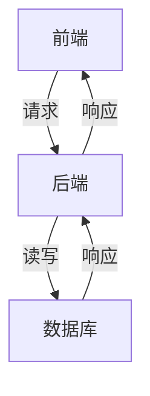

# 连锁店管理系统详细设计与具体代码实现

## 1. 背景介绍

### 1.1 行业现状与挑战
随着零售行业的快速发展，连锁店的管理变得愈加复杂。无论是库存管理、销售数据分析还是客户关系维护，都需要高效、精准的管理工具。传统的手工管理方式已经无法满足现代连锁店的需求，迫切需要一个高效、智能的管理系统来提升运营效率。

### 1.2 连锁店管理系统的意义
连锁店管理系统能够集成多种功能模块，包括库存管理、销售管理、客户管理、供应链管理等。通过信息化手段，连锁店可以实现数据的实时共享和分析，提升决策的科学性和准确性，最终提高整体运营效率和客户满意度。

### 1.3 文章目标
本文将详细介绍连锁店管理系统的设计与实现，从核心概念、算法原理、数学模型、代码实例等多个方面展开，提供一个完整的技术解决方案。

## 2. 核心概念与联系

### 2.1 系统架构
连锁店管理系统的架构设计是整个系统的基础。它通常包括前端、后端和数据库三个部分。前端负责用户交互，后端处理业务逻辑，数据库存储和管理数据。



### 2.2 模块划分
系统的功能模块主要包括库存管理、销售管理、客户管理、供应链管理等。每个模块负责不同的业务逻辑，模块之间通过接口进行数据交互。

### 2.3 数据流与信息交互
系统的数据流主要包括用户请求、业务处理、数据存储和数据展示。信息交互的核心在于如何高效、准确地传递数据，确保各模块之间的数据一致性和完整性。

## 3. 核心算法原理具体操作步骤

### 3.1 库存管理算法
库存管理是连锁店管理系统中的核心模块之一。其主要算法包括库存盘点、补货预测和库存优化。

#### 3.1.1 库存盘点
库存盘点是通过对现有库存进行核对，确保库存数据的准确性。具体步骤如下：
1. 获取当前库存数据。
2. 进行实物盘点，记录实际库存。
3. 比对系统库存与实际库存，生成盘点报告。

#### 3.1.2 补货预测
补货预测是根据历史销售数据和当前库存情况，预测未来的库存需求。主要步骤包括：
1. 收集历史销售数据。
2. 进行数据清洗和预处理。
3. 使用时间序列分析方法进行预测。

#### 3.1.3 库存优化
库存优化是通过优化库存结构，降低库存成本，提高库存周转率。其主要步骤包括：
1. 分析库存周转率。
2. 识别滞销商品和畅销商品。
3. 调整库存策略，优化库存结构。

### 3.2 销售管理算法
销售管理模块主要包括销售数据分析、销售预测和促销策略优化。

#### 3.2.1 销售数据分析
销售数据分析是通过对销售数据进行多维度分析，挖掘销售规律和趋势。具体步骤如下：
1. 收集销售数据。
2. 进行数据清洗和预处理。
3. 使用数据挖掘技术进行分析。

#### 3.2.2 销售预测
销售预测是根据历史销售数据，预测未来的销售情况。主要步骤包括：
1. 收集历史销售数据。
2. 进行数据清洗和预处理。
3. 使用机器学习算法进行预测。

#### 3.2.3 促销策略优化
促销策略优化是通过分析促销效果，优化促销策略，提高销售业绩。其主要步骤包括：
1. 收集促销数据。
2. 分析促销效果。
3. 优化促销策略。

### 3.3 客户管理算法
客户管理模块主要包括客户分类、客户价值分析和客户关系维护。

#### 3.3.1 客户分类
客户分类是通过对客户数据进行分析，将客户分为不同的类别。具体步骤如下：
1. 收集客户数据。
2. 进行数据清洗和预处理。
3. 使用聚类算法进行分类。

#### 3.3.2 客户价值分析
客户价值分析是通过分析客户的购买行为，评估客户的价值。主要步骤包括：
1. 收集客户购买数据。
2. 进行数据清洗和预处理。
3. 使用RFM模型进行分析。

#### 3.3.3 客户关系维护
客户关系维护是通过多种手段，提高客户满意度和忠诚度。其主要步骤包括：
1. 分析客户需求。
2. 制定客户维护策略。
3. 实施客户维护措施。

## 4. 数学模型和公式详细讲解举例说明

### 4.1 时间序列分析模型
时间序列分析模型是用于库存和销售预测的核心模型之一。常用的时间序列模型包括ARIMA、SARIMA和LSTM等。

#### 4.1.1 ARIMA模型
ARIMA（AutoRegressive Integrated Moving Average）模型是一种常用的时间序列预测模型。其数学表达式为：

$$
Y_t = c + \phi_1 Y_{t-1} + \phi_2 Y_{t-2} + \cdots + \phi_p Y_{t-p} + \epsilon_t + \theta_1 \epsilon_{t-1} + \theta_2 \epsilon_{t-2} + \cdots + \theta_q \epsilon_{t-q}
$$

其中，$Y_t$ 为时间 $t$ 的预测值，$c$ 为常数项，$\phi_i$ 为自回归系数，$\theta_i$ 为移动平均系数，$\epsilon_t$ 为误差项。

#### 4.1.2 SARIMA模型
SARIMA（Seasonal ARIMA）模型是在ARIMA模型的基础上，加入季节性因素的影响。其数学表达式为：

$$
Y_t = c + \phi_1 Y_{t-1} + \phi_2 Y_{t-2} + \cdots + \phi_p Y_{t-p} + \epsilon_t + \theta_1 \epsilon_{t-1} + \theta_2 \epsilon_{t-2} + \cdots + \theta_q \epsilon_{t-q} + \Phi_1 Y_{t-s} + \cdots + \Phi_P Y_{t-sP} + \Theta_1 \epsilon_{t-s} + \cdots + \Theta_Q \epsilon_{t-sQ}
$$

其中，$s$ 为季节周期，$\Phi_i$ 和 $\Theta_i$ 为季节性自回归和移动平均系数。

### 4.2 RFM模型
RFM（Recency, Frequency, Monetary）模型是用于客户价值分析的经典模型。其数学表达式为：

$$
RFM = w_1 R + w_2 F + w_3 M
$$

其中，$R$ 为最近一次购买时间，$F$ 为购买频率，$M$ 为购买金额，$w_1, w_2, w_3$ 为权重系数。

### 4.3 聚类算法
聚类算法是用于客户分类的常用算法之一。常用的聚类算法包括K-means、层次聚类等。

#### 4.3.1 K-means算法
K-means算法是一种基于距离的聚类算法。其主要步骤包括：
1. 初始化 $K$ 个聚类中心。
2. 计算每个数据点到聚类中心的距离，将数据点分配到最近的聚类中心。
3. 更新聚类中心，计算新聚类中心为所有分配到该聚类的数据点的平均值。
4. 重复步骤2和3，直到聚类中心不再变化。

其数学表达式为：

$$
J = \sum_{i=1}^{K} \sum_{j=1}^{n_i} \| x_j^i - \mu_i \|^2
$$

其中，$J$ 为目标函数，$K$ 为聚类数，$n_i$ 为第 $i$ 个聚类中的数据点数，$x_j^i$ 为第 $i$ 个聚类中的第 $j$ 个数据点，$\mu_i$ 为第 $i$ 个聚类的中心。

## 5. 项目实践：代码实例和详细解释说明

### 5.1 系统架构设计
在实际项目中，系统架构的设计至关重要。我们采用前后端分离的架构，前端使用React，后端使用Spring Boot，数据库使用MySQL。

```mermaid
graph TD;
    A[React前端] -->|请求| B