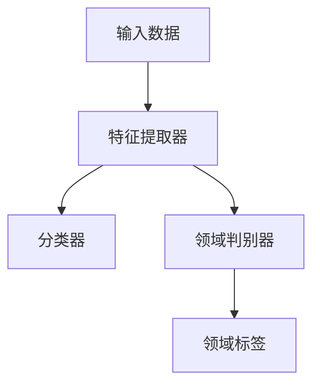

# 逆向梯度：DANN的核心奥秘

作者：禅与计算机程序设计艺术

## 1.背景介绍

### 1.1 领域介绍

在当今的人工智能和机器学习领域，跨领域适应性（Domain Adaptation）成为了一个至关重要的研究方向。跨领域适应性旨在解决训练数据和测试数据分布不同的问题，这在实际应用中非常常见。传统的机器学习模型在面对这种分布差异时往往表现不佳，因为它们假设训练数据和测试数据来自相同的分布。

### 1.2 问题定义

跨领域适应性问题的核心在于如何利用源领域的数据来提升目标领域的性能。具体来说，假设我们有一个源领域数据集 $D_s$ 和一个目标领域数据集 $D_t$，这两个数据集分别来自不同的分布。我们的目标是训练一个模型，使其在目标领域 $D_t$ 上表现良好，即使它主要是用源领域 $D_s$ 训练的。

### 1.3 DANN简介

Domain-Adversarial Neural Network（DANN）是一种解决跨领域适应性问题的有效方法。它通过引入逆向梯度的机制，使得模型能够学习到领域不变的特征，从而在目标领域上表现良好。DANN 的核心思想是利用对抗训练，使得特征提取器无法区分源领域和目标领域的数据分布。

## 2.核心概念与联系

### 2.1 逆向梯度

逆向梯度是 DANN 的核心机制，通过在训练过程中反转梯度的方向，使得特征提取器学习到领域不变的特征。这一机制的实现依赖于梯度反转层（Gradient Reversal Layer, GRL），它在前向传播时表现为恒等映射，而在反向传播时将梯度乘以一个负常数。

### 2.2 对抗训练

对抗训练是 DANN 的另一个重要组成部分，通过引入一个领域判别器（Domain Discriminator）来区分数据来自源领域还是目标领域。特征提取器和领域判别器之间的关系是对抗的，即特征提取器试图欺骗领域判别器，使其无法区分数据的来源。

### 2.3 特征提取器

特征提取器是 DANN 的核心组件之一，它负责从输入数据中提取特征。通过逆向梯度和对抗训练，特征提取器能够学习到领域不变的特征，从而在目标领域上表现良好。

### 2.4 分类器

分类器是 DANN 的最终输出层，负责对提取到的特征进行分类。在训练过程中，分类器和特征提取器共同优化，以确保模型在源领域和目标领域上都能表现良好。

## 3.核心算法原理具体操作步骤

### 3.1 数据预处理

在开始训练之前，需要对源领域和目标领域的数据进行预处理。常见的预处理步骤包括数据清洗、标准化和特征工程等。

### 3.2 模型架构设计

DANN 的模型架构包括三个主要部分：特征提取器、分类器和领域判别器。特征提取器负责从输入数据中提取特征，分类器对提取到的特征进行分类，而领域判别器则用于区分数据的来源。



### 3.3 训练过程

训练过程包括以下几个步骤：

1. **前向传播**：将输入数据通过特征提取器，得到特征表示。然后将特征表示分别输入到分类器和领域判别器，得到分类结果和领域判别结果。

2. **计算损失**：计算分类损失和领域判别损失。分类损失用于优化分类器和特征提取器，而领域判别损失用于优化领域判别器。

3. **反向传播**：通过梯度反转层反转领域判别损失的梯度，使得特征提取器能够学习到领域不变的特征。

4. **参数更新**：根据计算得到的梯度更新模型参数。

### 3.4 损失函数

DANN 的损失函数由两个部分组成：分类损失和领域判别损失。分类损失用于优化分类器和特征提取器，而领域判别损失通过梯度反转层反转后用于优化特征提取器。

$$
L = L_{cls} + \lambda L_{dom}
$$

其中，$L_{cls}$ 是分类损失，$L_{dom}$ 是领域判别损失，$\lambda$ 是一个权重参数，用于平衡两个损失。

## 4.数学模型和公式详细讲解举例说明

### 4.1 分类损失

分类损失通常采用交叉熵损失，用于衡量模型的分类性能。假设 $y_i$ 是第 $i$ 个样本的真实标签，$\hat{y}_i$ 是模型的预测概率，则交叉熵损失定义为：

$$
L_{cls} = - \frac{1}{N} \sum_{i=1}^N y_i \log(\hat{y}_i)
$$

### 4.2 领域判别损失

领域判别损失同样采用交叉熵损失，用于衡量领域判别器的性能。假设 $d_i$ 是第 $i$ 个样本的真实领域标签，$\hat{d}_i$ 是领域判别器的预测概率，则领域判别损失定义为：

$$
L_{dom} = - \frac{1}{N} \sum_{i=1}^N d_i \log(\hat{d}_i)
$$

### 4.3 梯度反转层

梯度反转层在前向传播时表现为恒等映射，而在反向传播时将梯度乘以一个负常数 $-\lambda$。假设输入为 $x$，输出为 $y$，则在前向传播时有：

$$
y = x
$$

而在反向传播时有：

$$
\frac{\partial L}{\partial x} = -\lambda \frac{\partial L}{\partial y}
$$

### 4.4 示例说明

假设我们有一个二分类问题，源领域和目标领域的数据分布不同。我们可以通过 DANN 模型来解决这个问题。具体步骤如下：

1. **数据预处理**：对源领域和目标领域的数据进行标准化处理。

2. **模型架构设计**：构建特征提取器、分类器和领域判别器。

3. **训练过程**：通过前向传播计算分类损失和领域判别损失，并通过梯度反转层反向传播梯度，更新模型参数。

4. **模型评估**：在目标领域上评估模型性能。

## 4.项目实践：代码实例和详细解释说明

### 4.1 数据预处理

在实际项目中，数据预处理是至关重要的一步。我们需要对源领域和目标领域的数据进行标准化处理，确保它们在同一尺度上。以下是一个简单的示例代码：

```python
from sklearn.preprocessing import StandardScaler
import numpy as np

# 假设源领域数据和目标领域数据分别存储在源数据和目标数据变量中
source_data = np.random.rand(100, 20)  # 示例数据
target_data = np.random.rand(100, 20)  # 示例数据

# 标准化处理
scaler = StandardScaler()
source_data = scaler.fit_transform(source_data)
target_data = scaler.transform(target_data)
```

### 4.2 模型架构设计

DANN 的模型架构包括特征提取器、分类器和领域判别器。以下是一个简单的 PyTorch 示例代码：

```python
import torch
import torch.nn as nn
import torch.optim as optim

class FeatureExtractor(nn.Module):
    def __init__(self):
        super(FeatureExtractor, self).__init__()
        self.layer = nn.Sequential(
            nn.Linear(20, 50),
            nn.ReLU(),
            nn.Linear(50, 100),
            nn.ReLU()
        )
    
    def forward(self, x):
        return self.layer(x)

class Classifier(nn.Module):
    def __init__(self):
        super(Classifier, self).__init__()
        self.layer = nn.Sequential(
            nn.Linear(100, 2),
            nn.LogSoftmax(dim=1)
        )
    
    def forward(self, x):
        return self.layer(x)

class DomainDiscriminator(nn.Module):
    def __init__(self):
        super(DomainDiscriminator, self).__init__()
        self.layer = nn.Sequential(
            nn.Linear(100, 50),
            nn.ReLU(),
            nn.Linear(50, 2),
            nn.LogSoftmax(dim=1