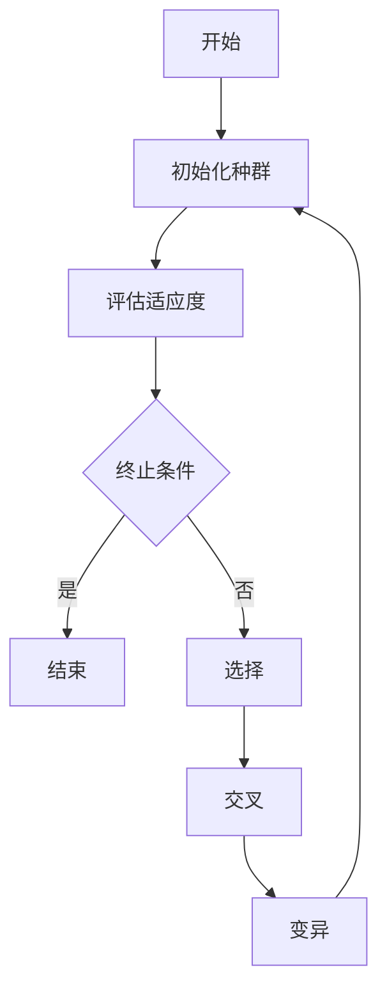

# 遗传算法与机器学习：强强联手

作者：禅与计算机程序设计艺术

## 1. 背景介绍

### 1.1 遗传算法的起源与发展

遗传算法（Genetic Algorithm, GA）是一种基于自然选择和遗传机制的优化算法。它由约翰·霍兰德（John Holland）在20世纪60年代提出，并在其1975年出版的著作《Adaptation in Natural and Artificial Systems》中得到了详细描述。遗传算法模拟生物进化过程，通过选择、交叉和变异等操作，在问题的解空间中逐步逼近最优解。

### 1.2 机器学习的崛起

机器学习（Machine Learning, ML）是人工智能的一个分支，旨在通过数据训练模型，使其能够自动改进和做出预测。自20世纪50年代以来，机器学习经历了多个发展阶段，从早期的感知器模型到如今的深度学习网络，机器学习已经成为解决复杂问题的强大工具。

### 1.3 遗传算法与机器学习的结合

遗传算法和机器学习在解决优化问题和建模复杂系统方面各有优势。将遗传算法引入机器学习，可以在模型参数优化、特征选择和超参数调优等方面发挥重要作用，从而提升机器学习模型的性能和效率。

## 2. 核心概念与联系

### 2.1 遗传算法的基本概念

#### 2.1.1 个体与种群

在遗传算法中，个体（Individual）代表一个潜在解，种群（Population）是由多个个体组成的集合。每个个体由一组编码（通常为二进制串）表示。

#### 2.1.2 适应度函数

适应度函数（Fitness Function）用于评估个体的优劣。适应度值越高，个体在种群中的生存几率越大。

#### 2.1.3 选择、交叉与变异

选择（Selection）操作根据适应度值选择个体进行繁殖；交叉（Crossover）操作将两个个体的部分基因交换产生新个体；变异（Mutation）操作随机改变个体的某些基因，以增加种群的多样性。

### 2.2 机器学习的基本概念

#### 2.2.1 数据与特征

数据是机器学习的基础，特征是数据的属性或表现形式。特征的选择和处理对模型的性能至关重要。

#### 2.2.2 模型与训练

模型是对数据模式的抽象表示，训练是通过数据调整模型参数的过程。常见的机器学习模型包括线性回归、决策树、神经网络等。

#### 2.2.3 评估与验证

评估是衡量模型性能的过程，常用指标包括准确率、精确率、召回率等。验证是通过交叉验证等方法评估模型的泛化能力。

### 2.3 遗传算法与机器学习的联系

#### 2.3.1 参数优化

遗传算法可以用于优化机器学习模型的参数，例如神经网络的权重和偏置。

#### 2.3.2 特征选择

通过遗传算法选择最优特征子集，可以提高模型的性能和计算效率。

#### 2.3.3 超参数调优

遗传算法在超参数调优方面表现出色，可以有效地搜索超参数空间，找到最优配置。

## 3. 核心算法原理具体操作步骤

### 3.1 初始化种群

初始化种群是遗传算法的第一步。通常，通过随机生成或基于先验知识生成一定数量的个体，构成初始种群。



### 3.2 评估适应度

每个个体的适应度由适应度函数计算得到。适应度函数根据问题的具体需求设计，通常反映个体解的优劣。

### 3.3 选择操作

选择操作基于适应度值选择个体进行繁殖。常见的选择方法包括轮盘赌选择、锦标赛选择等。

### 3.4 交叉操作

交叉操作将两个父代个体的部分基因交换，产生新的子代个体。常见的交叉方法有单点交叉、多点交叉和均匀交叉。

### 3.5 变异操作

变异操作随机改变个体的某些基因，以增加种群的多样性，防止陷入局部最优。

### 3.6 终止条件

遗传算法的终止条件可以是达到预设的适应度值、迭代次数或种群多样性等。

## 4. 数学模型和公式详细讲解举例说明

### 4.1 遗传算法的数学模型

遗传算法的数学模型基于进化过程的模拟。假设种群大小为 $N$，每个个体的基因长度为 $L$，则种群可以表示为一个 $N \times L$ 的矩阵。

$$
P = \begin{bmatrix}
p_{11} & p_{12} & \cdots & p_{1L} \\
p_{21} & p_{22} & \cdots & p_{2L} \\
\vdots & \vdots & \ddots & \vdots \\
p_{N1} & p_{N2} & \cdots & p_{NL}
\end{bmatrix}
$$

### 4.2 适应度函数

适应度函数 $f(x)$ 用于评估个体 $x$ 的优劣。适应度值越高，个体在种群中的生存几率越大。

$$
f(x) = \text{objective\_function}(x)
$$

### 4.3 选择操作

选择操作基于适应度值选择个体。轮盘赌选择的概率计算公式为：

$$
P(x_i) = \frac{f(x_i)}{\sum_{j=1}^{N} f(x_j)}
$$

### 4.4 交叉操作

单点交叉操作将两个父代个体的部分基因交换，产生新的子代个体。例如，对于两个个体 $x_1$ 和 $x_2$，在位置 $k$ 处进行交叉：

$$
x_1 = [x_{11}, x_{12}, \cdots, x_{1k}, x_{1(k+1)}, \cdots, x_{1L}] \\
x_2 = [x_{21}, x_{22}, \cdots, x_{2k}, x_{2(k+1)}, \cdots, x_{2L}]
$$

交叉后产生的新个体为：

$$
x_1' = [x_{11}, x_{12}, \cdots, x_{1k}, x_{2(k+1)}, \cdots, x_{2L}] \\
x_2' = [x_{21}, x_{22}, \cdots, x_{2k}, x_{1(k+1)}, \cdots, x_{1L}]
$$

### 4.5 变异操作

变异操作随机改变个体的某些基因。例如，对于个体 $x$ 的第 $i$ 个基因进行变异：

$$
x = [x_1, x_2, \cdots, x_i, \cdots, x_L] \\
x_i' = \text{mutate}(x_i)
$$

变异后的个体为：

$$
x' = [x_1, x_2, \cdots, x_i', \cdots, x_L]
$$

## 5. 项目实践：代码实例和详细解释说明

### 5.1 遗传算法实现

下面是一个简单的遗传算法实现，用于解决一个优化问题。

```python
import numpy as np
import random

# 适应度函数
def fitness_function(individual):
    return sum(individual)

# 初始化种群
def initialize_population(pop_size, gene_length):
    return np.random.randint(2, size=(pop_size, gene_length))

# 选择操作
def selection(population, fitnesses):
    total_fitness = sum(fitnesses)
    probabilities = [f/total_fitness for f in fitnesses]
    selected_index = np.random.choice(range(len(population)), p=probabilities)
    return population[selected_index]

# 交叉操作
def crossover(parent1, parent2):
    crossover_point = random.randint(1, len(parent1)-1)
    child1 = np.concatenate([parent1[:crossover_point], parent2