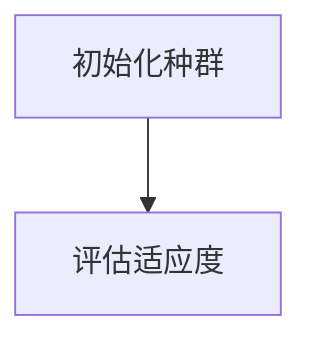
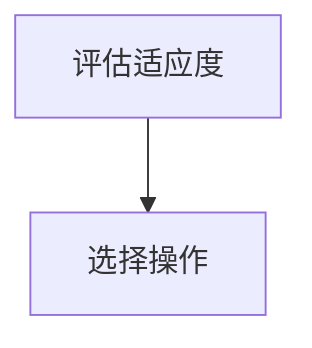
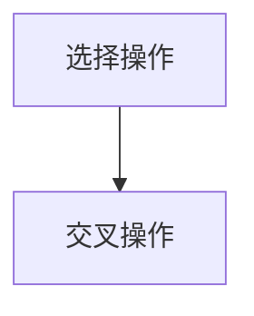
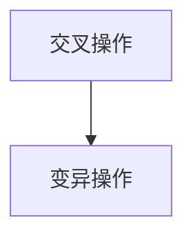
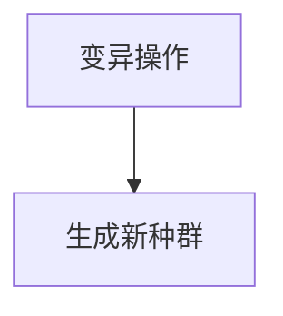
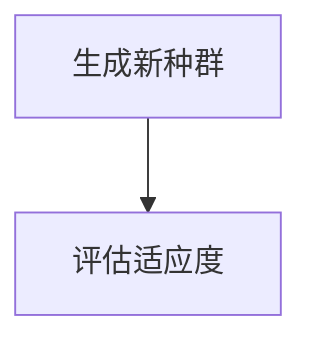
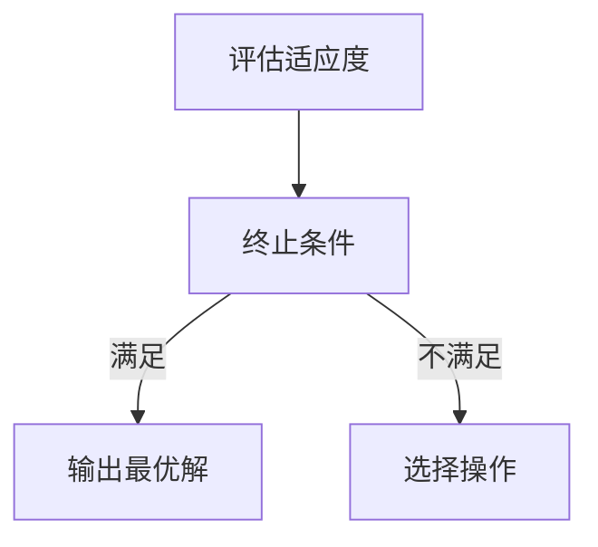

# 遗传算法社区：与全球开发者交流学习

作者：禅与计算机程序设计艺术

## 1.背景介绍

### 1.1 遗传算法的起源

遗传算法（Genetic Algorithm，GA）是一种基于自然选择和遗传机制的优化算法。它起源于20世纪70年代，由美国密歇根大学的John Holland教授提出。Holland教授从生物进化的角度出发，试图通过模拟自然界的进化过程来解决复杂的优化问题。

### 1.2 遗传算法的基本思想

遗传算法的基本思想是通过模拟自然选择和遗传机制，逐步逼近最优解。具体来说，它通过选择、交叉和变异等操作，生成新的候选解，并逐步优化这些候选解。遗传算法具有全局搜索能力，能够在复杂的搜索空间中找到全局最优解。

### 1.3 遗传算法的应用领域

遗传算法在许多领域得到了广泛应用，包括但不限于：

- 工程优化
- 机器学习
- 数据挖掘
- 生物信息学
- 金融建模
- 物流和供应链管理

在这些领域中，遗传算法被用来解决各种复杂的优化问题，如函数优化、路径规划、特征选择等。

## 2.核心概念与联系

### 2.1 个体与种群

在遗传算法中，个体（Individual）是问题的一个候选解，通常表示为一个字符串或数组。种群（Population）是由多个个体组成的集合。种群的规模通常是固定的，一个种群中的个体数量称为种群规模。

### 2.2 适应度函数

适应度函数（Fitness Function）是用来评估个体优劣的函数。适应度函数的值越高，表示个体越优越。在优化问题中，适应度函数通常是目标函数或目标函数的变形。

### 2.3 选择操作

选择操作（Selection）是从种群中选择个体参与交叉和变异的过程。常用的选择方法包括轮盘赌选择、锦标赛选择和排序选择等。

### 2.4 交叉操作

交叉操作（Crossover）是将两个个体的部分基因交换，生成新的个体的过程。常用的交叉方法包括单点交叉、多点交叉和均匀交叉等。

### 2.5 变异操作

变异操作（Mutation）是随机改变个体基因的过程。变异操作可以增加种群的多样性，防止算法陷入局部最优解。常用的变异方法包括位变异和交换变异等。

### 2.6 进化过程

遗传算法的进化过程包括初始化种群、评估适应度、选择、交叉、变异和生成新种群等步骤。这个过程会不断重复，直到满足终止条件为止。

## 3.核心算法原理具体操作步骤

### 3.1 初始化种群

首先，随机生成一个初始种群。种群中的每个个体都是问题的一个候选解。



### 3.2 评估适应度

然后，计算种群中每个个体的适应度值。适应度值越高，表示个体越优越。



### 3.3 选择操作

根据适应度值，从种群中选择个体参与交叉和变异操作。选择方法可以是轮盘赌选择、锦标赛选择等。



### 3.4 交叉操作

对选择出的个体进行交叉操作，生成新的个体。交叉方法可以是单点交叉、多点交叉等。



### 3.5 变异操作

对交叉生成的新个体进行变异操作，随机改变个体的基因。变异方法可以是位变异、交换变异等。



### 3.6 生成新种群

将变异后的个体加入新种群中，形成新的种群。



### 3.7 终止条件

判断是否满足终止条件。如果满足，则输出最优解；否则，重复上述步骤。



## 4.数学模型和公式详细讲解举例说明

### 4.1 适应度函数

适应度函数 $f(x)$ 是用来评估个体优劣的函数。对于一个优化问题，适应度函数通常是目标函数 $g(x)$ 或目标函数的变形。

$$
f(x) = g(x)
$$

### 4.2 选择操作

选择操作的目的是根据适应度值，从种群中选择个体参与交叉和变异。常用的选择方法包括轮盘赌选择（Roulette Wheel Selection）、锦标赛选择（Tournament Selection）等。

#### 4.2.1 轮盘赌选择

轮盘赌选择的概率 $p_i$ 与个体的适应度值 $f_i$ 成正比。

$$
p_i = \frac{f_i}{\sum_{j=1}^{N} f_j}
$$

其中，$N$ 是种群规模。

### 4.3 交叉操作

交叉操作是将两个个体的部分基因交换，生成新的个体。常用的交叉方法包括单点交叉（Single Point Crossover）、多点交叉（Multi Point Crossover）等。

#### 4.3.1 单点交叉

假设两个个体 $P_1$ 和 $P_2$ 的基因表示为：

$$
P_1 = (x_1, x_2, \ldots, x_i, \ldots, x_n)
$$

$$
P_2 = (y_1, y_2, \ldots, y_i, \ldots, y_n)
$$

在位置 $i$ 处进行交叉，生成两个新的个体 $C_1$ 和 $C_2$：

$$
C_1 = (x_1, x_2, \ldots, x_i, y_{i+1}, \ldots, y_n)
$$

$$
C_2 = (y_1, y_2, \ldots, y_i, x_{i+1}, \ldots, x_n)
$$

### 4.4 变异操作

变异操作是随机改变个体基因的过程。常用的变异方法包括位变异（Bit Mutation）、交换变异（Swap Mutation）等。

#### 4.4.1 位变异

假设个体 $P$ 的基因表示为：

$$
P = (x_1, x_2, \ldots, x_i, \ldots, x_n)
$$

在位置 $i$ 处进行变异，将 $x_i$ 变为 $x_i'$：

$$
P' = (x_1, x_2, \ldots, x_i', \ldots, x_n)
$$

### 4.5 进化过程

遗传算法的进化过程可以用以下数学模型表示：

1. 初始化种群 $P(0)$
2. 评估种群 $P(t)$ 的适应度值
3. 选择个体进行交叉和变异，生成新种群 $P(t+1)$
4. 判断是否满足终止条件。如果满足，输出最优解；否则，重复步骤2和3

$$
P(t+1) = \text{Mutation}(\text{Crossover}(\text{Selection}(P(t))))
$$

## 5.项目实践：代码实例和详细解释说明

### 5.1 初始化种群

以下是Python代码实现初始化种群的过程：

```python
import random

def initialize_population(pop_size, gene_length):
    population = []
    for _ in range(pop_size):
        individual = [random.randint(0, 1) for _ in range(gene_length)]
        population.append(individual)
    return population

# 初始化种群
pop_size = 10
gene_length = 8
population = initialize_population(pop_size, gene_length)
print(population)
```

### 5.2 评估