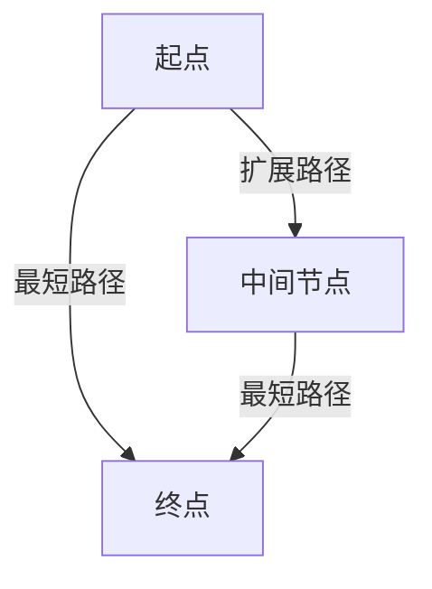
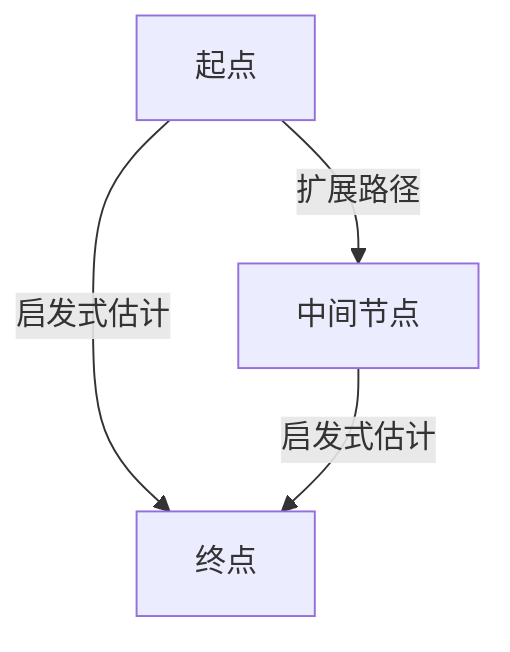

# 邮政编码系统详细设计与具体代码实现

作者：禅与计算机程序设计艺术

## 1. 背景介绍

### 1.1 邮政编码系统的起源与发展

邮政编码系统最早起源于20世纪初，旨在提高邮件投递的效率和准确性。随着全球化进程的加快，各国纷纷建立和完善了自己的邮政编码系统。邮政编码不仅用于邮件投递，还在电子商务、物流管理、地理信息系统等领域发挥着重要作用。

### 1.2 邮政编码系统的作用和意义

邮政编码系统的主要作用是通过编码方式对地理位置进行精确标识，从而提高邮件和包裹的投递效率。它还在以下方面具有重要意义：
- **地理信息系统（GIS）**：邮政编码是地理信息系统中重要的地理标识符。
- **电子商务**：邮政编码帮助电商平台进行物流规划和配送路径优化。
- **数据分析**：在市场分析和人口统计中，邮政编码是重要的数据维度。

### 1.3 设计与实现邮政编码系统的必要性

设计与实现一个高效的邮政编码系统不仅能提升邮件投递效率，还能为物流、电子商务等领域提供数据支持。本文将详细介绍邮政编码系统的设计原理、算法实现、数学模型、实际应用及未来发展趋势。

## 2. 核心概念与联系

### 2.1 邮政编码的基本结构

邮政编码通常由一组数字或字母构成，不同国家的邮政编码结构有所不同。以下是几种常见的邮政编码结构：
- **美国**：5位数字（例如：90210）或9位扩展码（例如：90210-1234）。
- **英国**：字母和数字组合（例如：EC1A 1BB）。
- **中国**：6位数字（例如：100000）。

### 2.2 地理信息系统中的邮政编码

在地理信息系统中，邮政编码作为地理标识符，可以与地理坐标、行政区划等信息关联，形成完整的地理数据模型。这对于地图绘制、路线规划等应用具有重要意义。

### 2.3 邮政编码与物流管理的关系

邮政编码在物流管理中用于优化配送路线、分配物流资源、提高配送效率。通过邮政编码，可以实现精确的地址解析和路径规划，降低物流成本。

## 3. 核心算法原理具体操作步骤

### 3.1 邮政编码生成算法

#### 3.1.1 基于地理坐标的编码方法

基于地理坐标的编码方法是将地理坐标（经纬度）转换为邮政编码。常见的方法有Geohash和Google的Plus Codes。


#### 3.1.2 基于行政区划的编码方法

基于行政区划的编码方法是将行政区划的层级信息转换为邮政编码。例如，省、市、区/县、街道等逐级编码。


### 3.2 邮政编码解析算法

#### 3.2.1 基于正则表达式的解析方法

使用正则表达式解析邮政编码，可以快速提取出邮政编码中的有效信息。例如，解析美国的5位数字邮政编码，可以使用正则表达式 `^\d{5}$`。

#### 3.2.2 基于地理数据库的解析方法

将邮政编码与地理数据库中的地址信息关联，可以实现更为精确的地址解析。例如，利用PostGIS等地理数据库，可以将邮政编码与具体的地理坐标关联。

### 3.3 路径优化算法

#### 3.3.1 Dijkstra算法

Dijkstra算法是一种经典的单源最短路径算法，适用于邮政编码系统中的路径优化。其基本思想是通过逐步扩展已知最短路径的节点，找到从起点到终点的最短路径。



#### 3.3.2 A*算法

A*算法是一种启发式搜索算法，结合了Dijkstra算法的优点和启发式估计，可以更快地找到最优路径。其基本思想是通过启发式函数估计当前节点到终点的代价，从而优先扩展代价较小的路径。



## 4. 数学模型和公式详细讲解举例说明

### 4.1 邮政编码生成的数学模型

#### 4.1.1 Geohash编码模型

Geohash是一种基于空间划分的编码方法，其基本思想是将地理坐标（经纬度）逐步划分为更小的区域，直到达到所需的精度。Geohash编码的过程可以表示为如下数学模型：

$$
\text{Geohash}(lat, lon, precision) = \sum_{i=1}^{precision} \left( \frac{lat_i}{2^i} + \frac{lon_i}{2^i} \right)
$$

其中，$lat_i$ 和 $lon_i$ 分别表示第 $i$ 次划分的纬度和经度。

#### 4.1.2 Plus Codes编码模型

Plus Codes是一种基于网格划分的编码方法，其基本思想是将地球表面划分为一系列网格，每个网格对应一个唯一的编码。Plus Codes编码的过程可以表示为如下数学模型：

$$
\text{PlusCode}(lat, lon, resolution) = \left( \frac{lat}{resolution}, \frac{lon}{resolution} \right)
$$

### 4.2 路径优化的数学模型

#### 4.2.1 Dijkstra算法的数学模型

Dijkstra算法的基本思想是通过逐步扩展已知最短路径的节点，找到从起点到终点的最短路径。其数学模型可以表示为：

$$
d(u, v) = \min_{w \in V} \left( d(u, w) + c(w, v) \right)
$$

其中，$d(u, v)$ 表示从节点 $u$ 到节点 $v$ 的最短路径长度，$c(w, v)$ 表示从节点 $w$ 到节点 $v$ 的路径长度。

#### 4.2.2 A*算法的数学模型

A*算法结合了Dijkstra算法的优点和启发式估计，其数学模型可以表示为：

$$
f(n) = g(n) + h(n)
$$

其中，$f(n)$ 表示节点 $n$ 的总代价，$g(n)$ 表示从起点到节点 $n$ 的实际代价，$h(n)$ 表示从节点 $n$ 到终点的启发式估计代价。

## 5. 项目实践：代码实例和详细解释说明

### 5.1 邮政编码生成代码实例

#### 5.1.1 Geohash编码实现

以下是使用Python实现Geohash编码的代码示例：

```python
import geohash2

def generate_geohash(lat, lon, precision=12):
    return geohash2.encode(lat, lon, precision)

lat = 37.7749
lon = -122.4194
precision = 8
geohash_code = generate_geohash(lat, lon, precision)
print(f"Geohash Code: {geohash_code}")
```

#### 5.1.2 Plus Codes编码实现

以下是使用Python实现Plus Codes编码的代码示例：

```python
import openlocationcode

def generate_plus_code(lat, lon, resolution=10):
    return openlocationcode.encode(lat, lon, resolution)

lat = 37.7749
lon = -122.4194
resolution = 10
plus_code = generate_plus_code(lat, lon, resolution)
print(f"Plus Code: {plus_code}")
```

### 5.2 邮政编码解析代码实例

#### 5.2.1 基于正则表达式的解析实现

以下是使用Python实现基于正则表达式的邮政编码解析的代码示例：

```python
import re

def parse_zip_code(zip_code):
    pattern = re.compile(r'^\d{5}$')
    if pattern.match(zip_code):
        return True
    else:
        return False

zip_code = "90210"
is_valid = parse_zip_code(zip_code)
print(f"Is