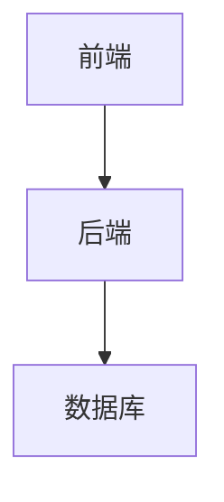

# 酒店管理系统详细设计与具体代码实现

作者：禅与计算机程序设计艺术

## 1. 背景介绍

### 1.1 行业背景

随着旅游业和酒店业的快速发展，酒店管理系统（Hotel Management System, HMS）已经成为现代酒店运营的核心工具。HMS不仅能帮助酒店提高运营效率，还能提升客户满意度，从而在激烈的市场竞争中占据优势。

### 1.2 项目背景

本文将详细介绍一个现代化酒店管理系统的设计与实现。通过该系统，酒店可以实现预订管理、客户管理、房间管理、账单管理等功能。我们将从系统架构、核心算法、代码实现等方面进行全面讲解，力求为读者提供一个完整的解决方案。

### 1.3 目标与意义

设计一个高效、可靠、易于维护的酒店管理系统，能够帮助酒店管理者更好地管理日常运营，提高客户满意度，提升酒店的整体竞争力。

## 2. 核心概念与联系

### 2.1 系统架构

酒店管理系统的架构通常包括前端、后端和数据库三部分。前端负责用户界面的展示和交互，后端处理业务逻辑和数据操作，数据库用于存储系统数据。



### 2.2 主要模块

酒店管理系统主要包括以下模块：

- **预订管理**：处理客户的房间预订请求。
- **客户管理**：管理客户信息和历史记录。
- **房间管理**：管理酒店房间信息，包括状态、类型、价格等。
- **账单管理**：生成和管理客户账单。

### 2.3 模块之间的联系

各模块之间通过API进行交互，前端通过API调用后端服务，后端与数据库进行数据交互。

## 3. 核心算法原理具体操作步骤

### 3.1 预订管理算法

预订管理的核心是房间分配算法，该算法需要考虑房间类型、房间状态、客户要求等因素。

#### 3.1.1 房间分配流程

1. 接收客户预订请求，获取预订信息（入住日期、离开日期、房间类型等）。
2. 查询数据库，获取符合条件的可用房间列表。
3. 根据客户要求排序房间列表，选择最优房间。
4. 更新数据库，标记房间为已预订状态。

### 3.2 客户管理算法

客户管理的核心是客户信息的存储和检索算法。

#### 3.2.1 客户信息存储流程

1. 接收客户信息（姓名、联系方式、身份证号等）。
2. 验证信息的完整性和合法性。
3. 将客户信息存入数据库，生成唯一客户ID。

### 3.3 房间管理算法

房间管理的核心是房间状态更新算法。

#### 3.3.1 房间状态更新流程

1. 接收房间状态更新请求（如入住、退房、维修等）。
2. 查询数据库，获取房间当前状态。
3. 根据请求更新房间状态。
4. 将更新后的状态存入数据库。

### 3.4 账单管理算法

账单管理的核心是账单生成算法。

#### 3.4.1 账单生成流程

1. 接收客户退房请求，获取入住信息（入住日期、离开日期、消费记录等）。
2. 计算总费用，包括房费、其他费用（如餐饮、服务等）。
3. 生成账单，保存到数据库，并返回给客户。

## 4. 数学模型和公式详细讲解举例说明

### 4.1 房间分配算法的数学模型

房间分配问题可以抽象为一个优化问题，目标是找到一个最优房间，使得客户满意度最大化。

假设有 $n$ 个房间，每个房间有一个状态 $s_i$，其中 $s_i \in \{0, 1\}$，0 表示可用，1 表示已预订。客户有 $m$ 个要求，每个要求可以表示为一个约束条件 $c_j$。

我们可以定义一个目标函数 $f(x)$，表示客户满意度，$x$ 表示选择的房间。

$$
f(x) = \sum_{i=1}^{n} w_i \cdot s_i \cdot x_i
$$

其中，$w_i$ 表示房间 $i$ 的权重，$x_i$ 表示房间 $i$ 是否被选择，$x_i \in \{0, 1\}$。

### 4.2 客户信息存储算法的数学模型

客户信息存储可以看作是一个键值对存储问题，使用哈希表可以提高检索效率。

假设有 $n$ 个客户，每个客户有一个唯一ID $k_i$ 和对应的信息 $v_i$。

哈希表的存储过程可以表示为：

$$
H(k_i) = v_i
$$

其中，$H$ 表示哈希函数。

### 4.3 房间状态更新算法的数学模型

房间状态更新可以看作是一个状态转移问题，使用状态转移矩阵可以表示状态的变化。

假设有 $n$ 个房间，每个房间有一个状态 $s_i$，状态转移矩阵 $P$ 表示状态的变化。

$$
s_i(t+1) = P \cdot s_i(t)
$$

其中，$s_i(t)$ 表示房间 $i$ 在时间 $t$ 的状态。

### 4.4 账单生成算法的数学模型

账单生成可以看作是一个费用计算问题，使用加权和可以表示总费用。

假设有 $n$ 项费用，每项费用有一个权重 $w_i$ 和对应的金额 $a_i$。

总费用可以表示为：

$$
T = \sum_{i=1}^{n} w_i \cdot a_i
$$

## 5. 项目实践：代码实例和详细解释说明

### 5.1 预订管理代码实现

以下是一个简单的预订管理代码示例，使用Python和Flask框架实现。

```python
from flask import Flask, request, jsonify
from datetime import datetime

app = Flask(__name__)

# 模拟数据库
rooms = [
    {"id": 1, "type": "single", "status": "available"},
    {"id": 2, "type": "double", "status": "available"},
    {"id": 3, "type": "suite", "status": "available"}
]

@app.route('/book', methods=['POST'])
def book_room():
    data = request.json
    check_in = datetime.strptime(data['check_in'], '%Y-%m-%d')
    check_out = datetime.strptime(data['check_out'], '%Y-%m-%d')
    room_type = data['room_type']
    
    # 查找可用房间
    available_rooms = [room for room in rooms if room['type'] == room_type and room['status'] == 'available']
    
    if available_rooms:
        room = available_rooms[0]
        room['status'] = 'booked'
        return jsonify({"message": "Room booked successfully", "room_id": room['id']})
    else:
        return jsonify({"message": "No available rooms"}), 400

if __name__ == '__main__':
    app.run(debug=True)
```

### 5.2 客户管理代码实现

以下是一个简单的客户管理代码示例，使用Python和Flask框架实现。

```python
from flask import Flask, request, jsonify

app = Flask(__name__)

# 模拟数据库
customers = []

@app.route('/customer', methods=['POST'])
def add_customer():
    data = request.json
    customer = {
        "id": len(customers) + 1,
        "name": data['name'],
        "contact": data['contact'],
        "id_card": data['id_card']
    }
    customers.append(customer)
    return jsonify({"message": "Customer added successfully", "customer_id": customer['id']})

if __name__ == '__main__':
    app.run(debug=True)
```

### 5.3 房间管理代码实现

以下是一个简单的房间管理代码示例，使用Python和Flask框架实现。

```python
from flask import Flask, request, jsonify

app = Flask(__name__)

# 模拟数据库
rooms = [
    {"id": 1, "type": "single", "status": "available"},
    {"id": 2, "type": "double", "status": "available"},
    {"id": 3, "type": "suite", "status": "available"}
]

@app.route('/room/<int:room_id>/status', methods=['PUT'])
def update_room_status(room_id):
    data = request.json
    status = data['status']
    
    for room in rooms:
        if room['id'] == room_id:
            room['status'] = status
            return jsonify({"message": "Room status updated successfully"})
    
    return