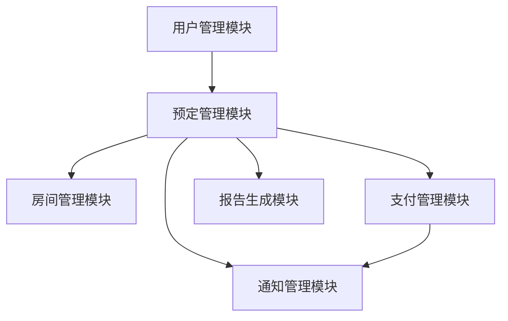

# 酒店预定管理系统详细设计与具体代码实现

作者：禅与计算机程序设计艺术

## 1. 背景介绍

### 1.1 项目背景

随着旅游业和商务出行的不断增长，酒店预定管理系统在现代酒店行业中扮演着至关重要的角色。一个高效、可靠的酒店预定管理系统不仅可以提升酒店的运营效率，还能极大地改善客户的预定体验。

### 1.2 需求分析

在设计和实现酒店预定管理系统之前，我们需要明确系统的核心需求：

1. **用户管理**：支持用户注册、登录、个人信息管理。
2. **房间管理**：包括房间的添加、删除、修改以及查询功能。
3. **预定管理**：用户可以查看房间的可用性并进行预定。
4. **支付系统**：集成支付功能，支持多种支付方式。
5. **通知系统**：预定成功、取消预定等通知功能。
6. **报告生成**：生成每日、每月、每年的预定报告。

### 1.3 技术选型

为了实现上述需求，我们选择以下技术栈进行开发：

- **前端**：React.js
- **后端**：Node.js + Express.js
- **数据库**：MongoDB
- **支付网关**：Stripe
- **通知系统**：Twilio (短信通知)

## 2. 核心概念与联系

### 2.1 系统架构

酒店预定管理系统的整体架构可以分为以下几个模块：

1. **用户管理模块**
2. **房间管理模块**
3. **预定管理模块**
4. **支付管理模块**
5. **通知管理模块**
6. **报告生成模块**

### 2.2 数据模型

系统中的核心数据模型包括：

1. **用户模型**：包含用户的基本信息，如用户名、密码、联系方式等。
2. **房间模型**：包含房间的基本信息，如房间号、类型、价格、状态等。
3. **预定模型**：包含预定的基本信息，如预定编号、用户ID、房间ID、预定时间、状态等。
4. **支付模型**：包含支付的基本信息，如支付编号、预定ID、支付金额、支付状态等。

### 2.3 模块间的联系

各个模块之间的联系可以通过以下Mermaid流程图展示：



## 3. 核心算法原理具体操作步骤

### 3.1 用户注册与登录

用户注册和登录是系统的入口，其核心算法包括用户信息的验证、加密存储以及身份验证。

#### 用户注册步骤

1. 用户提交注册信息。
2. 系统验证信息的有效性（如邮箱格式、密码强度）。
3. 使用bcrypt对密码进行加密存储。
4. 将用户信息保存到数据库中。

#### 用户登录步骤

1. 用户提交登录信息。
2. 系统验证用户信息的有效性。
3. 从数据库中检索用户信息并比较密码（使用bcrypt解密）。
4. 生成JWT（JSON Web Token）作为身份验证的凭证。

### 3.2 房间管理

房间管理包括房间的添加、删除、修改和查询，其核心算法涉及数据库的CRUD操作。

#### 添加房间步骤

1. 管理员提交房间信息。
2. 系统验证信息的有效性。
3. 将房间信息保存到数据库中。

#### 查询房间步骤

1. 用户提交查询条件（如房间类型、价格范围）。
2. 系统从数据库中检索匹配的房间信息。
3. 返回查询结果。

### 3.3 预定管理

预定管理是系统的核心功能，其算法涉及房间的可用性检查、预定信息的保存等。

#### 预定房间步骤

1. 用户选择房间并提交预定请求。
2. 系统检查房间的可用性。
3. 如果房间可用，生成预定信息并保存到数据库中。
4. 更新房间状态为已预定。

### 3.4 支付管理

支付管理涉及支付信息的处理和支付状态的更新。

#### 支付步骤

1. 用户提交支付请求。
2. 系统将支付请求发送到支付网关（如Stripe）。
3. 支付网关处理支付并返回支付结果。
4. 系统根据支付结果更新支付状态。

### 3.5 通知管理

通知管理涉及预定成功、取消预定等通知的发送。

#### 发送通知步骤

1. 预定成功后，系统生成通知信息。
2. 使用Twilio发送短信通知用户。

### 3.6 报告生成

报告生成涉及预定数据的统计和分析。

#### 生成报告步骤

1. 系统从数据库中检索预定数据。
2. 根据预定数据生成统计报告（如每日预定数、月度收入等）。
3. 生成的报告可以导出为Excel或PDF格式。

## 4. 数学模型和公式详细讲解举例说明

### 4.1 预定算法的数学模型

预定算法的核心在于房间可用性的检查，这可以通过集合运算来实现。

假设 $R$ 是所有房间的集合，$B$ 是已预定房间的集合，那么可用房间的集合 $A$ 可以表示为：

$$
A = R - B
$$

### 4.2 预定概率的计算

为了优化预定系统，我们可以引入预定概率的概念。假设某个房间在某个时间段内被预定的概率为 $P$，那么在 $n$ 个时间段内至少一次被预定的概率 $P_n$ 可以表示为：

$$
P_n = 1 - (1 - P)^n
$$

### 4.3 支付成功率的计算

假设支付成功的概率为 $Q$，那么在 $m$ 次支付尝试中至少一次成功的概率 $Q_m$ 可以表示为：

$$
Q_m = 1 - (1 - Q)^m
$$

## 5. 项目实践：代码实例和详细解释说明

### 5.1 用户管理模块代码示例

#### 用户注册代码

```javascript
const bcrypt = require('bcrypt');
const User = require('../models/User');

const registerUser = async (req, res) => {
    const { username, email, password } = req.body;
    
    // 验证信息有效性
    if (!username || !email || !password) {
        return res.status(400).json({ message: 'All fields are required' });
    }

    // 检查用户是否已存在
    const existingUser = await User.findOne({ email });
    if (existingUser) {
        return res.status(400).json({ message: 'User already exists' });
    }

    // 加密密码
    const hashedPassword = await bcrypt.hash(password, 10);

    // 创建新用户
    const newUser = new User({
        username,
        email,
        password: hashedPassword
    });

    // 保存用户信息到数据库
    await newUser.save();

    res.status(201).json({ message: 'User registered successfully' });
};

module.exports = { registerUser };
```

### 5.2 房间管理模块代码示例

#### 添加房间代码

```javascript
const Room = require('../models/Room');

const addRoom = async (req, res) => {
    const { roomNumber, type, price, status } = req.body;

    // 验证信息有效性
    if (!roomNumber || !type || !price || !status) {
        return res.status(400).json({ message: 'All fields are required' });
    }

    // 创建新房间
    const newRoom = new Room({
        roomNumber,
        type,
        price,
        status
    });

    // 保存房间信息到数据库
    await newRoom.save();

    res.status(201).json({ message: 'Room added successfully' });
};

module.exports = { addRoom };
```

### 5.3 预定管理模块代码示例

#### 预定房间代码

```javascript
const Booking = require('../models/Booking');
const Room = require('../models/Room');

const bookRoom = async (req, res) => {
    const { userId, roomId, bookingDate } = req.body;

    // 检查房间可用性
    const room = await Room.findById(roomId);
    if (!room || room.status !== 'available') {
        return res.status(400).json({ message: 'Room not available' });
    }

    // 创建预定信息
    const newBooking = new Booking({
        userId,
        roomId,
        bookingDate,
        status: 'booked'
    });

    // 保存预定信息到数据库
    await newBooking.save();

    // 更新房间状态
   