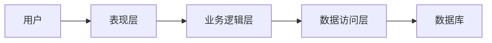

##  酒店预定管理系统详细设计与具体代码实现

作者：禅与计算机程序设计艺术

## 1. 背景介绍

### 1.1 酒店预订管理的现状与挑战

传统的酒店预订管理方式主要依赖于人工操作，例如电话预订、现场登记等。这种方式存在着效率低下、易出错、信息不透明等问题。随着互联网技术的快速发展，越来越多的酒店开始采用在线预订系统来提升管理效率和客户体验。

然而，现有的酒店预订系统也面临着一些挑战，例如：

* **功能单一**: 许多系统只提供基本的预订功能，缺乏对酒店其他业务流程的支持。
* **用户体验不佳**: 部分系统界面设计不合理，操作流程复杂，用户体验不佳。
* **数据安全问题**: 酒店预订系统存储着大量的客户信息，如果系统安全性不足，容易造成数据泄露。

### 1.2 系统目标

为了解决上述问题，本项目将开发一套功能完善、易用性高、安全性强的酒店预订管理系统。具体目标如下：

* **实现酒店客房的在线预订、入住、退房等核心业务流程**
* **提供友好的用户界面，方便用户进行操作**
* **采用安全可靠的技术手段，保障用户数据安全**

## 2. 核心概念与联系

### 2.1 系统用户角色

本系统主要涉及以下用户角色:

* **顾客**: 使用系统进行酒店预订、查询订单、取消订单等操作的用户。
* **酒店管理员**: 负责管理酒店信息、房间类型、价格、订单等信息的管理员用户。
* **系统管理员**: 负责管理系统用户、权限、日志等信息的管理员用户。

### 2.2 核心实体与关系

* **酒店**:  存储酒店的基本信息，例如酒店名称、地址、联系方式、星级等。
* **房间类型**: 存储不同类型房间的信息，例如房间名称、面积、床型、价格等。
* **房间**: 存储每个房间的具体信息，例如房间号、状态（空闲、已预订、已入住）等。
* **订单**: 存储顾客预订房间的信息，例如预订人姓名、联系方式、入住日期、离店日期、房间数量等。
* **支付**: 存储订单的支付信息，例如支付方式、支付金额、支付状态等。

### 2.3 系统架构

本系统采用经典的三层架构设计，分别为：

* **表现层**: 负责用户界面的展示和用户交互逻辑处理。
* **业务逻辑层**: 负责处理业务逻辑，例如预订房间、查询订单、生成报表等。
* **数据访问层**: 负责与数据库交互，进行数据的增删改查操作。



## 3. 核心算法原理具体操作步骤

### 3.1 预订房间

1. 用户选择入住日期、离店日期、房间类型和数量。
2. 系统根据用户选择的条件查询可用的房间。
3. 如果有可用的房间，系统会显示房间信息和价格，并允许用户选择房间进行预订。
4. 用户确认预订信息后，系统会生成订单，并跳转到支付页面。
5. 用户完成支付后，系统会更新订单状态，并发送确认邮件给用户。

### 3.2 入住登记

1. 用户到达酒店后，出示预订信息。
2. 酒店前台人员根据预订信息查询订单。
3. 如果订单有效，酒店前台人员会为用户办理入住手续，并分配房间。

### 3.3 退房结算

1. 用户退房时，酒店前台人员根据房间号查询订单。
2. 酒店前台人员核对用户消费情况，并生成账单。
3. 用户确认账单后，选择支付方式进行支付。
4. 酒店前台人员确认支付成功后，为用户办理退房手续。

## 4. 数学模型和公式详细讲解举例说明

本系统中没有涉及复杂的数学模型和公式。

## 5. 项目实践：代码实例和详细解释说明

### 5.1 技术选型

* **编程语言**: Java
* **数据库**: MySQL
* **Web 框架**: Spring Boot
* **前端框架**: Vue.js

### 5.2 代码实例

**预订房间接口**

```java
@RestController
@RequestMapping("/api/bookings")
public class BookingController {

    @Autowired
    private BookingService bookingService;

    @PostMapping
    public ResponseEntity<Booking> createBooking(@RequestBody BookingRequest bookingRequest) {
        // 校验请求参数
        // ...

        // 调用业务逻辑层创建订单
        Booking booking = bookingService.createBooking(bookingRequest);

        // 返回创建成功的订单信息
        return ResponseEntity.status(HttpStatus.CREATED).body(booking);
    }
}
```

**预订房间服务**

```java
@Service
public class BookingServiceImpl implements BookingService {

    @Autowired
    private BookingRepository bookingRepository;

    @Autowired
    private RoomRepository roomRepository;

    @Override
    public Booking createBooking(BookingRequest bookingRequest) {
        // 查询可用的房间
        List<Room> availableRooms = roomRepository.findAvailableRooms(
                bookingRequest.getCheckInDate(),
                bookingRequest.getCheckOutDate(),
                bookingRequest.getRoomTypeId()
        );

        // 如果有可用的房间，则创建订单
        if (!availableRooms.isEmpty()) {
            // 创建订单对象
            Booking booking = new Booking();
            // 设置订单信息
            // ...

            // 保存订单到数据库
            bookingRepository.save(booking);

            return booking;
        } else {
            // 抛出异常，提示用户没有可用的房间
            throw new NoAvailableRoomException();
        }
    }
}
```

## 6. 实际应用场景

* **连锁酒店**: 可以使用本系统管理多个酒店的预订信息。
* **单体酒店**: 可以使用本系统提升酒店的管理效率和客户体验。
* **民宿**: 可以使用本系统为顾客提供在线预订服务。

## 7. 工具和资源推荐

* **IntelliJ IDEA**: 一款功能强大的 Java 集成开发环境。
* **Navicat**: 一款数据库管理工具，支持 MySQL、PostgreSQL 等多种数据库。
* **Postman**: 一款 API 测试工具，可以方便地测试 RESTful API。

## 8. 总结：未来发展趋势与挑战

### 8.1 未来发展趋势

* **个性化推荐**: 根据用户的历史预订信息和偏好，为用户推荐更合适的酒店和房间。
* **智能客服**: 使用人工智能技术，为用户提供 24 小时在线客服服务。
* **大数据分析**: 收集和分析用户预订数据，为酒店经营决策提供数据支持。

### 8.2 面临的挑战

* **数据安全**: 随着酒店预订系统存储的数据越来越敏感，数据安全问题将更加突出。
* **用户隐私**: 如何在收集和使用用户数据的同时，保护用户隐私是一个需要重点关注的问题。
* **技术更新**: 酒店预订系统需要不断更新技术，以适应不断变化的市场需求。

## 9. 附录：常见问题与解答

### 9.1 如何修改订单信息？

用户可以在预订成功后的一段时间内修改订单信息，例如入住日期、离店日期、房间类型等。具体操作步骤如下：

1. 登录酒店预订系统。
2. 在“我的订单”页面找到需要修改的订单。
3. 点击“修改订单”按钮，进入订单修改页面。
4. 修改订单信息后，点击“确认修改”按钮即可。

### 9.2 如何取消订单？

用户可以在预订成功后的一段时间内取消订单。具体操作步骤如下：

1. 登录酒店预订系统。
2. 在“我的订单”页面找到需要取消的订单。
3. 点击“取消订单”按钮。
4. 系统会根据酒店的取消政策计算退款金额，并将退款原路返回至用户支付账户。
