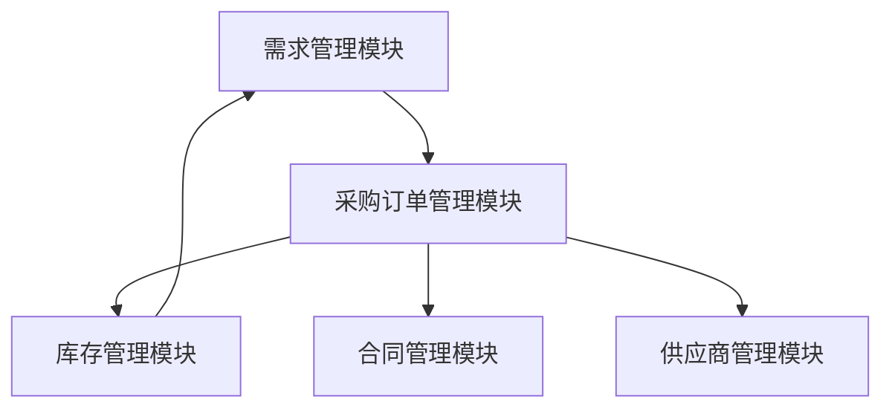
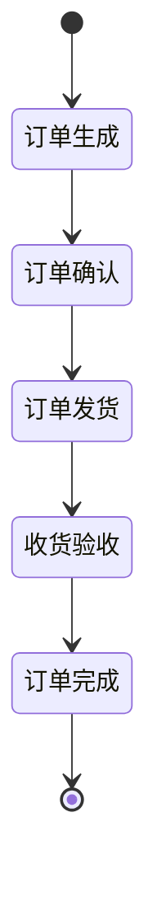

# 采购系统详细设计与具体代码实现

作者：禅与计算机程序设计艺术

## 1. 背景介绍

### 1.1 采购系统的定义与重要性

采购系统是企业管理中不可或缺的一部分。它不仅负责物资的采购，还涉及到供应商管理、库存管理、合同管理等多个环节。一个高效的采购系统可以大大提高企业的运营效率，降低成本，增强竞争力。

### 1.2 传统采购系统的局限性

传统的采购系统通常依赖于手工操作和纸质文档，这不仅效率低下，还容易出现错误。信息的传递速度慢，数据的准确性和及时性得不到保障，导致企业在采购决策上存在滞后性和不准确性。

### 1.3 现代采购系统的必要性

随着信息技术的发展，现代采购系统逐渐向电子化、自动化、智能化方向发展。通过信息系统的支持，企业可以实现采购过程的全程监控和管理，提高采购效率，降低采购成本，增强企业的市场竞争力。

## 2. 核心概念与联系

### 2.1 采购流程概述

采购流程通常包括需求识别、供应商选择、采购订单管理、收货与验收、付款等环节。每个环节都有其独特的业务逻辑和操作流程。

### 2.2 采购系统的主要模块

一个完整的采购系统通常包括以下几个主要模块：

- **需求管理模块**：用于管理企业内部的采购需求。
- **供应商管理模块**：用于管理供应商信息和评估供应商绩效。
- **采购订单管理模块**：用于生成、管理和跟踪采购订单。
- **库存管理模块**：用于管理采购物资的库存情况。
- **合同管理模块**：用于管理采购合同的签订和执行情况。

### 2.3 模块间的联系

各个模块之间存在紧密的联系和数据交互。例如，需求管理模块生成的采购需求会传递到采购订单管理模块，采购订单管理模块生成的订单信息会传递到库存管理模块，库存管理模块的库存信息会反馈到需求管理模块，形成一个闭环管理体系。



## 3. 核心算法原理具体操作步骤

### 3.1 需求识别算法

需求识别是采购流程的起点，通过对企业内部各个部门的需求进行收集和分析，生成采购需求。需求识别算法的核心是需求预测和需求合并。

#### 3.1.1 需求预测

需求预测是通过历史数据和统计模型，对未来的需求进行预测。常用的方法有时间序列分析、回归分析等。

$$
\hat{Y}(t) = \alpha + \beta t + \epsilon
$$

其中，$\hat{Y}(t)$ 是预测的需求量，$t$ 是时间，$\alpha$ 和 $\beta$ 是模型参数，$\epsilon$ 是误差项。

#### 3.1.2 需求合并

需求合并是将不同部门的相似需求进行合并，生成统一的采购需求。合并算法的核心是相似性度量和聚类分析。

$$
d(i,j) = \sqrt{\sum_{k=1}^n (x_{ik} - x_{jk})^2}
$$

其中，$d(i,j)$ 是需求 $i$ 和需求 $j$ 之间的距离，$x_{ik}$ 和 $x_{jk}$ 是需求 $i$ 和需求 $j$ 在第 $k$ 个维度上的值。

### 3.2 供应商选择算法

供应商选择是采购流程中的关键环节，通过对供应商的评估和筛选，选择最优的供应商。常用的方法有层次分析法（AHP）、数据包络分析（DEA）等。

#### 3.2.1 层次分析法（AHP）

层次分析法是通过构建层次结构模型，对各个因素进行两两比较，计算权重，最终选择最优方案。

$$
A = \begin{bmatrix}
1 & a_{12} & \cdots & a_{1n} \\
\frac{1}{a_{12}} & 1 & \cdots & a_{2n} \\
\vdots & \vdots & \ddots & \vdots \\
\frac{1}{a_{1n}} & \frac{1}{a_{2n}} & \cdots & 1
\end{bmatrix}
$$

其中，$A$ 是两两比较矩阵，$a_{ij}$ 是第 $i$ 个因素与第 $j$ 个因素的相对重要性。

#### 3.2.2 数据包络分析（DEA）

数据包络分析是通过构建多输入多输出的线性规划模型，对各个供应商进行效率评估，选择最优供应商。

$$
\max \theta = \sum_{r=1}^s u_r y_{rj}
$$

其中，$\theta$ 是效率值，$u_r$ 是输出权重，$y_{rj}$ 是第 $j$ 个供应商的第 $r$ 个输出。

### 3.3 采购订单管理算法

采购订单管理是采购流程中的核心环节，通过对采购订单的生成、管理和跟踪，实现采购过程的全程监控。常用的方法有订单生成算法、订单跟踪算法等。

#### 3.3.1 订单生成算法

订单生成是根据采购需求和供应商信息，生成采购订单。订单生成算法的核心是订单匹配和优化。

$$
\min Z = \sum_{i=1}^n \sum_{j=1}^m c_{ij} x_{ij}
$$

其中，$Z$ 是总成本，$c_{ij}$ 是第 $i$ 个需求与第 $j$ 个供应商的匹配成本，$x_{ij}$ 是匹配决策变量。

#### 3.3.2 订单跟踪算法

订单跟踪是对采购订单的执行情况进行跟踪和监控。常用的方法有状态机模型、事件驱动模型等。



## 4. 数学模型和公式详细讲解举例说明

### 4.1 需求预测模型

需求预测是采购系统中的关键环节，通过对历史数据和统计模型的分析，预测未来的需求。这里我们以时间序列分析为例，详细讲解需求预测模型的构建过程。

#### 4.1.1 时间序列分析

时间序列分析是通过对时间序列数据的分析，构建预测模型，预测未来的需求。常用的方法有移动平均法、指数平滑法、ARIMA模型等。

$$
Y(t) = \alpha + \beta t + \epsilon
$$

其中，$Y(t)$ 是时间 $t$ 的需求量，$\alpha$ 和 $\beta$ 是模型参数，$\epsilon$ 是误差项。

#### 4.1.2 移动平均法

移动平均法是通过对历史数据的移动平均，平滑时间序列数据，预测未来的需求。

$$
\hat{Y}(t) = \frac{1}{n} \sum_{i=0}^{n-1} Y(t-i)
$$

其中，$\hat{Y}(t)$ 是时间 $t$ 的预测需求量，$Y(t-i)$ 是时间 $t-i$ 的实际需求量，$n$ 是移动平均的窗口大小。

#### 4.1.3 指数平滑法

指数平滑法是通过对历史数据的指数加权平均，平滑时间序列数据，预测未来的需求。

$$
\hat{Y}(t) = \alpha Y(t-1) + (1-\alpha) \hat{Y}(t-1)
$$

其中，$\hat{Y}(t)$ 是时间 $t$ 的预测需求量，$Y(t-1)$ 是时间 $t-1$ 的实际需求量，$\alpha$ 是平滑系数。

### 4.2 供应商选择模型

供应商选择是采购系统中的关键环节，通过对供应商的评估和筛选，选择最优的供应商。这里我们以层次分析法为例，详细讲解供应商选择模型的构建过程。

#### 4.2.1 层次结构模型

层次结构模型是通过构建层次结构，对各个因素进行两两比较，计算权重，最终选择最优方案。

```mermaid
graph TD
    A[目标] --> B1[因素1]
   