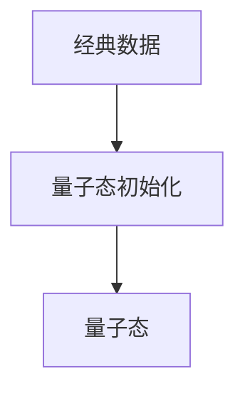

# 量子机器学习原理与代码实战案例讲解

作者：禅与计算机程序设计艺术

## 1.背景介绍

### 1.1 量子计算的崛起

量子计算是近年来计算机科学领域最令人兴奋的前沿之一。传统计算机基于经典物理学的比特进行计算，而量子计算机则利用量子力学原理，通过量子比特（qubit）进行信息处理。量子计算的潜力在于其能够在某些特定问题上显著超越经典计算机的能力，如因数分解和搜索算法。

### 1.2 机器学习的现状

机器学习（ML）已经成为现代人工智能的核心技术，通过算法和统计模型让计算机系统能够自动学习和改进。当前的机器学习技术在图像识别、自然语言处理和数据预测等领域取得了巨大成功。然而，随着数据量和计算复杂度的增加，经典计算机逐渐面临性能瓶颈。

### 1.3 量子机器学习的兴起

量子机器学习（QML）结合了量子计算和机器学习的优势，试图通过量子计算的强大计算能力来提升机器学习算法的性能。QML不仅有望解决经典计算机无法处理的大规模数据问题，还可能在优化、搜索和模式识别等方面带来革命性突破。

## 2.核心概念与联系

### 2.1 量子比特与经典比特

量子比特是量子计算的基本单元，与经典比特不同，它不仅可以表示0和1，还可以处于叠加态。叠加态允许量子比特同时表示0和1的任意组合，这为量子计算提供了巨大的并行计算能力。

### 2.2 量子纠缠与量子干涉

量子纠缠是量子计算中的另一重要概念，指的是两个或多个量子比特之间存在的一种非经典关联。这种关联使得量子比特之间的状态相互依赖，无论它们相距多远。量子干涉则利用量子态的叠加和相位关系，通过干涉现象来增强正确的计算结果并消除错误的结果。

### 2.3 量子门与量子电路

量子门是量子计算中操作量子比特的基本操作单元，类似于经典计算中的逻辑门。常见的量子门包括Hadamard门、CNOT门和Pauli门等。量子电路则是由一系列量子门组成的，用于实现特定的量子算法。

### 2.4 机器学习中的基本概念

机器学习涉及数据预处理、特征提取、模型训练和评估等多个步骤。常见的机器学习算法包括线性回归、支持向量机、神经网络和决策树等。在量子机器学习中，这些算法需要适应量子计算的特性进行改进和优化。

## 3.核心算法原理具体操作步骤

### 3.1 量子态表示与初始化

在量子机器学习中，首先需要将经典数据转换为量子态。这通常通过量子态初始化来实现，例如将数据编码到量子比特的振幅或相位中。



### 3.2 量子特征映射

量子特征映射是将经典数据映射到高维量子态空间的过程。通过适当的量子门操作，可以实现复杂的非线性映射，从而增强模型的表达能力。

### 3.3 量子模型训练

量子模型训练包括量子态的操作和测量。常见的量子机器学习模型包括量子支持向量机、量子神经网络和量子近邻算法等。训练过程通常涉及量子态的演化和测量结果的反馈。

### 3.4 量子测量与结果解码

量子测量是将量子态转换回经典信息的过程。由于量子态的测量具有随机性，需要多次测量并统计结果来获得可靠的输出。

## 4.数学模型和公式详细讲解举例说明

### 4.1 量子态的数学表示

量子态通常用Dirac符号表示，如 $|\psi\rangle$。一个量子比特的状态可以表示为：

$$
|\psi\rangle = \alpha|0\rangle + \beta|1\rangle
$$

其中， $\alpha$ 和 $\beta$ 是复数，满足归一化条件：

$$
|\alpha|^2 + |\beta|^2 = 1
$$

### 4.2 量子门操作

量子门通过对量子态进行线性变换来实现。Hadamard门（H门）是最常见的量子门之一，其作用是将量子比特置于叠加态：

$$
H|0\rangle = \frac{1}{\sqrt{2}}(|0\rangle + |1\rangle)
$$

$$
H|1\rangle = \frac{1}{\sqrt{2}}(|0\rangle - |1\rangle)
$$

### 4.3 量子支持向量机

量子支持向量机（QSVM）是量子机器学习中的一种重要算法。其基本思想是利用量子态的高维特征空间来实现分类。QSVM的核心是量子核函数，通过量子态的内积来计算相似度：

$$
K(\psi_i, \psi_j) = |\langle \psi_i | \psi_j \rangle|^2
$$

### 4.4 量子神经网络

量子神经网络（QNN）通过量子门和量子态的演化来模拟神经网络的行为。其训练过程涉及量子态的优化和测量结果的反馈。QNN的输出可以表示为：

$$
y = f(W|\psi\rangle)
$$

其中， $W$ 是量子门矩阵， $|\psi\rangle$ 是输入量子态， $f$ 是激活函数。

## 5.项目实践：代码实例和详细解释说明

### 5.1 环境搭建

在进行量子机器学习项目之前，需要搭建量子计算环境。常用的量子计算框架包括IBM Qiskit、Google Cirq和Microsoft Q#等。本文将以Qiskit为例进行代码实战。

### 5.2 数据预处理

首先，我们需要对经典数据进行预处理，并将其转换为量子态。以下是一个简单的例子，将经典数据编码为量子态：

```python
from qiskit import QuantumCircuit, Aer, transpile, assemble
from qiskit.visualization import plot_histogram

# 创建一个量子电路
qc = QuantumCircuit(1)

# 应用Hadamard门，将量子比特置于叠加态
qc.h(0)

# 运行量子电路
simulator = Aer.get_backend('statevector_simulator')
result = simulator.run(transpile(qc, simulator)).result()
statevector = result.get_statevector()

print(statevector)
```

### 5.3 量子特征映射

接下来，我们将经典数据映射到量子态空间。以下是一个简单的量子特征映射示例：

```python
import numpy as np

def feature_map(data):
    qc = QuantumCircuit(len(data))
    for i, x in enumerate(data):
        qc.rx(x, i)
    return qc

# 示例数据
data = np.array([0.5, 1.0, 1.5])
qc = feature_map(data)
qc.draw('mpl')
```

### 5.4 量子模型训练

在量子模型训练阶段，我们将使用量子电路来实现量子支持向量机的训练。以下是一个简单的QSVM训练示例：

```python
from qiskit.circuit.library import ZZFeatureMap
from qiskit_machine_learning.algorithms import QSVC

# 创建量子特征映射
feature_map = ZZFeatureMap(feature_dimension=3, reps=2)

# 创建QSVC模型
qsvc = QSVC(quantum_kernel=feature_map)

# 示例数据和标签
X = np.array([[0, 0, 0], [1, 1, 1], [1, 0, 1], [0, 1, 0]])
y = np.array([0, 1, 1, 0])

# 训练QSVC模型
qsvc.fit(X, y)

# 预测
predictions = qsvc.predict(X)
print(predictions)
```

### 5.5 量子测量与结果解码

最后，我们对量子态进行测量，并解码结果。以下是一个简单的量子测量示例：

```python
qc.measure_all()
result = simulator.run(transpile(qc, simulator)).result()
counts = result.get_counts()

