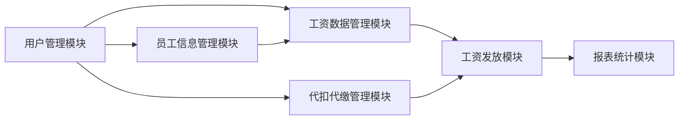

## 1. 背景介绍

### 1.1 工资代发代扣业务概述

在现代企业管理中，工资发放已经成为一项非常重要的工作。传统的工资发放方式效率低下、易出错，而且安全性难以保证。随着信息技术的快速发展，银行代扣代发工资系统应运而生。

银行代扣代发工资系统是指企业委托银行，通过银行网络平台，将员工工资、奖金、补贴等款项，按照人事部门提供的工资清单，直接存入员工指定的银行账户，并代扣代缴个人所得税、社会保险费等款项的一种工资发放方式。

### 1.2 系统建设的必要性

建设银行代扣代发工资系统，对于企业和员工都有着重要的意义：

* **对企业而言:**
    * 提高工资发放效率，降低人工成本；
    * 减少出错率，避免劳资纠纷；
    * 加强资金管理，提高资金使用效率；
    * 提升企业形象，增强员工对企业的信任感。
* **对员工而言:**
    * 工资发放及时准确；
    * 免去排队领工资的烦恼；
    * 可以随时查询工资明细；
    * 提高个人资金安全。

### 1.3 本文研究内容

本文将详细介绍银行代扣代发工资系统的详细设计与具体代码实现，内容涵盖系统需求分析、系统架构设计、数据库设计、核心功能模块设计与实现、系统测试等方面。

## 2. 核心概念与联系

### 2.1 系统用户角色

银行代扣代发工资系统涉及的用户角色主要包括：

* **管理员:** 负责系统管理、用户管理、权限管理等工作。
* **财务人员:** 负责工资数据的导入、审核、发放等工作。
* **员工:**  可以查询自己的工资明细、修改个人信息等。

### 2.2 系统核心功能模块

银行代扣代发工资系统主要包括以下核心功能模块：

* **用户管理模块:**  实现用户注册、登录、权限管理等功能。
* **员工信息管理模块:** 实现员工基本信息的录入、修改、查询等功能。
* **工资数据管理模块:**  实现工资数据的导入、审核、修改、查询等功能。
* **代扣代缴管理模块:** 实现个人所得税、社会保险费等款项的代扣代缴功能。
* **工资发放模块:** 实现工资的自动发放功能。
* **报表统计模块:**  提供各种工资报表，方便管理人员进行统计分析。

### 2.3 模块间联系

下图展示了银行代扣代发工资系统各模块之间的联系：



## 3. 核心算法原理具体操作步骤

### 3.1 工资计算算法

工资计算是银行代扣代发工资系统的核心算法之一，其主要步骤如下：

1. **获取员工基本工资:** 从员工信息表中获取员工的基本工资。
2. **计算应发工资:** 根据考勤数据、绩效考核结果等计算员工的应发工资。
3. **计算代扣代缴金额:** 根据国家相关政策和规定，计算个人所得税、社会保险费等代扣代缴金额。
4. **计算实发工资:**  应发工资减去代扣代缴金额，即为员工的实发工资。

### 3.2 代扣代缴算法

代扣代缴算法主要用于计算个人所得税、社会保险费等代扣代缴金额，其计算方法根据国家相关政策和规定执行。

### 3.3 工资发放流程

工资发放是银行代扣代发工资系统的核心功能之一，其主要流程如下：

1. **财务人员审核工资数据:** 财务人员对导入的工资数据进行审核，确保数据的准确性。
2. **生成代发代扣文件:** 系统根据审核通过的工资数据，生成代发代扣文件。
3. **上传代发代扣文件至银行:** 财务人员将生成的代发代扣文件上传至银行系统。
4. **银行处理代发代扣业务:** 银行系统接收代发代扣文件，并进行相应的处理。
5. **工资发放成功:** 银行将工资发放到员工指定的银行账户，并将发放结果反馈给系统。

## 4. 数学模型和公式详细讲解举例说明

### 4.1 个人所得税计算公式

$$
\text{个人所得税} = (\text{应纳税所得额} \times \text{适用税率} - \text{速算扣除数})
$$

其中：

* **应纳税所得额** = 应发工资 - 各项免税收入 - 各项扣除
* **适用税率** 根据应纳税所得额确定
* **速算扣除数** 根据适用税率确定

**举例说明:**

假设某员工当月应发工资为10000元，各项免税收入为2000元，各项扣除为3500元，则其应纳税所得额为:

$$
\text{应纳税所得额} = 10000 - 2000 - 3500 = 4500 \text{元}
$$

根据国家税务总局发布的个人所得税税率表，4500元对应的适用税率为3%，速算扣除数为0元，则其个人所得税为：

$$
\text{个人所得税} = (4500 \times 3\% - 0) = 135 \text{元}
$$

### 4.2 社会保险费计算公式

社会保险费包括养老保险、医疗保险、失业保险、工伤保险、生育保险等，其计算公式根据国家和地方政策规定执行。

## 5. 项目实践：代码实例和详细解释说明

### 5.1 技术选型

本项目采用 Spring Boot + MyBatis Plus + MySQL + Vue.js 进行开发。

* **Spring Boot:**  用于快速构建项目框架，简化开发流程。
* **MyBatis Plus:**  用于简化数据库操作，提高开发效率。
* **MySQL:**  用于存储系统数据。
* **Vue.js:**  用于构建前端页面，实现前后端分离。

### 5.2 代码实例

**工资计算代码:**

```java
public BigDecimal calculateSalary(Employee employee, Attendance attendance) {
    // 获取员工基本工资
    BigDecimal baseSalary = employee.getBaseSalary();

    // 计算应发工资
    BigDecimal grossSalary = calculateGrossSalary(baseSalary, attendance);

    // 计算代扣代缴金额
    BigDecimal deduction = calculateDeduction(grossSalary);

    // 计算实发工资
    BigDecimal netSalary = grossSalary.subtract(deduction);

    return netSalary;
}

// 计算应发工资
private BigDecimal calculateGrossSalary(BigDecimal baseSalary, Attendance attendance) {
    // TODO: 根据考勤数据、绩效考核结果等计算员工的应发工资
    return baseSalary;
}

// 计算代扣代缴金额
private BigDecimal calculateDeduction(BigDecimal grossSalary) {
    // TODO: 根据国家相关政策和规定，计算个人所得税、社会保险费等代扣代缴金额
    return BigDecimal.ZERO;
}
```

**代发代扣文件生成代码:**

```java
public void generatePayrollFile(List<Payroll> payrollList) throws IOException {
    // 创建文件
    File file = new File("payroll.txt");

    // 创建 BufferedWriter 对象
    BufferedWriter writer = new BufferedWriter(new FileWriter(file));

    // 循环写入数据
    for (Payroll payroll : payrollList) {
        String line = payroll.getEmployeeId() + "|" + payroll.getSalary();
        writer.write(line);
        writer.newLine();
    }

    // 关闭 BufferedWriter 对象
    writer.close();
}
```

## 6. 实际应用场景

银行代扣代发工资系统适用于各类企事业单位、政府机关、学校等，可以有效提高工资发放效率、降低人工成本、避免劳资纠纷。

## 7. 总结：未来发展趋势与挑战

### 7.1 未来发展趋势

* **智能化:**  随着人工智能技术的不断发展，未来银行代扣代发工资系统将会更加智能化，例如自动识别工资数据、自动审核工资数据等。
* **移动化:**  随着移动互联网的普及，未来银行代扣代发工资系统将会更加移动化，例如员工可以通过手机APP查询工资明细、修改个人信息等。
* **云计算化:**  随着云计算技术的不断发展，未来银行代扣代发工资系统将会更加云计算化，例如系统可以部署在云端，企业无需自己搭建服务器，可以节省成本。

### 7.2 面临的挑战

* **数据安全:**  银行代扣代发工资系统涉及到员工的敏感信息，如何保障数据安全是一个重要的挑战。
* **系统稳定性:**  银行代扣代发工资系统是企业的核心业务系统之一，如何保障系统的稳定运行是一个重要的挑战。
* **政策法规变化:**  国家和地方的政策法规不断变化，如何及时调整系统以适应政策法规的变化是一个重要的挑战。

## 8. 附录：常见问题与解答

### 8.1  问：银行代扣代发工资系统如何保障数据安全？

**答：** 银行代扣代发工资系统可以通过以下措施保障数据安全：

* **数据加密:**  对敏感数据进行加密存储和传输。
* **访问控制:**  严格控制用户对数据的访问权限。
* **安全审计:**  记录用户的操作日志，方便追溯问题。

### 8.2 问：如果银行系统出现故障，如何保证工资的及时发放？

**答：** 可以通过以下措施应对银行系统故障：

* **制定应急预案:**  提前制定好应急预案，明确出现故障时的处理流程。
* **选择备用银行:**  选择多家银行作为备用银行，避免单一银行故障导致工资无法发放。
* **人工发放:**  在紧急情况下，可以采取人工发放的方式，确保工资的及时发放。