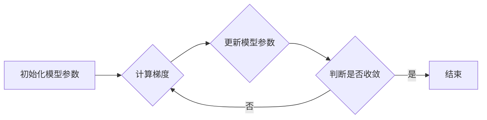

# 随机梯度下降算法在新兴应用领域的探索

作者：禅与计算机程序设计艺术

## 1. 背景介绍

### 1.1. 大数据时代与机器学习的兴起

近年来，随着互联网、物联网等技术的快速发展，全球数据量呈爆炸式增长，我们正迈入一个前所未有的大数据时代。海量的数据蕴藏着巨大的价值，同时也对数据处理和分析技术提出了更高的要求。机器学习作为一种强大的数据分析工具，能够从海量数据中自动学习规律，并对未来做出预测，因此受到了学术界和工业界的广泛关注。

### 1.2. 随机梯度下降算法：机器学习基石

在众多机器学习算法中，梯度下降算法及其变种一直扮演着至关重要的角色。梯度下降算法的基本思想是沿着目标函数梯度的反方向不断迭代更新模型参数，直到找到函数的最小值。然而，传统的梯度下降算法需要计算所有训练样本的梯度，在大规模数据集上效率低下。为了解决这个问题，随机梯度下降（Stochastic Gradient Descent，SGD）算法应运而生。

### 1.3. 随机梯度下降算法的优势与挑战

与传统的梯度下降算法相比，SGD算法每次迭代只随机选择一个或一小批样本进行梯度计算，大大降低了计算复杂度，提高了训练速度。此外，SGD算法还具有一定的逃离局部最优解的能力。然而，SGD算法也面临着一些挑战，例如：

*   **收敛速度较慢：**由于每次迭代只使用少量样本，SGD算法的收敛速度相对较慢，尤其是在接近最优解时容易出现震荡。
*   **对参数敏感：**SGD算法对学习率等超参数较为敏感，需要进行精细的调整才能获得良好的性能。

### 1.4. 本文目标与结构

为了更好地理解和应用SGD算法，本文将深入探讨SGD算法的原理、变种及其在新兴应用领域的探索。本文结构如下：

*   第二章将介绍SGD算法的核心概念和联系，包括梯度下降算法、随机梯度下降算法、学习率、批量大小等。
*   第三章将详细阐述SGD算法的原理和具体操作步骤，并通过图示和示例帮助读者理解。
*   第四章将介绍SGD算法的数学模型和公式，并通过详细的推导和举例说明帮助读者深入理解算法背后的数学原理。
*   第五章将介绍SGD算法的项目实践，包括代码实例和详细解释说明，帮助读者快速上手使用SGD算法解决实际问题。
*   第六章将探讨SGD算法在不同领域的实际应用场景，例如图像识别、自然语言处理、推荐系统等。
*   第七章将推荐一些常用的SGD算法工具和资源，方便读者进行更深入的学习和研究。
*   第八章将总结SGD算法的未来发展趋势与挑战，并对全文进行总结。
*   第九章将列出一些常见问题及其解答，帮助读者解决在学习和应用SGD算法过程中遇到的困惑。

## 2. 核心概念与联系

### 2.1. 梯度下降算法

梯度下降算法是一种迭代优化算法，用于寻找函数的最小值。其基本思想是沿着目标函数梯度的反方向不断迭代更新模型参数，直到找到函数的最小值。

假设我们有一个参数为 $\theta$ 的函数 $J(\theta)$，我们的目标是找到 $\theta$ 的值，使得 $J(\theta)$ 最小。梯度下降算法的迭代公式如下：

$$
\theta_{t+1} = \theta_t - \alpha \nabla J(\theta_t)
$$

其中：

*   $\theta_t$ 表示第 $t$ 次迭代时的参数值；
*   $\alpha$ 表示学习率，控制每次迭代的步长；
*   $\nabla J(\theta_t)$ 表示目标函数 $J(\theta)$ 在 $\theta_t$ 处的梯度。

### 2.2. 随机梯度下降算法

传统的梯度下降算法需要计算所有训练样本的梯度，在大规模数据集上效率低下。为了解决这个问题，随机梯度下降（Stochastic Gradient Descent，SGD）算法应运而生。

SGD算法每次迭代只随机选择一个或一小批样本进行梯度计算，大大降低了计算复杂度，提高了训练速度。SGD算法的迭代公式如下：

$$
\theta_{t+1} = \theta_t - \alpha \nabla J_i(\theta_t)
$$

其中：

*   $J_i(\theta_t)$ 表示随机选择的一个样本或一小批样本的损失函数在 $\theta_t$ 处的梯度。

### 2.3. 学习率

学习率是梯度下降算法中的一个重要超参数，控制每次迭代的步长。学习率过大会导致算法在最优解附近震荡，甚至无法收敛；学习率过小会导致算法收敛速度过慢。

### 2.4. 批量大小

批量大小是指每次迭代时使用的样本数量。批量大小为 1 时，称为随机梯度下降算法；批量大小等于样本总数时，称为批量梯度下降算法；批量大小介于 1 和样本总数之间时，称为小批量梯度下降算法。

## 3. 核心算法原理具体操作步骤

### 3.1. 算法流程图



### 3.2. 算法步骤

1.  **初始化模型参数：**随机初始化模型参数 $\theta_0$。
2.  **计算梯度：**随机选择一个样本或一小批样本，计算损失函数在当前参数值下的梯度 $\nabla J_i(\theta_t)$。
3.  **更新模型参数：**沿着梯度的反方向更新模型参数：$\theta_{t+1} = \theta_t - \alpha \nabla J_i(\theta_t)$。
4.  **判断是否收敛：**判断算法是否收敛，例如损失函数的值是否小于预设的阈值，或者模型参数的变化量是否小于预设的阈值。
5.  **重复步骤 2-4，直到算法收敛。**

## 4. 数学模型和公式详细讲解举例说明

### 4.1. 损失函数

损失函数用于衡量模型预测值与真实值之间的差距。常见的损失函数有：

*   **均方误差（Mean Squared Error，MSE）：**用于回归问题，计算预测值与真实值之间差的平方的平均值。

$$
MSE = \frac{1}{n}\sum_{i=1}^n(y_i - \hat{y}_i)^2
$$

*   **交叉熵（Cross Entropy）：**用于分类问题，衡量预测概率分布与真实概率分布之间的差异。

$$
CE = -\sum_{i=1}^n y_i \log(\hat{y}_i)
$$

### 4.2. 梯度

梯度是指函数在某一点的变化率最快的方向。对于多元函数，梯度是一个向量，每个元素表示函数在该点沿对应变量方向的变化率。

### 4.3. 随机梯度下降算法的数学推导

假设我们有一个参数为 $\theta$ 的损失函数 $J(\theta)$，我们的目标是找到 $\theta$ 的值，使得 $J(\theta)$ 最小。SGD算法的迭代公式如下：

$$
\theta_{t+1} = \theta_t - \alpha \nabla J_i(\theta_t)
$$

其中：

*   $J_i(\theta_t)$ 表示随机选择的一个样本或一小批样本的损失函数在 $\theta_t$ 处的梯度。

我们可以将 $J_i(\theta_t)$ 看作是 $J(\theta_t)$ 的一个无偏估计，即：

$$
E[J_i(\theta_t)] = J(\theta_t)
$$

因此，SGD算法的迭代公式可以看作是在期望意义下沿着目标函数梯度的反方向更新模型参数。

### 4.4. 举例说明

假设我们有一个线性回归模型，其损失函数为均方误差：

$$
J(\theta) = \frac{1}{2m}\sum_{i=1}^m(y_i - \theta^Tx_i)^2
$$

其中：

*   $m$ 表示样本数量；
*   $x_i$ 表示第 $i$ 个样本的特征向量；
*   $y_i$ 表示第 $i$ 个样本的真实标签；
*   $\theta$ 表示模型参数。

随机选择一个样本 $i$，其损失函数的梯度为：

$$
\nabla J_i(\theta) = (y_i - \theta^Tx_i)x_i
$$

因此，SGD算法的迭代公式为：

$$
\theta_{t+1} = \theta_t - \alpha (y_i - \theta_t^Tx_i)x_i
$$

## 5. 项目实践：代码实例和详细解释说明

```python
import numpy as np

# 定义损失函数
def loss_function(X, y, theta):
    m = len(y)
    h = X @ theta
    return (1 / (2 * m)) * np.sum((h - y) ** 2)

# 定义随机梯度下降算法
def stochastic_gradient_descent(X, y, theta, alpha, iterations):
    m = len(y)
    for i in range(iterations):
        for j in range(m):
            # 随机选择一个样本
            random_index = np.random.randint(0, m)
            X_i = X[random_index, :].reshape(1, -1)
            y_i = y[random_index]

            # 计算梯度
            h = X_i @ theta
            gradient = (h - y_i) * X_i.T

            # 更新参数
            theta = theta - alpha * gradient

        # 计算损失函数值
        cost = loss_function(X, y, theta)
        print(f"Iteration {i+1}: Cost = {cost}")

    return theta

# 生成示例数据
X = np.random.rand(100, 2)
y = 2 * X[:, 0] + 3 * X[:, 1] + np.random.randn(100)

# 初始化参数
theta = np.zeros((2, 1))

# 设置学习率和迭代次数
alpha = 0.01
iterations = 100

# 运行随机梯度下降算法
theta = stochastic_gradient_descent(X, y, theta, alpha, iterations)

# 打印最终的参数值
print(f"Final theta: {theta}")
```

**代码解释：**

1.  **导入必要的库：**`numpy` 用于矩阵运算。
2.  **定义损失函数：**`loss_function` 函数计算均方误差。
3.  **定义随机梯度下降算法：**`stochastic_gradient_descent` 函数实现随机梯度下降算法。
    *   **输入：**训练数据 `X`、标签 `y`、初始参数 `theta`、学习率 `alpha`、迭代次数 `iterations`。
    *   **输出：**训练好的参数 `theta`。
    *   **算法步骤：**
        1.  遍历所有迭代次数。
        2.  在每次迭代中，遍历所有样本。
        3.  随机选择一个样本。
        4.  计算梯度。
        5.  更新参数。
        6.  计算损失函数值并打印。
4.  **生成示例数据：**生成一个包含 100 个样本和 2 个特征的随机数据集，并根据线性模型生成对应的标签。
5.  **初始化参数：**将模型参数初始化为零向量。
6.  **设置学习率和迭代次数：**设置学习率为 0.01，迭代次数为 100。
7.  **运行随机梯度下降算法：**调用 `stochastic_gradient_descent` 函数训练模型。
8.  **打印最终的参数值：**打印训练好的参数值。

## 6. 实际应用场景

### 6.1. 图像识别

*   **目标检测：**SGD 算法可以用于训练目标检测模型，例如 Faster R-CNN、YOLO 等。
*   **图像分类：**SGD 算法可以用于训练图像分类模型，例如 ResNet、Inception 等。
*   **图像分割：**SGD 算法可以用于训练图像分割模型，例如 U-Net、SegNet 等。

### 6.2. 自然语言处理

*   **文本分类：**SGD 算法可以用于训练文本分类模型，例如 CNN、RNN 等。
*   **机器翻译：**SGD 算法可以用于训练机器翻译模型，例如 Transformer 等。
*   **语音识别：**SGD 算法可以用于训练语音识别模型，例如 CTC、RNN-T 等。

### 6.3. 推荐系统

*   **协同过滤：**SGD 算法可以用于训练协同过滤模型，例如矩阵分解等。
*   **基于内容的推荐：**SGD 算法可以用于训练基于内容的推荐模型，例如逻辑回归、支持向量机等。

## 7. 工具和资源推荐

*   **TensorFlow：**Google 开源的机器学习框架，提供了丰富的 SGD 算法实现和优化器。
*   **PyTorch：**Facebook 开源的机器学习框架，同样提供了丰富的 SGD 算法实现和优化器。
*   **Scikit-learn：**Python 的机器学习库，包含了 SGD 算法的简单实现。

## 8. 总结：未来发展趋势与挑战

### 8.1. 未来发展趋势

*   **自适应学习率：**自适应学习率算法可以根据训练过程自动调整学习率，例如 Adam、RMSprop 等。
*   **分布式 SGD：**分布式 SGD 算法可以将训练任务分布到多个计算节点上，加速模型训练。
*   **二阶优化方法：**二阶优化方法利用了目标函数的二阶导数信息，可以更快地收敛，例如牛顿法、L-BFGS 等。

### 8.2. 挑战

*   **超参数调整：**SGD 算法对学习率、批量大小等超参数较为敏感，需要进行精细的调整才能获得良好的性能。
*   **局部最优解：**SGD 算法容易陷入局部最优解，尤其是在非凸优化问题中。
*   **收敛速度：**SGD 算法的收敛速度相对较慢，尤其是在接近最优解时容易出现震荡。

## 9. 附录：常见问题与解答

### 9.1. SGD 算法为什么比批量梯度下降算法快？

SGD 算法每次迭代只使用少量样本进行梯度计算，而批量梯度下降算法需要计算所有训练样本的梯度，因此 SGD 算法的计算复杂度更低，训练速度更快。

### 9.2. 如何选择 SGD 算法的学习率？

学习率是 SGD 算法中的一个重要超参数，需要根据具体问题进行调整。一般来说，可以尝试不同的学习率，例如 0.1、0.01、0.001 等，并观察模型的收敛情况。

### 9.3. 如何避免 SGD 算法陷入局部最优解？

避免 SGD 算法陷入局部最优解的方法有很多，例如：

*   **使用随机梯度下降算法：**SGD 算法本身具有一定的逃离局部最优解的能力。
*   **使用动量：**动量可以帮助算法更快地逃离局部最优解。
*   **使用模拟退火算法：**模拟退火算法可以在一定程度上避免算法陷入局部最优解。
