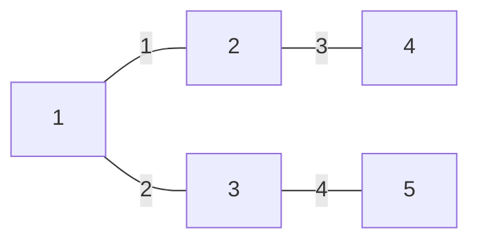

## 1. 背景介绍

### 1.1 从图论到机器学习：标签传播算法的起源

标签传播算法（Label Propagation Algorithm, LPA）是一种基于图论的半监督学习算法，其核心思想是利用已标记节点的标签信息，通过某种方式将标签信息传播到未标记节点，从而实现对未标记节点的分类。

LPA 最早由 Zhu 等人于 2002 年提出，其灵感来源于图论中的随机游走模型。在随机游走模型中，一个粒子从图中的某个节点出发，沿着图的边随机游走，最终停留在某个节点上。LPA 将标签信息看作是粒子，通过模拟粒子在图上的随机游走过程，将标签信息传播到未标记节点。

### 1.2 半监督学习的优势：少量标记数据，高效分类

传统的机器学习算法大多是有监督学习算法，需要大量的已标记数据进行训练。然而，在实际应用中，获取大量的已标记数据往往非常困难且成本高昂。相比之下，半监督学习算法只需要少量的已标记数据，就可以利用未标记数据的信息，提高分类器的性能。

LPA 作为一种半监督学习算法，具有以下优势：

* **少量标记数据：** LPA 只需要少量的已标记数据，就可以实现对未标记数据的分类，大大降低了数据标注的成本。
* **高效性：** LPA 的算法复杂度较低，可以高效地处理大规模数据集。
* **可解释性：** LPA 的算法原理简单易懂，其分类结果具有较高的可解释性。

### 1.3 应用领域：社区发现、文本分类、图像分割

由于其优越的性能和广泛的适用性，LPA 已被广泛应用于各个领域，例如：

* **社区发现：** 利用社交网络中的用户关系，发现用户所属的社区。
* **文本分类：** 利用文本之间的相似度，对文本进行分类。
* **图像分割：** 利用图像像素之间的颜色、纹理等信息，对图像进行分割。


## 2. 核心概念与联系

### 2.1 图：节点、边、权重

LPA 是基于图论的算法，因此在介绍 LPA 之前，我们需要先了解一些图论的基本概念。

* **图：** 由节点和边组成的集合，记作 $G = (V, E)$，其中 $V$ 表示节点集合，$E$ 表示边集合。
* **节点：** 图中的基本单元，代表现实世界中的实体，例如用户、商品、网页等。
* **边：** 连接两个节点的线段，代表节点之间的关系，例如用户之间的朋友关系、商品之间的购买关系、网页之间的链接关系等。
* **权重：** 边上可以赋予一个权重，表示两个节点之间关系的强弱，例如用户之间互动频率、商品之间购买次数、网页之间链接权重等。

### 2.2 随机游走：从概率角度理解标签传播

随机游走模型是 LPA 的核心理念，它模拟了粒子在图上的随机游走过程。

* **随机游走：** 一个粒子从图中的某个节点出发，沿着图的边随机游走，最终停留在某个节点上。
* **转移概率：** 粒子从节点 $i$ 游走到节点 $j$ 的概率，记作 $p_{ij}$，其计算公式为：

$$
p_{ij} = \frac{w_{ij}}{\sum_{k=1}^{n} w_{ik}}
$$

其中，$w_{ij}$ 表示节点 $i$ 和节点 $j$ 之间的边的权重，$n$ 表示图中节点的个数。

### 2.3 标签传播：将标签信息看作粒子

LPA 将标签信息看作是粒子，通过模拟粒子在图上的随机游走过程，将标签信息传播到未标记节点。

* **标签矩阵：** 用一个矩阵 $Y$ 来表示节点的标签信息，其中 $Y_{ij}$ 表示节点 $i$ 属于标签 $j$ 的概率。
* **标签传播：** 在每一轮迭代中，每个节点将其标签信息按照转移概率传播给其邻居节点。
* **标签更新：** 每个节点根据其邻居节点传播过来的标签信息，更新自身的标签信息。


## 3. 核心算法原理具体操作步骤

LPA 的算法流程如下：

1. **初始化：** 
    * 将已标记节点的标签信息初始化为 1，其他节点的标签信息初始化为 0。
    * 计算图的邻接矩阵 $W$，其中 $W_{ij}$ 表示节点 $i$ 和节点 $j$ 之间的边的权重。
    * 计算节点的度矩阵 $D$，其中 $D_{ii}$ 表示节点 $i$ 的度数，其他元素为 0。
    * 计算转移矩阵 $P = D^{-1}W$。
2. **迭代传播：** 
    * 重复以下步骤，直到标签矩阵 $Y$ 收敛：
        * 计算每个节点的邻居节点传播过来的标签信息：$Y' = PY$。
        * 更新每个节点的标签信息：
            * 对于已标记节点，保持其标签信息不变。
            * 对于未标记节点，将其标签信息更新为 $Y'$ 中对应位置的值。
3. **输出结果：** 
    * 将每个节点的标签信息取最大值对应的标签作为该节点的最终标签。

### 3.1 初始化阶段

LPA 的初始化阶段主要完成以下三项工作：

#### 3.1.1 初始化标签矩阵

LPA 是一种半监督学习算法，需要少量的已标记数据进行训练。在初始化阶段，我们需要将已标记节点的标签信息初始化为 1，其他节点的标签信息初始化为 0。

例如，假设我们有一个包含 5 个节点的图，其中节点 1 和节点 3 是已标记节点，其标签分别为 1 和 2，则标签矩阵 $Y$ 初始化如下：

$$
Y = \begin{bmatrix}
1 & 0 \\
0 & 0 \\
0 & 1 \\
0 & 0 \\
0 & 0
\end{bmatrix}
$$

#### 3.1.2 计算邻接矩阵

邻接矩阵 $W$ 用于表示图中节点之间的连接关系。其中，$W_{ij}$ 表示节点 $i$ 和节点 $j$ 之间的边的权重。如果节点 $i$ 和节点 $j$ 之间存在边，则 $W_{ij}$ 等于边的权重；否则，$W_{ij}$ 等于 0。

例如，假设我们有如下所示的图：



则该图的邻接矩阵 $W$ 为：

$$
W = \begin{bmatrix}
0 & 1 & 2 & 0 & 0 \\
1 & 0 & 0 & 3 & 0 \\
2 & 0 & 0 & 0 & 4 \\
0 & 3 & 0 & 0 & 0 \\
0 & 0 & 4 & 0 & 0
\end{bmatrix}
$$

#### 3.1.3 计算度矩阵和转移矩阵

度矩阵 $D$ 是一个对角矩阵，其对角线上的元素表示对应节点的度数。节点的度数是指与其相连的边的数量。

转移矩阵 $P$ 表示粒子从一个节点游走到另一个节点的概率。其计算公式为：

$$
P = D^{-1}W
$$

其中，$D^{-1}$ 表示度矩阵的逆矩阵。

例如，对于上面例子中的图，其度矩阵 $D$ 为：

$$
D = \begin{bmatrix}
3 & 0 & 0 & 0 & 0 \\
0 & 4 & 0 & 0 & 0 \\
0 & 0 & 6 & 0 & 0 \\
0 & 0 & 0 & 3 & 0 \\
0 & 0 & 0 & 0 & 4
\end{bmatrix}
$$

其转移矩阵 $P$ 为：

$$
P = D^{-1}W = \begin{bmatrix}
0 & 1/3 & 2/3 & 0 & 0 \\
1/4 & 0 & 0 & 3/4 & 0 \\
1/3 & 0 & 0 & 0 & 2/3 \\
0 & 3/3 & 0 & 0 & 0 \\
0 & 0 & 2/2 & 0 & 0
\end{bmatrix}
$$

### 3.2 迭代传播阶段

在迭代传播阶段，LPA 算法会重复以下步骤，直到标签矩阵 $Y$ 收敛：

#### 3.2.1 计算邻居节点传播的标签信息

在每一轮迭代中，每个节点都会将其标签信息按照转移概率传播给其邻居节点。具体来说，对于节点 $i$，其邻居节点传播过来的标签信息 $Y'_i$ 可以通过以下公式计算：

$$
Y'_i = \sum_{j=1}^{n} p_{ij}Y_j
$$

其中，$p_{ij}$ 表示节点 $i$ 到节点 $j$ 的转移概率，$Y_j$ 表示节点 $j$ 的标签信息。

#### 3.2.2 更新节点标签信息

在计算出邻居节点传播过来的标签信息后，每个节点需要根据这些信息更新自身的标签信息。

* 对于已标记节点，其标签信息保持不变。
* 对于未标记节点，其标签信息更新为 $Y'$ 中对应位置的值。

例如，假设在某一轮迭代中，标签矩阵 $Y$ 的值为：

$$
Y = \begin{bmatrix}
1 & 0 \\
0.2 & 0.8 \\
0 & 1 \\
0.6 & 0.4 \\
0.5 & 0.5
\end{bmatrix}
$$

则根据上述公式，可以计算出每个节点的邻居节点传播过来的标签信息 $Y'$：

$$
Y' = \begin{bmatrix}
0 & 1/3 & 2/3 & 0 & 0 \\
1/4 & 0 & 0 & 3/4 & 0 \\
1/3 & 0 & 0 & 0 & 2/3 \\
0 & 3/3 & 0 & 0 & 0 \\
0 & 0 & 2/2 & 0 & 0
\end{bmatrix}
\begin{bmatrix}
1 & 0 \\
0.2 & 0.8 \\
0 & 1 \\
0.6 & 0.4 \\
0.5 & 0.5
\end{bmatrix}
=
\begin{bmatrix}
0.2 & 0.8 \\
0.45 & 0.55 \\
0.33 & 0.67 \\
0.6 & 0.4 \\
0 & 1
\end{bmatrix}
$$

然后，根据更新规则，可以更新标签矩阵 $Y$：

$$
Y = \begin{bmatrix}
1 & 0 \\
0.45 & 0.55 \\
0 & 1 \\
0.6 & 0.4 \\
0 & 1
\end{bmatrix}
$$

### 3.3 输出结果

当标签矩阵 $Y$ 收敛后，LPA 算法会将每个节点的标签信息取最大值对应的标签作为该节点的最终标签。

例如，假设最终的标签矩阵 $Y$ 为：

$$
Y = \begin{bmatrix}
1 & 0 \\
0.8 & 0.2 \\
0 & 1 \\
0.9 & 0.1 \\
0 & 1
\end{bmatrix}
$$

则节点 1、2、3、4、5 的最终标签分别为 1、1、2、1、2。


## 4. 数学模型和公式详细讲解举例说明

### 4.1 标签传播的矩阵表示

LPA 算法的标签传播过程可以用矩阵运算来表示。假设 $Y^{(t)}$ 表示第 $t$ 轮迭代后的标签矩阵，则标签传播过程可以表示为：

$$
Y^{(t+1)} = \alpha PY^{(t)} + (1-\alpha)Y^{(0)}
$$

其中，$P$ 表示转移矩阵，$Y^{(0)}$ 表示初始标签矩阵，$\alpha$ 是一个介于 0 和 1 之间的参数，用于控制标签传播的平滑程度。

### 4.2 参数 $\alpha$ 的影响

参数 $\alpha$ 控制着标签传播的平滑程度。当 $\alpha$ 接近 1 时，标签信息更容易在图上传播，分类结果更加平滑；当 $\alpha$ 接近 0 时，标签信息更难传播，分类结果更容易出现“孤岛”现象。

### 4.3 收敛性分析

LPA 算法的收敛性可以通过以下定理来保证：

**定理：** 如果转移矩阵 $P$ 是一个随机矩阵（即每一行的元素之和为 1），则 LPA 算法的标签矩阵 $Y$ 会收敛到一个唯一的解。

### 4.4 举例说明

为了更好地理解 LPA 算法的数学模型，我们举一个简单的例子来说明。

假设我们有一个包含 4 个节点的图，其邻接矩阵为：

$$
W = \begin{bmatrix}
0 & 1 & 1 & 0 \\
1 & 0 & 1 & 1 \\
1 & 1 & 0 & 1 \\
0 & 1 & 1 & 0
\end{bmatrix}
$$

节点 1 和节点 4 的标签已知，分别为 1 和 2。

根据上述公式，我们可以计算出该图的度矩阵 $D$、转移矩阵 $P$ 以及初始标签矩阵 $Y^{(0)}$：

$$
D = \begin{bmatrix}
2 & 0 & 0 & 0 \\
0 & 3 & 0 & 0 \\
0 & 0 & 3 & 0 \\
0 & 0 & 0 & 2
\end{bmatrix}
$$

$$
P = D^{-1}W = \begin{bmatrix}
0 & 1/2 & 1/2 & 0 \\
1/3 & 0 & 1/3 & 1/3 \\
1/3 & 1/3 & 0 & 1/3 \\
0 & 1/2 & 1/2 & 0
\end{bmatrix}
$$

$$
Y^{(0)} = \begin{bmatrix}
1 & 0 \\
0 & 0 \\
0 & 0 \\
0 & 1
\end{bmatrix}
$$

假设 $\alpha = 0.8$，则根据标签传播公式，我们可以计算出第 1 轮迭代后的标签矩阵 $Y^{(1)}$：

$$
Y^{(1)} = 0.8 \begin{bmatrix}
0 & 1/2 & 1/2 & 0 \\
1/3 & 0 & 1/3 & 1/3 \\
1/3 & 1/3 & 0 & 1/3 \\
0 & 1/2 & 1/2 & 0
\end{bmatrix}
\begin{bmatrix}
1 & 0 \\
0 & 0 \\
0 & 0 \\
0 & 1
\end{bmatrix}
+ 0.2
\begin{bmatrix}
1 & 0 \\
0 & 0 \\
0 & 0 \\
0 & 1
\end{bmatrix}
=
\begin{bmatrix}
0.2 & 0 \\
0.07 & 0.07 \\
0.07 & 0.07 \\
0 & 0.2
\end{bmatrix}
$$

同理，我们可以计算出第 2 轮、第 3 轮...迭代后的标签矩阵，直到标签矩阵收敛。


## 5. 项目实践：代码实例和详细解释说明

### 5.1 Python 代码实现

```python
import numpy as np

def label_propagation(W, Y0, alpha=0.8, max_iter=100, tol=1e-4):
    """
    标签传播算法

    参数：
        W：邻接矩阵
        Y0：初始标签矩阵
        alpha：标签传播的平滑程度
        max_iter：最大迭代次数
        tol：收敛阈值

    返回值：
        Y：最终的标签矩阵
    """

    # 计算度矩阵
    D = np.diag(np.sum(W, axis=1))

    # 计算转移矩阵
    P = np.linalg.inv(D) @ W

    # 初始化标签矩阵
    Y = Y0.copy()

    # 迭代传播
    for i in range(max_iter):
        # 保存上一轮迭代的标签矩阵
        Y_prev = Y.copy()

        # 计算邻居节点传播的标签信息
        Y = alpha * P @ Y + (1 - alpha) * Y0

        # 检查是否收敛
        if np.max(np.abs(Y - Y_prev)) < tol:
            break

    return Y
```

### 5.2 代码解释

* `label_propagation` 函数实现了 LPA 算法。
* 函数的参数包括：
    * `W`：邻接矩阵
    * `Y0`：初始标签矩阵
    * `alpha`：标签传播的平滑程度，默认为 0.8
    * `max_iter`：最大迭代次数，默认为 100
    * `tol`：收敛阈值，默认为 1e-4
* 函数的返回值为最终的标签矩阵