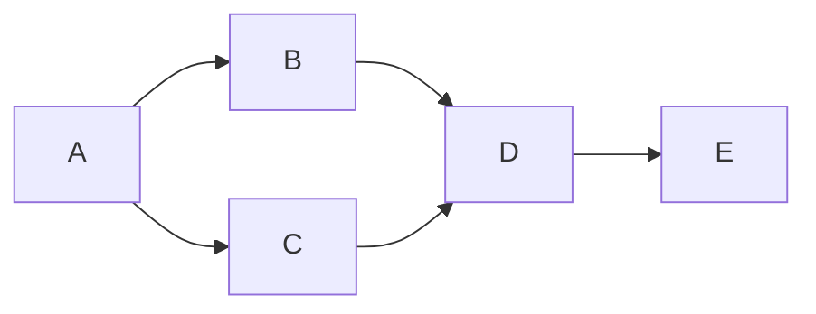

##  需求优先级管理与项目估算原理与代码实战案例讲解

**作者：禅与计算机程序设计艺术**

## 1. 背景介绍

### 1.1 软件项目管理之痛

在软件开发领域，"延期"、"预算超支"、"需求变更" 几乎是每个项目经理挥之不去的梦魇。究其原因，需求管理混乱、项目估算不准确是导致这些问题的根源。

### 1.2 需求优先级管理的重要性

需求优先级管理就是根据项目的战略目标、资源限制、时间安排等因素，对所有需求进行优先级排序，确保团队集中精力完成最重要的任务。有效的需求优先级管理可以帮助团队：

* **集中资源:**  将有限的资源投入到最关键的需求上，避免浪费。
* **降低风险:**  优先处理高风险需求，尽早暴露问题并解决。
* **提高效率:**  明确开发顺序，减少返工和等待时间。
* **提升客户满意度:**  按价值交付产品，满足客户核心需求。

### 1.3 项目估算的必要性

项目估算则是对软件开发工作量、成本、时间等进行预测的过程。准确的项目估算可以帮助团队：

* **制定合理的计划:**  根据估算结果制定可行的开发计划，避免过度承诺。
* **有效地分配资源:**  根据任务的估算工作量，合理分配人力和物力资源。
* **监控项目进度:**  将实际进度与估算结果进行对比，及时发现偏差并调整。
* **提高沟通效率:**  为团队成员、客户和其他利益相关者提供统一的项目预期。

## 2. 核心概念与联系

### 2.1 需求优先级管理

#### 2.1.1 需求分类

* **功能需求:**  描述系统需要实现的功能，例如用户注册、商品浏览、订单支付等。
* **非功能需求:**  描述系统的质量属性，例如性能、安全、可用性、可维护性等。
* **约束:**  限制项目实施的因素，例如时间、成本、技术限制等。

#### 2.1.2 优先级评估方法

* **MoSCoW 法:**  将需求分为必须有 (Must have)、应该有 (Should have)、可以有 (Could have) 和将会有 (Won't have) 四个等级。
* **Kano 模型:**  根据需求对用户满意度的影响，将需求分为基本型需求、期望型需求和兴奋型需求。
* **100 美元测试法:**  让团队成员模拟 100 美元的投资分配，投票决定每个需求的价值。
* **相对排序法:**  两两比较所有需求，确定它们的相对优先级。

#### 2.1.3 需求优先级管理工具

* **Jira:**  流行的项目管理软件，提供需求管理、优先级排序、进度跟踪等功能。
* **Trello:**  基于看板的项目管理工具，可以用于可视化需求优先级和工作流程。
* **Asana:**  团队协作工具，可以用于管理项目、任务和需求。

### 2.2 项目估算

#### 2.2.1 估算方法

* **类比估算:**  参考类似项目的 historical data 进行估算。
* **参数估算:**  根据项目参数（例如代码行数、功能点数量）和历史数据建立数学模型进行估算。
* **三点估算法:**  分别估计最乐观、最悲观和最可能的完成时间，然后计算平均值或加权平均值。
* **扑克估算法:**  团队成员使用扑克牌代表自己的估算值，通过讨论达成共识。

#### 2.2.2 估算单位

* **人天:**  一个人工作一天的工作量。
* **故事点:**  抽象的度量单位，用于表示完成一个用户故事所需的工作量。

#### 2.2.3 影响估算的因素

* **需求的清晰度:**  需求越清晰，估算越准确。
* **团队的经验:**  经验丰富的团队估算更准确。
* **技术的复杂度:**  技术越复杂，估算越困难。
* **外部依赖:**  外部依赖越多，估算越不确定。

## 3. 核心算法原理具体操作步骤

### 3.1 需求优先级管理

#### 3.1.1  MoSCoW 法

1. **确定评估范围:**  明确需要进行优先级评估的需求范围。
2. **解释 MoSCoW 定义:**  向团队成员解释 MoSCoW 四个等级的含义。
3. **独立评估:**  让每个团队成员独立地对需求进行评估，并将其归类到相应的等级。
4. **讨论和达成共识:**  团队成员一起讨论评估结果，解决分歧，最终达成共识。
5. **记录和跟踪:**  记录最终的优先级评估结果，并在项目过程中定期 review 和调整。

#### 3.1.2  100 美元测试法

1. **确定评估范围:**  明确需要进行优先级评估的需求范围。
2. **分配虚拟货币:**  给每个团队成员分配 100 美元的虚拟货币。
3. **独立投资:**  让每个团队成员独立地将虚拟货币投资到各个需求上，表示他们认为需求的价值。
4. **统计结果:**  统计每个需求获得的投资总额，作为需求的优先级排序依据。
5. **讨论和调整:**  团队成员一起讨论投资结果，解释投资理由，并根据需要调整需求的优先级。

### 3.2 项目估算

#### 3.2.1  三点估算法

1. **确定估算目标:**  明确需要进行估算的任务或用户故事。
2. **识别最乐观、最悲观和最可能的完成时间:**  
    * **O:**  最乐观完成时间，即一切顺利的情况下完成任务所需的最短时间。
    * **P:**  最悲观完成时间，即遇到所有可能的问题和风险的情况下完成任务所需的最长时间。
    * **M:**  最可能完成时间，即在正常情况下完成任务所需的时间。
3. **计算预期完成时间 (E) 和标准差 (SD):**
    * **E = (O + 4M + P) / 6**
    * **SD = (P - O) / 6**
4. **确定置信区间:**  根据项目风险偏好，选择合适的置信区间，例如 95% 置信区间为 E ± 1.96SD。

#### 3.2.2  扑克估算法

1. **确定估算目标:**  明确需要进行估算的任务或用户故事。
2. **选择估算单位:**  选择合适的估算单位，例如故事点、人天等。
3. **解释估算规则:**  向团队成员解释扑克估算的规则，例如：
    * 每个人选择一张扑克牌，代表自己对任务工作量的估算值。
    * 所有成员同时亮牌。
    * 如果估算值差异较大，则进行讨论，解释估算理由，并再次进行估算，直到达成共识。
4. **进行多轮估算:**  对每个任务或用户故事进行多轮估算，直到估算值趋于稳定。
5. **记录估算结果:**  记录最终的估算结果，作为项目计划和跟踪的依据。

## 4. 数学模型和公式详细讲解举例说明

### 4.1 需求优先级管理

#### 4.1.1  加权评分法

加权评分法是一种常用的需求优先级评估方法，它根据预先定义的评估指标和权重，对每个需求进行评分，最终根据总分进行优先级排序。

**步骤：**

1. **确定评估指标:**  根据项目目标和 stakeholder 的需求，确定关键的评估指标，例如商业价值、技术风险、实施成本等。
2. **确定指标权重:**  根据指标的重要性，为每个指标分配权重，权重之和为 1。
3. **制定评分标准:**  为每个指标制定评分标准，例如 1-5 分，分数越高表示需求越重要。
4. **对需求进行评分:**  根据评分标准，对每个需求进行评分。
5. **计算加权得分:**  将每个指标的得分乘以对应的权重，然后将所有指标的加权得分相加，得到需求的总分。
6. **根据总分排序:**  根据总分对需求进行排序，总分越高表示需求优先级越高。

**示例：**

假设我们需要对以下三个需求进行优先级评估：

| 需求 | 商业价值 | 技术风险 | 实施成本 |
|---|---|---|---|
| 需求 A | 高 | 低 | 中 |
| 需求 B | 中 | 高 | 低 |
| 需求 C | 低 | 中 | 高 |

假设我们确定以下指标权重：

* 商业价值: 0.5
* 技术风险: 0.3
* 实施成本: 0.2

并制定以下评分标准：

* 高: 5 分
* 中: 3 分
* 低: 1 分

则我们可以计算每个需求的加权得分：

| 需求 | 商业价值 | 技术风险 | 实施成本 | 总分 |
|---|---|---|---|---|
| 需求 A | 5 * 0.5 = 2.5 | 1 * 0.3 = 0.3 | 3 * 0.2 = 0.6 | 3.4 |
| 需求 B | 3 * 0.5 = 1.5 | 5 * 0.3 = 1.5 | 1 * 0.2 = 0.2 | 3.2 |
| 需求 C | 1 * 0.5 = 0.5 | 3 * 0.3 = 0.9 | 5 * 0.2 = 1 | 2.4 |

因此，需求 A 的优先级最高，其次是需求 B，最后是需求 C。

### 4.2 项目估算

#### 4.2.1  PERT (Program Evaluation and Review Technique)

PERT 是一种基于网络图的项目管理技术，它可以用于估计项目完成时间和识别关键路径。

**步骤：**

1. **创建项目网络图:**  将项目分解成一系列任务，并使用节点表示任务，使用箭头表示任务之间的依赖关系。
2. **估计任务完成时间:**  使用三点估算法或其他方法，估计每个任务的完成时间。
3. **计算最早开始时间 (ES) 和最早结束时间 (EF):**
    * **ES:**  一个任务的最早开始时间等于其所有前置任务的最早结束时间的最大值。
    * **EF:**  一个任务的最早结束时间等于其最早开始时间加上其完成时间。
4. **计算最晚开始时间 (LS) 和最晚结束时间 (LF):**
    * **LF:**  一个任务的最晚结束时间等于其所有后置任务的最晚开始时间的最小值。
    * **LS:**  一个任务的最晚开始时间等于其最晚结束时间减去其完成时间。
5. **计算总浮动时间 (TF):**
    * **TF = LS - ES = LF - EF**
6. **识别关键路径:**  关键路径是指网络图中总浮动时间为 0 的路径，它代表着完成项目所需的最短时间。

**示例：**

假设我们有一个包含以下任务的项目：

| 任务 | 前置任务 | 完成时间 (天) |
|---|---|---|
| A | 无 | 3 |
| B | A | 5 |
| C | A | 2 |
| D | B, C | 4 |
| E | D | 2 |

我们可以创建以下项目网络图：



然后，我们可以使用三点估算法估计每个任务的完成时间：

| 任务 | O | M | P | E | SD |
|---|---|---|---|---|---|
| A | 2 | 3 | 4 | 3 | 0.33 |
| B | 4 | 5 | 6 | 5 | 0.33 |
| C | 1 | 2 | 3 | 2 | 0.33 |
| D | 3 | 4 | 5 | 4 | 0.33 |
| E | 1 | 2 | 3 | 2 | 0.33 |

接下来，我们可以计算每个任务的 ES、EF、LS、LF 和 TF：

| 任务 | ES | EF | LS | LF | TF |
|---|---|---|---|---|---|
| A | 0 | 3 | 0 | 3 | 0 |
| B | 3 | 8 | 3 | 8 | 0 |
| C | 3 | 5 | 6 | 8 | 3 |
| D | 8 | 12 | 8 | 12 | 0 |
| E | 12 | 14 | 12 | 14 | 0 |

根据 TF，我们可以识别出关键路径为 A -> B -> D -> E，完成项目所需的最短时间为 14 天。

## 5. 项目实践：代码实例和详细解释说明

### 5.1 Python 代码实现需求优先级排序

```python
import pandas as pd

# 定义需求数据
requirements = [
    {"id": "REQ-1", "name": "用户注册", "value": 5, "cost": 3, "risk": 1},
    {"id": "REQ-2", "name": "商品浏览", "value": 4, "cost": 2, "risk": 2},
    {"id": "REQ-3", "name": "购物车", "value": 3, "cost": 1, "risk": 3},
    {"id": "REQ-4", "name": "订单支付", "value": 5, "cost": 4, "risk": 2},
    {"id": "REQ-5", "name": "用户评价", "value": 2, "cost": 1, "risk": 1},
]

# 定义指标权重
weights = {"value": 0.5, "cost": 0.3, "risk": 0.2}

# 创建 DataFrame
df = pd.DataFrame(requirements)

# 计算加权得分
df["score"] = df["value"] * weights["value"] + df["cost"] * weights["cost"] + df["risk"] * weights["risk"]

# 按得分排序
df = df.sort_values(by="score", ascending=False)

# 打印结果
print(df)
```

**代码解释：**

1. 首先，我们定义了需求数据、指标权重和一个空的 DataFrame。
2. 然后，我们使用 `pd.DataFrame()` 函数将需求数据转换为 DataFrame。
3. 接下来，我们使用向量化操作计算每个需求的加权得分，并将结果存储在新的 "score" 列中。
4. 最后，我们使用 `sort_values()` 函数按 "score" 列对 DataFrame 进行排序，并打印结果。

### 5.2 Python 代码实现三点估算法

```python
import statistics

# 定义任务数据
tasks = [
    {"id": "TASK-1", "name": "需求分析", "optimistic": 2, "most_likely": 3, "pessimistic": 5},
    {"id": "TASK-2", "name": "系统设计", "optimistic": 3, "most_likely": 4, "pessimistic": 6},
    {"id": "TASK-3", "name": "编码实现", "optimistic": 5, "most_likely": 7, "pessimistic": 10},
    {"id": "TASK-4", "name": "测试", "optimistic": 2, "most_likely": 3, "pessimistic": 4},
    {"id": "TASK-5", "name": "部署", "optimistic": 1, "most_likely": 2, "pessimistic": 3},
]

# 计算预期完成时间和标准差
for task in tasks:
    task["expected"] = (task["optimistic"] + 4 * task["most_likely"] + task["pessimistic"]) / 6
    task["std_dev"] = (task["pessimistic"] - task["optimistic"]) / 6

# 打印结果
for task in tasks:
    print(f"任务 {task['name']}: 预期完成时间 = {task['expected']:.2f} 天，标准差 = {task['std_dev']:.2f} 天")

# 计算项目总预期完成时间和标准差
total_expected = sum([task["expected"] for task in tasks])
total_std_dev = statistics.stdev([task["expected"] for task in tasks])

print(f"\n项目总预期完成时间 = {total_expected:.2f} 天，标准差 = {total_std_dev:.2f} 天")
```

**代码解释：**

1. 首先，我们定义了任务数据。
2. 然后，我们使用循环遍历每个任务，并使用三点估算法计算预期完成时间和标准差。
3. 接下来，我们打印每个任务的预期完成时间和标准差。
4. 最后，我们计算项目总预期完成时间和标准差，并打印结果。

## 6. 实际应用场景

### 6.1 产品路线图规划

在规划产品路线图时，可以使用需求优先级管理方法对用户需求进行优先级排序，确保产品开发团队集中精力开发最重要的功能。

**示例：**

假设我们正在开发一个电商平台，我们收集到了以下用户需求：

* 用户注册和登录
* 商品浏览和搜索
* 购物车和订单管理
* 在线支付
* 用户评价和晒单
