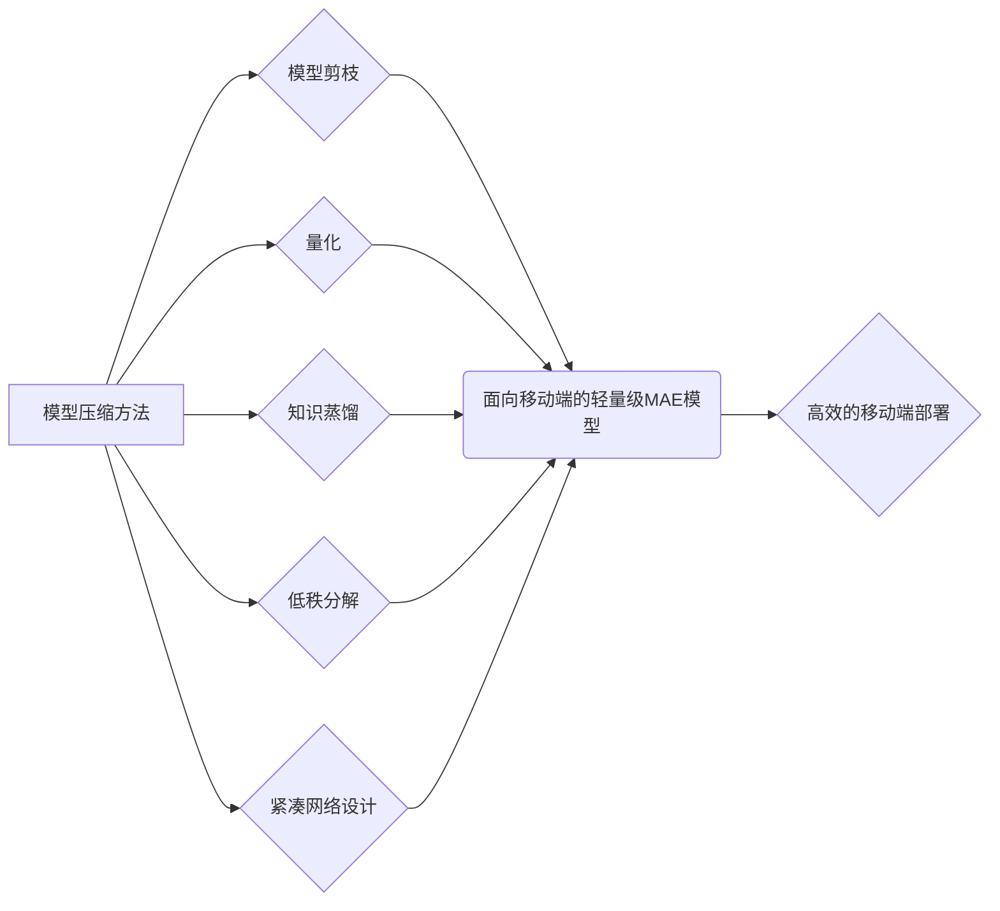

# 面向移动端的轻量级MAE模型压缩

作者：禅与计算机程序设计艺术

## 1. 背景介绍

### 1.1 MAE模型的兴起

近年来，随着深度学习技术的快速发展，掩码自编码器（Masked Autoencoder, MAE）模型在计算机视觉领域取得了显著的成果。MAE模型通过随机掩码输入图像的一部分，并训练模型重建被掩码的部分，从而学习到更具判别性的图像表征。这种自监督学习方式使得MAE模型能够在没有大量标注数据的情况下，依然能够学习到丰富的图像特征，因此在图像分类、目标检测、语义分割等任务中展现出巨大的潜力。

### 1.2 移动端部署的挑战

然而，MAE模型通常包含大量的参数和计算量，难以直接部署到资源受限的移动设备上。这对于希望将MAE模型应用于移动端视觉任务（如手机拍照、AR/VR等）带来了巨大的挑战。为了解决这个问题，模型压缩技术应运而生，其目标是在保证模型性能的前提下，尽可能地减少模型的大小和计算量，使其能够高效地运行在移动设备上。

### 1.3 本文目标

本文旨在探讨面向移动端的轻量级MAE模型压缩技术。我们将介绍几种主流的模型压缩方法，并结合具体的代码实例，详细阐述如何将这些方法应用于MAE模型的压缩，最终实现模型在移动设备上的高效部署。

## 2. 核心概念与联系

### 2.1 模型压缩方法概述

模型压缩方法主要可以分为以下几类：

* **模型剪枝（Pruning）：** 通过移除模型中冗余或不重要的连接（权重），从而减小模型的大小和计算量。
* **量化（Quantization）：** 使用低比特的数值表示模型的权重和激活值，例如将32位浮点数转换为8位整数，从而减少模型的存储空间和计算开销。
* **知识蒸馏（Knowledge Distillation）：** 训练一个小的学生模型来模仿一个大的教师模型的输出，从而将教师模型的知识迁移到学生模型上。
* **低秩分解（Low-Rank Decomposition）：** 将模型中的高维矩阵分解成多个低维矩阵的乘积，从而减少模型的参数量和计算量。
* **紧凑网络设计（Compact Network Design）：** 设计更加高效的网络结构，例如使用深度可分离卷积、分组卷积等，从模型设计阶段就降低模型的复杂度。

### 2.2  MAE模型压缩的特殊性

与传统的卷积神经网络相比，MAE模型在结构上存在一些特殊性，例如：

* **编码器-解码器结构：** MAE模型通常采用编码器-解码器结构，其中编码器用于提取图像特征，解码器用于重建被掩码的图像部分。
* **非对称的编码器和解码器：** MAE模型的编码器通常比解码器更深、更复杂，因为编码器需要学习更具判别性的特征表示。
* **掩码机制：** MAE模型的训练过程中使用了随机掩码机制，这使得模型需要处理不同掩码比例和位置的输入图像。

这些特殊性使得传统的模型压缩方法在应用于MAE模型时需要进行一些调整和优化，才能取得更好的效果。


### 2.3 核心概念联系图



## 3. 核心算法原理具体操作步骤

### 3.1 模型剪枝

#### 3.1.1 原理

模型剪枝的基本原理是识别并移除模型中对模型性能贡献较小的连接（权重）。这些连接通常对应于网络中不重要的特征或冗余的信息，因此移除它们对模型的整体性能影响较小。

#### 3.1.2 操作步骤

1. **训练一个基准模型：** 首先，我们需要训练一个性能良好的基准MAE模型。
2. **确定剪枝标准：** 选择一个合适的剪枝标准来评估每个连接的重要性，例如权重的绝对值、权重的梯度等。
3. **剪枝连接：** 根据剪枝标准，将重要性低于阈值的连接从模型中移除。
4. **微调模型：** 对剪枝后的模型进行微调，以恢复模型的性能。

#### 3.1.3  MAE模型剪枝的特殊考虑

* **编码器和解码器的剪枝比例：** 由于MAE模型的编码器比解码器更复杂，因此可以对编码器进行更 aggressive 的剪枝。
* **掩码机制的影响：**  在剪枝过程中，需要考虑掩码机制的影响，例如可以根据掩码的位置对连接进行选择性剪枝。

### 3.2 量化

#### 3.2.1 原理

量化的基本原理是使用低比特的数值表示模型的权重和激活值，从而减少模型的存储空间和计算开销。例如，可以使用8位整数表示原本使用32位浮点数表示的权重，这样可以将模型的大小缩小4倍。

#### 3.2.2 操作步骤

1. **训练一个基准模型：** 首先，我们需要训练一个性能良好的基准MAE模型。
2. **确定量化方案：** 选择合适的量化方案，例如对称量化、非对称量化、量化感知训练等。
3. **量化模型：** 根据量化方案，将模型的权重和激活值转换为低比特的数值表示。
4. **微调模型：** 对量化后的模型进行微调，以恢复模型的性能。


#### 3.2.3 MAE模型量化的特殊考虑

* **编码器和解码器的量化方案：** 可以对编码器和解码器采用不同的量化方案，例如对编码器使用更 aggressive 的量化方案。
* **掩码机制的影响：** 在量化过程中，需要考虑掩码机制的影响，例如可以根据掩码的位置对权重和激活值进行选择性量化。

### 3.3 知识蒸馏

#### 3.3.1 原理

知识蒸馏的基本原理是训练一个小的学生模型来模仿一个大的教师模型的输出，从而将教师模型的知识迁移到学生模型上。学生模型通常比教师模型更小、更快，因此更适合部署到移动设备上。


#### 3.3.2 操作步骤

1. **训练一个教师模型：** 首先，我们需要训练一个性能良好的大型MAE模型作为教师模型。
2. **设计学生模型：** 设计一个比教师模型更小、更快的学生模型。
3. **知识迁移：** 使用教师模型的输出来监督学生模型的训练，例如可以使用教师模型的输出作为学生模型的 soft target。
4. **微调学生模型：** 对学生模型进行微调，以进一步提高其性能。

#### 3.3.3 MAE模型知识蒸馏的特殊考虑

* **教师模型的选择：** 选择一个性能优异的教师模型至关重要，因为它直接影响着学生模型的性能上限。
* **知识迁移的方式：** 可以探索不同的知识迁移方式，例如可以使用教师模型的中间层特征作为学生模型的监督信息。

### 3.4 低秩分解

#### 3.4.1 原理
低秩分解的原理是将模型中的高维矩阵分解成多个低维矩阵的乘积，从而减少模型的参数量和计算量。例如，可以将一个 $m \times n$ 的矩阵分解成一个 $m \times k$ 的矩阵和一个 $k \times n$ 的矩阵的乘积，其中 $k < min(m, n)$。


#### 3.4.2 操作步骤
1. **选择分解方法:** 选择合适的低秩分解方法，例如奇异值分解 (SVD)、Tucker 分解等。
2. **对模型中的矩阵进行分解:** 使用选择的分解方法对模型中的高维矩阵进行分解。
3. **微调模型:** 对分解后的模型进行微调，以恢复模型的性能。


#### 3.4.3 MAE模型低秩分解的特殊考虑
* **分解哪些层:** 可以选择对模型中的特定层进行低秩分解，例如对编码器中的 Transformer 层进行分解。
* **分解的秩:** 分解的秩越低，模型压缩的程度越大，但模型的性能也可能下降得更多。


### 3.5 紧凑网络设计
#### 3.5.1 原理
紧凑网络设计的原理是从模型设计阶段就考虑模型的效率，使用更加高效的网络结构来降低模型的复杂度。


#### 3.5.2 常用方法
* **深度可分离卷积:** 将标准卷积操作分解为深度卷积和逐点卷积，可以减少模型的参数量和计算量。
* **分组卷积:** 将输入通道分组，并在每组内进行卷积操作，可以减少模型的参数量和计算量。
* **神经架构搜索:** 使用算法自动搜索更加高效的网络结构。


#### 3.5.3 MAE模型紧凑网络设计的特殊考虑
* **编码器和解码器的设计:** 可以针对编码器和解码器分别设计更加紧凑的网络结构。
* **掩码机制的融合:** 可以将掩码机制融合到网络结构的设计中，例如设计可以自适应地处理不同掩码比例的网络结构。

## 4. 数学模型和公式详细讲解举例说明

### 4.1 模型剪枝的 L1 正则化

在模型剪枝中，可以使用 L1 正则化来鼓励模型的权重稀疏化，从而更容易地进行剪枝。L1 正则化的公式如下：

$$
L = L_0 + \lambda \sum_{i=1}^{n} |w_i|
$$

其中，$L_0$ 是模型的原始损失函数，$\lambda$ 是正则化系数，$w_i$ 是模型的第 $i$ 个权重。L1 正则化会在模型的损失函数中添加一个惩罚项，该惩罚项与模型权重的绝对值之和成正比。通过最小化 L1 正则化的损失函数，可以使得模型的权重更加稀疏，即更多的权重接近于 0。

**举例说明:**

假设一个模型有两层，每层有两个神经元，模型的权重矩阵如下：

$$
W = 
\begin{bmatrix}
w_{11} & w_{12} \\
w_{21} & w_{22}
\end{bmatrix}
$$

使用 L1 正则化后，模型的损失函数变为：

$$
L = L_0 + \lambda (|w_{11}| + |w_{12}| + |w_{21}| + |w_{22}|)
$$

通过最小化 L1 正则化的损失函数，可以使得模型的权重更加稀疏，例如：

$$
W' = 
\begin{bmatrix}
0 & w_{12} \\
w_{21} & 0
\end{bmatrix}
$$

### 4.2 量化的线性量化公式

线性量化是一种常用的量化方法，其公式如下：

$$
q = round(\frac{x - x_{min}}{s})
$$

$$
\hat{x} = s \times q + x_{min}
$$

其中：

* $x$ 是原始的浮点数，
* $q$ 是量化后的整数，
* $s$ 是量化步长，
* $x_{min}$ 是量化范围的下界，
* $round()$ 函数表示四舍五入取整。


**举例说明:**

假设要将一个浮点数 $x = 3.14$ 量化为 8 位整数，量化范围为 $[-1, 1]$。

1. 首先计算量化步长：
$$
s = \frac{x_{max} - x_{min}}{2^b - 1} = \frac{1 - (-1)}{2^8 - 1} \approx 0.0078
$$
2. 然后将 $x$ 量化为整数：
$$
q = round(\frac{x - x_{min}}{s}) = round(\frac{3.14 - (-1)}{0.0078}) \approx 529
$$
3. 最后将量化后的整数转换为量化后的浮点数：
$$
\hat{x} = s \times q + x_{min} = 0.0078 \times 529 + (-1) \approx 3.1382
$$

可以看到，量化后的浮点数 $\hat{x}$ 与原始的浮点数 $x$ 非常接近。

## 5. 项目实践：代码实例和详细解释说明

### 5.1 基于PyTorch的模型剪枝实现

```python
import torch
import torch.nn as nn
import torch.nn.utils.prune as prune

# 定义一个简单的 MAE 模型
class MAE(nn.Module):
    def __init__(self):
        super(MAE, self).__init__()
        # ...

# 加载预训练的 MAE 模型
model = MAE()
model.load_state_dict(torch.load('pretrained_mae.pth'))

# 选择要剪枝的层
module = model.encoder.layer[0].attention.self.query
# 使用 L1 正则化进行剪枝
prune.l1_unstructured(module, name="weight", amount=0.5)

# 打印剪枝后的模型结构
print(model)

# 微调剪枝后的模型
# ...
```

### 5.2 基于TensorFlow Lite的模型量化实现

```python
import tensorflow as tf

# 加载预训练的 MAE 模型
model = tf.keras.models.load_model('pretrained_mae.h5')

# 使用 TensorFlow Lite Converter 进行量化
converter = tf.lite.TFLiteConverter.from_keras_model(model)
converter.optimizations = [tf.lite.Optimize.DEFAULT]
quantized_tflite_model = converter.convert()

# 保存量化后的模型
open('quantized_mae.tflite', 'wb').write(quantized_tflite_model)
```

## 6. 实际应用场景

### 6.1 手机拍照

轻量级MAE模型可以应用于手机拍照，例如：

* **图像超分辨率：** 使用轻量级MAE模型对低分辨率的图像进行超分辨率重建，从而提升图像的清晰度。
* **图像去噪：** 使用轻量级MAE模型对噪声图像进行去噪，从而提升图像的质量。
* **图像风格迁移：** 使用轻量级MAE模型将一种图像的风格迁移到另一种图像上，从而创造出更加艺术化的照片。

### 6.2 AR/VR

轻量级MAE模型可以应用于AR/VR，例如：

* **场景理解：** 使用轻量级MAE模型对AR/VR场景进行语义分割，从而实现更加智能的交互体验。
* **虚拟试衣：** 使用轻量级MAE模型对用户进行人体姿态估计，从而实现更加逼真的虚拟试衣效果。
* **手势识别：** 使用轻量级MAE模型对手势进行识别，从而实现更加自然的人机交互。

## 7. 总结：未来发展趋势与挑战

### 7.1 未来发展趋势

* **更加高效的模型压缩方法：** 研究更加高效的模型压缩方法，例如基于 Transformer 的模型压缩方法、基于 AutoML 的模型压缩方法等。
* **硬件友好的模型压缩方法：**  研究更加硬件友好的模型压缩方法，例如针对特定硬件平台进行优化的模型压缩方法。
* **与其他技术的结合：** 将模型压缩技术与其他技术相结合，例如与联邦学习、边缘计算等技术相结合。

### 7.2 面临的挑战

* **模型性能和压缩比的平衡：** 如何在保证模型性能的前提下，尽可能地提高模型的压缩比是一个巨大的挑战。
* **压缩模型的泛化能力：** 如何保证压缩后的模型在不同数据集和任务上的泛化能力是一个重要的研究方向。
* **压缩模型的安全性：** 如何保证压缩后的模型的安全性，防止模型被恶意攻击是一个需要关注的问题。


## 8. 附录：常见问题与解答

### 8.1  Q: 模型剪枝后，模型的精度会下降多少？

A: 模型剪枝后，模型的精度下降程度取决于多个因素，例如剪枝的比例、剪枝的标准、模型的结构等。一般来说，剪枝比例越大，模型的精度下降得越多。

### 8.2  Q: 模型量化后，模型的推理速度会提升多少？

A: 模型量化后，模型的推理速度提升程度取决于多个因素，例如量化的比特数、硬件平台等。一般来说，量化的比特数越低，模型的推理速度提升得越多。

### 8.3  Q: 知识蒸馏中，如何选择合适的教师模型？

A: 选择教师模型时，需要考虑以下因素：

* 教师模型的性能：教师模型的性能应该足够好，因为它直接影响着学生模型的性能上限。
* 教师模型的大小：教师模型的大小应该适中，因为如果教师模型太大，训练学生模型的成本会很高。
* 教师模型与学生模型的相似度：教师模型与学生模型的结构和任务应该比较相似，这样才能更好地进行知识迁移。
