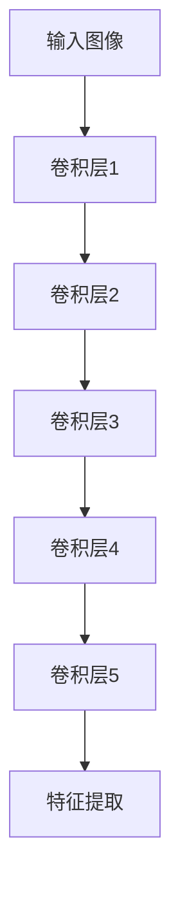

# 风格迁移：将艺术家的风格融入你的照片

作者：禅与计算机程序设计艺术

## 1. 背景介绍

风格迁移（Style Transfer）是一种利用深度学习技术，将一种图像的艺术风格应用到另一种图像上的技术。它最初由 Gatys 等人在 2015 年提出，并迅速成为计算机视觉领域的一个热门话题。风格迁移不仅在学术界引起了广泛关注，还在商业应用中得到了广泛应用，如照片编辑软件、视频特效和虚拟现实等领域。

### 1.1 发展历史

风格迁移的概念最早可以追溯到图像处理和计算机视觉领域的早期工作。然而，真正将这一概念带入主流的是深度学习技术的发展。2015 年，Gatys 等人发表了一篇论文《A Neural Algorithm of Artistic Style》，首次展示了利用卷积神经网络（CNN）进行风格迁移的可能性。这一突破性工作引发了大量后续研究，探索如何提高风格迁移的效果和效率。

### 1.2 应用领域

风格迁移的应用领域非常广泛，以下是一些主要的应用场景：

- **艺术创作**：艺术家可以将自己的风格应用到照片或其他图像上，创造出独特的艺术作品。
- **照片编辑**：用户可以使用风格迁移技术，将经典艺术作品的风格应用到自己的照片上，生成具有艺术感的照片。
- **视频特效**：在视频制作中，风格迁移可以用于生成独特的视觉效果，使视频具有独特的风格。
- **虚拟现实**：在虚拟现实应用中，风格迁移可以用于生成具有特定艺术风格的虚拟环境。

## 2. 核心概念与联系

风格迁移的核心概念主要包括内容图像、风格图像和生成图像。内容图像是用户希望保持其内容的图像，风格图像是用户希望应用其风格的图像，而生成图像则是最终的输出图像，它结合了内容图像的内容和风格图像的风格。

### 2.1 内容图像

内容图像是风格迁移过程中需要保持其内容特征的图像。通常情况下，内容图像是用户希望进行风格迁移的目标图像。例如，如果用户希望将一张照片转换为具有梵高风格的图像，那么这张照片就是内容图像。

### 2.2 风格图像

风格图像是风格迁移过程中提供艺术风格的图像。通常情况下，风格图像是用户希望应用其风格的艺术作品。例如，如果用户希望将一张照片转换为具有梵高风格的图像，那么梵高的画作就是风格图像。

### 2.3 生成图像

生成图像是风格迁移过程的最终输出图像。它结合了内容图像的内容和风格图像的风格。生成图像的目标是最大程度地保持内容图像的内容特征，同时应用风格图像的艺术风格。

### 2.4 卷积神经网络（CNN）

卷积神经网络（CNN）是风格迁移的核心技术。CNN 是一种深度学习模型，特别适用于图像处理任务。它通过层级结构提取图像的不同特征，从而实现风格迁移。

## 3. 核心算法原理具体操作步骤

风格迁移的核心算法基于卷积神经网络（CNN），通过优化生成图像，使其同时满足内容图像的内容特征和风格图像的风格特征。具体操作步骤如下：

### 3.1 特征提取

首先，通过预训练的卷积神经网络（如 VGG19）提取内容图像和风格图像的特征。通常情况下，使用 CNN 的中间层特征来表示图像的内容和风格。

### 3.2 内容损失

内容损失用于衡量生成图像与内容图像在内容特征上的差异。通常使用均方误差（MSE）来计算内容损失：

$$
L_{content} = \sum_{i=1}^{N} \left( F_{i}^{content} - F_{i}^{generated} \right)^2
$$

其中，$F_{i}^{content}$ 和 $F_{i}^{generated}$ 分别表示内容图像和生成图像在第 $i$ 层的特征图。

### 3.3 风格损失

风格损失用于衡量生成图像与风格图像在风格特征上的差异。通常使用 Gram 矩阵来表示图像的风格特征，并使用均方误差（MSE）来计算风格损失：

$$
L_{style} = \sum_{j=1}^{M} \left( G_{j}^{style} - G_{j}^{generated} \right)^2
$$

其中，$G_{j}^{style}$ 和 $G_{j}^{generated}$ 分别表示风格图像和生成图像在第 $j$ 层的 Gram 矩阵。

### 3.4 总损失

总损失是内容损失和风格损失的加权和：

$$
L_{total} = \alpha L_{content} + \beta L_{style}
$$

其中，$\alpha$ 和 $\beta$ 分别是内容损失和风格损失的权重系数。

### 3.5 优化

通过梯度下降算法优化生成图像，使其总损失最小化。具体步骤如下：

1. 初始化生成图像，可以是内容图像、随机噪声图像或其他图像。
2. 通过卷积神经网络计算生成图像的内容特征和风格特征。
3. 计算内容损失和风格损失。
4. 计算总损失。
5. 通过反向传播计算损失函数对生成图像的梯度。
6. 更新生成图像，使其总损失最小化。
7. 重复步骤 2-6，直到总损失收敛或达到预定的迭代次数。

## 4. 数学模型和公式详细讲解举例说明

风格迁移的数学模型主要包括内容损失、风格损失和总损失。下面详细讲解这些公式，并通过具体例子说明。

### 4.1 内容损失

内容损失用于衡量生成图像与内容图像在内容特征上的差异。假设 $P$ 是内容图像，$G$ 是生成图像，$F_{l}(P)$ 和 $F_{l}(G)$ 分别表示在第 $l$ 层卷积神经网络中内容图像和生成图像的特征图，则内容损失定义为：

$$
L_{content}(P, G) = \frac{1}{2} \sum_{i,j} \left( F_{l}(P)_{ij} - F_{l}(G)_{ij} \right)^2
$$

其中，$i$ 和 $j$ 分别表示特征图的空间位置。

### 4.2 风格损失

风格损失用于衡量生成图像与风格图像在风格特征上的差异。假设 $A$ 是风格图像，$G$ 是生成图像，$F_{l}(A)$ 和 $F_{l}(G)$ 分别表示在第 $l$ 层卷积神经网络中风格图像和生成图像的特征图，则风格损失定义为：

首先，计算 Gram 矩阵：

$$
G_{l}(A) = F_{l}(A) F_{l}(A)^{T}
$$

$$
G_{l}(G) = F_{l}(G) F_{l}(G)^{T}
$$

然后，风格损失定义为：

$$
L_{style}(A, G) = \sum_{l=0}^{L} w_{l} \frac{1}{4N_{l}^{2}M_{l}^{2}} \sum_{i,j} \left( G_{l}(A)_{ij} - G_{l}(G)_{ij} \right)^2
$$

其中，$w_{l}$ 是第 $l$ 层的权重，$N_{l}$ 和 $M_{l}$ 分别是第 $l$ 层特征图的通道数和空间位置数。

### 4.3 总损失

总损失是内容损失和风格损失的加权和：

$$
L_{total}(P