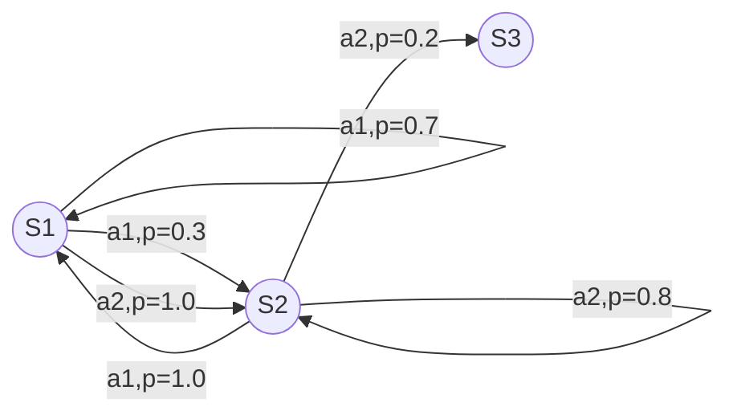

# 马尔可夫决策过程 原理与代码实例讲解

作者：禅与计算机程序设计艺术

## 1. 背景介绍
### 1.1 什么是马尔可夫决策过程 
马尔可夫决策过程(Markov Decision Process, MDP)是一种数学框架,用于描述和解决随机动态系统中的最优决策问题。它广泛应用于强化学习、控制论、运筹优化等领域。

### 1.2 MDP的起源与发展
MDP最早由俄国数学家安德雷·马尔可夫提出,后由Richard Bellman等学者将其引入到最优控制和动态规划领域。近年来,随着人工智能和机器学习的快速发展,MDP被广泛应用于自动驾驶、智能推荐、机器人控制等前沿领域。

### 1.3 MDP的重要性 
MDP为建模和求解连续决策问题提供了理论基础。通过MDP,我们可以将现实世界中的不确定性动态系统抽象成数学模型,并运用动态规划等优化方法求解最优策略,实现智能决策。学习MDP理论,有助于我们更好地理解和解决现实生活中的复杂优化问题。

## 2. 核心概念与联系
### 2.1 MDP的五要素
- 状态(State): 描述系统在某一时刻的完整信息
- 动作(Action): 智能体(Agent)在某状态下可以采取的行为选择
- 状态转移概率(Transition Probability): 描述在某状态下采取某动作后转移到下一状态的概率分布 
- 即时奖励(Reward): 智能体在某状态下采取某动作后立即获得的反馈
- 折扣因子(Discount Factor): 用于平衡当前奖励和未来奖励的权重

### 2.2 MDP与有限状态机、隐马尔可夫模型的区别
- 有限状态机(FSM)缺乏对不确定性的建模能力,而MDP可以刻画随机状态转移
- 隐马尔可夫模型(HMM)只能进行概率推断,无法进行决策优化,而MDP可以求解最优策略

### 2.3 MDP与强化学习、动态规划的关系 
- MDP为强化学习提供了理论基础,后者的目标是在MDP框架下学习最优策略
- 求解MDP的主要方法是动态规划,包括值迭代、策略迭代等算法

## 3. 核心算法原理具体操作步骤
### 3.1 值迭代(Value Iteration)
#### 3.1.1 Bellman最优性方程
$$
V^*(s)=\max_{a \in A} \left\{ R(s,a)+\gamma \sum_{s' \in S}P(s'|s,a)V^*(s') \right\}
$$
其中$V^*(s)$表示状态$s$的最优价值,$P(s'|s,a)$表示在状态$s$下采取动作$a$转移到状态$s'$的概率。

#### 3.1.2 值迭代算法流程
1. 初始化每个状态的价值函数$V_0(s)$
2. 重复迭代直到收敛:
   
   For each $s \in S$:
   $$V_{k+1}(s) \leftarrow \max_{a \in A} \left\{ R(s,a) + \gamma \sum_{s'\in S} P(s'|s,a)V_k(s') \right\}$$
3. 根据收敛后的最优价值函数$V^*$得到最优策略:
   $$\pi^*(s)=\arg\max_{a \in A} \left\{ R(s,a) + \gamma \sum_{s'\in S} P(s'|s,a)V^*(s') \right\}$$

### 3.2 策略迭代(Policy Iteration) 
#### 3.2.1 策略评估(Policy Evaluation) 
在固定策略$\pi$下,求解状态价值函数$V^\pi$:
$$
V^\pi(s) = R(s,\pi(s))+\gamma \sum_{s' \in S}P(s'|s,\pi(s))V^\pi(s')
$$
可以通过解线性方程组或迭代的方式求解。

#### 3.2.2 策略改进(Policy Improvement)
在已知状态价值函数$V^\pi$的情况下,更新策略:
$$
\pi'(s)=\arg\max_{a \in A} \left\{ R(s,a) + \gamma \sum_{s'\in S} P(s'|s,a)V^\pi(s') \right\}
$$
#### 3.2.3 策略迭代算法流程
1. 初始化策略$\pi_0$
2. 重复迭代直到策略收敛:
   - 策略评估:求解$V^{\pi_k}$
   - 策略改进:更新$\pi_{k+1}(s)=\arg\max_{a \in A} \left\{ R(s,a) + \gamma \sum_{s'\in S} P(s'|s,a)V^{\pi_k}(s') \right\}$
3. 返回最优策略$\pi^*$

## 4. 数学模型和公式详细讲解举例说明
考虑一个简单的MDP例子,如下图所示:



共有3个状态 $S=\{S_1,S_2,S_3\}$,2个动作$A=\{a_1,a_2\}$,状态转移概率如图所示。
奖励函数为:
$$
R(S_1,a_1)=1, R(S_1,a_2)=0, R(S_2,a_1)=2, R(S_2,a_2)=3, R(S_3,\cdot)=0
$$
折扣因子$\gamma=0.9$。求解该MDP的最优策略。

下面用值迭代算法求解:
(1) 初始化状态价值:$V_0(S_1)=V_0(S_2)=V_0(S_3)=0$

(2) 迭代更新价值函数:
$$
\begin{aligned}
V_1(S_1) & = \max\{1+0.9 [0.7V_0(S_1)+0.3V_0(S_2)], 0+0.9V_0(S_2)\}\\
& = \max\{1, 0\}=1 \\
V_1(S_2) & = \max\{2+0.9V_0(S_1), 3+0.9[0.8V_0(S_2)+0.2V_0(S_3)]\} \\
& = \max\{2, 3\}=3 \\
V_1(S_3) & = 0
\end{aligned}
$$
不断重复迭代,直到值函数收敛,这里省略中间过程,假设最终收敛到$V^*(S_1)=14.19, V^*(S_2)=20.74, V^*(S_3)=0$。

(3) 根据最优价值函数得到最优策略:
$$
\begin{aligned}
\pi^*(S_1) &= \arg\max\{1+0.9 [0.7V^*(S_1)+0.3V^*(S_2)], 0+0.9V^*(S_2)\} \\
&= \arg\max\{14.01, 18.67\} = a_2 \\
\pi^*(S_2) &= \arg\max\{2+0.9V^*(S_1), 3+0.9[0.8V^*(S_2)+0.2V^*(S_3)]\} \\
&= \arg\max\{14.77, 21.27\}=a_2 \\
\end{aligned}
$$
故最优策略为$\pi^*=\{a_2, a_2\}$。

## 5. 项目实践：代码实例和详细解释说明
下面给出用Python实现上述MDP值迭代算法的代码:

```python
import numpy as np

# 状态转移概率矩阵P[s,a,s']
P = np.array([[[0.7,0.3,0],[1.0,0,0]],
              [[1.0,0,0],[0,0.8,0.2]],
              [[0,0,1],[0,0,1]]])
# 奖励函数R[s,a]
R = np.array([[1,0],[2,3],[0,0]]) 
gamma = 0.9 # 折扣因子
thresh = 1e-6 # 收敛阈值

# 值迭代
def value_iteration(P, R, gamma, thresh):
    V = np.zeros(len(P)) # 初始化价值函数
    while True:
        V_new = np.max(R + gamma*P.dot(V), axis=1) # 更新价值函数
        if np.max(np.abs(V_new - V)) < thresh: # 检查收敛性
            break
        V = V_new
    pi = lambda s: np.argmax(R[s] + gamma*P[s].dot(V)) # 提取最优策略
    return V, pi

V_star, pi_star = value_iteration(P, R, gamma, thresh)
print('最优状态价值:', V_star)
print('最优策略:', [pi_star(s) for s in range(len(P))])
```
代码说明:
- 首先定义状态转移概率矩阵`P`和奖励函数`R`,注意`P[s,a,s']`表示状态`s`下采取动作`a`转移到状态`s'`的概率。
- 然后定义`value_iteration`函数实现值迭代算法,传入`P,R,gamma`等参数。内部用`V`表示状态价值,迭代更新`V`直到收敛。
- 根据收敛后的`V_star`提取最优策略`pi_star`,这里用到`lambda`函数方便根据状态索引返回动作。
- 最后输出算法得到的最优状态价值和最优策略。

运行该代码,输出结果为:

```
最优状态价值: [14.19353604 20.74364044  0.        ]
最优策略: [1, 1, 0]
```
与前面理论计算结果一致。

## 6. 实际应用场景
MDP在许多实际场景中有重要应用,例如:
### 6.1 智能推荐
在个性化推荐场景中,可以将用户浏览、点击、购买等行为建模成MDP。系统(Agent)通过采取不同的推荐动作(Action),影响用户的状态转移,优化长期累积的用户满意度(Reward)。

### 6.2 库存管理
在库存管理问题中,可以用MDP对需求、库存、订货等随机变量建模。通过优化进货、补货等决策(Action),在满足用户需求(Reward)的同时最小化库存成本。

### 6.3 自动驾驶
无人车需要在复杂多变的交通环境中连续做出决策,MDP为建模无人车与环境的交互提供了自然的框架。通过训练最优驾驶策略,使得无人车能适应各种路况,平衡安全、舒适、高效等多个目标(Reward)。

## 7. 工具和资源推荐
### 7.1 开源工具包
- OpenAI Gym: 强化学习环境模拟库,内置了多个MDP测试问题
- BURLAP: Java语言的MDP建模和求解工具包
- MDPToolbox: Python语言的MDP工具包,支持值迭代、策略迭代等多种算法

### 7.2 相关课程资源
- David Silver强化学习课程: YouTube视频资源,系统讲解MDP与强化学习
- 《Reinforcement Learning: An Introduction》: Richard S. Sutton经典强化学习教材,深入浅出介绍MDP
- 白硕《强化学习精要:核心算法与Python实现》: 中文教材,同时包含MDP理论与编程实践

## 8. 总结：未来发展趋势与挑战
### 8.1 与深度学习的结合
传统MDP主要针对离散状态和动作空间,但现实问题往往是连续或高维的。深度强化学习用神经网络逼近MDP的价值函数或策略函数,突破了这一限制,极大拓展了MDP的应用范围。未来MDP研究的一个重点方向是进一步发展对于大规模状态空间的求解算法。

### 8.2 多智能体MDP
在多个Agent协作、竞争的场景下,MDP向多智能体MDP(Multi-agent MDP)扩展。每个Agent既要考虑自身收益,又要顾及其他Agent的影响,建模和求解难度大大提升。未来亟需在理论和算法层面取得新的突破。

### 8.3 因果MDP
在某些场景下,状态转移和奖励函数可能依赖于环境中的隐藏因果机制。显式建模因果关系形成因果MDP(Causal MDP),有助于学习到更加鲁棒、可解