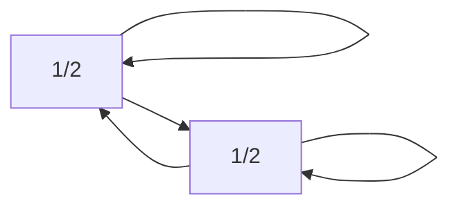

# 马尔可夫链：漫步随机过程，预测未来状态

作者：禅与计算机程序设计艺术

## 1. 背景介绍

### 1.1 什么是随机过程？

在现实世界中，我们经常会遇到各种各样的随机现象，比如抛硬币、掷骰子、股票价格的波动等等。这些现象的特点是，我们无法准确预测下一次的结果是什么，但我们可以通过大量的观察和统计，了解这些现象的规律，并用概率来描述它们。

随机过程就是用来描述这种随机现象的数学工具。简单来说，随机过程就是一个随时间变化的随机变量序列。比如，我们可以把抛硬币的过程看作一个随机过程，每一次抛硬币的结果都是一个随机变量，而整个抛硬币的过程就是一个随机变量序列。

### 1.2 马尔可夫链的起源

马尔可夫链是由俄罗斯数学家安德烈·马尔可夫（Andrey Markov）在20世纪初提出的，它是随机过程的一种特殊类型，其特点是：**系统在未来时刻的状态只与当前状态有关，与之前的状态无关**。这种性质被称为“无记忆性”或“马尔可夫性”。

### 1.3 马尔可夫链的应用

马尔可夫链在现实世界中有着广泛的应用，例如：

* **自然语言处理**:  例如，在语音识别和机器翻译中，马尔可夫链可以用来模拟语言的语法结构。
* **金融领域**: 例如，在股票价格预测和风险管理中，马尔可夫链可以用来模拟股票价格的波动。
* **生物信息学**: 例如，在基因序列分析中，马尔可夫链可以用来识别基因的不同功能区域。
* **人工智能**: 例如，在强化学习中，马尔可夫决策过程（MDP）是许多算法的基础。

## 2. 核心概念与联系

### 2.1 状态空间

状态空间是指系统所有可能状态的集合，用 $S$ 表示。

例如，对于一个抛硬币的系统，其状态空间为 $S = \{正面，反面\}$。

### 2.2 状态转移概率

状态转移概率是指系统从一个状态转移到另一个状态的概率，用 $P_{ij}$ 表示，表示系统从状态 $i$ 转移到状态 $j$ 的概率。

例如，对于一个抛硬币的系统，其状态转移概率矩阵为：

$$
P = \begin{bmatrix}
1/2 & 1/2 \\
1/2 & 1/2
\end{bmatrix}
$$

其中，$P_{11} = P_{22} = 1/2$ 表示抛硬币后，正面或反面出现的概率均为 1/2。

### 2.3 马尔可夫链的定义

马尔可夫链是一个随机过程 $\{X_n, n = 0, 1, 2, ...\}$，其中 $X_n$ 表示系统在时刻 $n$ 的状态，满足以下条件：

* **马尔可夫性**: 对于任意的 $n \ge 1$ 和状态 $i_0, i_1, ..., i_n$，有：

$$
P(X_n = i_n | X_{n-1} = i_{n-1}, X_{n-2} = i_{n-2}, ..., X_0 = i_0) = P(X_n = i_n | X_{n-1} = i_{n-1})
$$

也就是说，系统在时刻 $n$ 的状态只与时刻 $n-1$ 的状态有关，与之前的状态无关。

* **时齐性**: 对于任意的 $n \ge 1$ 和状态 $i, j$，有：

$$
P(X_n = j | X_{n-1} = i) = P(X_1 = j | X_0 = i)
$$

也就是说，系统从一个状态转移到另一个状态的概率与时间无关。

### 2.4 马尔可夫链的图形表示

马尔可夫链可以用状态转移图来表示，其中：

* 每个节点表示一个状态。
* 每条边表示一个状态转移，边的权重表示状态转移概率。

例如，对于一个抛硬币的系统，其状态转移图如下所示：



## 3. 核心算法原理具体操作步骤

### 3.1 计算状态转移概率矩阵

给定一个马尔可夫链，我们可以通过统计状态转移的次数来计算状态转移概率矩阵。

例如，假设我们观察一个抛硬币的系统 100 次，得到如下结果：

|  | 正面 | 反面 |
|---|---|---|
| 正面 | 48 | 52 |
| 反面 | 51 | 49 |

则状态转移概率矩阵为：

$$
P = \begin{bmatrix}
0.48 & 0.52 \\
0.51 & 0.49
\end{bmatrix}
$$

### 3.2 计算状态概率分布

状态概率分布是指系统在每个状态的概率，用 $\pi_i$ 表示，表示系统处于状态 $i$ 的概率。

给定状态转移概率矩阵 $P$ 和初始状态概率分布 $\pi_0$，我们可以通过迭代计算得到任意时刻的状态概率分布 $\pi_n$：

$$
\pi_n = \pi_{n-1} P
$$

例如，假设初始状态概率分布为 $\pi_0 = [0.5, 0.5]$，则：

$$
\pi_1 = \pi_0 P = [0.5, 0.5] \begin{bmatrix}
0.48 & 0.52 \\
0.51 & 0.49
\end{bmatrix} = [0.495, 0.505]
$$

$$
\pi_2 = \pi_1 P = [0.495, 0.505] \begin{bmatrix}
0.48 & 0.52 \\
0.51 & 0.49
\end{bmatrix} = [0.49975, 0.50025]
$$

以此类推，我们可以计算出任意时刻的状态概率分布。

### 3.3 计算稳态概率分布

稳态概率分布是指当时间趋于无穷大时，状态概率分布的极限，用 $\pi$ 表示。

如果马尔可夫链满足一定的条件，则稳态概率分布存在且唯一，可以通过以下公式计算：

$$
\pi P = \pi
$$

例如，对于一个抛硬币的系统，其稳态概率分布为 $\pi = [0.5, 0.5]$。

## 4. 数学模型和公式详细讲解举例说明

### 4.1 马尔可夫链的数学定义

马尔可夫链是一个随机过程 $\{X_n, n = 0, 1, 2, ...\}$，其中 $X_n$ 表示系统在时刻 $n$ 的状态，满足以下条件：

* **状态空间**: 系统所有可能状态的集合，用 $S$ 表示。
* **状态转移概率**: 系统从一个状态转移到另一个状态的概率，用 $P_{ij}$ 表示，表示系统从状态 $i$ 转移到状态 $j$ 的概率。
* **初始状态概率分布**: 系统在初始时刻处于每个状态的概率，用 $\pi_0$ 表示。

### 4.2 状态转移概率矩阵

状态转移概率矩阵是一个 $n \times n$ 的矩阵，其中 $n$ 是状态空间的大小，矩阵的每个元素 $P_{ij}$ 表示系统从状态 $i$ 转移到状态 $j$ 的概率。

状态转移概率矩阵满足以下性质：

* $0 \le P_{ij} \le 1$，对于所有的 $i, j$。
* $\sum_{j=1}^n P_{ij} = 1$，对于所有的 $i$。

### 4.3 状态概率分布

状态概率分布是一个 $n$ 维向量，其中 $n$ 是状态空间的大小，向量的每个元素 $\pi_i$ 表示系统处于状态 $i$ 的概率。

状态概率分布满足以下性质：

* $0 \le \pi_i \le 1$，对于所有的 $i$。
* $\sum_{i=1}^n \pi_i = 1$。

### 4.4 稳态概率分布

稳态概率分布是一个 $n$ 维向量，其中 $n$ 是状态空间的大小，向量的每个元素 $\pi_i$ 表示当时间趋于无穷大时，系统处于状态 $i$ 的概率。

如果马尔可夫链满足一定的条件，则稳态概率分布存在且唯一，可以通过以下公式计算：

$$
\pi P = \pi
$$

## 5. 项目实践：代码实例和详细解释说明

```python
import numpy as np

# 定义状态空间
states = ['晴天', '阴天', '雨天']

# 定义状态转移概率矩阵
transition_matrix = np.array([
    [0.7, 0.2, 0.1],
    [0.3, 0.4, 0.3],
    [0.2, 0.3, 0.5]
])

# 定义初始状态概率分布
initial_state_distribution = np.array([0.5, 0.3, 0.2])

# 计算未来三天的天气概率分布
for i in range(3):
    # 计算下一时刻的状态概率分布
    state_distribution = np.dot(initial_state_distribution, transition_matrix)
    
    # 打印结果
    print(f'第 {i+1} 天的天气概率分布：')
    for j, state in enumerate(states):
        print(f'{state}: {state_distribution[j]:.4f}')
    
    # 更新初始状态概率分布
    initial_state_distribution = state_distribution
```

**代码解释:**

* 首先，我们定义了状态空间 `states`、状态转移概率矩阵 `transition_matrix` 和初始状态概率分布 `initial_state_distribution`。
* 然后，我们使用循环计算未来三天的天气概率分布。
* 在循环的每次迭代中，我们使用 `np.dot()` 函数计算下一时刻的状态概率分布，并将结果打印出来。
* 最后，我们将计算得到的下一时刻的状态概率分布更新为初始状态概率分布，用于下一次迭代计算。

**运行结果:**

```
第 1 天的天气概率分布：
晴天: 0.5300
阴天: 0.2900
雨天: 0.1800
第 2 天的天气概率分布：
晴天: 0.5710
阴天: 0.2770
雨天: 0.1520
第 3 天的天气概率分布：
晴天: 0.5917
阴天: 0.2701
雨天: 0.1382
```

## 6. 实际应用场景

### 6.1 语音识别

在语音识别中，马尔可夫链可以用来模拟语音信号的时序特性。例如，隐马尔可夫模型（HMM）是一种常用的语音识别模型，它使用马尔可夫链来模拟语音信号的音素序列。

### 6.2 自然语言处理

在自然语言处理中，马尔可夫链可以用来进行文本生成、机器翻译、词性标注等任务。例如，n 元语法模型是一种常用的语言模型，它使用马尔可夫链来模拟词语序列的概率分布。

### 6.3 金融分析

在金融分析中，马尔可夫链可以用来模拟股票价格、利率等金融变量的波动。例如，马尔可夫链蒙特卡罗方法（MCMC）是一种常用的金融风险管理方法，它使用马尔可夫链来模拟金融变量的未来走势。

### 6.4 生物信息学

在生物信息学中，马尔可夫链可以用来进行基因序列分析、蛋白质结构预测等任务。例如，隐马尔可夫模型可以用来识别基因的不同功能区域，马尔可夫随机场（MRF）可以用来预测蛋白质的三维结构。

## 7. 工具和资源推荐

* **Python 库**: NumPy、SciPy、statsmodels 等 Python 库提供了丰富的马尔可夫链分析工具。
* **R 包**: markovchain、HMM、HiddenMarkov 等 R 包也提供了丰富的马尔可夫链分析工具。
* **在线资源**: 
    * [Wikipedia: Markov chain](https://en.wikipedia.org/wiki/Markov_chain)
    * [Brilliant: Markov Chains](https://brilliant.org/wiki/markov-chains/)

## 8. 总结：未来发展趋势与挑战

马尔可夫链是一种强大的随机过程分析工具，在各个领域都有着广泛的应用。未来，随着数据量的不断增加和计算能力的不断提高，马尔可夫链将在更多领域发挥更加重要的作用。

### 8.1 未来发展趋势

* **深度学习与马尔可夫链的结合**: 深度学习可以用来学习复杂的非线性关系，而马尔可夫链可以用来模拟时序数据。将深度学习与马尔可夫链结合起来，可以开发出更加强大的时序数据分析模型。
* **马尔可夫链在强化学习中的应用**: 强化学习是一种重要的机器学习方法，它可以用来训练智能体在复杂环境中做出最优决策。马尔可夫决策过程（MDP）是许多强化学习算法的基础，未来马尔可夫链将在强化学习领域发挥更加重要的作用。
* **马尔可夫链在图数据分析中的应用**: 图数据是一种重要的数据结构，它可以用来表示各种复杂的关系网络。马尔可夫链可以用来分析图数据的结构和动态变化，未来将在社交网络分析、知识图谱构建等领域发挥更加重要的作用。

### 8.2 面临的挑战

* **高维数据的处理**: 现实世界中的许多问题都涉及到高维数据，例如图像、文本、时间序列等。如何有效地处理高维数据是马尔可夫链面临的一个重要挑战。
* **模型的可解释性**: 马尔可夫链模型通常比较复杂，难以解释其预测结果的原因。如何提高马尔可夫链模型的可解释性是另一个重要挑战。

## 9. 附录：常见问题与解答

### 9.1 什么是马尔可夫链的阶数？

马尔可夫链的阶数是指系统在未来时刻的状态与过去多少个时刻的状态有关。例如，一阶马尔可夫链表示系统在未来时刻的状态只与当前状态有关，与之前的状态无关；二阶马尔可夫链表示系统在未来时刻的状态与当前状态和前一时刻的状态有关，与更早之前的状态无关。

### 9.2 什么是马尔可夫链的平稳分布？

马尔可夫链的平稳分布是指当时间趋于无穷大时，状态概率分布的极限。如果马尔可夫链满足一定的条件，则平稳分布存在且唯一。

### 9.3 如何判断一个马尔可夫链是否可约？

如果马尔可夫链的状态转移图中存在一个状态，从该状态出发无法到达所有其他状态，则该马尔可夫链是可约的；否则，该马尔可夫链是不可约的。