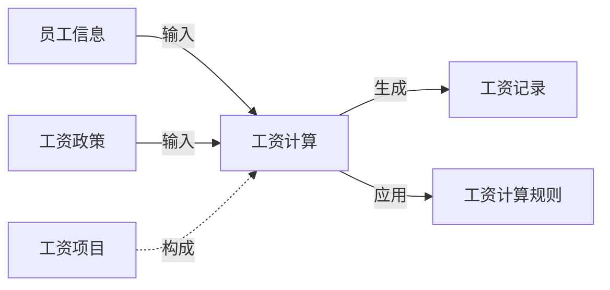
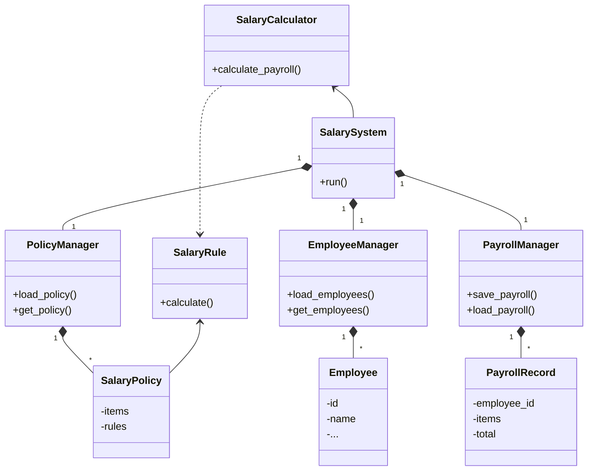

# 高校工资管理系统详细设计与具体代码实现

## 1. 背景介绍

### 1.1 工资管理系统的重要性

在任何组织机构中，工资管理都是一项关键的运营任务。准确、高效的工资计算和发放对于维护员工士气、吸引和留住人才至关重要。高校作为人力资源密集型机构,工资管理系统的重要性更是不言而喻。

### 1.2 高校工资管理的特殊性和挑战

与一般企业相比,高校工资管理面临着一些独特的挑战:

- **多元化的职员构成** 高校拥有教师、科研人员、管理人员等不同类型的职工,工资计算规则复杂多样。
- **附加薪酬项目** 除基本工资外,高校职工还可能享有课酬、论文津贴、科研经费等多种附加薪酬项目。
- **动态变化的工资政策** 受政策影响,工资构成和计算规则可能频繁调整。
- **庞大的数据量** 高校往往拥有大量职工,涉及海量工资数据的处理和存储。

### 1.3 工资管理系统的作用

高效的工资管理系统可以极大简化高校的工资管理流程,主要作用包括:

- 自动化工资计算,减少人工操作
- 统一规范化的工资政策执行
- 提高工资数据的准确性和一致性 
- 方便查询和审计工资记录
- 降低工资管理的运营成本

## 2. 核心概念与联系

### 2.1 工资管理系统的核心概念

- **工资项目(SalaryItem)** 构成工资的基本单元,如基本工资、绩效工资、加班工资等。
- **工资计算规则(SalaryRule)** 定义了如何根据相关数据计算工资项目金额。
- **工资政策(SalaryPolicy)** 管理整个机构的工资构成、计算规则和相关标准。
- **员工信息(EmployeeProfile)** 包括员工的基本信息、职位信息等,用于工资计算。
- **工资记录(PayrollRecord)** 某员工某期间内各工资项目的金额及总计工资数据。

### 2.2 核心概念之间的关系

工资管理系统的核心是根据员工信息、工资政策等数据,应用工资计算规则,计算出各工资项目金额,生成工资记录。这些概念之间的关系如下:



## 3. 核心算法原理具体操作步骤

工资管理系统的核心算法是如何根据输入数据计算出正确的工资记录。这一过程可分为以下步骤:

### 3.1 获取相关数据

包括员工信息、工资政策等数据。这些数据可能来自数据库、文件或其他数据源。

### 3.2 解析工资政策

工资政策通常是一个配置文件,定义了当前机构的工资构成、计算规则等。需要解析该文件并建立相应的数据结构。

### 3.3 应用工资计算规则

遍历每一个工资项目,根据其对应的计算规则,结合员工信息等数据,计算出该项目的金额。

对于不同类型的工资项目,计算规则可能有所不同,例如:

- 基本工资 = 员工基本工资标准
- 绩效工资 = 员工绩效分数 * 绩效工资系数
- 课酬 = Σ(开课课时数 * 课酬标准)
- ...

### 3.4 生成工资记录

将计算出的各工资项目金额汇总,生成最终的工资记录对象或文件。

### 3.5 核心算法示例代码

```python
# 伪代码示例
employee_data = load_employee_data()
salary_policy = load_salary_policy()

for employee in employee_data:
    payroll_record = PayrollRecord(employee.id)
    
    for salary_item in salary_policy.items:
        item_amount = 0
        if salary_item.type == 'BASE_SALARY':
            item_amount = employee.base_salary
        elif salary_item.type == 'MERIT_PAY':
            item_amount = employee.merit_score * salary_policy.merit_rate
        elif salary_item.type == 'LECTURE_PAY':
            item_amount = sum(course.hours * salary_policy.lecture_rate for course in employee.courses)
        # 处理其他工资项目...
        
        payroll_record.items[salary_item.id] = item_amount
        
    payroll_record.total = sum(payroll_record.items.values())
    save_payroll_record(payroll_record)
```

该示例展示了工资计算的核心逻辑,即遍历员工、遍历工资项目,根据对应的计算规则求出每个工资项目的金额,并生成工资记录。

## 4. 数学模型和公式详细讲解举例说明

在工资管理系统中,某些工资计算规则可能需要使用数学模型和公式。以下是一些常见的例子:

### 4.1 绩效工资计算模型

假设绩效工资与员工绩效分数成正比,并且受员工职级的影响,公式如下:

$$
\text{Merit Pay} = \alpha \times \text{Merit Score} \times f(\text{Grade})
$$

其中:
- $\alpha$ 为绩效工资系数,反映单位绩效分值的货币价值
- $f(\text{Grade})$ 为职级因子函数,不同职级的员工绩效分值有不同的权重

例如,可以定义 $f(\text{Grade}) = 1 + 0.2 \times \text{Grade}$,其中 Grade 为职级编号(由低到高)。

### 4.2 员工薪酬分配模型

假设单位总体薪酬预算为 $B$,需要在 $n$ 名员工之间合理分配。我们可以使用一种基于员工薪酬权重的分配模型:

$$
\begin{aligned}
\max \quad & \sum_{i=1}^n w_i \log x_i \\
\text{s.t.} \quad & \sum_{i=1}^n x_i = B \\
& x_i \ge 0, \quad i=1,2,\ldots,n
\end{aligned}
$$

其中:
- $x_i$ 为分配给第 $i$ 员工的薪酬额
- $w_i$ 为第 $i$ 员工的权重系数,可根据工龄、职级、绩效等因素确定

该模型试图最大化员工薪酬满意度(对数效用函数)的总和,同时满足预算约束。

### 4.3 加班工资计算

加班工资一般会根据加班时长按不同的加班费率计算,例如:

$$
\begin{aligned}
\text{Overtime Pay} = & \begin{cases}
1.5 \times \text{Base Rate} \times \text{Overtime Hours}, & 0 < \text{Overtime Hours} \le 2\\
2 \times \text{Base Rate} \times \text{Overtime Hours}, & \text{Overtime Hours} > 2
\end{cases}
\end{aligned}
$$

其中 Base Rate 为员工的基本工资时薪标准。

## 5. 项目实践:代码实例和详细解释说明

为了展示工资管理系统的实际实现,我们提供了一个基于 Python 的示例项目。该项目包含了系统的核心模块和功能,并附有详细的代码注释和使用说明。

### 5.1 系统架构



该系统主要由以下几个核心模块组成:

- `SalarySystem`: 主模块,负责整个系统的运行流程控制。
- `PolicyManager`: 负责加载和管理工资政策数据。
- `EmployeeManager`: 负责加载和管理员工信息数据。
- `PayrollManager`: 负责保存和读取工资记录数据。
- `SalaryCalculator`: 核心计算模块,根据输入数据计算出工资记录。
- `SalaryPolicy` 和 `SalaryRule`: 工资政策和计算规则的数据模型。
- `Employee` 和 `PayrollRecord`: 员工信息和工资记录的数据模型。

### 5.2 关键模块代码解释

#### 5.2.1 SalarySystem

`SalarySystem` 模块是整个系统的入口,它协调其他模块的工作:

```python
class SalarySystem:
    def __init__(self, policy_file, employee_file, payroll_file):
        self.policy_manager = PolicyManager(policy_file)
        self.employee_manager = EmployeeManager(employee_file)
        self.payroll_manager = PayrollManager(payroll_file)
        self.calculator = SalaryCalculator()

    def run(self):
        # 加载数据
        salary_policy = self.policy_manager.get_policy()
        employees = self.employee_manager.get_employees()

        # 计算工资
        payroll_records = []
        for employee in employees:
            payroll_record = self.calculator.calculate_payroll(employee, salary_policy)
            payroll_records.append(payroll_record)

        # 保存工资记录
        self.payroll_manager.save_payroll(payroll_records)
```

该模块首先初始化其他模块,然后执行 `run()` 方法来运行整个流程:加载数据 -> 计算工资 -> 保存工资记录。

#### 5.2.2 SalaryCalculator

`SalaryCalculator` 是核心计算模块,它根据员工信息和工资政策,计算出最终的工资记录:

```python
class SalaryCalculator:
    def calculate_payroll(self, employee, salary_policy):
        payroll_record = PayrollRecord(employee.id)

        for salary_item in salary_policy.items:
            rule = salary_policy.rules[salary_item.rule_id]
            item_amount = rule.calculate(employee, salary_item)
            payroll_record.items[salary_item.id] = item_amount

        payroll_record.total = sum(payroll_record.items.values())
        return payroll_record
```

该模块遍历工资政策中的每个工资项目,根据其对应的计算规则 `SalaryRule`,结合员工信息,计算出该项目的金额。最后将所有项目金额相加得到总工资,并返回一个 `PayrollRecord` 对象。

#### 5.2.3 SalaryRule

`SalaryRule` 是工资计算规则的抽象基类,不同类型的工资项目需要继承该类并实现 `calculate()` 方法:

```python
class SalaryRule(ABC):
    @abstractmethod
    def calculate(self, employee, salary_item):
        pass

class BaseSalaryRule(SalaryRule):
    def calculate(self, employee, salary_item):
        return employee.base_salary

class MeritPayRule(SalaryRule):
    def calculate(self, employee, salary_item):
        merit_rate = salary_item.config['rate']
        grade_factor = 1 + 0.2 * employee.grade
        return employee.merit_score * merit_rate * grade_factor
```

如上所示,我们定义了 `BaseSalaryRule` 和 `MeritPayRule` 两种工资规则。`BaseSalaryRule` 直接返回员工的基本工资标准,而 `MeritPayRule` 则按照之前讨论的绩效工资计算模型进行计算。

通过扩展 `SalaryRule`,可以方便地添加新的工资计算规则,从而支持更多类型的工资项目。

### 5.3 使用示例

以下是一个使用该工资管理系统的示例:

```python
# 初始化系统
policy_file = 'salary_policy.json'
employee_file = 'employees.csv'
payroll_file = 'payroll.csv'
salary_system = SalarySystem(policy_file, employee_file, payroll_file)

# 运行系统
salary_system.run()

# 加载并查看结果
payroll_records = salary_system.payroll_manager.load_payroll()
for record in payroll_records:
    print(f"Employee ID: