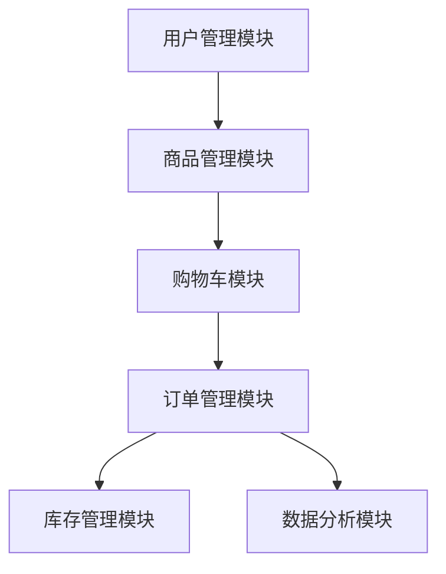

# 鲜花销售系统详细设计与具体代码实现

作者：禅与计算机程序设计艺术

## 1. 背景介绍

### 1.1 行业背景

鲜花销售行业在近年来得到了迅速发展，越来越多的消费者通过在线平台购买鲜花。电子商务的普及以及消费者对便捷服务的需求推动了鲜花销售系统的兴起。一个高效的鲜花销售系统可以帮助企业优化库存管理、提高销售效率、提升客户满意度。

### 1.2 项目背景

本项目旨在设计并实现一个鲜花销售系统，涵盖从用户注册、商品展示、购物车管理、订单处理到支付等一系列功能。系统将采用现代化的技术架构，确保其具有高可用性、可扩展性和安全性。

### 1.3 目标与意义

通过本项目的实施，旨在实现以下目标：
- 提供用户友好的界面，提升用户体验。
- 实现高效的订单处理，减少人工干预。
- 优化库存管理，降低库存成本。
- 提供数据分析功能，支持业务决策。

## 2. 核心概念与联系

### 2.1 系统架构概述

鲜花销售系统将采用分层架构设计，包括表示层、业务逻辑层和数据访问层。每一层都具有明确的职责，以实现系统的高内聚和低耦合。

### 2.2 关键模块介绍

- **用户管理模块**：负责用户的注册、登录、权限管理等功能。
- **商品管理模块**：负责商品的添加、修改、删除、展示等功能。
- **购物车模块**：管理用户添加到购物车中的商品。
- **订单管理模块**：处理用户下单、支付、订单状态跟踪等功能。
- **库存管理模块**：管理商品库存，提供库存预警功能。
- **数据分析模块**：提供销售数据的统计与分析功能。

### 2.3 模块间的联系

各模块通过接口进行通信，业务逻辑层负责协调各模块的工作，确保数据的一致性和完整性。以下是系统模块间的联系图：



## 3. 核心算法原理具体操作步骤

### 3.1 用户注册与登录

用户注册与登录是系统的入口功能。用户通过填写注册表单提交信息，系统进行数据验证和存储；登录时，系统验证用户输入的凭证并生成会话。

### 3.2 商品展示与搜索

商品展示模块通过从数据库中读取商品信息，并以分页的方式展示给用户。用户可以通过搜索框输入关键词进行商品搜索，系统会根据关键词进行模糊匹配。

### 3.3 购物车管理

用户在浏览商品时，可以将感兴趣的商品添加到购物车。购物车模块负责管理用户所选商品的数量、价格等信息，并提供修改和删除功能。

### 3.4 订单处理

订单处理是系统的核心功能之一。用户在购物车中确认商品后，提交订单。系统会生成唯一的订单编号，验证库存，计算总价，并引导用户进行支付。

### 3.5 库存管理

库存管理模块负责监控商品的库存量。当库存低于预设的阈值时，系统会发送预警通知。库存管理还涉及到订单处理后的库存扣减。

### 3.6 数据分析

数据分析模块通过对销售数据的统计分析，生成各种报表，帮助企业了解销售情况、用户偏好等，为业务决策提供支持。

## 4. 数学模型和公式详细讲解举例说明

### 4.1 库存预警模型

库存预警是通过设定库存阈值，当库存量低于阈值时，系统会触发预警。设定库存预警阈值为 $T$，当前库存量为 $S$，则预警条件为：

$$
S < T
$$

### 4.2 销售预测模型

销售预测可以通过时间序列分析模型进行预测。常用的时间序列模型之一是ARIMA模型。设销售量时间序列为 $Y_t$，ARIMA模型可表示为：

$$
Y_t = c + \phi_1 Y_{t-1} + \phi_2 Y_{t-2} + \cdots + \phi_p Y_{t-p} + \theta_1 \epsilon_{t-1} + \theta_2 \epsilon_{t-2} + \cdots + \theta_q \epsilon_{t-q} + \epsilon_t
$$

其中，$c$ 为常数项，$\phi_i$ 为自回归系数，$\theta_i$ 为移动平均系数，$\epsilon_t$ 为白噪声。

### 4.3 订单处理模型

订单处理涉及到多种计算，包括订单总价计算、折扣计算等。设商品单价为 $P_i$，数量为 $Q_i$，折扣率为 $D$，则订单总价 $T$ 为：

$$
T = \sum_{i=1}^{n} (P_i \cdot Q_i) \cdot (1 - D)
$$

## 5. 项目实践：代码实例和详细解释说明

### 5.1 用户注册与登录模块

以下是用户注册与登录模块的代码示例：

```python
# 用户注册
@app.route('/register', methods=['POST'])
def register():
    username = request.form['username']
    password = request.form['password']
    # 数据验证
    if not username or not password:
        return jsonify({'error': 'Invalid input'}), 400
    # 密码加密
    hashed_password = generate_password_hash(password)
    # 存储用户信息
    new_user = User(username=username, password=hashed_password)
    db.session.add(new_user)
    db.session.commit()
    return jsonify({'message': 'User registered successfully'}), 201

# 用户登录
@app.route('/login', methods=['POST'])
def login():
    username = request.form['username']
    password = request.form['password']
    user = User.query.filter_by(username=username).first()
    if user and check_password_hash(user.password, password):
        # 生成会话
        session['user_id'] = user.id
        return jsonify({'message': 'Login successful'}), 200
    return jsonify({'error': 'Invalid credentials'}), 401
```

### 5.2 商品展示与搜索模块

以下是商品展示与搜索模块的代码示例：

```python
# 商品展示
@app.route('/products', methods=['GET'])
def get_products():
    page = request.args.get('page', 1, type=int)
    per_page = request.args.get('per_page', 10, type=int)
    products = Product.query.paginate(page, per_page, False)
    return jsonify({
        'products': [product.to_dict() for product in products.items],
        'total': products.total,
        'pages': products.pages,
        'current_page': products.page
    })

# 商品搜索
@app.route('/search', methods=['GET'])
def search_products():
    query = request.args.get('query', '')
    products = Product.query.filter(Product.name.ilike(f'%{query}%')).all()
    return jsonify({'products': [product.to_dict() for product in products]})
```

### 5.3 购物车管理模块

以下是购物车管理模块的代码示例：

```python
# 添加商品到购物车
@app.route('/cart', methods=['POST'])
def add_to_cart():
    product_id = request.form['product_id']
    quantity = request.form['quantity']
    user_id = session.get('user_id')
    if not user_id:
        return jsonify({'error': 'User not logged in'}), 401
    cart_item = CartItem.query.filter_by(user_id=user_id, product_id=product_id).first()
    if cart_item:
        cart_item.quantity += int(quantity)
    else:
        new_cart_item = CartItem(user_id=user_id, product_id=product_id, quantity=quantity)
        db.session.add(new_cart_item)
    db.session.commit()
    return jsonify({'message': 'Product added to cart'}), 201

# 获取购物车商品
@app.route('/cart', methods=['GET'])
def get_cart():
    user_id = session.get('user_id')
    if not user_id:
        return jsonify({'error': 'User not logged in'}), 401
    cart_items = CartItem.query.filter_by(user_id=user_id).all()
    return jsonify({'cart_items': [item.to_dict() for item in cart_items]})
```

### 5.4 订单处理模块

以下是订单处理模块的代码示例：

```python
# 提交订单
@app.route('/order', methods=['POST'])
def place_order():
    user_id = session.get('user_id')
    if not user_id:
        return jsonify({'error': 'User not logged in'}), 401
    cart_items = CartItem.query.filter_by(user_id=user_id).all()
   