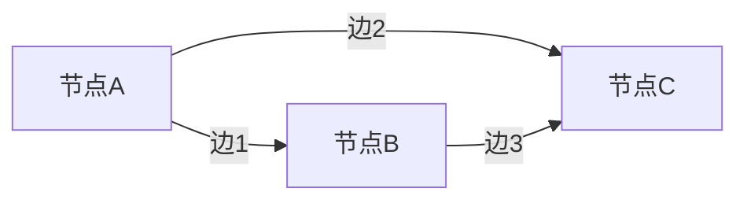

# 🔗目标跟踪中的图神经网络：挖掘目标之间的关系

作者：禅与计算机程序设计艺术

## 1. 背景介绍

目标跟踪（Object Tracking）是计算机视觉领域中的重要研究方向，广泛应用于视频监控、自动驾驶、智能交通等领域。传统的目标跟踪方法通常依赖于目标的外观特征，如颜色、纹理等。然而，这些方法在面对复杂场景时，例如目标遮挡、光照变化、运动模糊等，往往表现不佳。

近年来，随着深度学习技术的发展，基于深度神经网络的目标跟踪方法逐渐成为研究热点。其中，图神经网络（Graph Neural Networks, GNNs）因其在处理非欧几里得数据上的优势，开始被应用于目标跟踪任务中。图神经网络通过挖掘目标之间的关系，可以更有效地处理复杂场景中的目标跟踪问题。

本文将深入探讨目标跟踪中的图神经网络技术，详细介绍其核心概念、算法原理、数学模型及公式，并通过项目实践展示其应用。同时，本文还将介绍图神经网络在实际应用中的场景、推荐工具和资源，并展望其未来发展趋势与挑战。

## 2. 核心概念与联系

### 2.1 目标跟踪的基本概念

目标跟踪是指在视频序列中，随着时间的推移，对目标的位置和状态进行估计和更新的过程。目标跟踪的核心任务是根据目标在前一帧中的位置和状态，预测目标在当前帧中的位置和状态。

### 2.2 图神经网络的基本概念

图神经网络是一种能够处理图结构数据的深度学习模型。图结构数据由节点（Nodes）和边（Edges）组成，节点表示实体，边表示实体之间的关系。图神经网络通过对节点和边的信息进行聚合和传递，实现对图结构数据的表示和学习。

### 2.3 目标跟踪与图神经网络的结合

在目标跟踪任务中，目标之间的关系信息对于提高跟踪性能具有重要作用。图神经网络能够有效地挖掘和利用目标之间的关系信息，因此将其应用于目标跟踪任务中，可以显著提升跟踪效果。

### 2.4 相关技术概述

在目标跟踪任务中，常用的图神经网络技术包括图卷积网络（Graph Convolutional Networks, GCNs）、图注意力网络（Graph Attention Networks, GATs）等。这些技术通过不同的方式对图结构数据进行处理和学习，能够在目标跟踪任务中发挥重要作用。

## 3. 核心算法原理具体操作步骤

### 3.1 图神经网络的基本操作

图神经网络的基本操作包括节点信息的聚合（Aggregation）和更新（Update）。在每一层图神经网络中，节点的信息将通过边传递给相邻节点，然后对接收到的信息进行聚合和更新，从而得到新的节点表示。

### 3.2 图卷积网络（GCNs）

图卷积网络是一种通过卷积操作对图结构数据进行处理的图神经网络。其核心思想是通过对节点的邻居节点的信息进行卷积操作，实现对节点表示的更新。

#### 3.2.1 卷积操作

在图卷积网络中，卷积操作通过对节点及其邻居节点的信息进行加权求和，实现节点表示的更新。具体公式如下：

$$
h_i^{(l+1)} = \sigma \left( \sum_{j \in \mathcal{N}(i)} \frac{1}{c_{ij}} W^{(l)} h_j^{(l)} \right)
$$

其中，$h_i^{(l)}$ 表示节点 $i$ 在第 $l$ 层的表示，$\mathcal{N}(i)$ 表示节点 $i$ 的邻居节点集合，$c_{ij}$ 表示节点 $i$ 和 $j$ 之间的归一化系数，$W^{(l)}$ 表示第 $l$ 层的权重矩阵，$\sigma$ 表示激活函数。

#### 3.2.2 模型训练

图卷积网络的训练过程与传统神经网络类似，通过反向传播算法对模型参数进行优化。具体步骤如下：

1. 初始化模型参数；
2. 前向传播计算节点表示；
3. 计算损失函数；
4. 反向传播计算梯度；
5. 更新模型参数。

### 3.3 图注意力网络（GATs）

图注意力网络是一种通过注意力机制对图结构数据进行处理的图神经网络。其核心思想是通过对节点及其邻居节点的信息进行加权求和，实现节点表示的更新。

#### 3.3.1 注意力机制

在图注意力网络中，注意力机制通过对节点及其邻居节点的信息进行加权求和，实现节点表示的更新。具体公式如下：

$$
h_i^{(l+1)} = \sigma \left( \sum_{j \in \mathcal{N}(i)} \alpha_{ij}^{(l)} W^{(l)} h_j^{(l)} \right)
$$

其中，$\alpha_{ij}^{(l)}$ 表示节点 $i$ 和 $j$ 之间的注意力权重，$W^{(l)}$ 表示第 $l$ 层的权重矩阵，$\sigma$ 表示激活函数。

#### 3.3.2 注意力权重计算

注意力权重通过对节点 $i$ 和 $j$ 的表示进行加权求和后，再通过一个激活函数进行计算。具体公式如下：

$$
\alpha_{ij}^{(l)} = \frac{\exp \left( \text{LeakyReLU} \left( a^T \left[ W^{(l)} h_i^{(l)} \| W^{(l)} h_j^{(l)} \right] \right) \right)}{\sum_{k \in \mathcal{N}(i)} \exp \left( \text{LeakyReLU} \left( a^T \left[ W^{(l)} h_i^{(l)} \| W^{(l)} h_k^{(l)} \right] \right) \right)}
$$

其中，$a$ 表示注意力机制的参数向量，$\|$ 表示向量拼接操作。

#### 3.3.3 模型训练

图注意力网络的训练过程与图卷积网络类似，通过反向传播算法对模型参数进行优化。具体步骤如下：

1. 初始化模型参数；
2. 前向传播计算节点表示；
3. 计算损失函数；
4. 反向传播计算梯度；
5. 更新模型参数。

## 4. 数学模型和公式详细讲解举例说明

### 4.1 图卷积网络的数学模型

图卷积网络的数学模型基于卷积操作，通过对节点及其邻居节点的信息进行加权求和，实现节点表示的更新。具体公式如下：

$$
h_i^{(l+1)} = \sigma \left( \sum_{j \in \mathcal{N}(i)} \frac{1}{c_{ij}} W^{(l)} h_j^{(l)} \right)
$$

其中，$h_i^{(l)}$ 表示节点 $i$ 在第 $l$ 层的表示，$\mathcal{N}(i)$ 表示节点 $i$ 的邻居节点集合，$c_{ij}$ 表示节点 $i$ 和 $j$ 之间的归一化系数，$W^{(l)}$ 表示第 $l$ 层的权重矩阵，$\sigma$ 表示激活函数。

### 4.2 图注意力网络的数学模型

图注意力网络的数学模型基于注意力机制，通过对节点及其邻居节点的信息进行加权求和，实现节点表示的更新。具体公式如下：

$$
h_i^{(l+1)} = \sigma \left( \sum_{j \in \mathcal{N}(i)} \alpha_{ij}^{(l)} W^{(l)} h_j^{(l)} \right)
$$

其中，$\alpha_{ij}^{(l)}$ 表示节点 $i$ 和 $j$ 之间的注意力权重，$W^{(l)}$ 表示第 $l$ 层的权重矩阵，$\sigma$ 表示激活函数。

注意力权重通过对节点 $i$ 和 $j$ 的表示进行加权求和后，再通过一个激活函数进行计算。具体公式如下：

$$
\alpha_{ij}^{(l)} = \frac{\exp \left( \text{LeakyReLU} \left( a^T \left[ W^{(l)} h_i^{(l